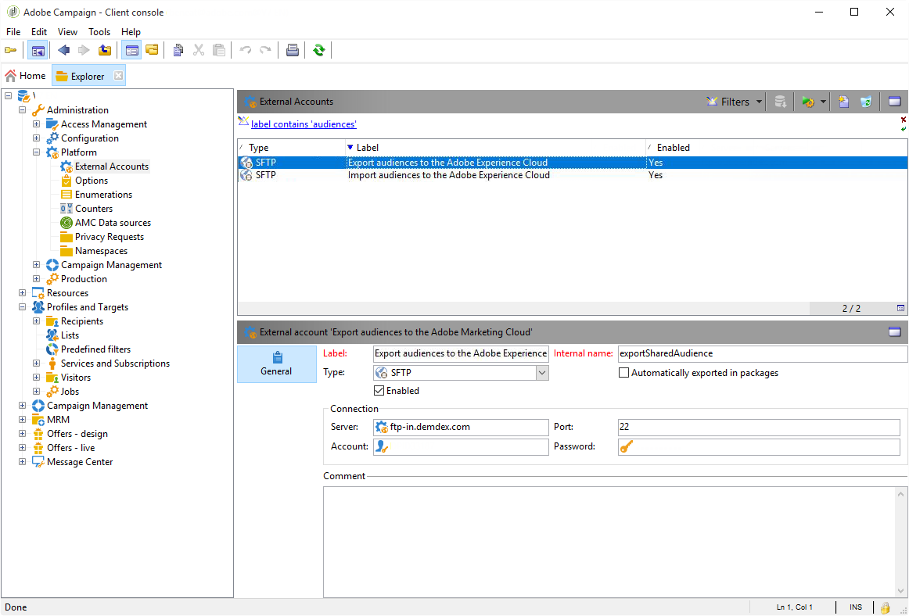
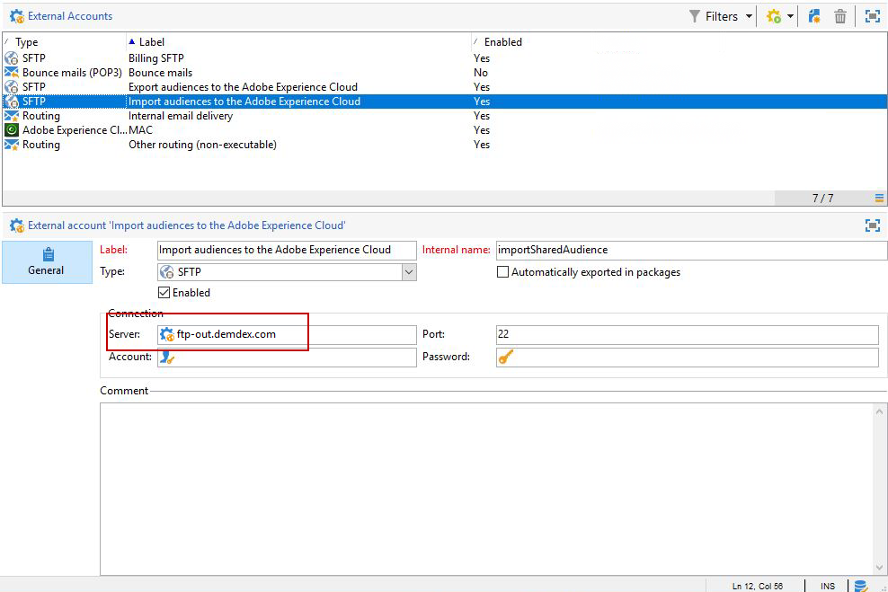
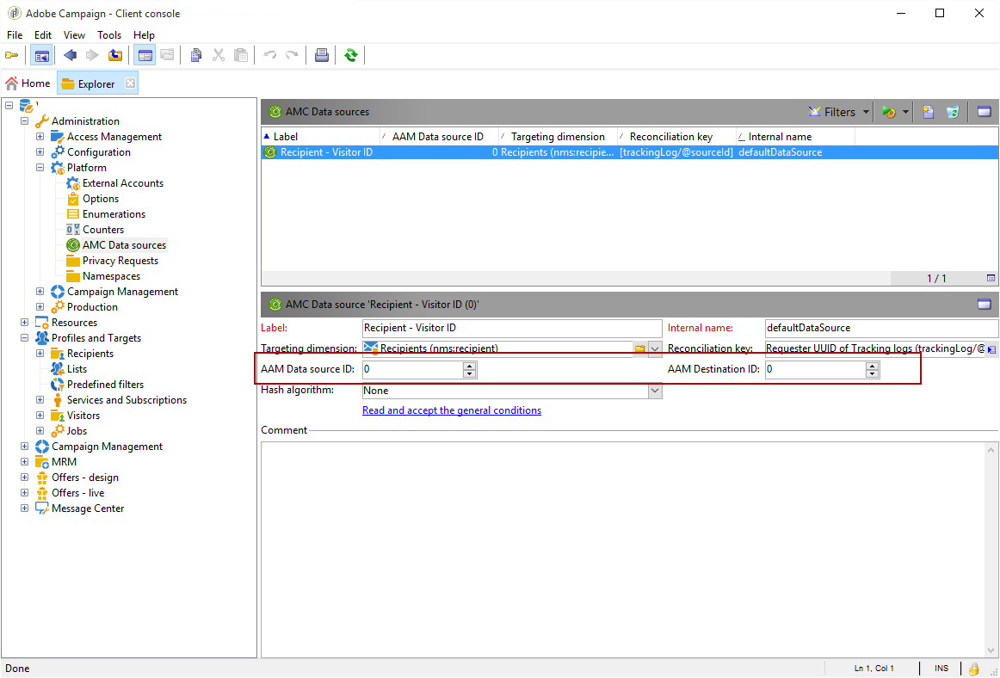

# Configuring shared audiences integration in Adobe Campaign{#configuring-shared-audiences-integration-in-adobe-campaign}

Once you have submitted this request, Adobe will proceed to the provisioning of the integration for you and contact you to provide details and information that you have to finalize the configuration:

1. [Step 1: Configure or check the external accounts in Adobe Campaign](#step-1--configure-or-check-the-external-accounts-in-adobe-campaign)
1. [Step 2: Configure the Data Source](#step-2--configure-the-data-source)
1. [Step 3: Configure Campaign Tracking server](#step-3--configure-campaign-tracking-server)
1. [Step 4: Configure the Visitor ID Service](#step-4--configure-the-visitor-id-service)

>[!IMPORTANT]
>
>If you are using the demdex domain and following the syntax **ftp-out.demdex.com** for the import external account and **ftp-in.demdex.com** for the export external account, you need to adapt your implementation accordingly and move to Amazon Simple Storage Service (S3) connector to import or export data. For more information on how to configure your external accounts with Amazon S3, refer to this [section](../../integrations/using/configuring-shared-audiences-integration-in-adobe-campaign.md#step-1--configure-or-check-the-external-accounts-in-adobe-campaign).

## Step 1: Configure or check the external accounts in Adobe Campaign {#step-1--configure-or-check-the-external-accounts-in-adobe-campaign}

First, we need to configure or check the external accounts in Adobe Campaign as follows:

1. Click the **[!UICONTROL Explorer]** icon.
1. Go to **[!UICONTROL Administration > Platform > External accounts]**. The mentioned SFTP accounts should have been configured by Adobe and the necessary information should have been communicated to you.

    * **[!UICONTROL importSharedAudience]**: account dedicated to importing audiences.
    * **[!UICONTROL exportSharedAudience]**: account dedicated to exporting audiences.

   

1. Select the **[!UICONTROL Export audiences to the Adobe Marketing Cloud]** external account.

1. From the **[!UICONTROL Type]** drop-down, select **[!UICONTROL AWS S3]**.

1. Provide the following details:

   * **[!UICONTROL AWS S3 Account Server]**
   URL of your server, it should be filled as follows:

      ```
      <S3bucket name>.s3.amazonaws.com/<s3object path>
      ```

   * **[!UICONTROL AWS access key ID]**
  To know where to find your AWS access key ID, refer to this [page](https://docs.aws.amazon.com/general/latest/gr/aws-sec-cred-types.html#access-keys-and-secret-access-keys) .

   * **[!UICONTROL Secret access key to AWS]**
  To know where to find your secret access key to AWS, refer to this [page](https://aws.amazon.com/fr/blogs/security/wheres-my-secret-access-key/).

   * **[!UICONTROL AWS Region]**
  To learn more on AWS region, refer to this [page](https://aws.amazon.com/about-aws/global-infrastructure/regions_az/).

   

1. Click **[!UICONTROL Save]** and configure the **[!UICONTROL Import audiences from the Adobe Marketing Cloud]** external account as detailed in the previous steps.

Your external accounts are now configured.

## Step 2: Configure the Data Source {#step-2--configure-the-data-source}

The **Recipient - Visitor ID** is created inside Audience Manager. This is an out-of-the-box data source configured by default for Visitor ID. Segments created from Campaign will be part of this data source.

To configure the **[!UICONTROL Recipient - Visitor ID]** data source:

1. From the **[!UICONTROL Explorer]** node, select **[!UICONTROL Administration > Platform > AMC Data sources]**.
1. Select **[!UICONTROL Recipient - Visitor ID]**.
1. Enter the **[!UICONTROL Data Source ID]** and **[!UICONTROL AAM Destination ID]** provided by Adobe.

   

## Step 3: Configure Campaign Tracking server {#step-3--configure-campaign-tracking-server}

For the configuration of the integration with People Core service or Audience manager, we also need to configure Campaign Tracking server.

You need to make sure the Campaign Tracking Server is registered on the domain (CNAME). You can find more information about domain name delegation in [this article](https://helpx.adobe.com/campaign/kb/domain-name-delegation.html).

## Step 4: Configure the Visitor ID Service {#step-4--configure-the-visitor-id-service}

In the case that your Visitor ID service has never been configured on your web properties or websites, refer to the following [document](https://docs.adobe.com/content/help/en/id-service/using/implementation/setup-aam-analytics.html) to learn how to configure your service or the following [video](https://helpx.adobe.com/marketing-cloud/how-to/email-marketing.html#step-two) .

Your configuration and provisioning are finalized, the integration can now be used to import and export audiences or segments.
