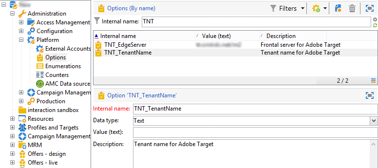

# Configuring the integration with Adobe Target{#configuring-the-integration-with-adobe-target}

## Prerequisites {#prerequisites}

In order to use the integration between Adobe Campaign and Adobe Target, you must have:

* Adobe Experience Cloud and Adobe Target organizations
* An Adobe Target rawbox specified to establish the connection with Adobe Campaign

## Configuring Adobe Campaign {#configuring-adobe-campaign}

To configure Adobe Campaign:

1. Install the **[!UICONTROL Integration with the Adobe Experience Cloud]** standard package. Installing an integration package is the same as installing a standard package, which is detailed in the [Package Import](../../platform/using/working-with-data-packages.md#importing-packages) section. This gives you access to the shared assets via Digital Asset Manager.
1. Enable connection via IMS (Adobe ID connection service) to use images shared via Adobe Experience Cloud in your emails. Consult the section about [IMS](../../integrations/using/about-adobe-id.md).
1. In **[!UICONTROL Administration > Platform > Options]**, configure the server and organization (Tenant) options for Adobe Target:

    * **[!UICONTROL TNT_EdgeServer]** : Adobe Target server used for the integration. This option is already selected by default. This value corresponds to the Adobe Target **[!UICONTROL Domain Server]**, followed by the value **/m2**. For example: **tt.omtrdc.net/m2**.
    * **[!UICONTROL TNT_TenantName]** : Adobe Target Organization name. This value corresponds to the name of the Adobe Target **[!UICONTROL Client]**.

   

>[!CAUTION]
>
>For hybrid and hosted architectures, these options must be set on all servers, including the [mid-sourcing server](../../installation/using/mid-sourcing-server.md) and the [execution instance](../../message-center/using/configuring-instances.md#execution-instance).