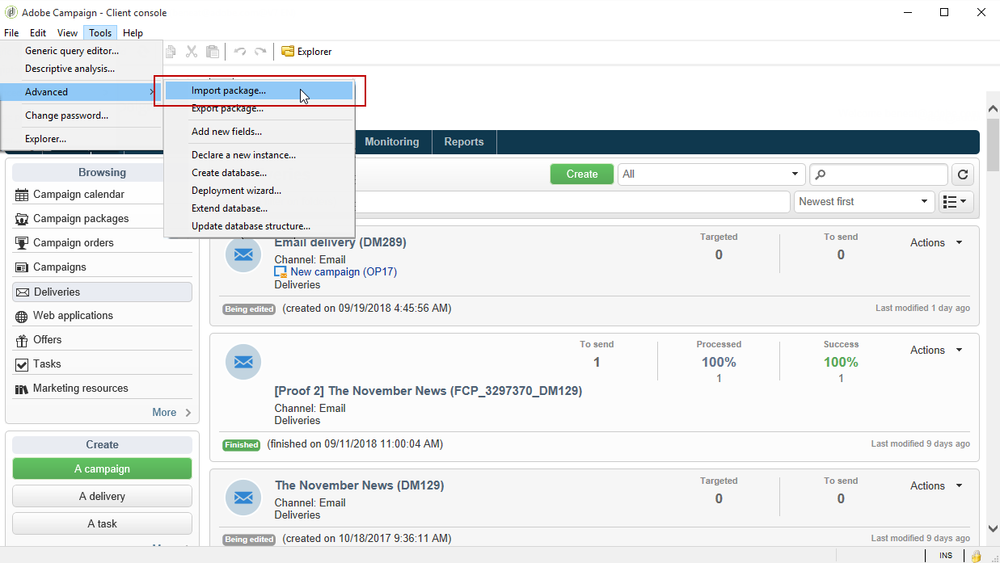
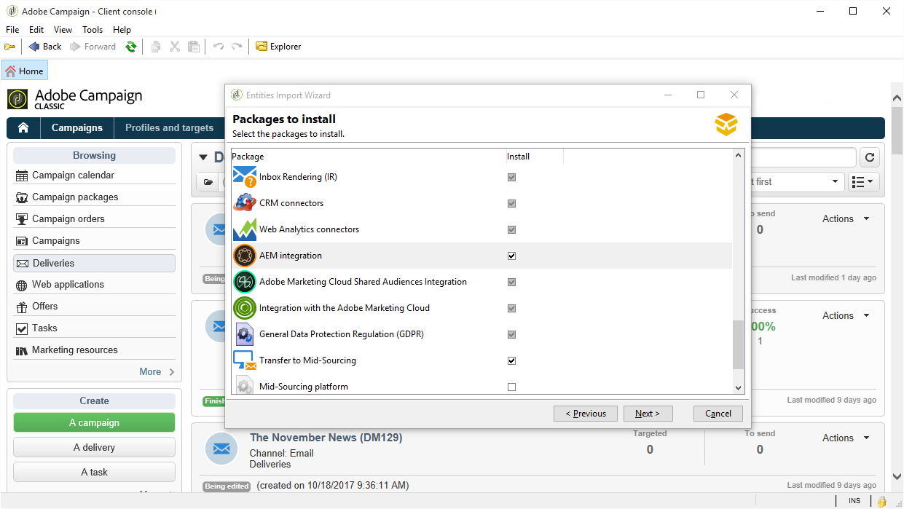
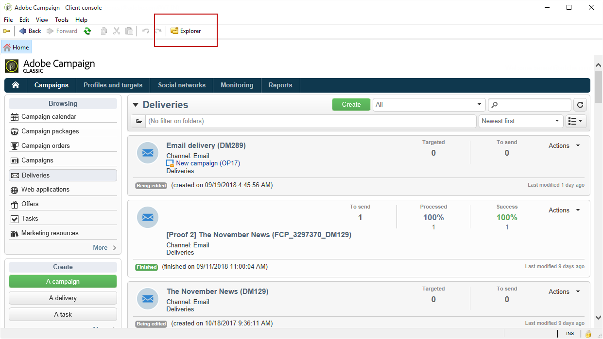
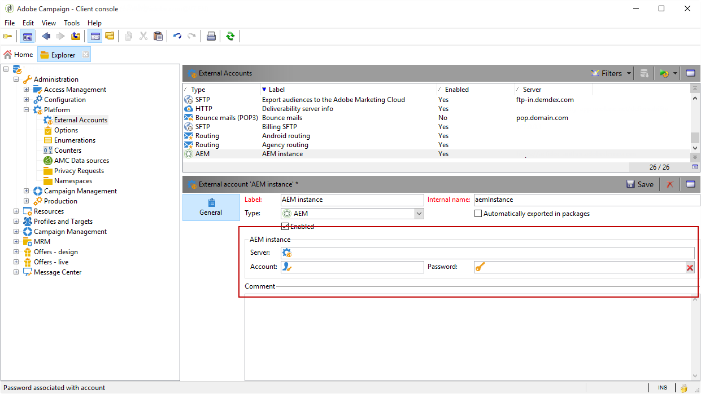
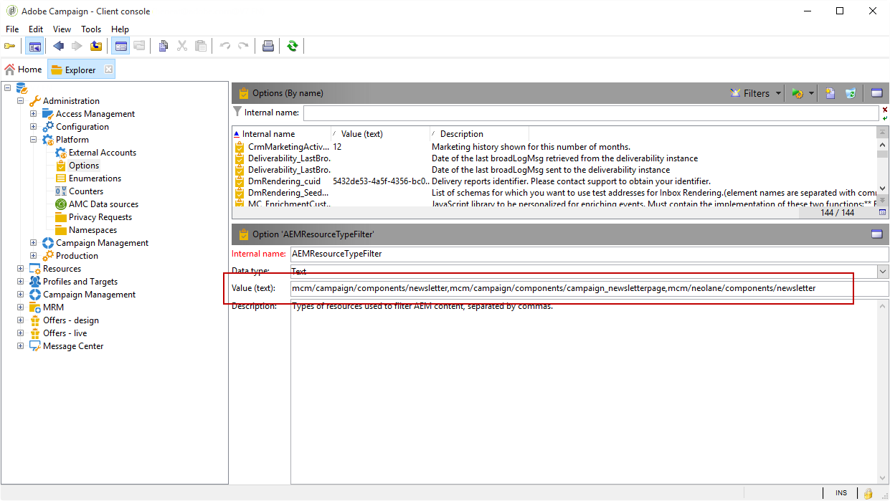

# Configuring the integration{#configuring-the-integration}

## Configuring in Adobe Campaign {#configuring-in-adobe-campaign}

To use these two solutions together, you must configure them to connect to one another.

Follow the steps below to start the configuration in Adobe Campaign:

1. [Install the AEM integration package in Adobe Campaign](#install-the-aem-integration-package-in-adobe-campaign)
1. [Configure the external account](#configure-the-external-account)
1. [Configure AEM resources filtering](#configure-aem-resources-filtering)

For advanced configurations such as managing personalization fields and blocks. Refer to Adobe Experience Manager [documentation](https://helpx.adobe.com/experience-manager/6-5/sites/administering/using/campaignonpremise.html).

### Install the AEM integration package in Adobe Campaign {#install-the-aem-integration-package-in-adobe-campaign}

You first need to install the **[!UICONTROL AEM integration]** package.

1. From your Adobe Campaign instance, select **[!UICONTROL Tools]** from the upper toolbar.
1. Select **[!UICONTROL Tools > Advanced > Import package...]**.

   

1. Select **[!UICONTROL Install a standard package]**.
1. Check **[!UICONTROL AEM integration]** then click the **[!UICONTROL Next]** button.

   

1. In the next window, click the **[!UICONTROL Start]** button to start the installation of your package. Close the window once the installation is finished.

### Configure the security zone for AEM operator {#configure-the-security-zone-for-aem-operator}

The **[!UICONTROL AEM integration]** package sets the **[!UICONTROL aemserver]** operator in Campaign. This operator will be used to connect the Adobe Experience Manager server to Adobe Campaign.

You need to configure a security zone for this operator to connect to Adobe Campaign via Adobe Experience Manager.

>[!CAUTION]
>
>We strongly recommend creating a security zone dedicated to AEM to avoid any security problems. For more on this, refer to the Installation [guide](../../installation/using/security-zones.md).

If your Campaign instance is hosted by Adobe, contact [Adobe Customer Care](https://helpx.adobe.com/enterprise/admin-guide.html/enterprise/using/support-for-experience-cloud.ug.html) team. If you are using Campaign on-premise, follow the steps below:

1. Open the **serverConf.xml** configuration file.
1. Access the **allowUserPassword** attribute of the selected security zone and set it to **true**.

   This will allow Adobe Experience Manager to connect Adobe Campaign via login/password.

### Configure the external account {#configure-the-external-account}

The **[!UICONTROL AEM integration]** package created the external account for Adobe Experience Cloud. You need now to configure it to connect with your Adobe Experience Manager instance.

To confugure the AEM external account, follow the steps below:

1. Click the **[!UICONTROL Explorer]** button.

   

1. Select **[!UICONTROL Administration > Platform > External accounts]**.
1. From the **[!UICONTROL External account]** list, select **[!UICONTROL AEM instance]**.
1. Enter the parameters for your AEM authoring instance:

    * **[!UICONTROL Server]** 
    * **[!UICONTROL Account]** 
    * **[!UICONTROL Password]**

   >[!NOTE]
   >
   >Make sure that your **[!UICONTROL Server]** address does not end with a a trailing slash.

   

1. Check the **[!UICONTROL Enabled]** box.
1. Click the **[!UICONTROL Save]** button.

### Configure AEM resources filtering {#configure-aem-resources-filtering}

The **AEMResourceTypeFilter** option is used to filter types of Experience Manager resources that can be used in Adobe Campaign. This allows Adobe Campaign to retrieve Experience Manager contents that are specifically designed to be used in Adobe Campaign only.

To check if the **[!UICONTROL AEMResourceTypeFilter]** option is configured:

1. Click the **[!UICONTROL Explorer]** button.
1. Select **[!UICONTROL Administration > Platform > Options]**.
1. From the **[!UICONTROL Options]** list, select **[!UICONTROL AEMResourceTypeFilter]**.
1. In the **[!UICONTROL Value (text)]** field, the path should be as follows:

   ```
   mcm/campaign/components/newsletter,mcm/campaign/components/campaign_newsletterpage,mcm/neolane/components/newsletter
   ```

   Or in some case:

   ```
   mcm/campaign/components/newsletter
   ```

   

## Configuring in Adobe Experience Manager {#configuring-in-adobe-experience-manager}

Follow the steps below to start the configuration in Adobe Experience Manager:

1. Configure the **replication** to replicate from the AEM authoring instance to the AEM publishing instance.

   To learn how to configure replication, refer to Adobe Experience Manager [documentation](https://helpx.adobe.com/experience-manager/6-5/sites/deploying/using/replication.html).

1. Install the integration **FeaturePack** on your authoring instance then replicate the installation on your publishing instance. (For AEM versions 5.6.1 and 6.0 only).

   To learn how to install FeaturePack, refer to Adobe Experience Manager [documentation](https://helpx.adobe.com/experience-manager/aem-previous-versions.html).

1. Connect Adobe Experience Manager to Adobe Campaign by configuring a dedicated **Cloud Service**.

   To learn how to connect both solutions via Cloud Services, refer to Adobe Experience Manager [documentation](https://helpx.adobe.com/experience-manager/6-5/sites/administering/using/campaignonpremise.html#ConfiguringAdobeExperienceManager) .

1. Configure the **Externalizer service**.

   To learn how to configure it, refer to Adobe Experience Manager [documentation](https://helpx.adobe.com/experience-manager/6-5/sites/developing/using/externalizer.html).
