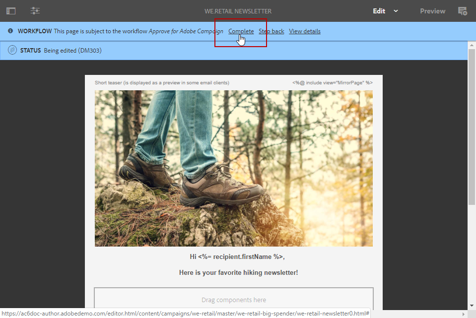

# Creating an Experience Manager newsletter{#creating-an-experience-manager-newsletter}

This integration can be used for example to create a newsletter in Adobe Experience Manager which will then be used in Adobe Campaign as part of an email campaign.

For a more detailed example on how to use this integration, refer to this [step-by-step guide](https://helpx.adobe.com/campaign/kb/acc-aem.html).

**From Adobe Experience Manager:**

1. From your AEM author instance, click the **Adobe Experience** logo in the upper left side of the page and select **[!UICONTROL Sites]**.

   

1. Select **[!UICONTROL Campaigns > Name of your brand (here We.Retail) > Main Area > Email campaigns]**.
1. Click the **[!UICONTROL Create]** button in the upper right side of the page then select **[!UICONTROL Page]**.

   

1. Select the **[!UICONTROL Adobe Campaign Email (AC 6.1)]** template and name your newsletter.
1. Once your page is created, access the **[!UICONTROL Page information]** menu and click **[!UICONTROL Open Properties]**.

   

1. In the **[!UICONTROL Cloud Services]** tab, select **[!UICONTROL Adobe Campaign]** as **[!UICONTROL Cloud service configuration]** and your Adobe Campaign instance in the second drop-down.

   

1. Edit your email content by adding components, e.g. personalization fields from Adobe Campaign.
1. When your email is ready, access the **[!UICONTROL Page information]** menu and click **[!UICONTROL Start workflow]**.

   

1. From the first drop-down, select **[!UICONTROL Publish to Adobe Campaign]** as workflow model and click **[!UICONTROL Start workflow]**.

   

1. Then, as the previous step, launch the **[!UICONTROL Approve for Campaign]** workflow.
1. A disclaimer appears on top of your page. Click **[!UICONTROL Complete]** to confirm the review and click **[!UICONTROL Ok]**.

   

1. Click again **[!UICONTROL Complete]** and select **[!UICONTROL Newsletter approval]** in the **[!UICONTROL Next Step]** drop-down.

   

Your newsletter is now ready and synchronized in Adobe Campaign.

**From Adobe Campaign:**

1. From the **[!UICONTROL Campaigns]** tab, click **[!UICONTROL Deliveries]** then **[!UICONTROL Create]**.

   

1. In the **[!UICONTROL Delivery template]** drop-down, select the **[!UICONTROL Email delivery with AEM content (mailAEMContent)]** template.

   

1. Add a **[!UICONTROL Label]** to your delivery and click **[!UICONTROL Continue]**.
1. Click the **[!UICONTROL Synchronize]** button.

   If this button does not appear in your interface, click the **[!UICONTROL Properties]** button and select the **[!UICONTROL Advanced]** tab. The **[!UICONTROL Content editing mode]** field should be set to **[!UICONTROL AEM]** with your AEM instance in the **[!UICONTROL AEM account]** field.

   

1. Select the delivery previously created in Adobe Experience Manager and click **[!UICONTROL Ok]**.
1. Click the **[!UICONTROL Refresh content]** button as soon as some changes are made to your AEM delivery.

   

Your email is now ready to be send to your audience.
