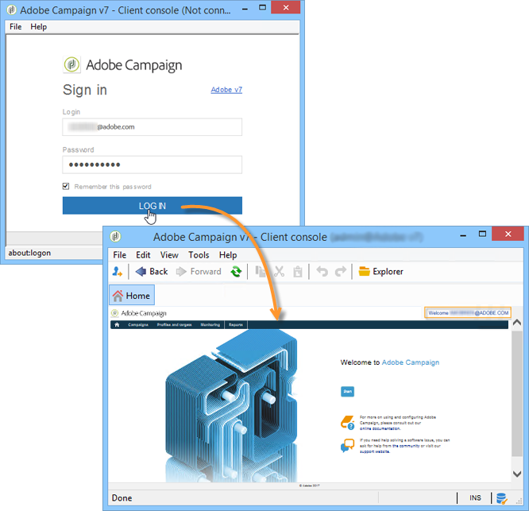
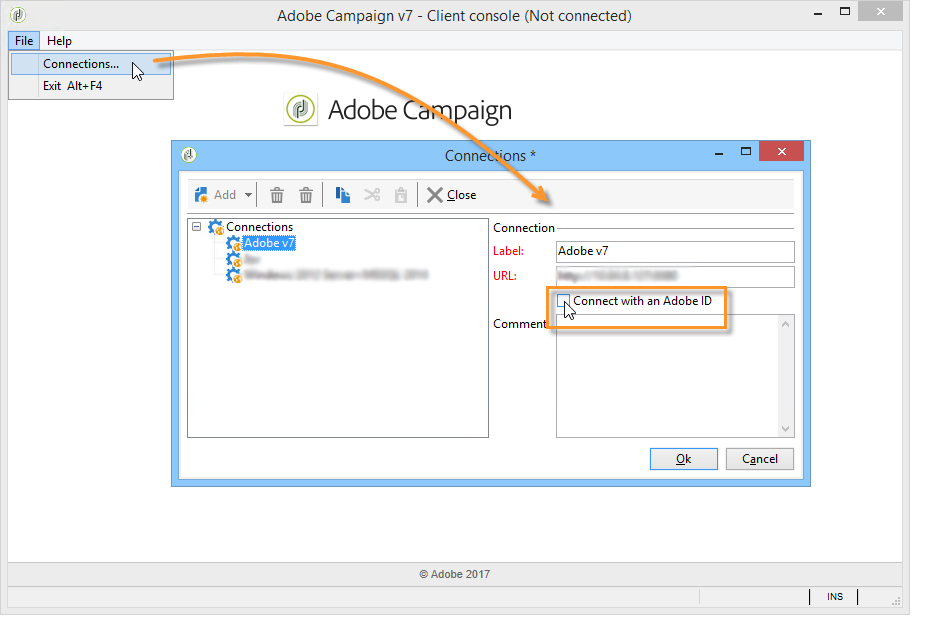

# Implementing IMS{#implementing-ims}

## Enabling the IMS connection {#enabling-the-ims-connection}

1. To enable connecting via the IMS, check **[!UICONTROL Connect with an Adobe ID]** in the console's connections window.

   

1. Enter your Adobe ID and password. The Adobe Campaign Home screen will then appear.

   

## Disabling the IMS connection {#disabling-the-ims-connection}

To disable connecting via the Adobe ID, disconnect, click **[!UICONTROL File > Connections]** and uncheck **[!UICONTROL Connect with an Adobe ID]** . 

