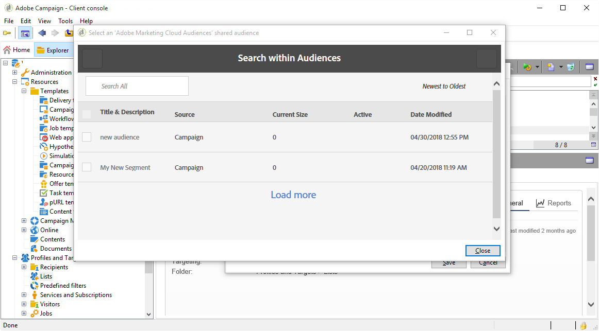

# Importing and exporting audiences{#importing-and-exporting-audiences}

## Importing an audience {#importing-an-audience}

You can import audiences/segments from Audience manager or People core service into Adobe Campaign via the recipient lists.

1. Go to the **[!UICONTROL Profiles and Targets]** > **[!UICONTROL Lists]** node in the Adobe Campaign explorer.
1. In the action bar, select **[!UICONTROL New]** > **[!UICONTROL Create a shared audience...]**.

   

1. In the window that opens, click **[!UICONTROL Select a shared audience]** to go to the list of shared audiences/segments available from the other Adobe Experience Cloud solutions.
1. Select an audience and confirm. The audience's information is automatically completed.

   Please note that to be able to import shared audience, you should be assigned the **[!UICONTROL Audience library]** product in the admin console and be an administrator in Audience Manager. For more on this, refer to the [Admin console documentation](https://helpx.adobe.com/enterprise/managing/user-guide.html).

   

1. Select the AMC Data source from the **[!UICONTROL AMC Data source]** field to define the type of data expected.

   

1. Save the audience.

The audience is imported via a technical workflow. The imported list contains elements that can be reconciled using the AMC Data source. The elements that are not recognized by Adobe Campaign are not imported.

The import process takes 24-36 hours to synchronize, when segments are imported directly from People core service or Audience Manager. After this period, you will be able to find and use your new audience in Adobe Campaign.

>[!NOTE]
>
>If you are importing audiences from Adobe Analytics to Adobe Campaign, these audiences need to be first shared in People Core Service or Audience Manager. This process takes 12-24 hours, which must be added to the 24-36 hours synchronization with Campaign.
>
>In that specific case, audience sharing timeframe can be up to 60 hours. For more information on Adobe Analytics audience sharing in People Core service and Audience manager, refer to this [documentation](https://docs.adobe.com/content/help/en/analytics/components/segmentation/segmentation-workflow/seg-publish.html).

The audience data is completely replaced every time it is synchronized. Only segments can be imported. Granular data including key-value pairs, traits and rules are not supported.

## Exporting an audience {#exporting-an-audience}

You can export an audience from Adobe Campaign to Audience manager or People core service using a workflow. The processes for creating and using a workflow are detailed in [this document](../../workflow/using/building-a-workflow.md). The exported audiences are saved as segments in People core service:

1. Create a new targeting workflow.
1. Using the different activities available, target a set of recipients.
1. After the targeting, drag and drop an **[!UICONTROL Update shared audience]** activity, then open it.

   

1. Define the audience that you want to export via the **[!UICONTROL Select a shared audience]** option. In the window that opens, you can select an existing audience or create a new audience.

   If you select an existing audience, only the new records will be added to the audience.

   To export your recipient list in a new audience, complete the **[!UICONTROL Segment name]** field then click **[!UICONTROL Create]** before selecting the newly created audience.

   Finish the operation by clicking the check symbol at the top right of the window, then the **[!UICONTROL OK]** button.

1. Select the **[!UICONTROL AMC Data source]** to specify the expected data type. The schema is automatically determined.

   

1. Save the audience.

The audience is then exported. The save audience activity has two outbound transitions. The main transition contains the recipients that were successfully exported. The additional transition contains the recipients that could not have been mapped with a visitor ID or declared ID.

Synchronization between Adobe Campaign and People core service takes 24-36 hours. After this period, you will be able to find your new audience in People core service and reuse it in other Adobe Experience Cloud solutions. For more information on using an Adobe Campaign shared audience in Adobe People core service, refer to this [documentation](https://docs.adobe.com/content/help/en/core-services/interface/audiences/t-audience-create.html).

>[!NOTE]
>
>In order to be reconciled, the records must have an Adobe Experience Cloud ID ('visitor ID' or 'declared ID'). The records that do not have an Adobe Experience Cloud ID are ignored when exporting and importing audiences.
