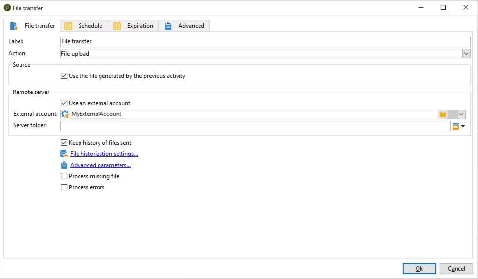
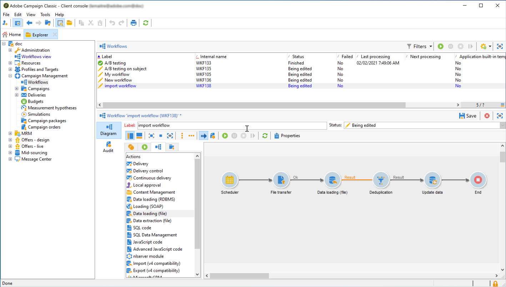

# Ingest Adobe Experience Platform segments into Campaign {#destinations}

To ingest Adobe Experience Platform into Campaign and use them in your workflows, you first need to connect Adobe Campaign as an Adobe Experience Platform **Destination** and configure it with the segment to export.

Once the Destination has been configured, data will be exported to your storage location, and you will need to build a dedicated workflow in Campaign Classic to ingest it.

## Connect Adobe Campaign as a Destination

In Adobe Experience platform, configure a connection with Adobe Campaign by selecting a storage location for the exported segments. This steps also allows you to select the segments to export and specify additional XDM fields to include.

For more on this, refer to the [Destinations documentation](https://experienceleague.adobe.com/docs/experience-platform/destinations/catalog/email-marketing/adobe-campaign.html).

After the Destination has been configured, Adobe Experience Platform creates a tab-delimited .txt or .csv file in the storage location that you provided. This operation is scheduled and performed once per 24h.

You can now configure a Campaign Classic workflow to ingest the segment into Campaign.

## Create an import workflow in Campaign Classic

Once Campaign Classic has been configured as a Destination, you need to build a dedicated workflow to import the file that has been exported by Adobe Experience Platform.

To do this, you need to add and configure a **[!UICONTROL File transfer]** activity. For more on how to configure this activity, refer to [this section](../../workflow/using/file-transfer.md).

   

You can then build your workflow according to your needs (update the database using the segment data, send a cross-channel deliveries to the segment, etc.)

As an example, the workflow below downloads the file from your storage location on a daily basis, then updates Campaign database with the segment data.

   
