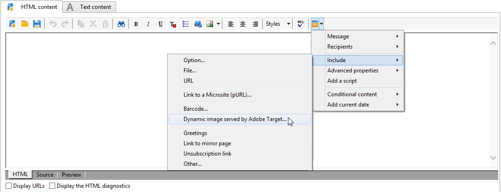
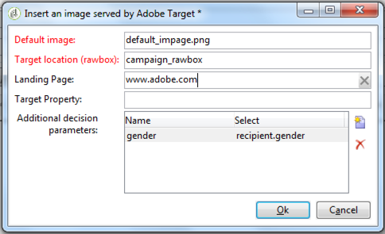
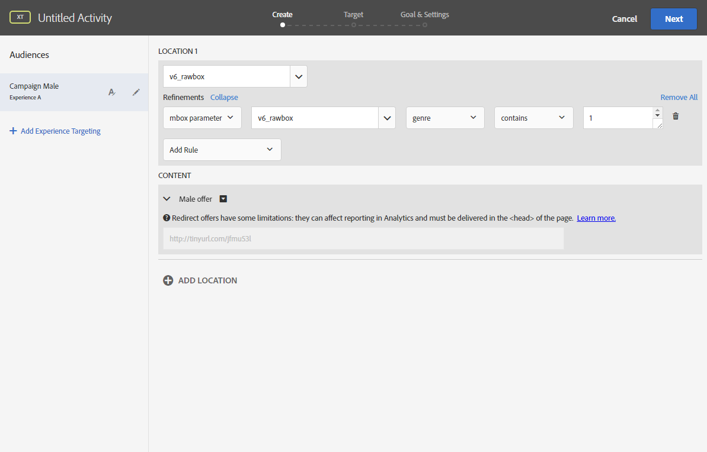
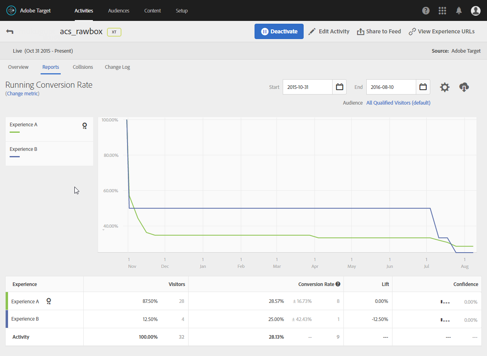

# Inserting Target dynamic content {#inserting-a-dynamic-image}

In this guide, we will present how to integrate a dynamic offer from Target into an email in Adobe Campaign.

We want to create a delivery that will include an image block that will dynamically change according to the recipient's country. The data is sent with each mbox request and depends on the visitor's IP address.

In this email, we want one of the images to vary dynamically according to the following user-experiences:

* The email is opened in France.
* The email is opened in the United States.
* If none of these conditions apply, a default image is displayed.

For this to work, we need to perform the following steps both in Adobe Campaign and Target Standard:

1. Inserting the dynamic offer in an email
1. Creating redirect offers
1. Creating audiences
1. Creating an Experience Targeting Activity
1. Previewing and sending the email

## Inserting the dynamic offer in an email {#inserting-dynamic-offer}

In Adobe Campaign, once you're done defining the target and content of your email, you can insert a dynamic image from Target.

To do this, specify the default image's URL, the location name, and the fields you want to transfer to Target.

### Where to find the option {#option-offer}

In Adobe Campaign, there are two ways to insert a dynamic image from Target into an email:

* If you are using the digital content editor, choose an existing image and select **[!UICONTROL Insert]** > **[!UICONTROL Dynamic image served by Adobe Target]** from the toolbar.

   

* If you are using the standard editor, place the cursor where you want to insert the image and select **[!UICONTROL Include]** > **[!UICONTROL Dynamic image served by Adobe Target...]** from the personalization drop-down menu.

   

### Defining the image parameters {#defining-image-parameters}

* The **[!UICONTROL Default image]**'s URL: The image that will be displayed when none of the conditions are fulfilled. You can also select an image from your Assets library.
* The **[!UICONTROL Target location]**: Enter a name for your dynamic offer's location. You will have to select this location in your Target activity.
* The **[!UICONTROL Additional decision parameters]**: Select the Campaign fields that you need to transfer to Target. In our example, we added the Country field.

   

## Creating redirect offers {#create-redirect-offers}

In Target Standard, you can create different versions of your offer. Depending on each user experience, a redirect offer can be created and you can specify the image that will be displayed.

In our case, we need two redirect offers, the third one (the default one) is to be defined in Adobe Campaign.

1. To create a new redirect offer in Target Standard, from the **[!UICONTROL Content]** tab, click **[!UICONTROL Code offers]**.

1. Click **[!UICONTROL Create]** then **[!UICONTROL Redirect Offer]**.

   

1. Enter a name for the offer and the URL of your image.

   

1. Follow the same procedure for the remaining redirect offer. For more on this, refer to this [page](https://docs.adobe.com/help/en/target/using/experiences/offers/offer-redirect.html).

## Creating audiences {audiences-target}

In Target, you need to create the two audiences into which the people who visit your offer will be categorized for the  different contents to be delivered. For each audience, add a rule to define who will be able to see the offer.

1. To create a new audience in Target, from the **[!UICONTROL Audiences]** tab, click **[!UICONTROL Create Audience]**.

   

1. Add a name to your audience.

   

1. Click **[!UICONTROL Add a rule]** and select a category. The rule uses specific criteria to target the visitors. You can refine the rules by adding conditions or by creating new rules in other categories.

1. Follow the same procedure for the remaining audiences.

## Creating an Experience Targeting Activity {#creating-targeting-activity}

In Target Standard, we need to create an Experience Targeting activity, define the different experiences, and associate them with the corresponding offers.

### Defining the audience {#defining-the-audience}

1. To create an Experience Targeting activity, from the **[!UICONTROL Activities]** tab, click **[!UICONTROL Create Activity]** then **[!UICONTROL Experience Targeting]**.

   

1. Select **[!UICONTROL Form]** as **[!UICONTROL Experience Composer]**.

1. Choose an audience by clicking the **[!UICONTROL Change audience]** button.

   

1. Select the audience that was created in the previous steps.

   

1. Create another experience by clicking **[!UICONTROL Add Experience Targeting]**.

### Defining the location and content {#defining-location-content}

Add a content for each audience:

1. Select the location name that you chose when inserting the dynamic offer in Adobe Campaign.

   

1. Click the drop-down button and select **[!UICONTROL Change Redirect Offer]**.

   

1. Select the redirect offer that you had previously created.

   

1. Follow the same steps for the second experience.

### Defining the activity {#defining-activity}

This section details the steps to carry out in Adobe Campaign to integrate an image from Adobe Target into an email.

You must carry out the following actions in Adobe Target beforehand:

* Create one or several [redirection offers](https://marketing.adobe.com/resources/help/en_US/tnt/help/t_Creating_a_Redirect_Offer.html), in which you must specify the URL of the image you will be using.
* Create one or several [audiences](https://marketing.adobe.com/resources/help/en_US/target/target/t_create-audience.html), to define the target of your activity.
* Create an [Form-based experience composer](https://marketing.adobe.com/resources/help/en_US/tnt/help/t_Creating_an_A_B_Test.html) activity, in which you must select a rawbox and specify several experiences, depending on the number of redirection offers created. For each experience, you must select one of the redirection offers created.

  To specify these experiences, you can create segments using information from Adobe Campaign. To use data from Adobe Campaign in the offer's selection rules, you must specify the data in the rawbox in Adobe Target.

To insert an Adobe Target image in an Adobe Campaign delivery:

1. Create an email delivery.
1. In the available personalization fields, select **[!UICONTROL Include > Dynamic image served by Adobe Target]**.

   

1. In the window that opens, select the image that will appear by default in the email. You can specify the image URL or use a [shared image](../../integrations/using/sharing-assets-with-adobe-experience-cloud.md).
1. Enter the name of the rawbox specified in Adobe Target.
1. Enter a URL in the **[!UICONTROL Landing Page]** field if you want the default image to redirect to a default landing page. This URL is only for the cases when the default image is displayed in the final email and is optional.
1. If you use Enterprise permissions in your settings in Adobe Target, add the corresponding property in this field. Learn more about Target Enterprise permissions in [this page](https://marketing.adobe.com/resources/help/en_US/target/target/properties-overview.html). This field is optional and not required if you don't use Enterprise permissions in Target.
1. In **[!UICONTROL Additional decision parameters]**, specify the mapping between the fields defined in the Adobe Target segments and the Adobe Campaign fields. The Adobe Campaign fields used must have been specified in the rawbox.

   

   Defining a parameter in Adobe Target is carried out via the rawbox created when integrating the Target image in Adobe Campaign and the **Refinements** option.

   

   The example shown here demonstrates how to define different experiences for men and women.

You can also define several cases based on the user's email domain and address. The data is automatically recovered from the user's browser when the email is opened.

When previewing your email, you can see, when selecting different profiles, that the image inserted changes depending on the parameters specified in the Adobe Target activity and in Adobe Campaign.

You can measure the results of your sends in Adobe Target.

