# Inserting Target dynamic content {#inserting-a-dynamic-image}

In this guide, we will present how to integrate a dynamic offer from Target into an email in Adobe Campaign.

We want to create a delivery that will include an image block that will dynamically change according to the recipient's country. The data is sent with each mbox request and depends on the visitor's IP address.

In this email, we want one of the images to vary dynamically according to the following user-experiences:

* The email is opened in France.
* The email is opened in the United States.
* If none of these conditions apply, a default image is displayed.

For this to work, we need to perform the following steps both in Adobe Campaign and Target:

1. [Inserting the dynamic offer in an email](../../integrations/using/inserting-a-dynamic-image.md#inserting-dynamic-offer)
1. [Creating redirect offers](../../integrations/using/inserting-a-dynamic-image.md#create-redirect-offers)
1. [Creating audiences](../../integrations/using/inserting-a-dynamic-image.md#audiences-target)
1. [Creating an Experience Targeting Activity](../../integrations/using/inserting-a-dynamic-image.md#creating-targeting-activity)
1. [Previewing and sending the email](../../integrations/using/inserting-a-dynamic-image.md#preview-send-email)

## Inserting the dynamic offer in an email {#inserting-dynamic-offer}

In Adobe Campaign, once you're done defining the target and content of your email, you can insert a dynamic image from Target.

To do this, specify the default image's URL, the location name, and the fields you want to transfer to Target.

In Adobe Campaign, there are two ways to insert a dynamic image from Target into an email:

* If you are using the digital content editor, choose an existing image and select **[!UICONTROL Insert]** > **[!UICONTROL Dynamic image served by Adobe Target]** from the toolbar.

   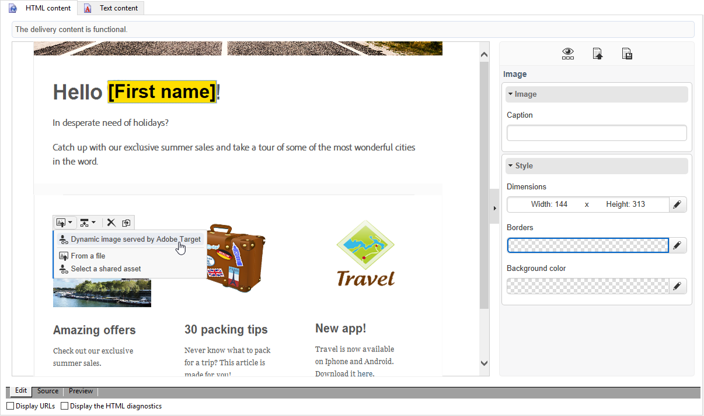

* If you are using the standard editor, place the cursor where you want to insert the image and select **[!UICONTROL Include]** > **[!UICONTROL Dynamic image served by Adobe Target...]** from the personalization drop-down menu.

   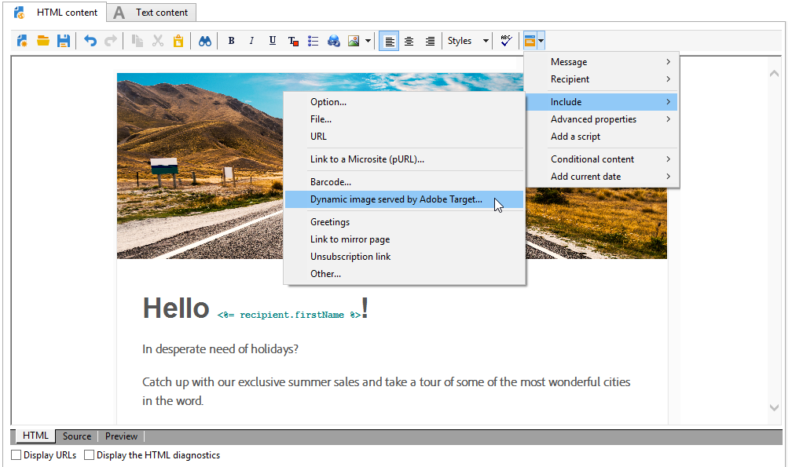

### Defining the image parameters {#defining-image-parameters}

* The **[!UICONTROL Default image]**'s URL: The image that will be displayed when none of the conditions are fulfilled. You can also select an image from your Assets library.
* The **[!UICONTROL Target location]**: Enter a name for your dynamic offer's location. You will have to select this location in your Target activity.
* The **[!UICONTROL Landing Page]**: If you want the default image to redirect to a default landing page. This URL is only for the cases when the default image is displayed in the final email and is optional.
* The **[!UICONTROL Additional decision parameters]**: Specify the mapping between the fields defined in the Adobe Target segments and the Adobe Campaign fields. The Adobe Campaign fields used must have been specified in the rawbox. In our example, we added the Country field.

If you use Enterprise permissions in your settings in Adobe Target, add the corresponding property in this field. Learn more about Target Enterprise permissions in [this page](https://docs.adobe.com/content/help/en/target/using/administer/manage-users/enterprise/properties-overview.html).

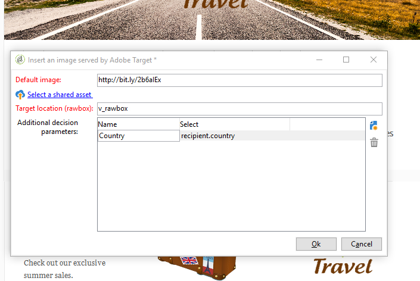

## Creating redirect offers {#create-redirect-offers}

In Target, you can create different versions of your offer. Depending on each user experience, a redirect offer can be created and you can specify the image that will be displayed.

In our case, we need two redirect offers, the third one (the default one) is to be defined in Adobe Campaign.

1. To create a new redirect offer in Target Standard, from the **[!UICONTROL Content]** tab, click **[!UICONTROL Code offers]**.

1. Click **[!UICONTROL Create]** then **[!UICONTROL Redirect Offer]**.

   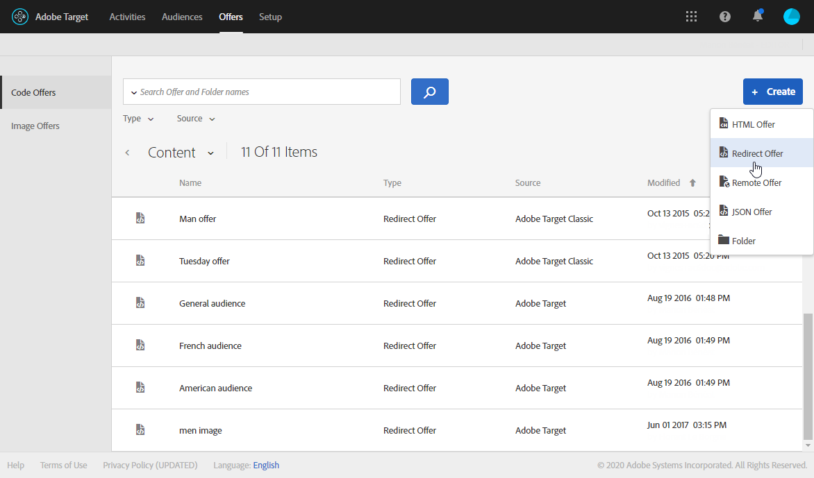

1. Enter a name for the offer and the URL of your image.

   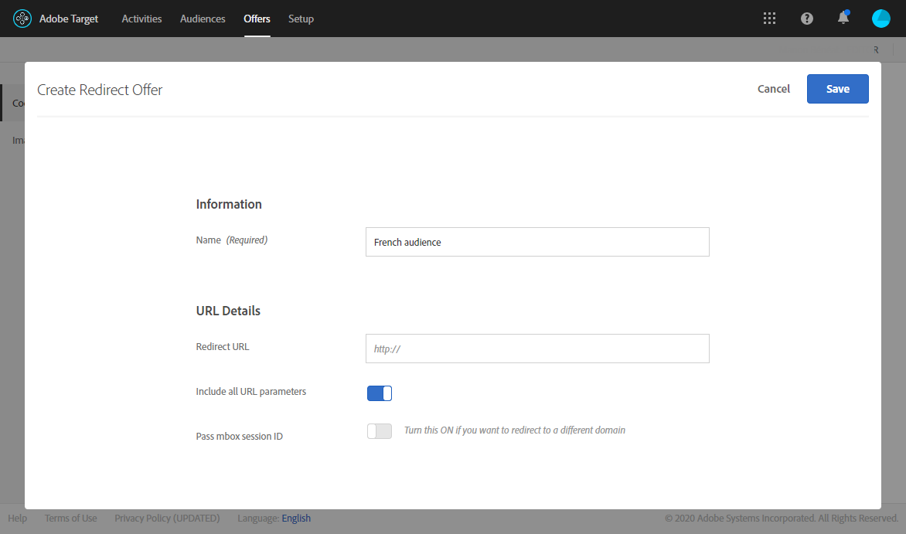

1. Follow the same procedure for the remaining redirect offer. For more on this, refer to this [page](https://docs.adobe.com/help/en/target/using/experiences/offers/offer-redirect.html).

## Creating audiences {#audiences-target}

In Target, you need to create the two audiences into which the people who visit your offer will be categorized for the different contents to be delivered. For each audience, add a rule to define who will be able to see the offer.

1. To create a new audience in Target, from the **[!UICONTROL Audiences]** tab, click **[!UICONTROL Create Audience]**.

   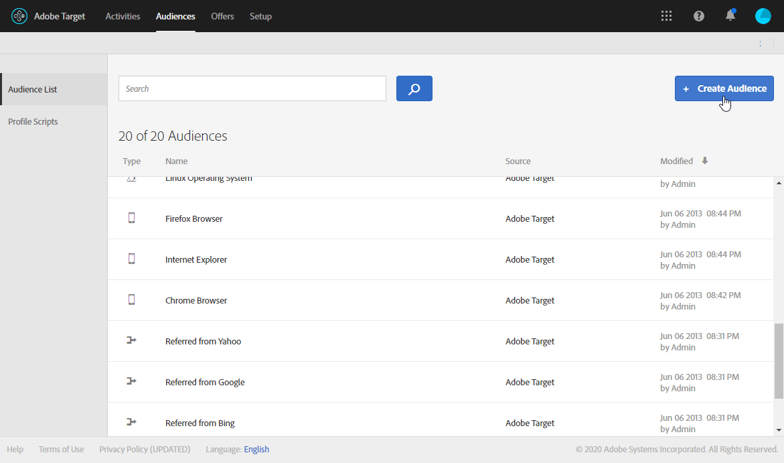

1. Add a name to your audience.

   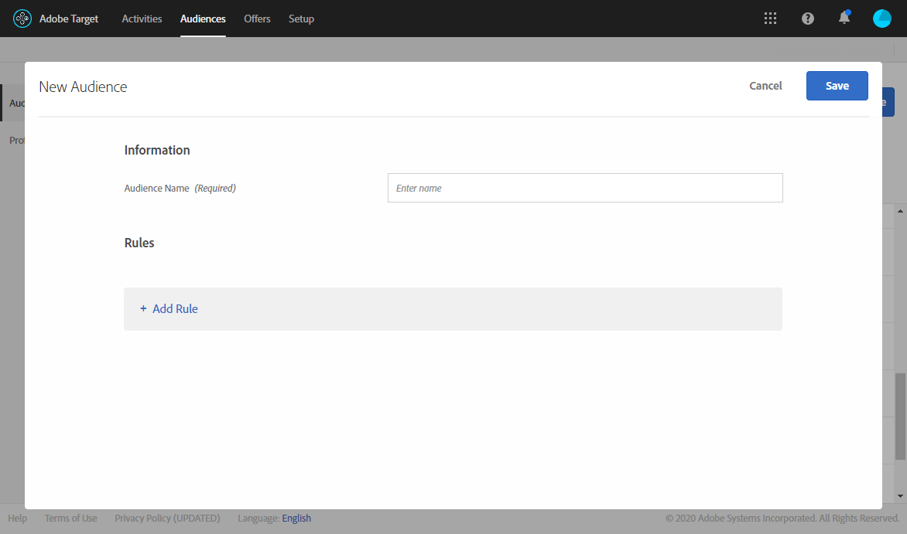

1. Click **[!UICONTROL Add a rule]** and select a category. The rule uses specific criteria to target the visitors. You can refine the rules by adding conditions or by creating new rules in other categories.

1. Follow the same procedure for the remaining audiences.

## Creating an Experience Targeting Activity {#creating-targeting-activity}

In Target, we need to create an Experience Targeting activity, define the different experiences, and associate them with the corresponding offers.

### Defining the audience {#defining-the-audience}

1. To create an Experience Targeting activity, from the **[!UICONTROL Activities]** tab, click **[!UICONTROL Create Activity]** then **[!UICONTROL Experience Targeting]**.

   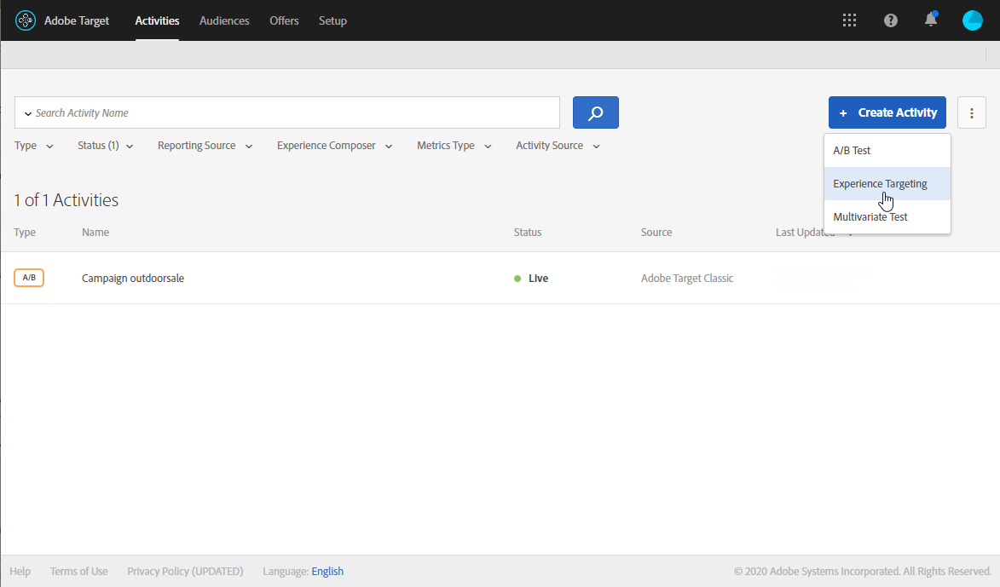

1. Select **[!UICONTROL Form]** as **[!UICONTROL Experience Composer]**.

1. Choose an audience by clicking the **[!UICONTROL Change audience]** button.

   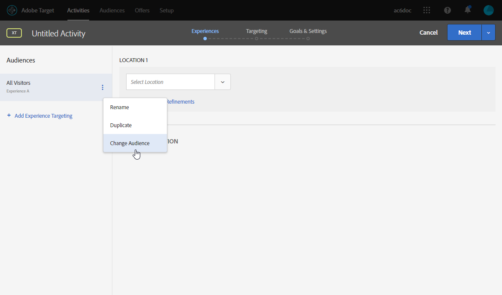

1. Select the audience that was created in the previous steps.

   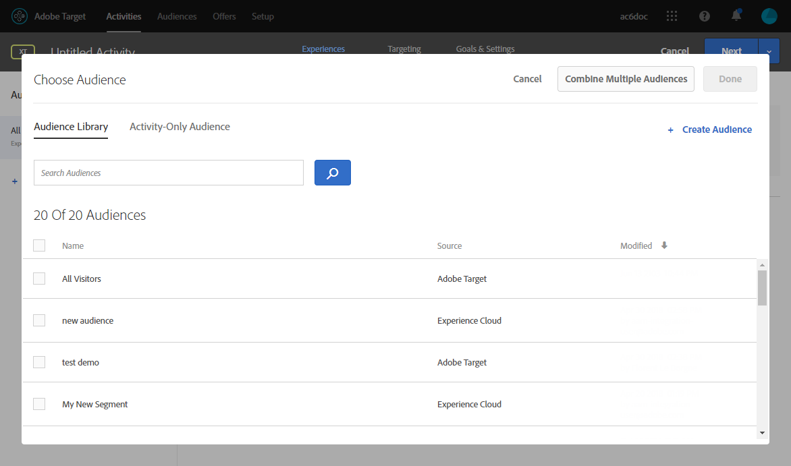

1. Create another experience by clicking **[!UICONTROL Add Experience Targeting]**.

### Defining the location and content {#defining-location-content}

Add a content for each audience:

1. Select the location name that you chose when inserting the dynamic offer in Adobe Campaign.

   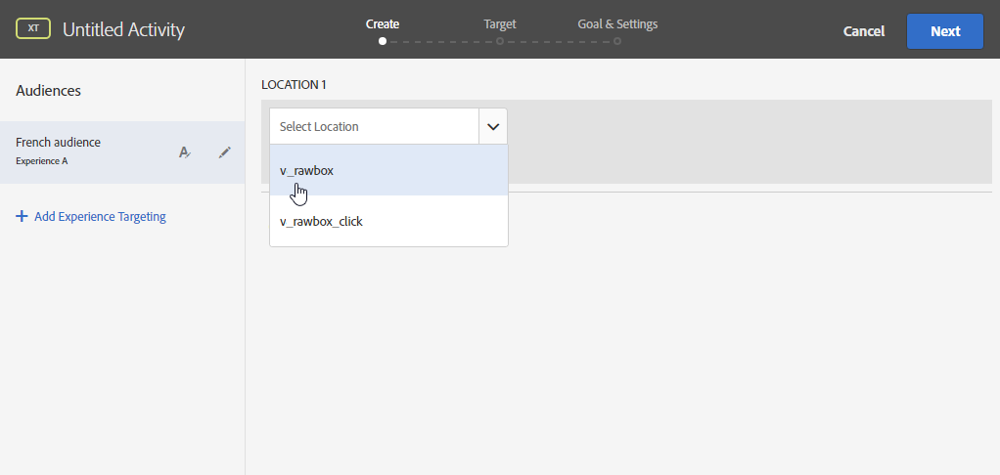

1. Click the drop-down button and select **[!UICONTROL Change Redirect Offer]**.

   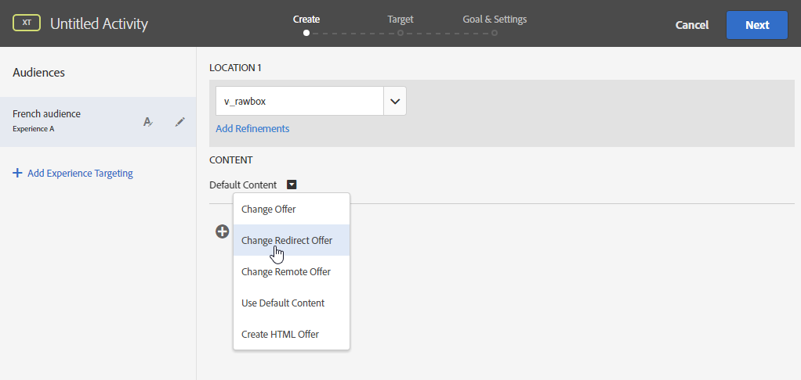

1. Select the redirect offer that you had previously created.

   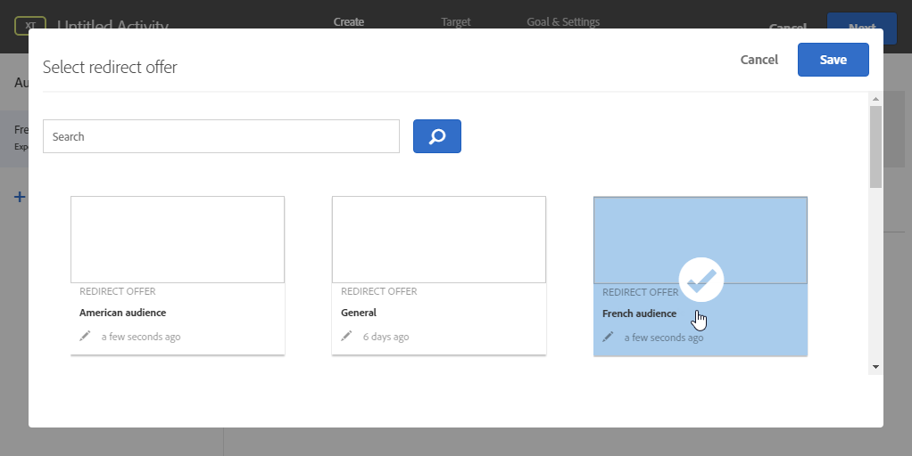

1. Follow the same steps for the second experience.

### Defining the activity {#defining-activity}

The **[!UICONTROL Target]** window summarizes your activity. If necessary, you can add other experiences.

   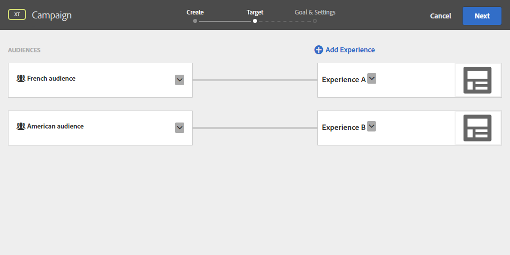

The **[!UICONTROL Goal & Settings]** window allows you to personalize your activity by setting a priority, an objective, or a duration.

The **[!UICONTROL Reporting Settings]** section lets you select an action and edit the parameters that will determine when your goal is achieved.

   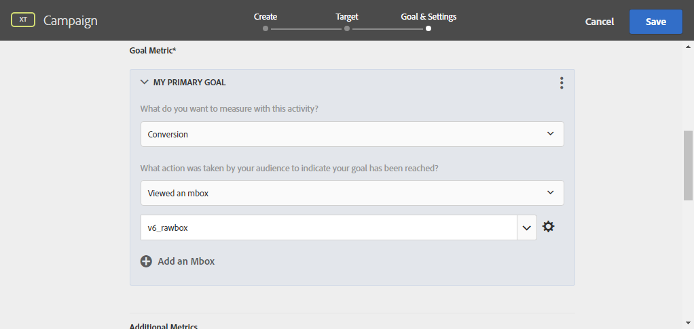

## Previewing and sending the email in Campaign Classic {#preview-send-email}

In Adobe Campaign, you can now preview your email and test its rendering on different recipients. You will notice that the image changes according to the different experiences created. To learn more on email creation, refer to this [page](../../delivery/using/defining-the-email-content.md).

You are now ready to send your email including a dynamic offer from Target.

   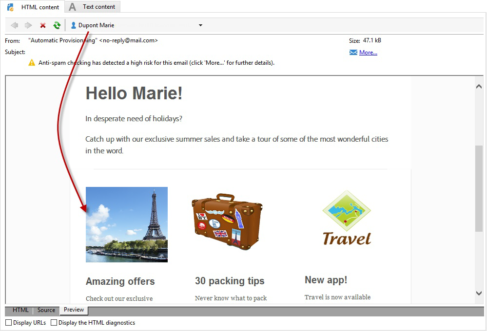
