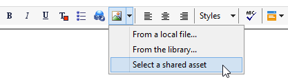
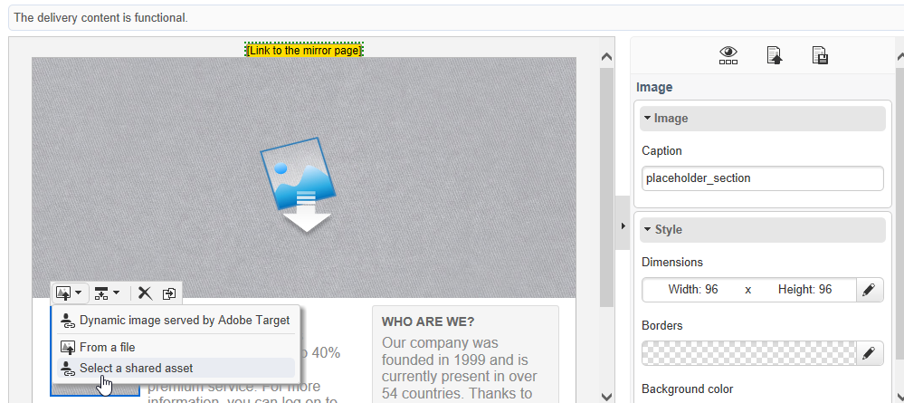
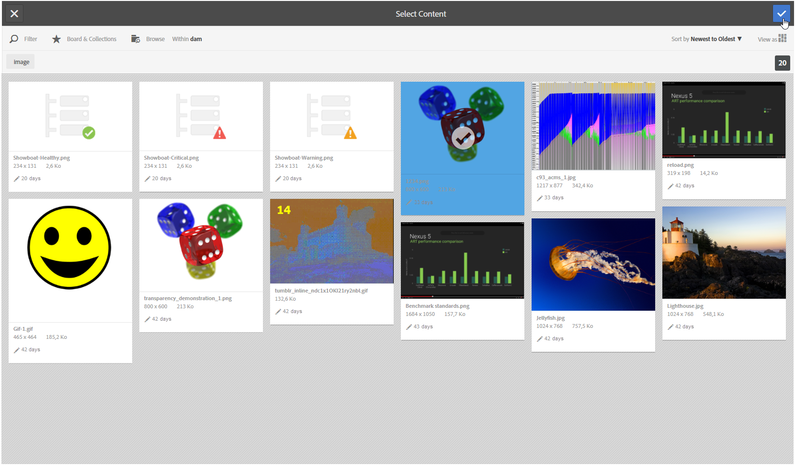

# Inserting a shared asset{#inserting-a-shared-asset}

Assets shared from Adobe Experience Cloud can be used in your emails and landing pages as follows:

1. Create a new email or a new landing page.

   If you use assets from Adobe Experience Manager assets library, use a delivery template created when [configuring the integration](../../integrations/using/configuring-access-to-assets.md#integrating-with-aem-assets).

   If you do not have this specific template, make sure that in the delivery **Properties**, the **[!UICONTROL Content editing mode]** (**[!UICONTROL Advanced]** tab) is set to **DCE** and that the AEM external account that you want to use for accessing your AEM Assets resource library is provided.

1. In the editing window, select the option to add an image:

    * If you are using the [standard editing mode](../../delivery/using/defining-the-email-content.md#adding-images), select **[!UICONTROL Image]** > **[!UICONTROL Select a shared asset]**.
    
      

    * If you are using the [advanced editing mode](../../web/using/about-campaign-html-editor.md) (DCE), go to an image block, then via the contextual menu, select **[!UICONTROL Select a shared asset]**.
    
      

      >[!NOTE]
      >
      >You cannot insert shared images from Adobe Campaign in [web access](../../platform/using/adobe-campaign-workspace.md#console-and-web-access) when using the DCE.

1. In the selection window that opens, select an image, then confirm.

   The available images either come from your Adobe Experience Cloud library, or your AEM Assets library, depending on how your Adobe Campaign instance is configured. Refer to the [Configuring access to Assets](../../integrations/using/configuring-access-to-assets.md) section.

   

>[!NOTE]
>
>If you use the integration with Adobe Target, you can use a shared image as a default image. Refer to [this page](../../integrations/using/integrating-with-adobe-target.md).
