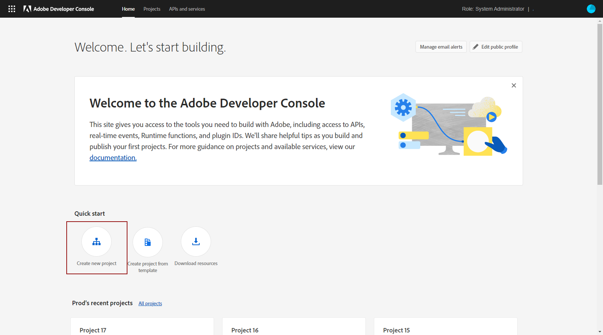
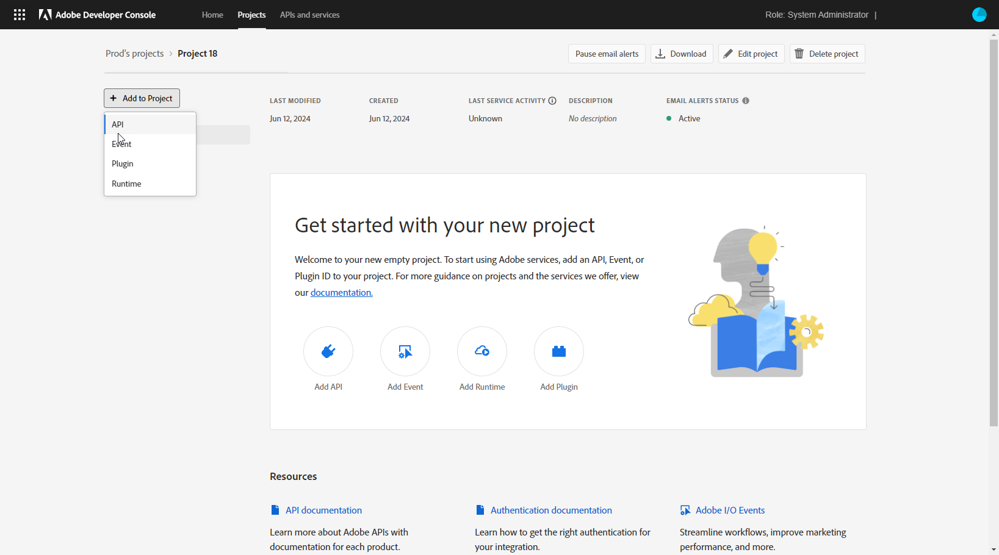
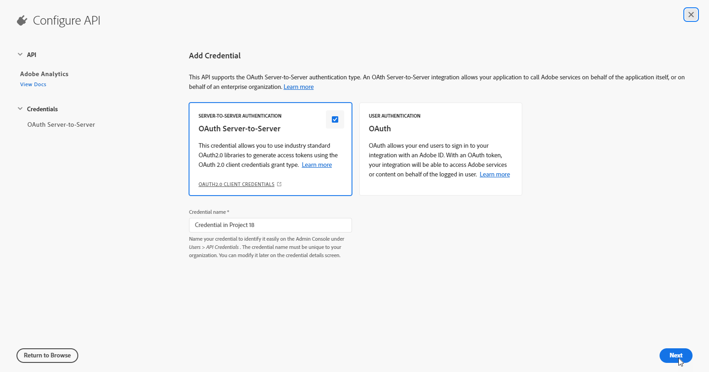
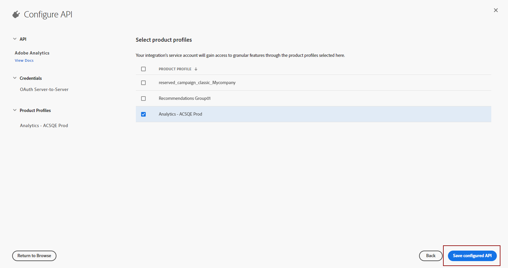

# Create your Adobe technical account {#create-service-account}

Server-to-Server authentication credentials allow your application's server to generate access tokens and make API calls on behalf of your application itself. [Learn more](https://developer.adobe.com/developer-console/docs/guides/authentication/ServerToServerAuthentication/)

## Migrate existing integrations {#migrate-jwt}

The Service Account (JWT) credential is being deprecated by Adobe. Campaign integrations with Adobe solutions and apps must now rely on OAuth Server-to-Server credential.

If you have implemented inbound or outbound integrations with Campaign before June 2024, you must upgrade your Campaign environment to v7.4.1 and migrate your Technical Account to oAuth as detailed [in this documentation](https://developer.adobe.com/developer-console/docs/guides/authentication/ServerToServerAuthentication/migration){target="_blank"}. Existing Service Account (JWT) credentials will continue to work until **January 27, 2025**.

Once migration is done, you must associate your new credential to Campaign as explained in [this section](#add-credentials).

## Create new OAuth technical account for new integrations {#oauth-service}

To create your OAuth technical account for new integrations, follow these steps:

1. Access Adobe Developer console and log in as **System Administrator** of your Organization.
   
   For more information on Admin roles, refer to this [page](https://helpx.adobe.com/enterprise/using/admin-roles.html).
   
1. Click **[!UICONTROL Create a new project]**.

    

1. Click **[!UICONTROL Add to Project]** and select **[!UICONTROL API]**.

    

1. Select the product you want to integrate with Campaign and click **[!UICONTROL Next]**.

1. Choose **[!UICONTROL OAuth Server-to-Server]** as authentication type and click **[!UICONTROL Next]**.

    

1. Select the **[!UICONTROL Product profile]** link to your project. 

    You can create a new one if needed. [Learn more](https://helpx.adobe.com/enterprise/using/manage-product-profiles.html)

1. Then, click **[!UICONTROL Save Configured API]**.

    

1. From your project, under Credential select [!DNL OAuth Server-to-Server] and copy the following information:

   * **[!UICONTROL Client ID]**
   * **[!UICONTROL Client secret]**
   * **[!UICONTROL Technical account ID]**
   * **[!UICONTROL Organization ID]**

## Add OAuth project credentials in Adobe Campaign {#add-credentials}

Follow the steps below to add your OAuth project credentials in Adobe Campaign:

1. Login via SSH to each container where the Adobe Campaign instance is installed.

1. Add your OAuth project credentials in Adobe Campaign by running the following command as `neolane` user. This will insert the **[!UICONTROL Technical Account]** credentials in the instance configuration file.

    ```
    nlserver config -instance:<instance_name> -setimsoauth:ims-org-id/client-id/technical-account-id/client-secret
    ```
