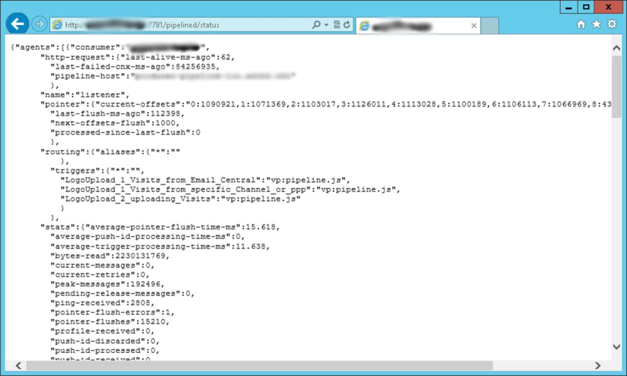
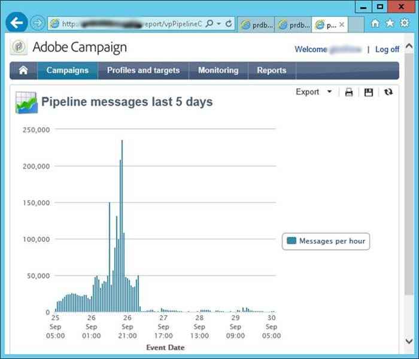

# Pipeline monitoring {#pipeline-monitoring}

The pipelined status web service gives information on the status of the pipelined process.

It can be accessed manually using a browser or automatically with a monitoring application.

It's in REST format, which is described below.

## Indicators {#indicators}

This section lists the indicators in the status web service.

Recommended indicators to monitor are highlighted.

* Consumer: name of the client pulling the triggers. Configured in the pipeline option.
* http-request
    * last-alive-ms-ago: time in ms since a connection check was made.
    * last-failed-cnx-ms-ago: time in ms since the last time the connection check failed.
    * pipeline-host: name of the host where the pipeline data is pulled from.
* pointer
    * current-offsets: value of the pointer into the pipeline, per child thread.
    * last-flush-ms-ago: time in ms since a batch of triggers was retrieved.
    * next-offsets-flush: time to wait until the next batch, when finished.
    * processed-since-last-flush: number of triggers processed in the last batch.
* routing
    * triggers: list of triggers retrieved. Configured in the pipelined option.
* stats
    * average-pointer-flush-time-ms: average processing time for one batch of triggers.
    * average-trigger-processing-time-ms: average time spent parsing the triggers data.
    * bytes-read: number of bytes read from the queue since the process was started.
    * current-messages: current number of pending messages that have been pulled from the queue and are awaiting processing. This indicator should be close to zero.
    * current-retries: current number of messages that have failed processing and are awaiting retry.
    * peak-messages: maximum number of pending messages the process has been handling since it was started.
    * pointer-flushes: number of batches of messages processed since the start.
    * routing-JS-custom: number of messages that were processed by the custom JS.
    * trigger-discarded: number of messages that were discarded after too many retries due to processing errors.
    * trigger-processed: number of messages that were processed without an error.
    * trigger-received: number of messages received from the queue.

These stats are displayed per processing thread.

* average-trigger-processing-time-ms: average time spent parsing the triggers data.
* is-JS-processor: value "1" if this thread uses the custom JS.
* trigger-discarded: number of messages that were discarded after too many retries due to processing errors. This indicator should be zero.
* trigger-failures: number of processing errors in the JS. This indicator should be zero.
* trigger-received: number of messages received from the queue. 

* Settings: they are set in the config files.
    * flush-pointer-msg-count: number of messages in a batch.
    * flush-pointer-period-ms: time between two batches, in milliseconds.
    * processing-threads-JS: number of processing threads running the custom JS.
    * retry-period-ms: time between two retries when a processing error occurs.
    * retry-validity-duration-ms: duration from the time processing is retried until the message is discarded.
    * Pipeline messages Report

## Pipeline messages report {#pipeline-report}

This report displays the number of messages per hour in the last five days.

    
