# Synchronizing audiences{#synchronizing-audiences}

You can build a sophisticated list by using the Campaign v7 advanced features and share this list as an audience directly and in real time with Campaign Standard (including additional data) in a seamless way. Your Campaign Standard user can then consume the audience in Adobe Campaign Standard.

Complex targeting involving additional data that are not replicated in Campaign Standard can only be achieved using Campaign v7.

You can also simply share lists of recipients or data coming through a connector like Microsoft Dynamics with Campaign Standard.

This use case shows how to prepare the target of your delivery in Campaign v7 and how to reuse this target and its additional data in a delivery created and sent with Adobe Campaign Standard.

>[!NOTE]
>
>You can also enrich data using aggregates and collections in Adobe Campaign Standard if all the data you need are already replicated.

## Prerequisites {#prerequisites}

To achieve this, you need:

* Recipients stored in Campaign v7 database and synchronized with Campaign Standard. Refer to the [Synchronizing profiles](../../integrations/using/synchronizing-profiles.md) section.
* Additional data such as subscriptions or transactions stored in tables related to nms:recipients in Campaign v7 database. These data can come from Campaign v7 OOB schemas or custom tables. They are by default unavailable in Campaign Standard as they are not synchronized.
* Right to execute workflows in both Campaign v7 and Campaign Standard.
* Right to create and execute a delivery in Campaign Standard.

## Create a targeting workflow with additional data in Campaign v7 {#create-a-targeting-workflow-with-additional-data-in-campaign-v7}

Complex targeting involving additional data that are not replicated in Campaign Standard can only be achieved using Campaign v7.

Once the target and its additional data are defined, it is possible to save it as a list that can be shared with Campaign Standard.

>[!NOTE]
>
>This is an example. Depending on your requirements, you can simply query a list of recipients and share it with ACS without any further processing. You can also use other data management activities to prepare your final target.

To get the final audience and its additional data:

1. Create a new workflow from **Profiles and Targets** > **Jobs** > **Targeting workflows**.
1. Add a **Query** activity and select the recipients that you want to send final email to. For example, all recipients between 18 and 30 years old and living in France.

   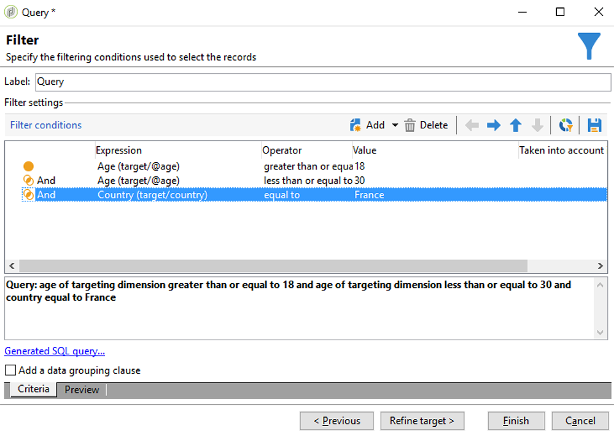

1. Add additional data from within the query. For more information, refer to the [Adding data](../../workflow/using/query.md#adding-data) section.

   This example shows how to add an aggregate to count how many deliveries a recipient received in a year.

   In the **Query**, select **Add data...**.

   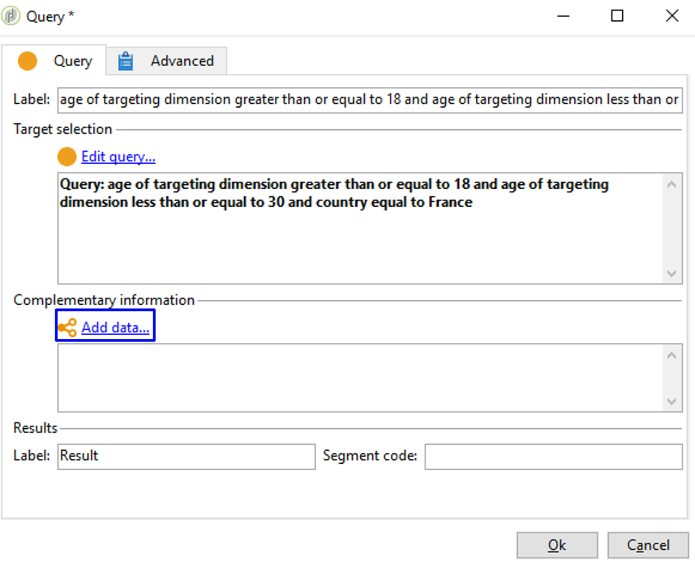

1. Select **Data linked to the filtering dimension** and click **Next**.

   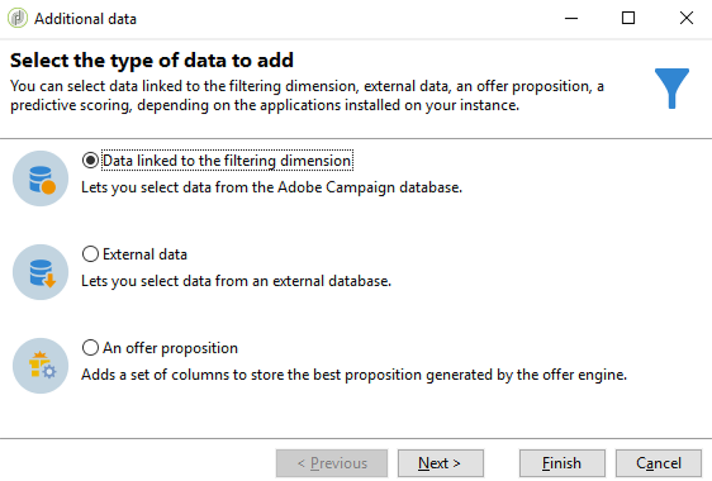

1. Choose **Data linked to the filtering dimension** and then select the **Recipient delivery logs** node and click **Next**.

   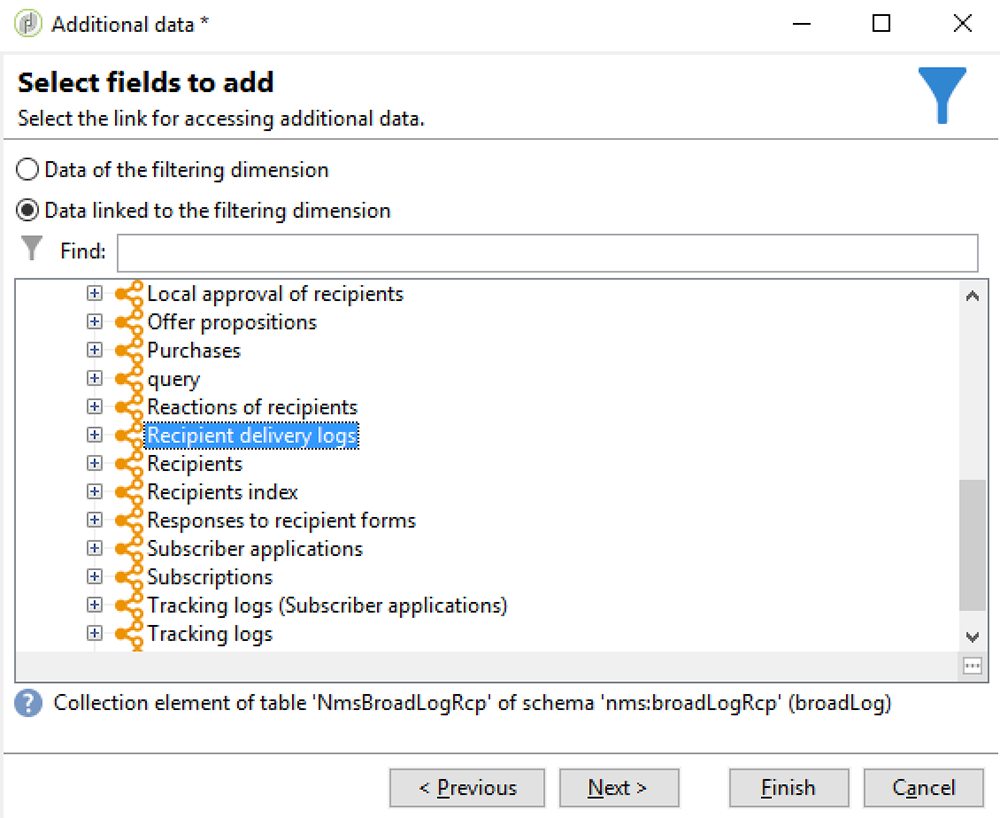

1. Select **Aggregates** in the **Data collected** field and click **Next**.

   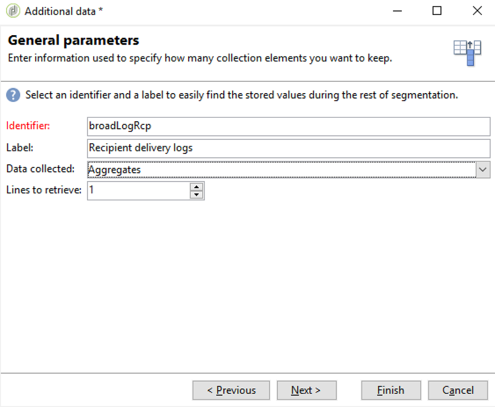

1. Add a filtering condition to only take into account logs that were created during the last 365 days and click **Next**.

   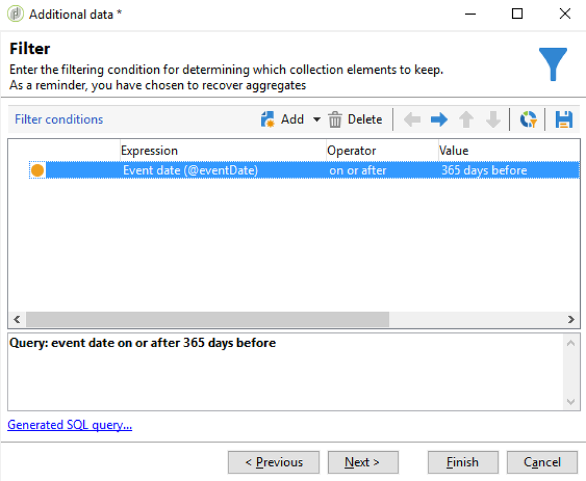

1. Define the output columns. Here, the only needed column is the one counting the number of deliveries. To do that:

    * Select **Add** on the right of the window.
    * From the **Select field** window, click **Advanced selection**.
    * Select **Aggregate**, then **Count**. Check the **Distinct** option, and click **Next**.
    * In the list of fields, select the field used for the **Count** function. Choose a field that will always be populated, for example the **Primary key** field, and click **Finish**.
    * Change the expression in the **Alias** column. This alias will allow you to easily retrieve the added column in the final delivery. For example **NBdeliveries**.
    * Click **Finish** and save the **Query** activity configuration.

   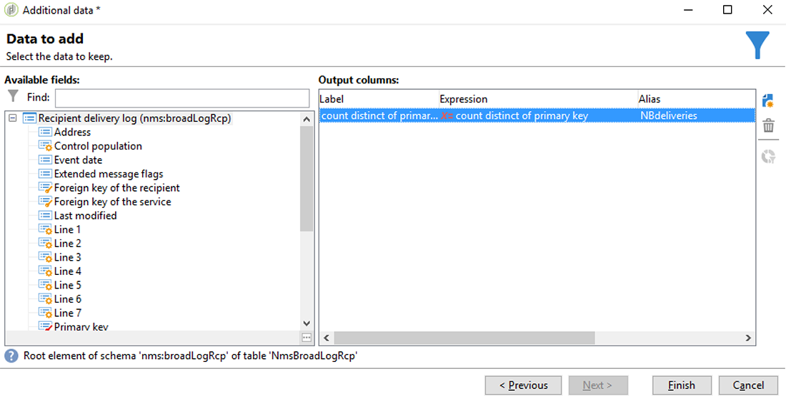

1. Save the workflow. The next section shows how to share the population with ACS.

## Share the target with Campaign Standard {#share-the-target-with-campaign-standard}

Once the target population is defined, you can share it with ACS through a **List update** activity.

1. In the workflow created previously, add a **List update** activity and specify the list you want to update or create.

   Specify the folder in which you want to save the list in Campaign v7. Lists are subject to the folder mapping defined during the implementation, which can have an impact on their visilibity once shared in Campaign Standard. Refer to the [Rights conversion](../../integrations/using/synchronizing-audiences.md#rights-conversion) section.

1. Make sure the **Share with ACS** option is checked. It is checked by default.

   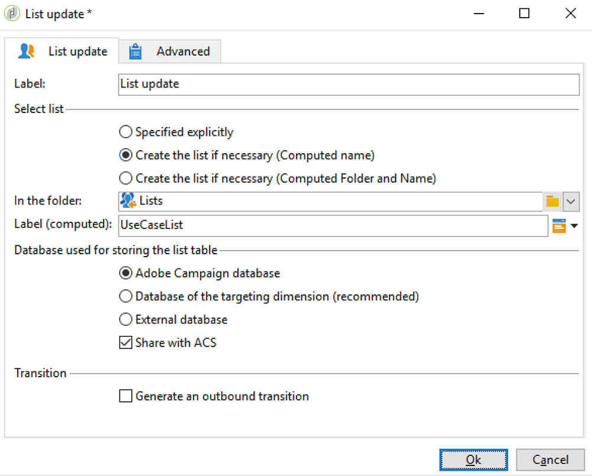

1. Save and execute the workflow.

   The target and its additional data are saved in a list in Campaign v7 and shared immediately as a list audience in Campaign Standard. Only the profiles that have been replicated are shared with ACS.

If an error occurs on the **List update** activity, it means that the synchronization with Campaign Standard may have failed. To be able to see more details about what went wrong, go to **Administration** > **ACS Connector** > **Process** > **Diagnosis**. This folder contains synchronization workflows triggered by the **List update** activity execution. Refer to the [Troubleshooting the ACS Connector](../../integrations/using/troubleshooting-the-acs-connector.md) section.

## Retrieve the data in Campaign Standard and use it in a delivery {#retrieve-the-data-in-campaign-standard-and-use-it-in-a-delivery}

Once the targeting workflow is executed in Campaign v7, you are able to find the list audience in read-only mode from the **Audiences** menu of Campaign Standard.

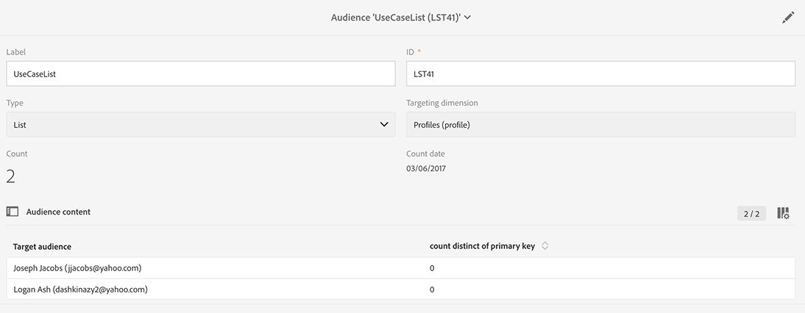

By creating a delivery workflow in Campaign Standard, it is then possible to use this audience as well as the additional data that it contains in a delivery.

1. Create a new workflow from the **Marketing activities** menu.
1. Add a **Read audience** activity and select the audience you previously shared from Campaign v7.

   This activity is used to retrieve the data of the selected audience. You can also apply an additional **Source Filtering** if needed by using the according tab of this activity.

1. Add an **Email delivery** activity and configure it as any other [email delivery activity](https://helpx.adobe.com/campaign/standard/automating/using/email-delivery.html).
1. Open the delivery content.
1. Add a personalization field. From the popup, locate the **Additional data (targetData)** node. This node contains the additional data of the audience that were computed in the initial targeting workflow. You can use them as any other personalization field.

   For this example, the additional data coming from the original targeting workflow is the number of deliveries sent to each recipient in the last 365 days. The NBdeliveries alias specified in the targeting workflow is visible here.

   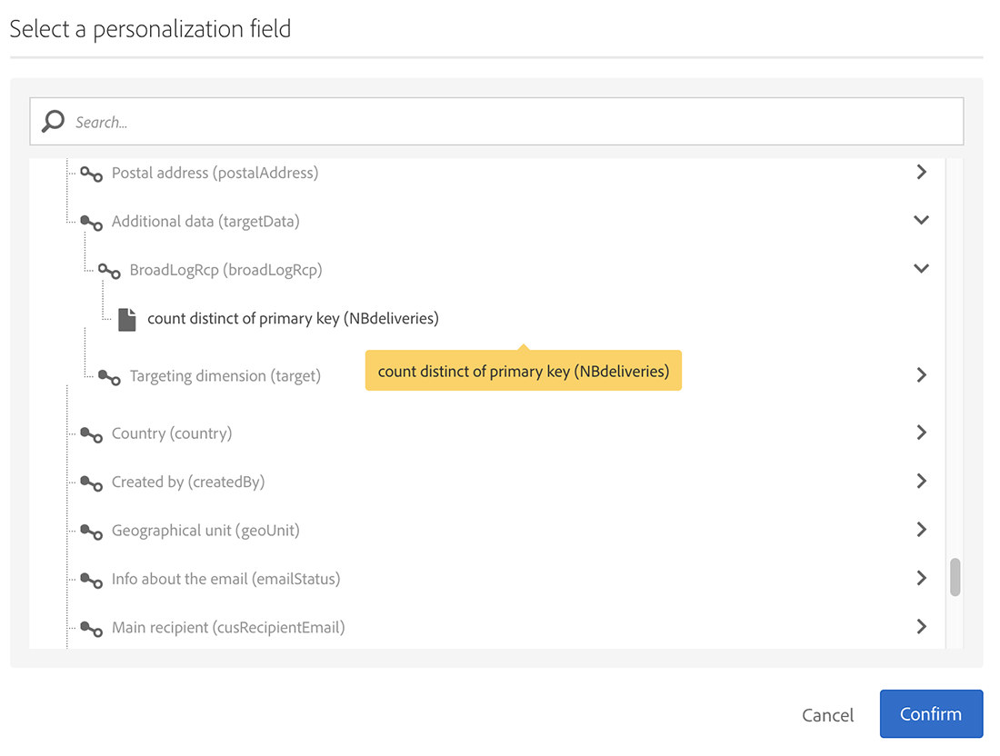

1. Save the delivery and the workflow.

   The workflow is now ready to be executed. The delivery will be analyzed and ready to be sent.

   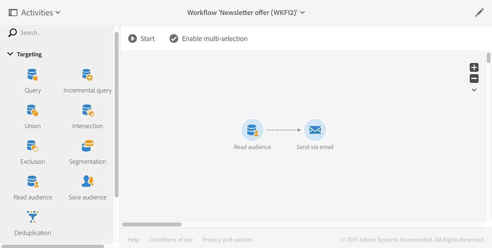

## Send and monitor your delivery {#send-and-monitor-your-delivery}

Once the delivery and its content are ready, send the delivery, as described with more details in [this section](https://helpx.adobe.com/campaign/standard/automating/using/email-delivery.html):

1. Execute the delivery workflow. This step prepares the email for sending.
1. From the delivery dashboard, manually confirm that the delivery can be sent.
1. Monitor the reports and logs of the delivery:

    * **In Campaign Standard**: Access [reports](https://helpx.adobe.com/campaign/standard/reporting/using/about-dynamic-reports.html) and [logs](https://helpx.adobe.com/campaign/standard/sending/using/monitoring-a-delivery.html) related to the delivery as for any delivery.
    * **in Campaign v7 and Campaign Standard**: Delivery IDs, email broad logs, and email tracking logs are synchronized to Campaign v7. You can then get à 360° view of your marketing campaigns from Campaign v7.

      Quarantines are automatically synchronized back to Campaign v7. This allows to take non-deliverable information into account for the next targeting performed in Campaign v7.

      You can find more information about quarantine management in Campaign Standard in [this section](https://helpx.adobe.com/campaign/standard/sending/using/understanding-quarantine-management.html).

