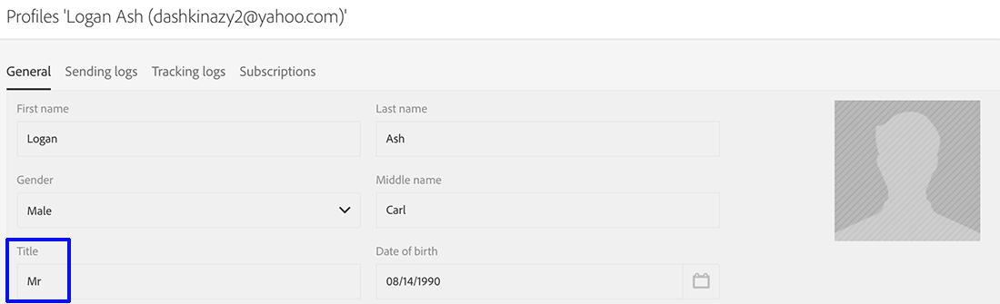

# Synchronizing profiles{#synchronizing-profiles}

ACS Connector replicates data from Campaign v7 to Campaign Standard. The data received from Campaign v7 can be used in Campaign Standard to create deliveries. You can see how profiles are synchronized by performing the operations listed below.

* **Add new recipients**: Create a new recipient in Campaign v7 and confirm that a corresponding profile has been replicated to Campaign Standard. See [Creating a new recipient](../../integrations/using/synchronizing-profiles.md#creating-a-new-recipient).
* **Update recipients**: Edit a new recipient in Campaign v7 and view the corresponding profile in Campaign Standard to confirm that the update has been replicated. See [Editing a recipient](../../integrations/using/synchronizing-profiles.md#editing-a-recipient).
* **Build a workflow in Campaign Standard**: Create a workflow in Campaign Standard that includes a query with an audience or profiles replicated from Campaign v7. See [Creating a workflow](../../integrations/using/synchronizing-profiles.md#creating-a-workflow).
* **Create a delivery in Campaign Standard**: Follow the workflow to completion to send a delivery. See [Creating a delivery](../../integrations/using/synchronizing-profiles.md#creating-a-delivery).
* **Verify the unsubscription link**: Use a Campaign v7 web application to make certain that the recipient's choice to unsubscribe to a service is sent to the Campaign v7 database. The option to stop receiving the service is replicated to Campaign Standard. See [Changing the unsubscription link](../../integrations/using/synchronizing-profiles.md#changing-the-unsubscription-link).

## Prerequisites {#prerequisites}

The following sections describe how ACS Connector helps you add and edit recipients in Campaign v7 and then use them in a Campaign Standard delivery. ACS Connector requires the following:

* Recipients in Campaign v7 replicated to Campaign Standard.
* User rights to execute workflows in both Campaign v7 and Campaign Standard.
* User rights to create and execute a delivery in Campaign Standard.

## Changing the unsubscription link {#changing-the-unsubscription-link}

When a recipient clicks the unsubscription link in an email sent by Campaign Standard, the corresponding profile in Campaign Standard is updated. To make certain that a replicated profile includes a user's choice to unsubscribe to a service, the information must be sent to Campaign v7 rather than Campaign Standard. To execute the change, the unsubscription service is linked to a Campaign v7 web application rather than Campaign Standard.

>[!NOTE]
>
>Please ask your consultant to configure the web application for the unsubscription service before following the steps below.

## Creating a new recipient {#creating-a-new-recipient}

1. Create a new recipient in Campaign v7 for replication to Campaign Standard. Enter as much information as possible, including the recipient's last name, first name, email address, and postal address. However, do not choose a **Salutation** since it will be added in the next section, [Editing a recipient](../../integrations/using/synchronizing-profiles.md#editing-a-recipient). For further information, see [Adding recipients](../../platform/using/adding-profiles.md).

   

1. Confirm that the new recipient has been added to Campaign Standard. When reviewing the profile, make certain that the data you entered in Campaign v7 is also available in Campaign Standard. To learn where to find profiles in Campaign Standard, see [Navigation Basics](https://helpx.adobe.com/campaign/standard/start/using/interface-description.html).

   

   By default, the periodic replication for ACS Connector is once every 15 minutes. For further information, see [Data replication](../../integrations/using/synchronizing-profiles.md#data-replication).

## Editing a recipient {#editing-a-recipient}

The steps below for changing a single point of data offer a simple example of how Campaign v7 becomes the master database for Campaign Standard when using data replication. Modifying or deleting replicated data in Campaign v7 has the same effect on the corresponding data in Campaign Standard.

1. Choose the newly created recipient from [Creating a new recipient](../../integrations/using/synchronizing-profiles.md#creating-a-new-recipient) and edit the recipient’s name. For example, choose a **Salutation** for the recipient (e.g. Mr. or Mrs.). For further information, see [Editing a profile](../../platform/using/editing-a-profile.md).

   

1. Confirm that the recipient’s name has been updated in Campaign Standard. To learn where to find profiles in Campaign Standard, see [Navigation Basics](https://helpx.adobe.com/campaign/standard/start/using/interface-description.html).

   

   By default, the periodic replication for ACS Connector is once every 15 minutes. For further information, see [Data replication](../../integrations/using/synchronizing-profiles.md#data-replication).

## Creating a workflow {#creating-a-workflow}

Profiles and services replicated from Campaign v7 are available to digital marketers to leverage the rich data in Campaign Standard. The instructions below demonstrate how to add a query to a Campaign Standard workflow and then use it with the replicated database.

For further information and full instructions regarding Campaign Standard workflows, see [Workflows](https://helpx.adobe.com/campaign/standard/automating/using/about-data-and-processes.html).

1. Go to Campaign Standard and click **Marketing Activities**.
1. Click **Create** on the upper right.
1. Click **Workflow**.
1. Click **New workflow** and **Next**.
1. Enter a name for the workflow in the **Label** field and additional information if needed. Click **Next**.
1. From **Targeting** on the left, drag a **Query** target to the workspace.

   

1. Double click the **Query** activity and choose a parameter that can be used with the replicated database. For example, you can:

    * Drag **Profiles** to the workspace. Use the field pull-down menu to choose **Is external resource** to find profiles that were replicated from Campaign v7.
    * Drag other query parameters to further target the replicated profiles.

## Creating a delivery {#creating-a-delivery}

>[!NOTE]
>
>The instructions for creating the delivery continue the workflow started with [Creating a workflow](../../integrations/using/synchronizing-profiles.md#creating-a-workflow).

Digital marketers can leverage a Campaign v7 web application to make certain that a recipient's choice to unsubscribe to a service is sent to the Campaign v7 database. After the recipient clicks the unsubscription link, the option to stop receiving the service is replicated from Campaign v7 to Campaign Standard. For additional details, see [Changing the unsubscription link](../../integrations/using/synchronizing-profiles.md#changing-the-unsubscription-link).

Follow the steps below to add an email delivery to an existing workflow with the unsubscription service created in Campaign v7. For further information and full instructions regarding Campaign Standard workflows, see this [document](https://helpx.adobe.com/campaign/standard/automating/using/about-data-and-processes.html).

>[!NOTE]
>
>Please ask your consultant to configure the web application for the unsubscription service before following the steps below.

1. Click **Channels** on the left.
1. Drag **Email delivery** to the existing workflow in the workspace.

   

1. Double click the **Email delivery** activity and choose **Single send email** or **Recurring email**. Select your options and click **Next**.
1. Click **Send via email** and click **Next**.

   

1. Enter a name for the delivery in the **Label** field and additional information if needed. Click **Next**.

   

1. In the **Subject** field, enter the subject that will appear in the recipient's email inbox.
1. Click **Change content** to add an HTML template.

   

1. Choose content that includes the link to unsubscribe to the service. Click **Confirm**.

   

1. The current unsubscription link must be replaced by a new one that uses the web application created by your consultant. Locate the unsubscription link at the bottom of the email content and click it once. Click the trash can icon to delete the link.

   

1. Click inside the same content area and type **Unsubscription link**.

   

1. Highlight the text with your cursor and click the chain icon.
1. Click **Link to a landing page**.

   

1. Click the folder icon to choose the landing page.

   

1. Choose the web application created by the consultant and click **Confirm**.

   

1. Click **Create**.
1. Return to the workflow by clicking the delivery name.

   

1. Click **Start** to send the delivery. The email delivery icon blinks to indicate that it is being prepared for delivery.

   

1. Double click the **Email delivery** channel and choose **Confirm** to send the email. Click **OK** to send the messages.

   

## Verifying the unsubscription service {#verifying-the-unsubscription-service}

Follow the instructions in [Creating a workflow](../../integrations/using/synchronizing-profiles.md#creating-a-workflow) and [Creating a delivery](../../integrations/using/synchronizing-profiles.md#creating-a-delivery) before moving to the steps below.

1. The recipient clicks the unsubscription link in the email delivery.

   

1. The recipient confirms the unsubscription.

   

1. The recipient data in Campaign v7 is updated to reflect that the user has unsubscribed. Confirm that the box **No longer contact (by any channel)** is checked for the recipient. To learn how to view a recipient in Campaign v7, see [Editing a profile](../../platform/using/editing-a-profile.md).

   

1. Go to Campaign Standard and open the profile details for the recipient. Confirm that a checkbox appears next to **No longer contact (by any channel)**. To learn where to find profiles in Campaign Standard, see [Navigation Basics](https://helpx.adobe.com/campaign/standard/start/using/interface-description.html).

   

