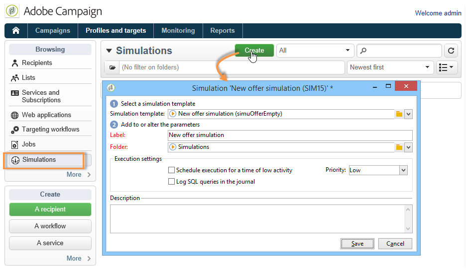
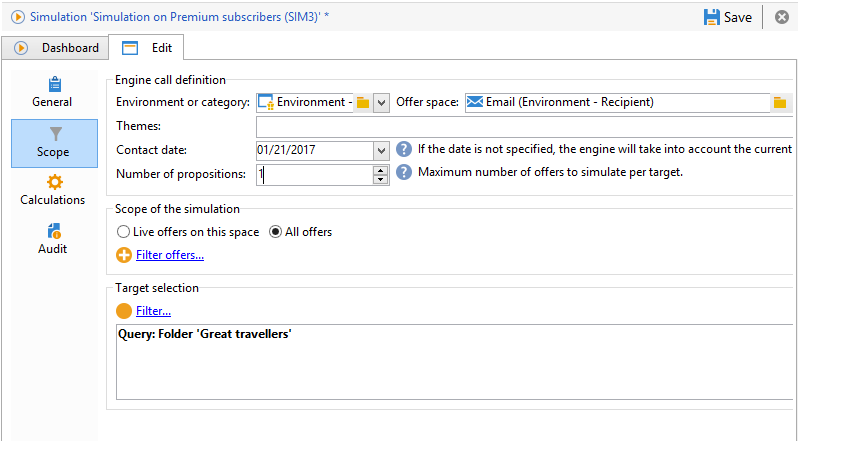
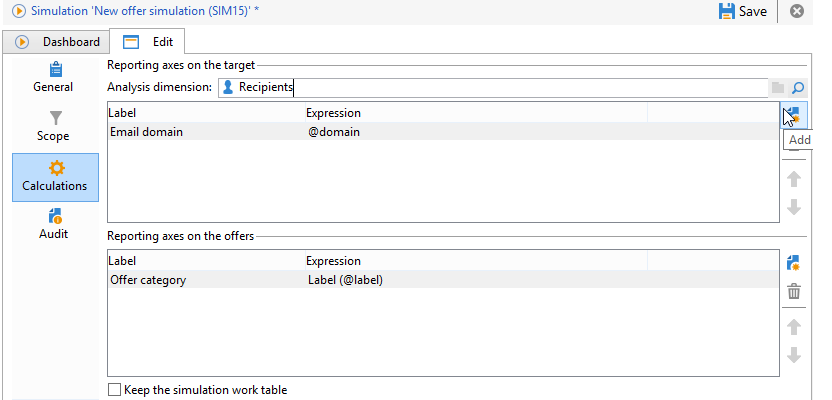
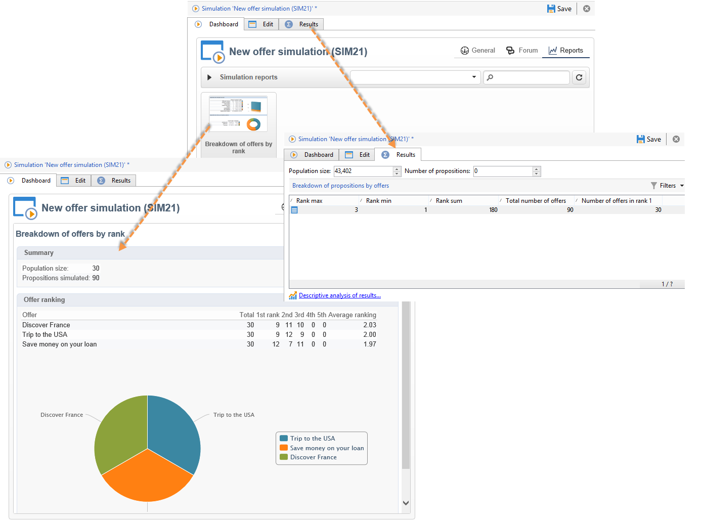

# About offers simulation{#about-offers-simulation}

The **Simulation** module lets you test the distribution of offers belonging to a category or an environment before sending your proposition to recipients.

Simulation takes into account the contexts and eligibility rules previously applied to offers (refer to [Offer catalog overview](../../interaction/using/offer-catalog-overview.md)), as well as their presentation rules (refer to [Managing offer presentation](../../interaction/using/managing-offer-presentation.md)). This lets you test and refine various versions of your offer proposition without actually using an offer or over/under soliciting a target, since simulation has no impact on the targeted recipients.

To learn how to simulate an offer, read the steps below.

 You can also watch this [video](https://helpx.adobe.com/campaign/classic/how-to/simulate-offer-in-acv6.html?playlist=/ccx/v1/collection/product/campaign/classic/segment/digital-marketers/explevel/intermediate/applaunch/introduction/collection.ccx.js&ref=helpx.adobe.com).

## Main steps for creating a simulation {#main-steps-for-creating-a-simulation}

To run a simulation of your offers, apply the following steps:

1. In the **[!UICONTROL Profiles and Targets]** tab, click the **[!UICONTROL Simulations]** link, then click the **[!UICONTROL Create]** button.

   

1. Save and edit the simulation which you have just created.
1. Go to the **[!UICONTROL Edit]** tab and specify the execution settings.

   For more on this, refer to [Execution settings](../../interaction/using/execution-settings.md).

   

   >[!NOTE]
   >
   >Execution settings are only available if you are using Interaction with Campaign.

1. Specify the simulation scope.

   For more on this, refer to [Definition of the scope](../../interaction/using/simulation-scope.md#definition-of-the-scope).

   

1. Add reporting axes to enhance the **[!UICONTROL Offer distribution by rank]** report (optional).

   For more on this, refer to [Adding reporting axes](../../interaction/using/simulation-scope.md#adding-reporting-axes).

   

1. Click **[!UICONTROL Save]** to record the simulation settings.
1. Start the simulation via the dashboard.

   

1. Check the simulation result and display the analysis report.

   For more on this, refer to [Simulation tracking](../../interaction/using/simulation-tracking.md).

   
