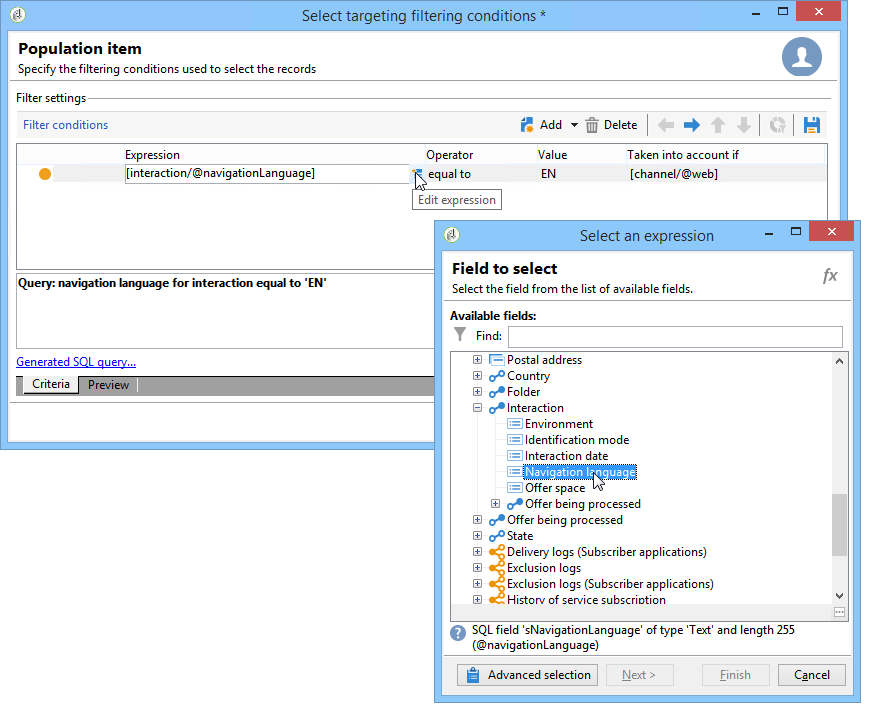
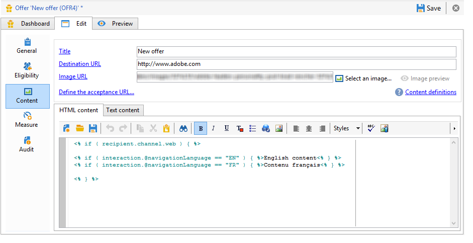
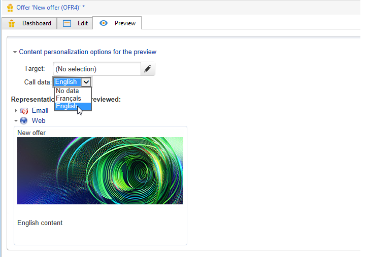
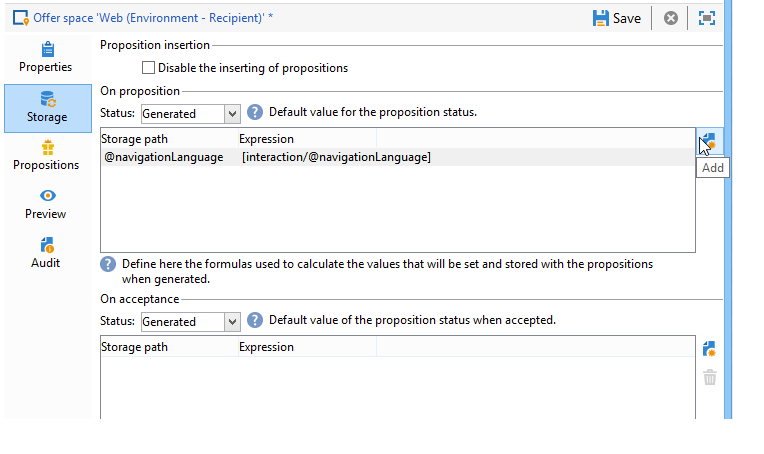

# Additional data{#additional-data}


During a call to the Interaction engine, you can transfer contextual additional information. This data can come from the target data stored in the work table of a workflow (outbound channel) or the call data sent by the website during the call (inbound channel). You can use this additional data in the eligibility rules, in offer personalization, and you can also store it in a proposition table.

For the inbound channel, it may be useful to recover information such as the browser language of the people consulting the offer, or the name of the call center agent, for example. You can then use this call data in the eligibility rules to present an offer only to those people viewing the web page in French or English.

In a targeting workflow (outbound channel), you can use the target data during a call to the engine. For example, you can enrich the target with data from a recipient linked transaction or an external database, via the FDA.

## Additional data configuration {#additional-data-configuration}

You must extend the **nms:interaction** schema linked to the environment and declare the list of additional fields that will be used during a call to the Interaction engine. When creating the eligibility rule or personalizing an offer, these fields will become accessible from the **Interaction** node (refer to [Using additional data](#using-additional-data)).

For the inbound channel, you must add the call data fields into the **Interaction** node.

```
<element label="Interactions" labelSingular="Interaction" name="interaction">
  <attribute label="Navigation language" name="navigationLanguage" type="string"/>
</element>
```

>[!NOTE]
>
>Xml collections are supported on the inbound channel, but the links to other schemas are not.

For the outbound channel, you must add a **targetData** element containing the additional fields into the **Interaction** node.

```
<element label="Interactions" labelSingular="Interaction" name="interaction">
  <element name="targetData">
    <attribute label="Date of last transaction" name="lastTransactionDate" type="datetime"/>
  </element>
</element>
```

>[!NOTE]
>
>Collections are not supported for the outbound channel. However, you can create links to other schemas.

If you would like to store this data in the proposition table, you must also extend the **nms:propositionRcp** schema and declare these fields.

```
<element label="Recipient offer propositions" labelSingular="Recipient offer proposition" name="propositionRcp">
  <attribute label="Last transaction date" name="lastTransactionDate" type="datetime"/>
  <attribute label="Navigation language" name="navigationLanguage" type="string"/>
</element>
```

## Additional data implementation {#additional-data-implementation}

### Input channel (Web page) {#input-channel--web-page-}

To transfer additional data when calling the engine, you have to add the **interactionGlobalCtx** variable into the web page's JavaScript code. Insert the **Interaction** node containing the call data into this variable. You must respect the same xml structure that is in the **nms:interaction** schema. Refer to: [Additional data configuration](#additional-data-configuration).

```
interactionGlobalCtx = "<interaction navigationLanguage='"+myLanguage+"'/>";
```

### Output channel {#output-channel}

You must create a targeting workflow loading additional data in the work table by respecting the same xml structure and same internal names as in the **nms:interaction** schema. Refer to: [Additional data configuration](#additional-data-configuration).

## Using additional data {#using-additional-data}

### Eligibility rules {#eligibility-rules}

You can use the additional data in the eligibility rules for offers, categories and weights.

For example, you can choose to have the offer presented only to people viewing the page in English. 



>[!NOTE]
>
>You must limit the rule on the channels for which the data is defined. In our example, we are limiting the rule on the inbound web channel (**[!UICONTROL Taken into account if]** field).

### Personalization {#personalization}

You can also use this additional data when personalizing an offer. For example, you can add a condition for the navigation language 



>[!NOTE]
>
>You must limit the personalization on the channels for which the data is defined. In our example, we are limiting the rule on the inbound web channel.

If you have personalized an offer using additional data, this data will not appear in the preview by default because it is not available in the database. In the environment's **[!UICONTROL Example of call data]** tab, you must add value samples to use in the preview. Please respect the same xml structure that is in the **nms:interaction** schema extension. For more on this, refer to [Additional data configuration](#additional-data-configuration).


When previewing, click **[!UICONTROL Content personalization options for the preview]** and select a value in the **[!UICONTROL Call data]** field.



### Storage {#storage}

During a call to the engine, you can store additional data in the proposition table to enrich the database. This data could be used, for example in reports, in ROI calculations, or for later processes.

>[!NOTE]
>
>You must have extended the **nms:propositionRcp** schema and declared the fields that will contain the data to be stored. For more on this: [Additional data configuration](#additional-data-configuration).

In the offer space, go to the **[!UICONTROL Storage]** tab and click the **[!UICONTROL Add]** button.

In the **[!UICONTROL Storage path]** column, select the storage field in the proposition table. In the **[!UICONTROL Expression]** column, select the additional field in the **[!UICONTROL Interaction]** node.

You can retrieve call data when the proposition is generated or when it is accepted (when the person clicks on the offer).


