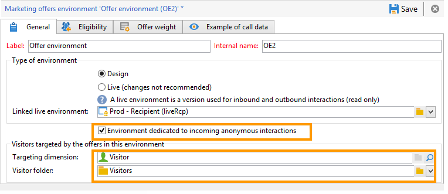
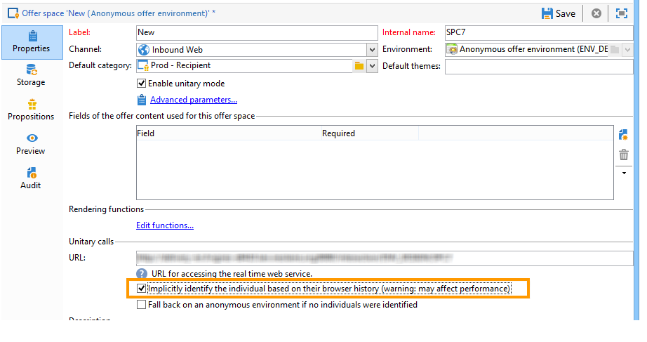
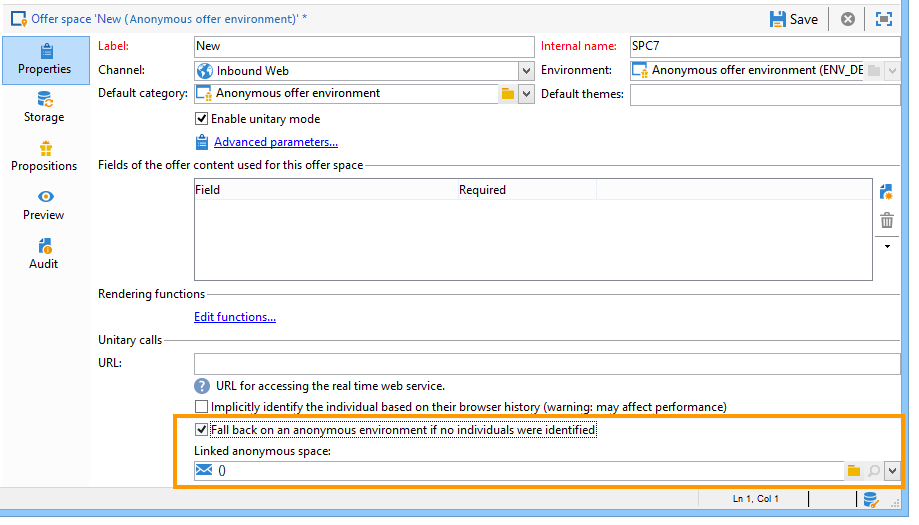

# Anonymous interactions{#anonymous-interactions}

## Targeting and storing an environment for anonymous interactions {#targeting-and-storing-an-environment-for-anonymous-interactions}

By default, Interaction comes with a pre-configured environment to target the recipient table (identified offers). If you wish to target another table (visitor table for anonymous offers or a specific recipient table), you need to use the target mapping wizard to create the environment. For more on this, see [Creating an offer environment](../../interaction/using/anonymous-interactions.md#creating-an-offer-environment).

When you create an anonymous environment via the mapping creation wizard, the **Environment dedicated to incoming anonymous interactions** box is automatically checked in the environment's **General** tab.

The **Targeting dimension** is automatically completed. By default, it links to the visitor table.

The **Visitor folder** field appears. It is automatically completed to link to the **Visitors** folder. This field lets you choose where to store visitor profiles. 

>[!NOTE]
>
>If you want to filter several types of visitors, for instance in the case of anonymous offers presented for one or more brands, you need to create an environment for each brand, and a **Visitors** type folder for each environment.

## Offer catalog for anonymous interactions {#offer-catalog-for-anonymous-interactions}

Just like outbound interactions, inbound interactions are organized in an offer catalog which is made up of categories and offers.

To create categories and spaces, apply the same process as for identified visitors (refer to [Creating offer categories](../../interaction/using/creating-offer-categories.md) and [Creating an offer environment](../../interaction/using/anonymous-interactions.md#creating-an-offer-environment)).

## Anonymous visitors {#anonymous-visitors}

Anonymous visitors may be submitted to a cookie identification process when they connect. This implicit recognition is based on the visitor's browser history.

During this step, a comparison is made between the data recovered by the cookies and those in your database. In some cases, the visitor is recognized (he is then implicitly identified), in other cases, he is not recognized (and therefore remains anonymous).

To run this analysis, for the offer space, check the **Implicitly identify the individual based on their browser history** option.

## Processing unidentified anonymous visitors {#processing-unidentified-anonymous-visitors}

After analysis, if an anonymous visitor is not identified, you can store their data in a given space. This will allow you to suggest offers specifically aimed at this type of visitor, matching the specified typology rules.

If there is no element that allows you to identify a contact, or if you do not want to suggest an identified offer to a contact that can be implicitly identified, you can choose to carry out a fallback on an anonymous environment.

To do this, check the **Fall back on an anonymous environment if no individuals were identified**, then specify the environment dedicated to these unidentified visitors in the **Linked anonymous space** when specifying an offer space.

