# Approving and activating an offer{#approving-and-activating-an-offer}

Once the offer content is complete, you need to approve it for it to be duplicated into the live environment and delivered. Approval concerns the offer content and its eligibility.

The banner on the offer dashboard tells you whether the offer needs to go through the approval cycle or not. 

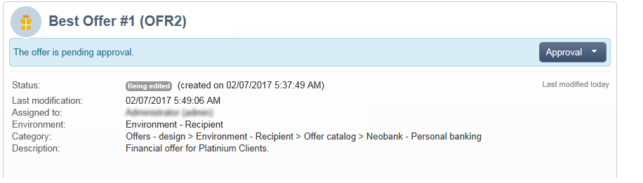

## Approving offer content {#approving-offer-content}

Approving offer content means selecting the representation(s) that you want to make available in the live environment.

The content of an offer has one representation per space. As each offer space has its own structure and its own rendering functions, the offer representation can vary.

You can choose to approve the offer content on certain available spaces and reject it on others.

>[!IMPORTANT]
>
>Once the content and eligibility of an offer are approved, the publication workflow (Offer notification) runs automatically and the offer is made live and available on all activated spaces.

To approve the offer content, apply the following steps:

1. Click the **[!UICONTROL Approval]** button and select **[!UICONTROL Approve content]** in popup.

   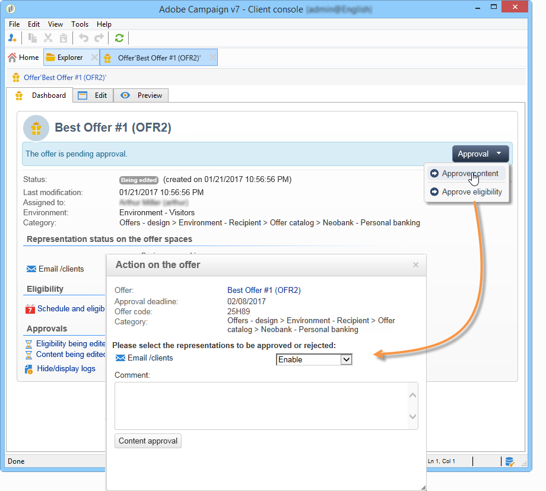

1. Using the drop-down list, select the representations you want to keep editing or those you want to publish to the live environment, then click **[!UICONTROL Content approval]**.

   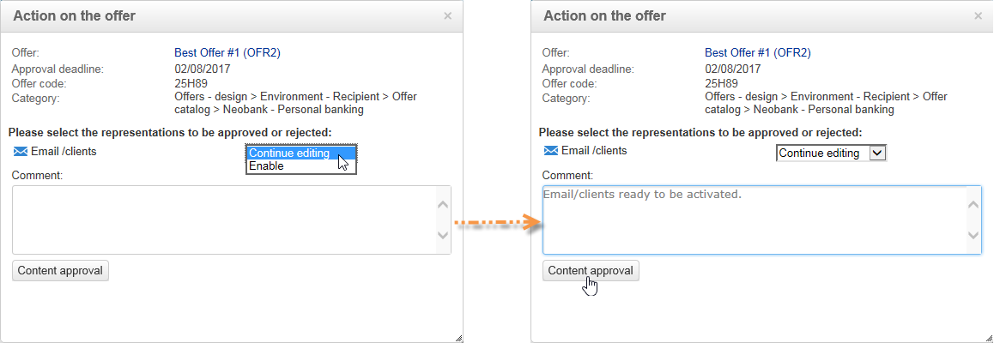

   Once the offer content is approved, the information is updated on the offer dashboard table.

   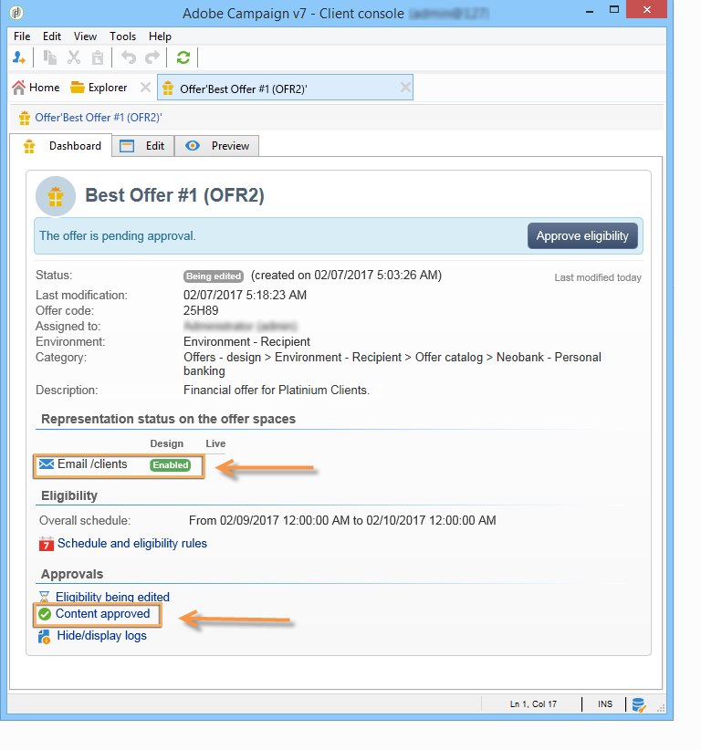

   >[!NOTE]
   >
   >The **[!UICONTROL Content approved]** mention does not mean that all the offer representations have been enabled and approved. It indicates that the content approval process has been achieved, whether all offers have been enabled/approved or not.

## Approving offer eligibility {#approving-offer-eligibility}

Approving offer eligibility means accepting or rejecting offer weights and the eligibility rules also configured in the offer or inherited from the rules created in the parent category.

>[!IMPORTANT]
>
>Once the content and eligibility of an offer are approved, the publication workflow (Offer notification) runs automatically and the offer is made live and available on all activated spaces.

* The full list of rules can be viewed by clicking **[!UICONTROL Schedule and eligibility rules]**.

  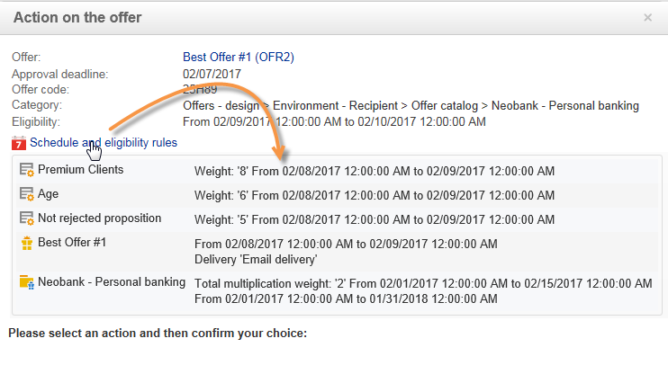

* To change the eligibility rules, click **[!UICONTROL Reject]**, then click **[!UICONTROL Eligibility approval]**.

  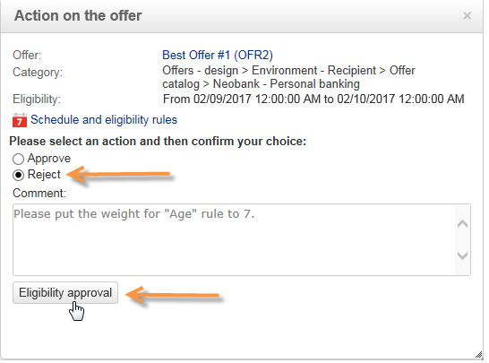

  The various statuses are updated on the offer dashboard.

  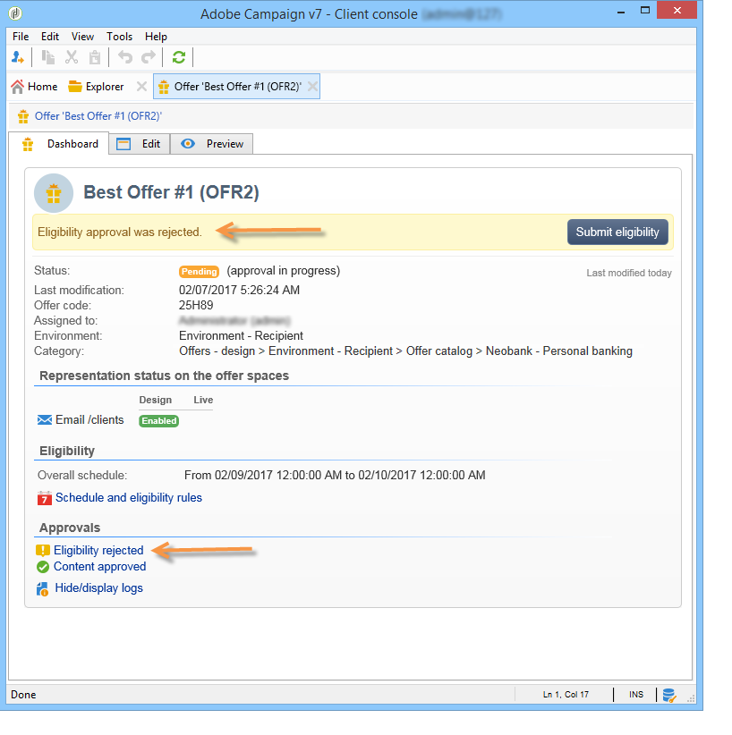

* To accept the offer eligibility, click **[!UICONTROL Approve eligibility]**.

  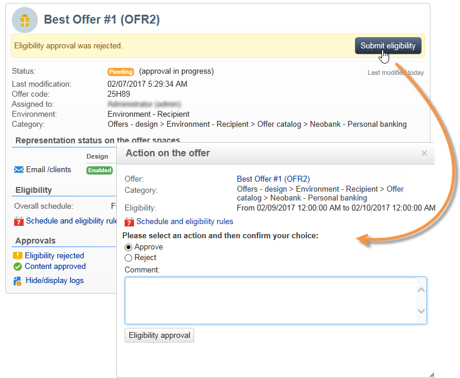

  Approve eligibility, add a comment if necessary, then click **[!UICONTROL Eligibility approval]**.

  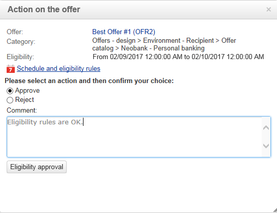

  The various statuses are updated on the offer dashboard.

  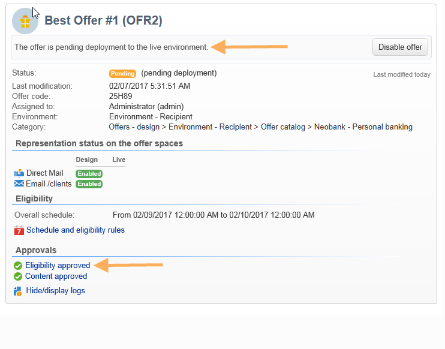

## Approval tracking {#approval-tracking}

Approval tracking is available on the offer dashboard. Click **[!UICONTROL Hide/display logs]** to access it.

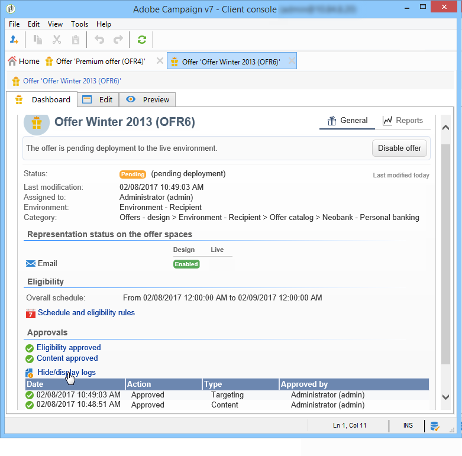

>[!NOTE]
>
>Tracking is also available in the **[!UICONTROL Audit]** tab of the offer, with details of reviewers' comments.

## Restart the approval {#restart-the-approval}

Once the approval has been launched, it can be re-launched. To do this, follow these instructions:

1. Click **[!UICONTROL Content approved]** on the offer dashboard.
1. In the **[!UICONTROL Edit]** window that appears, select the approval to restart, then click **[!UICONTROL Re-initialize approval to submit it again]**.
1. Confirm by clicking **[!UICONTROL Ok]**.

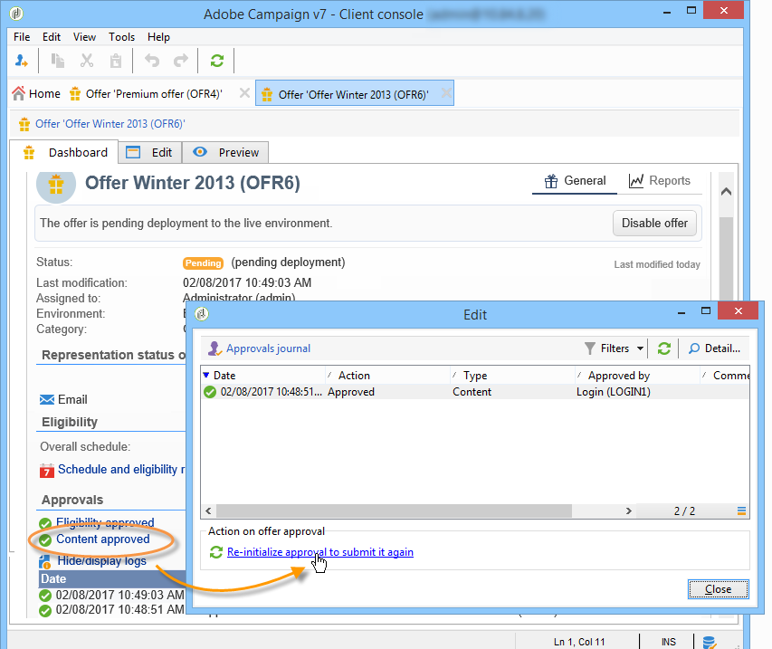

## Publishing the offer {#publishing-the-offer}

Once the content and eligibility of an offer have both been approved, the offer is published by a workflow that automatically runs for each offer whose approval cycle has finished. The **[!UICONTROL Offer notification]** workflow also runs every hour in order to synchronize (if necessary) the spaces and categories contained in the offer catalog from the design environment to the live environment.

The dashboard of the offer available in the design environment contains information regarding publishing, including the name of the matching offer in the live environment.

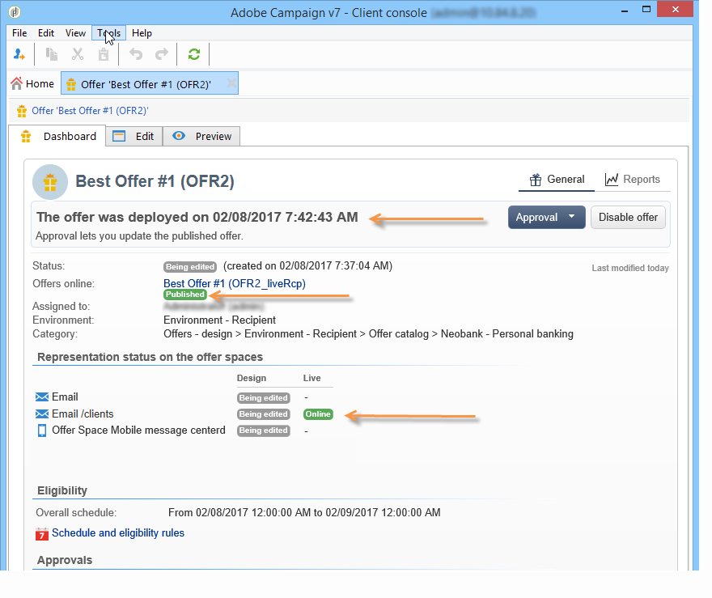

To display the offer that is available in the live environment, click the offer label: the live offer has a dashboard that contains all its relevant information.

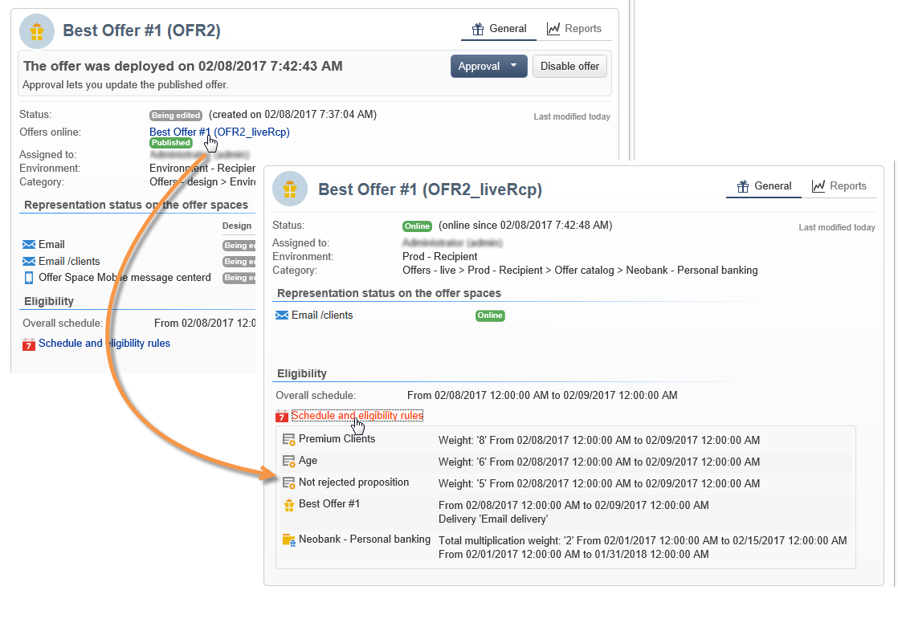

## Disabling an offer {#disabling-an-offer}

Once the offer is approved, you can disable it.

To do this, go to the dashboard for an online offer or an offer waiting to go online, then click **[!UICONTROL Disable offer]**.

You can also directly disable a category by going to the **[!UICONTROL Eligibility]** tab and checking the **[!UICONTROL Enabled]** box.

>[!NOTE]
>
>When an offer is deleted in a design environment, it is automatically deactivated in the linked online environment. After a proposition retention period, the deactivated offers are deleted from the online environment.

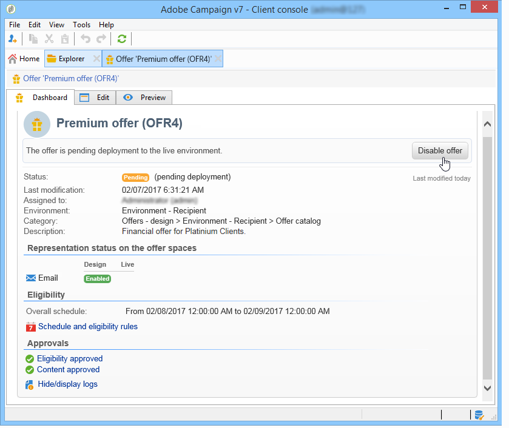
