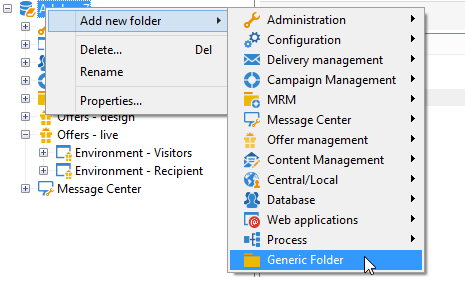
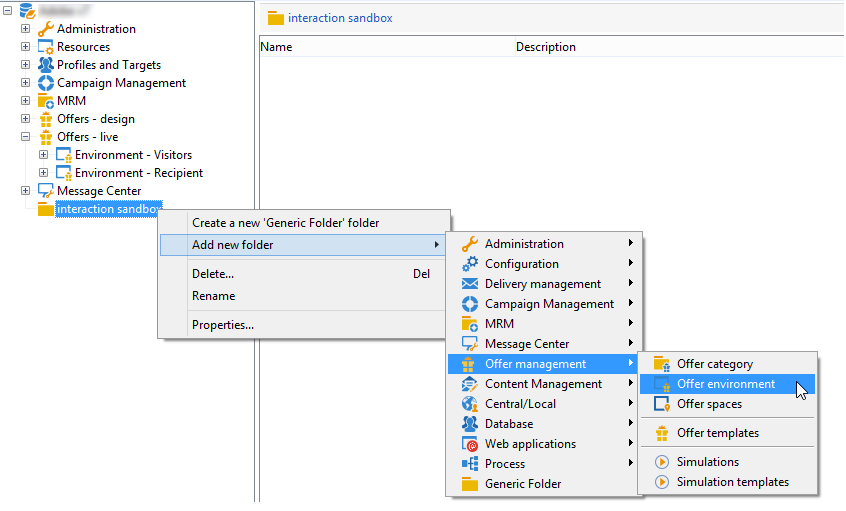
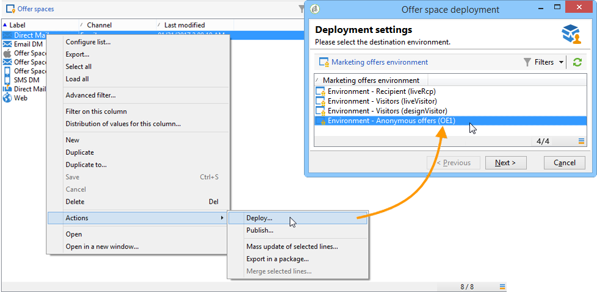

# Creating a test environment{#creating-a-test-environment}

To create a test environment (sandbox mode), apply the following steps:

>[!IMPORTANT]
>
>Only use this environment creation method for test environments. In all other cases, use the target mapping wizard. For more on this, refer to [Creating an offer environment](../../interaction/using/live-design-environments.md#creating-an-offer-environment).

1. Launch the Adobe Campaign explorer and go to the instance root.
1. Right-click and add a **[!UICONTROL Generic folder]** using the drop-down menus.

   

1. Next, go to the folder you just created and add an **[!UICONTROL Offer environment]** using the right-click menus.

   

1. Apply the same process to create the environment sub-folders and elements. 
1. Once your tests have finished and you wish to use the environment in production, duplicate the offers and spaces in your design environment. (Right-click > **[!UICONTROL Actions]** > **[!UICONTROL Deploy]** ).

   
