# Creating an offer{#creating-an-offer}

## Creating the offer {#creating-the-offer}

To create an offer, apply the following steps:

1. Go to the **[!UICONTROL Campaigns]** tab and click the **[!UICONTROL Offers]** link.

   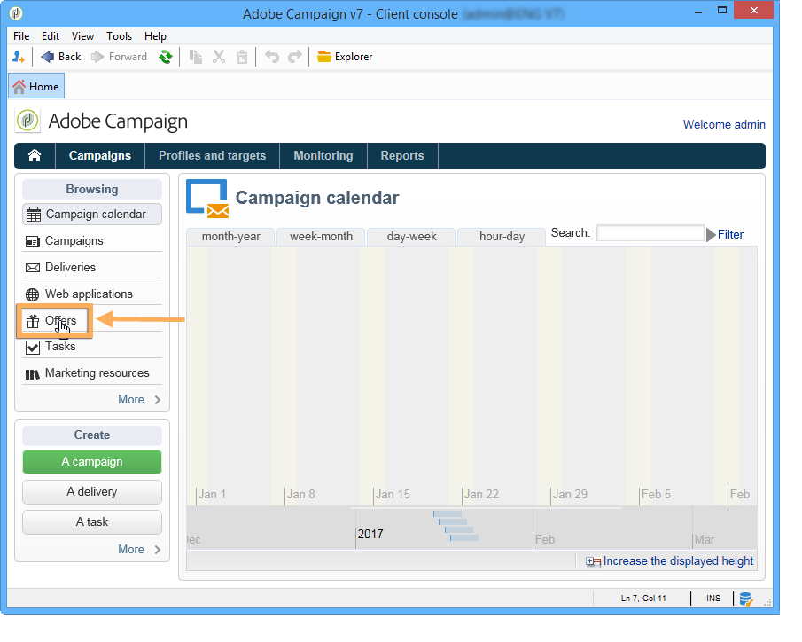

1. Click the **[!UICONTROL Create]** button.

   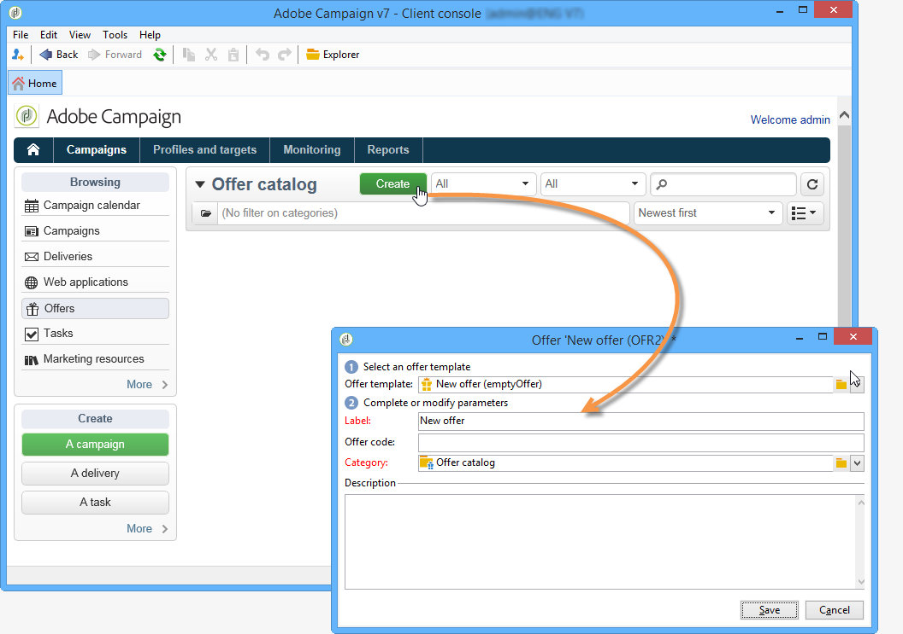

1. Change the label and select the category the offer should belong to.

   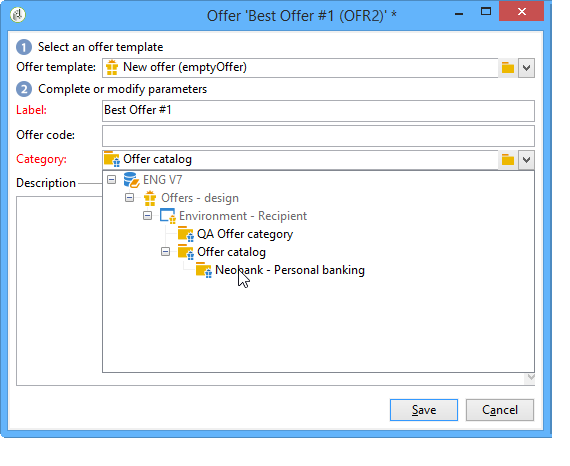

1. Click **[!UICONTROL Save]** to create the offer.

   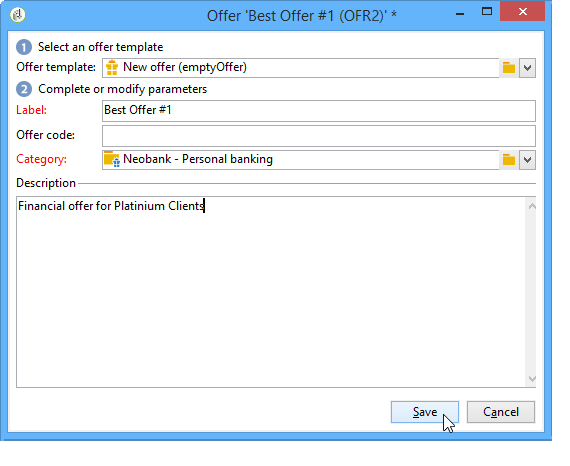

   The offer is available in the platform and its content can be configured.

   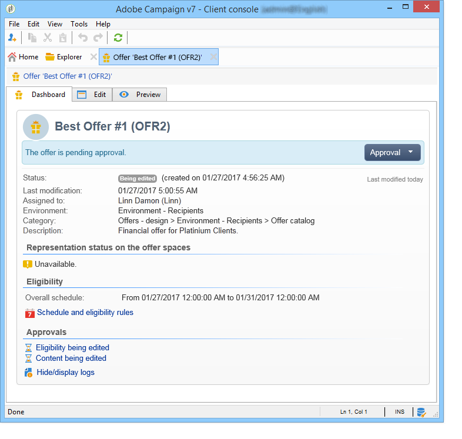

## Configuring offer eligibility {#configuring-offer-eligibility}

In the **[!UICONTROL Eligibility]** tab, define the period the offer will be valid for and can be presented, the filters to apply to the target and the offer weight.

### Defining the eligibility period of an offer {#defining-the-eligibility-period-of-an-offer}

To define the eligibility period of the offer, use the drop-down lists and select a start and an end date in the calendar.

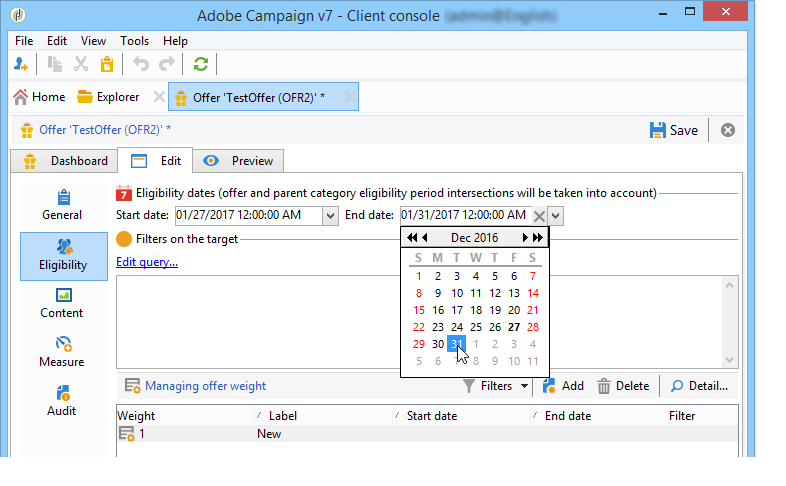

Outside of these dates, the offer won't be selected by the Interaction engine. If you have also configured eligibility dates for the offer category, the most restrictive period will apply.

### Filters on the target {#filters-on-the-target}

You can apply filters to the offer target.

To do this, click the **[!UICONTROL Edit query]** link and select the filter you want to apply. (Refer to [this section](../../platform/using/steps-to-create-a-query.md#step-4---filter-data)). 

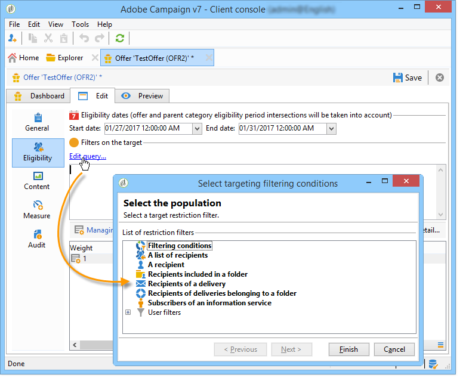

If predefined filters have been created already, you can select them from the list of user filters. For more on this, refer to [Creating predefined filters](../../interaction/using/creating-predefined-filters.md).

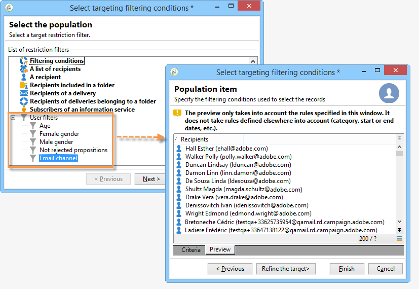

### Offer weight {#offer-weight}

To enable the engine to decide between several offers that the target is eligible for, you need to assign one or more weights to the offer. You can also apply filters to the target if necessary or restrict the offer space which the weight will apply to. An offer with a more significant weight will be preferred over an offer with less weight.

You can configure multiple weights for the same offer, for example to distinguish sup-periods, specific targets or even an offer space.

For example, an offer can have a weight of A for contacts aged 18 to 25 and a weight of B for contacts above that range. If an offer is eligible all summer, it can also have a weight of A in July and a weight of B in August.

>[!NOTE]
>
>The assigned weight can be temporarily modified according to the parameters of the category the offer belongs to. For more on this, refer to [Creating offer categories](../../interaction/using/creating-offer-categories.md).

To create a weight in an offer, apply the following steps:

1. Click **[!UICONTROL Add]**.

   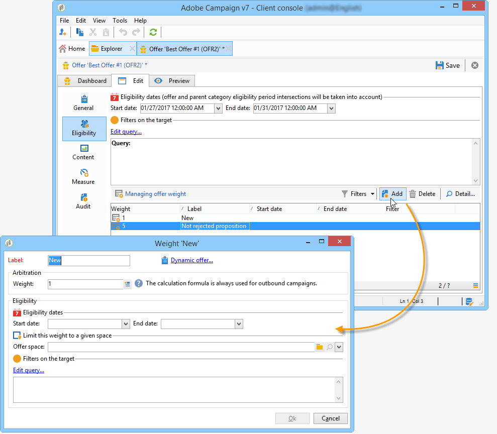

1. Change the label and assign a weight. By default, it is 1.

   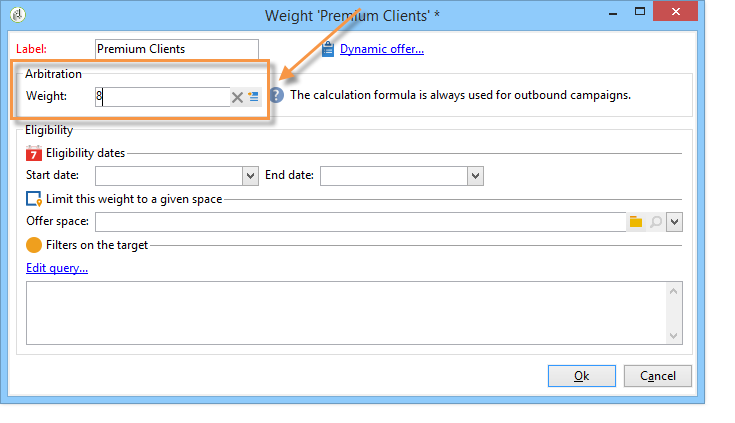

   >[!IMPORTANT]
   >
   >If no weight is entered (0), the target will not be considered eligible for the offer.

1. If you want the weight to apply for a given period, define eligibility dates.

   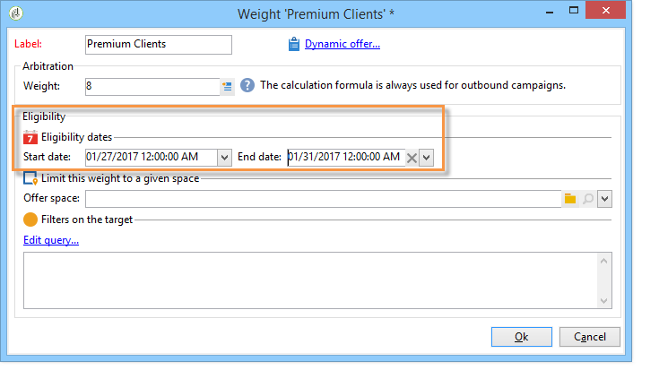

1. If necessary, restrict the weight to a specific offer space. 

   

1. Apply a filter to a target.

   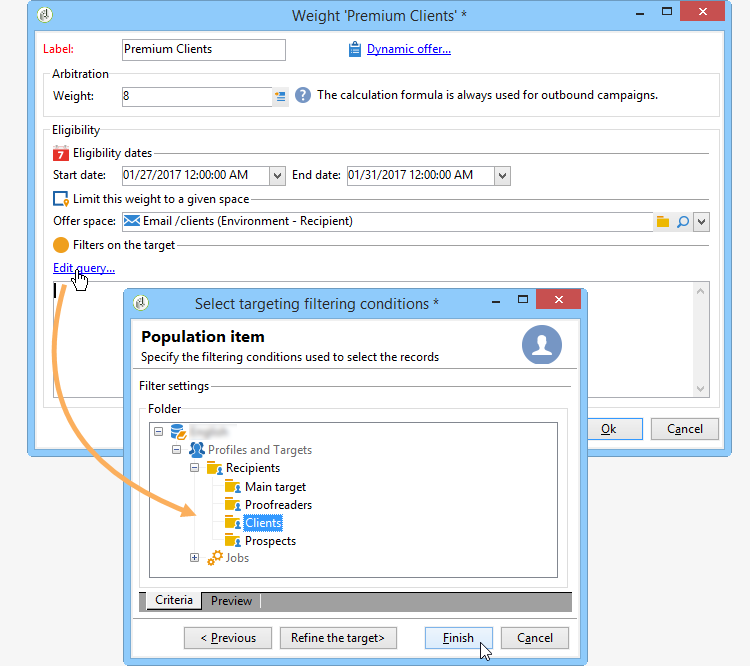

1. Click **[!UICONTROL OK]** to save the weight.

   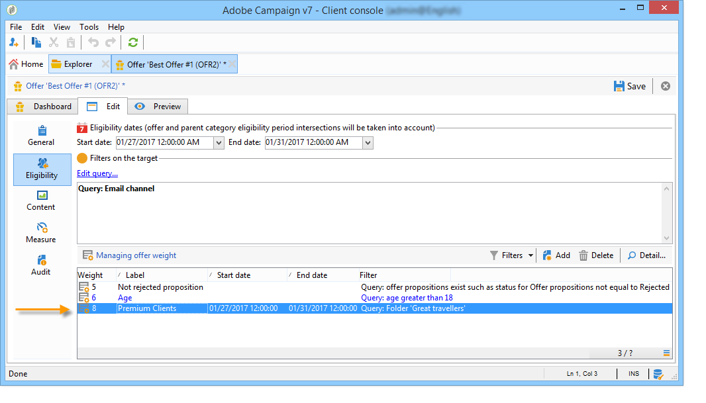

   >[!NOTE]
   >
   >If a target is eligible for multiple weights for a selected offer, the engine keeps the best (highest) weight. When calling up the offer engine, an offer is selected a maximum of once per contact.

### Summary of offer eligibility rules {#a-summary-of-offer-eligibility-rules}

Once configuration is complete, a summary of the eligibility rules will be available on the offer dashboard.

To view it, click the **[!UICONTROL Schedule and eligibility rules]** link.

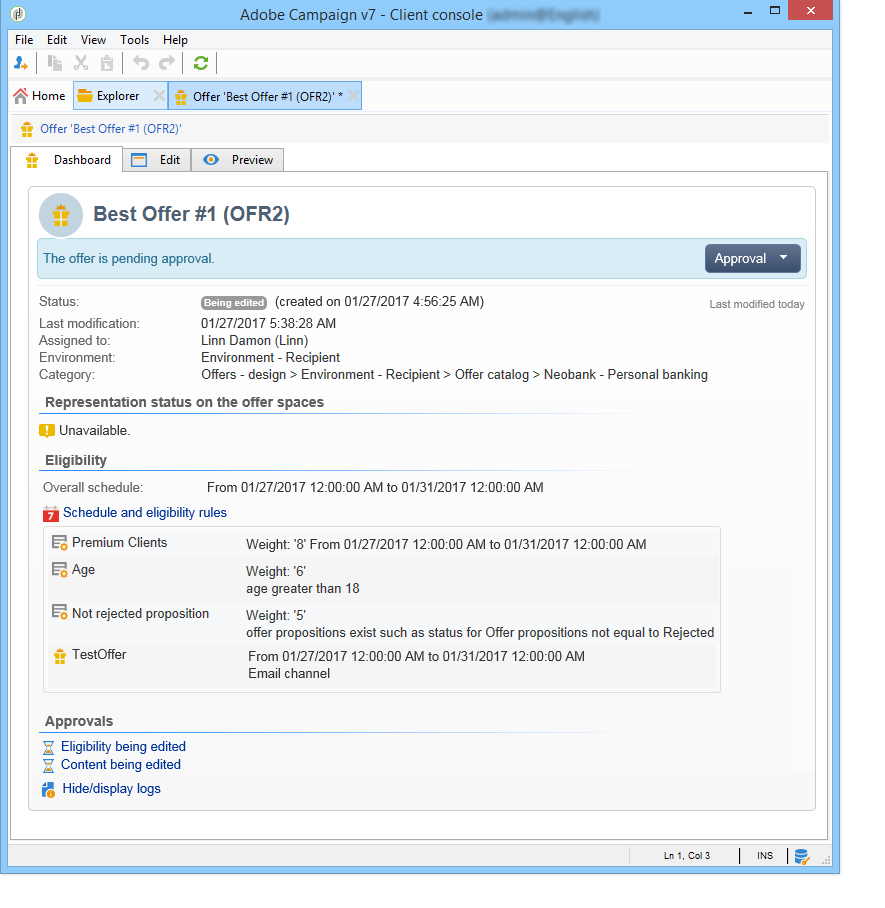

## Creating the offer content {#creating-the-offer-content}

1. Click the **[!UICONTROL Edit]** tab, then click the **[!UICONTROL Content]** tab.

   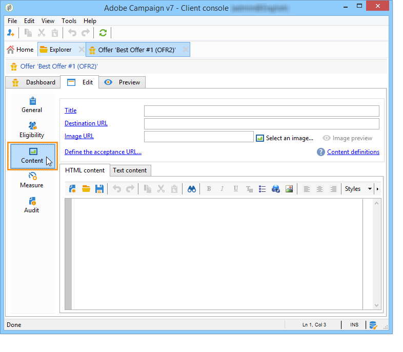

1. Complete the various fields of the offer content.

    * **[!UICONTROL Title]** : Specify the title that you would like to make appear in your offer. Warning: this is not referring to the offer's label, which is defined in the **[!UICONTROL General]** tab.
    * **[!UICONTROL Destination URL]** : specify your offer's URL. To be processed correctly, it must start with "http://" or "https://".
    * **[!UICONTROL Image URL]** : specify a URL or an access path to the image of your offer.
    * **[!UICONTROL HTML content]** / **[!UICONTROL Text content]** : enter the body of your offer in the tab you would like. To generate tracking, the **[!UICONTROL HTML content]** must be composed of HTML elements that can be enclosed in a `<div>` type element. For example, the result of a `<table>` element in the HTML page will be as followed:

   ```
      <div> 
       <table>
        <tr>
         <th>Month</th>
         <th>Savings</th>   
        </tr>   
        <tr>    
         <td>January</td>
         <td>$100</td>   
        </tr> 
       </table> 
      </div>
   ```

   Defining the acceptance URL is presented in the [Configuring the status when the proposition is accepted](../../interaction/using/creating-offer-spaces.md#configuring-the-status-when-the-proposition-is-accepted) section.

   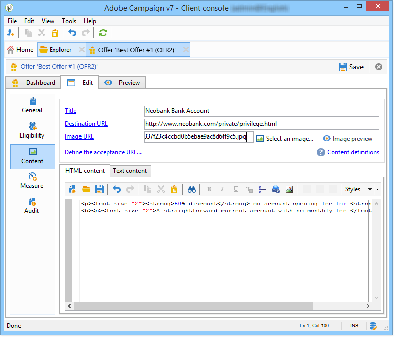

   To find the required fields as they were defined during offer space configuration, click the **[!UICONTROL Content definitions]** link to display the list. For more on this, refer to [Creating offer spaces](../../interaction/using/creating-offer-spaces.md).

   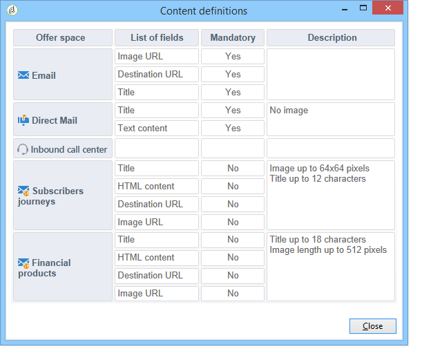

   In this example, the offer must include a title, an image, HTML content and a destination URL.

## Previewing the offer {#previewing-the-offer}

As soon as your offer content is configured, you can preview the offer as it will appear for its recipient. To do this:

1. Click the **[!UICONTROL Preview]** tab.

   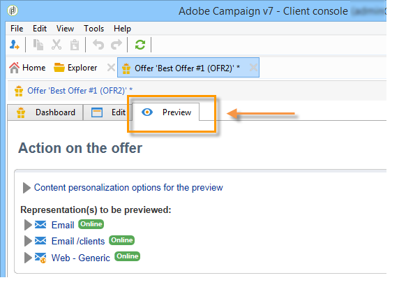

1. Select the representation of the offer you want to view.

   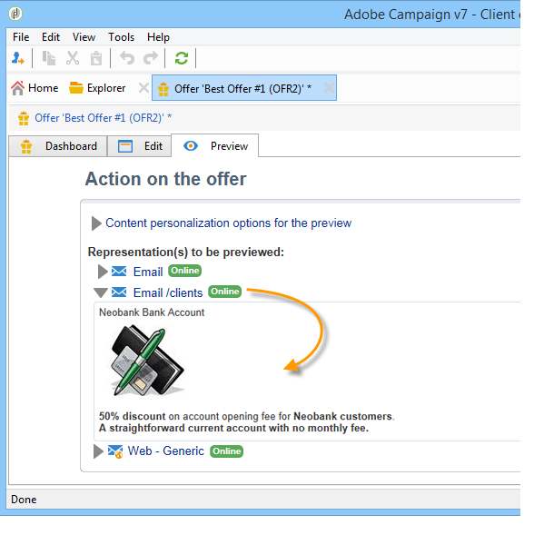

1. If you have personalized the offer content, select the offer target to view personalization.

   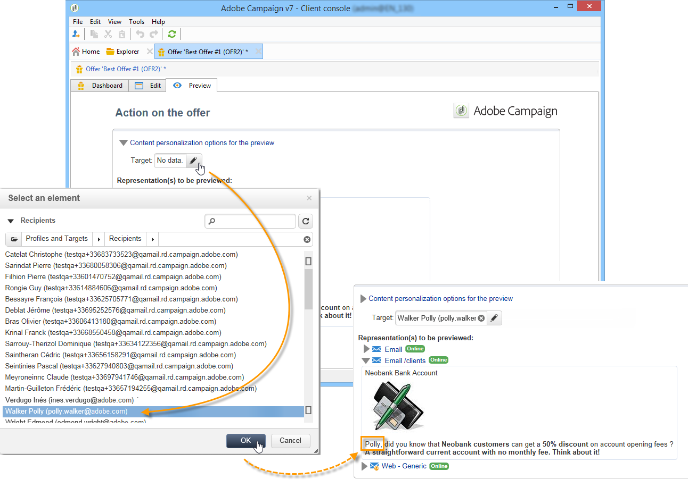

## Creating a hypothesis on an offer {#creating-a-hypothesis-on-an-offer}

You can create hypotheses on your offer propositions. This lets you determine the impact of your offers on purchases carried out for the product concerned.

>[!NOTE]
>
>These hypotheses are carried out via Response Manager. Please check your license agreement.

Hypotheses carried out on an offer proposition are referenced in their **[!UICONTROL Measure]** tab.

Creating hypotheses is detailed in [this page](../../campaign/using/about-response-manager.md).

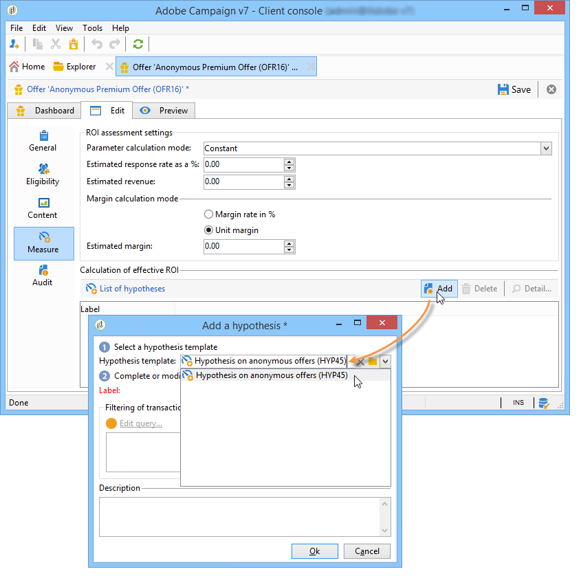
