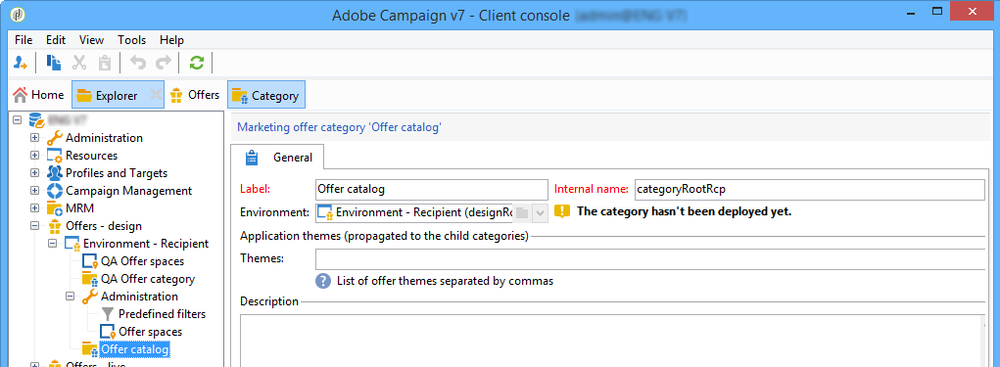
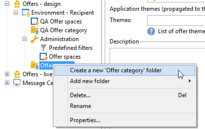
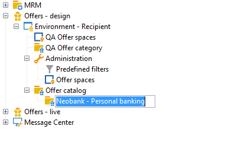
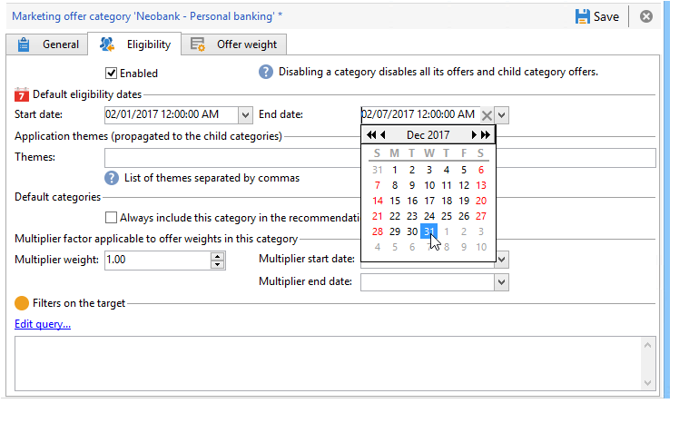
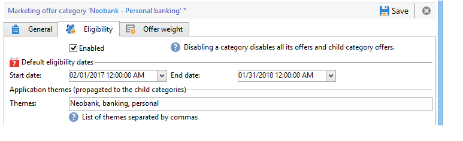
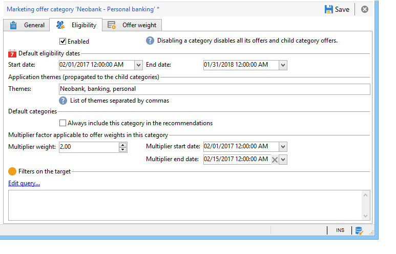
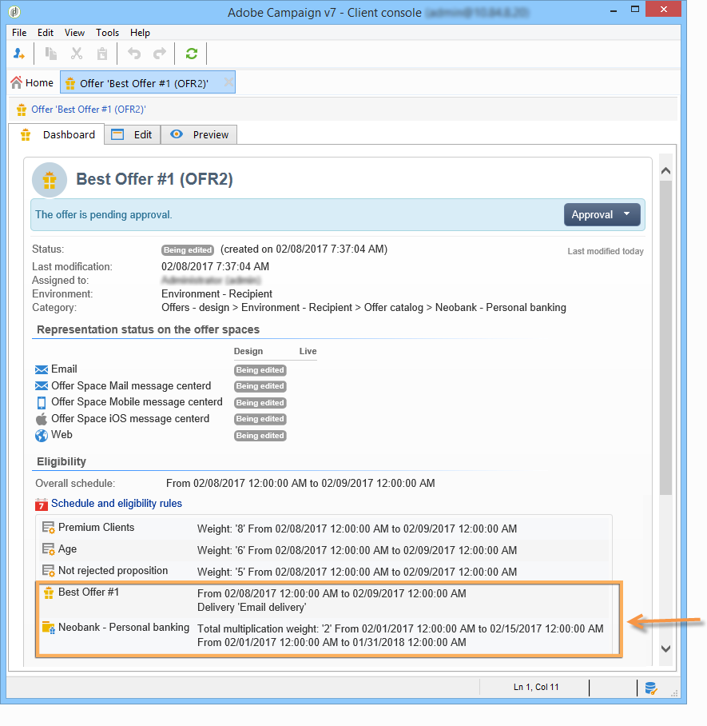

# Creating offer categories{#creating-offer-categories}

The creation of offer categories can only take place in the **Design** environment. They are deployed automatically in the **Live** environment (i.e. made available) when the created/modified offer(s) they contain are approved. By default, the **Design** environment contains a category to receive all offers. Sub-categories can be created to add hierarchy to the catalog offers.

For each category, you can define eligibility dates, i.e. a period beyond which the offers contained in the category may no longer be presented to their target. If you want the offers from a specific category to be selected as a priority by the offer engine, to better expose a product for example, you can increase their weights for a given period by adding a multiplying weight to the category.

To create an additional category, apply the following steps:

1. Go to the **Offer catalog** folder.

   

1. Right click and select **Create a new "Offer category" folder** from the drop-down list.

   

1. Re-name the category. You can edit the label later using the **General** tab.

   

   >[!NOTE]
   >
   >Repeat these steps to create as many categories as necessary.

   Thereafter, as needed you can:

    * assign eligibility dates from the **Eligibility** tab.
    
      

    * enter key words that may be used to select offers from within this category, using the **Themes** field.
    
      

      >[!NOTE]
      >
      >When calling up the offer engine, only the part of the catalog in which the themes or categories match the parameters is selected.

    * You can temporarily "boost" the offer weight of a category for a given period via the **Multiplier weight** field.
    
      

A recap of the eligibility rules is available on the dashboard of the offers included in the category. To view them, click the **Schedule and eligibility rules of the offer** link.

