# Creating offer spaces{#creating-offer-spaces}


Offer space creation may only be carried out by a **technical administrator** with access to the offer space sub-folder. Offer spaces can only be created in the design environment, and are automatically duplicated into the live environment during offer approval.

The content of the catalog offers is configured in the offer spaces. By default, the content can include the following fields: **[!UICONTROL Title]**, **[!UICONTROL Destination URL]**, **[!UICONTROL Image URL]**, **[!UICONTROL HTML content]** and **[!UICONTROL Text content]**. The field sequence is configured in the offer space.

Advanced parameters let you specify a contact identification key (which can be made of up of various elements, the name and email field at the same time for example). For more on this, refer to the [Presenting an identified offer](../../interaction/using/integration-via-javascript--client-side-.md#presenting-an-identified-offer) section.

The HTML or XML rendering is created via a rendering function. The sequence of the fields defined in the rendering function must be identical to the sequence configured in the content.

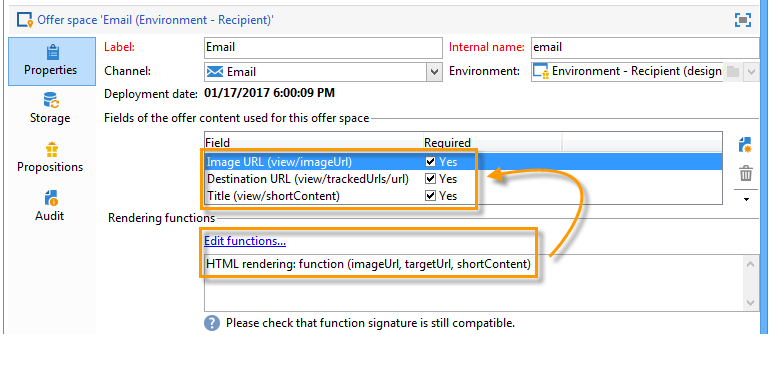

To create a new offer space, apply the following process:

1. Go to the list of offer spaces and click **[!UICONTROL New]**.

   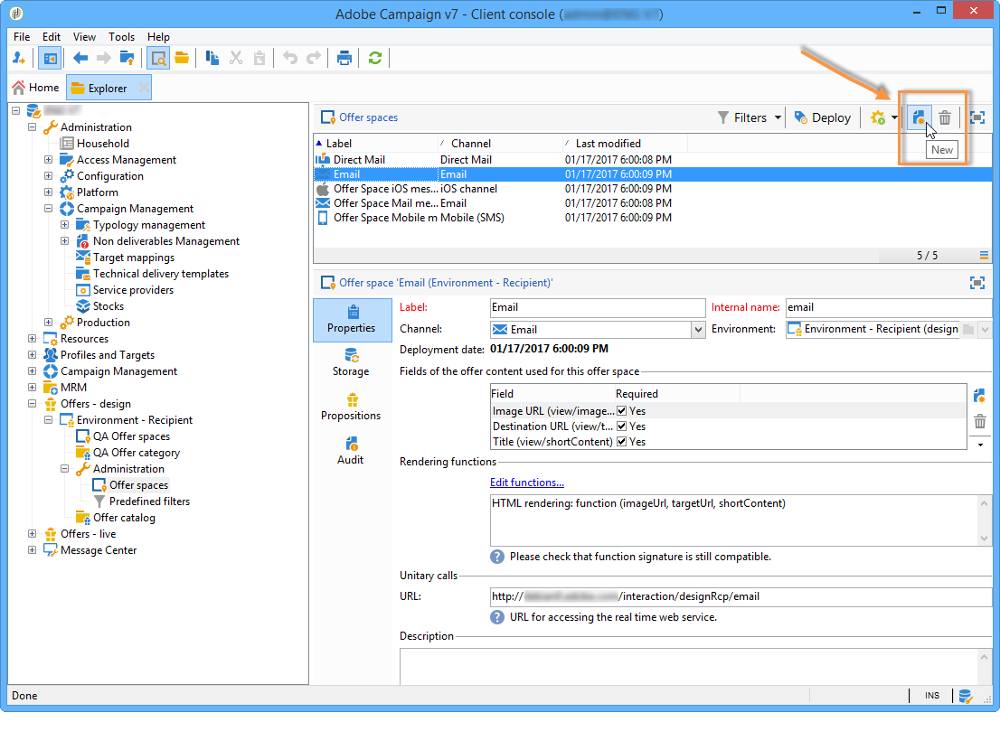

1. Select the channel you want to use and change the label of the offer space.

   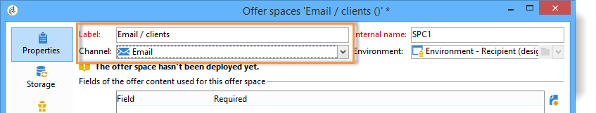

1. Check the **[!UICONTROL Enable unitary mode]** box if one of the following cases applies to you:

    * You are using Interaction with Message Center
    * You are using Interaction's unitary mode (inbound interactions)

1. Go to the **[!UICONTROL Content field]** window and click **[!UICONTROL Add]**.

   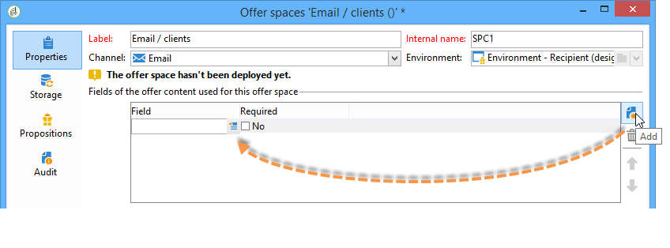

1. Go to the **[!UICONTROL Content]** node and select the fields in the following order: **[!UICONTROL Title]**, then **[!UICONTROL Image URL]**, then **[!UICONTROL HTML content]**, then **[!UICONTROL Destination URL]**.

   

1. Check the **[!UICONTROL Required]** box to make each field mandatory.

   >[!NOTE]
   >
   >This configuration is used at the preview and makes offer spaces invalid when publishing if one of the mandatory elements is missing from the offer concerned. However, if an offer is already live on an offer space, these criteria are not taken into account.

   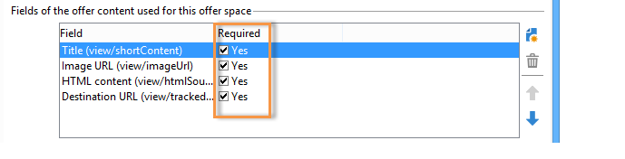

1. Click **[!UICONTROL Edit functions]** to create a rendering function.

   These functions are used to generate offer representations on an offer space. There are several possible formats: HTML or text for outbound interactions and XML for inbound interactions.

   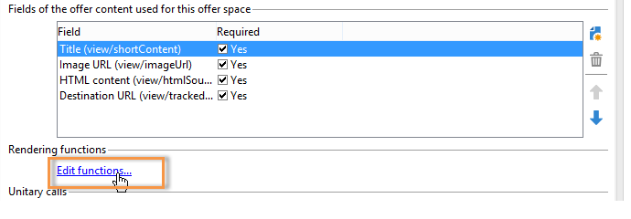

1. Go to the **[!UICONTROL HTML rendering]** tab and select **[!UICONTROL Overload the HTML rendering function]**.
1. Insert your rendering function.

   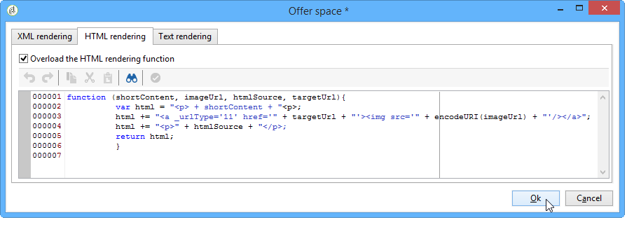

If necessary, you can overload the XML rendering functions for inbound interactions. You can also overload HTML and text rendering functions for outbound interactions. For more on this, refer to [About inbound channels](../../interaction/using/about-inbound-channels.md).

## Offer proposition statuses {#offer-proposition-statuses}

An offer proposition can have various statuses depending on the interactions with the targeted population. Interaction comes with a set of values that can be applied to the offer proposition throughout its life cycle. However, you will need to configure the platform so that the status changes when the offer proposition is created and accepted.

>[!NOTE]
>
>The offer proposition's status is not updated immediately. It is carried out by the tracking workflow which is triggered every hour.

### Status list {#status-list}

Interaction comes with the following values that can be used to qualify the status of an offer proposition:

* **[!UICONTROL Accepted]**.
* **[!UICONTROL Scheduled]**.
* **[!UICONTROL Generated]**.
* **[!UICONTROL Interested]**.
* **[!UICONTROL Presented]**.
* **[!UICONTROL Rejected]**.

These values aren't applied by default: they have to be configured.

>[!NOTE]
>
>The status of an offer proposition will automatically be changed to "Presented" if the offer is linked to a delivery with the "Sent" status.

### Configuring the status when the proposition is created {#configuring-the-status-when-the-proposition-is-created}

When an offer proposition is created by the interaction engine its status is changed, whether it is an inbound or an outbound interaction. The choice between these two values depends on the way the offer spaces were configured in the **[!UICONTROL Design]** environment

For each space, you can configure the status you want to apply when a proposition is created, depending on the information you want to display in the offer reports.

To do this, use the following process:

1. Go to the **[!UICONTROL Storage]** tab of the desired space.
1. Select the status that you want to apply to the proposition when it is created.

   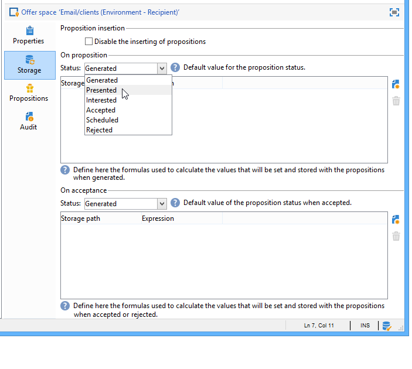

### Configuring the status when the proposition is accepted {#configuring-the-status-when-the-proposition-is-accepted}

Once an offer proposition has been accepted, you can use one of the values provided by default to configure the proposition's new status. The update is effective when a recipient clicks on a link in the offer, which calls up the Interaction engine.

To do this, use the following process:

1. Go to the **[!UICONTROL Storage]** tab of the desired space.
1. Select the status that you want to apply to the proposition when it is accepted.

   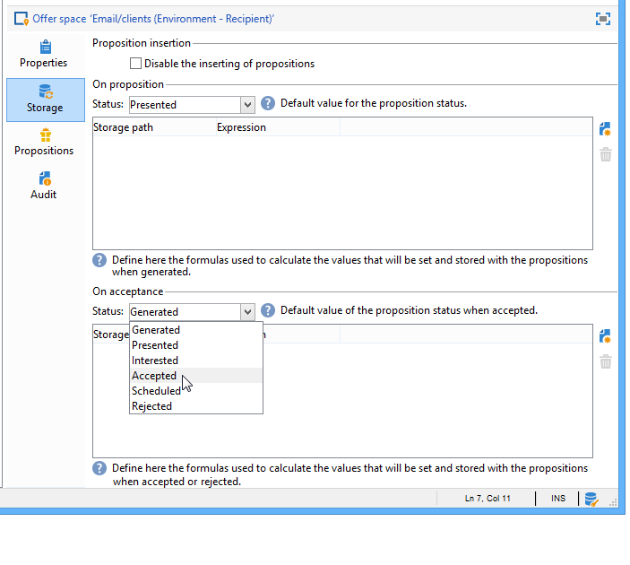

**Inbound interaction**

The **[!UICONTROL Storage]** tab lets you define statuses for **proposed** and **accepted** offer propositions only. For inbound interaction, the status of offer propositions should be specified directly in the URL for calling the offer engine, rather than through the interface. This way, you will be able to specify which status to apply in other cases, for example if an offer proposition is rejected.

```
<BASE_URL>?a=UpdateStatus&p=<PRIMARY_KEY_OF_THE_PROPOSITION>&st=<NEW_STATUS_OF_THE_PROPOSITION>&r=<REDIRECT_URL>
```

For instance, the proposition (identifier **40004**) that matches the **Home insurance** offer displayed on the **Neobank** site contains the following URL:

```
<BASE_URL>?a=UpdateStatus&p=<40004>&st=<3>&r=<"http://www.neobank.com/insurance/subscribe.html">
```

As soon as a visitor clicks the offer, and therefore the URL, the **[!UICONTROL Accepted]** status (value **3**) is applied to the proposition and the visitor is redirected to a new page of the **Neobank** site to take out the insurance contract.

>[!NOTE]
>
>If you want to specify another status in the url (for example if an offer proposition is rejected), use the value corresponding to the desired status. Example: **[!UICONTROL Rejected]** = "5", **[!UICONTROL Presented]** = "1" and so on.
>
>Statuses and their values can be retrieved in the **[!UICONTROL Offer propositions (nms)]** data schema. For more on this, refer to [this page](../../configuration/using/data-schemas.md).

**Outbound interaction**

In case of an outbound interaction, you can automatically apply the **[!UICONTROL Interested]** status to an offer proposition when the delivery contains a link. Simply add the **_urlType="11"** value to the link:

```
<a _urlType="11" href="<DEST_URL>">Link inserted into the delivery</a>
```

## Offer preview per space {#offer-preview-per-space}

In this tab, you can view the offers for which the recipient is eligible via a chosen method. In the example below, the recipient is eligible for three offer proposals via mail.

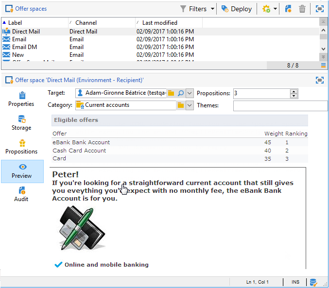

If a recipient isn't eligible for any offers, this is shown in the preview.

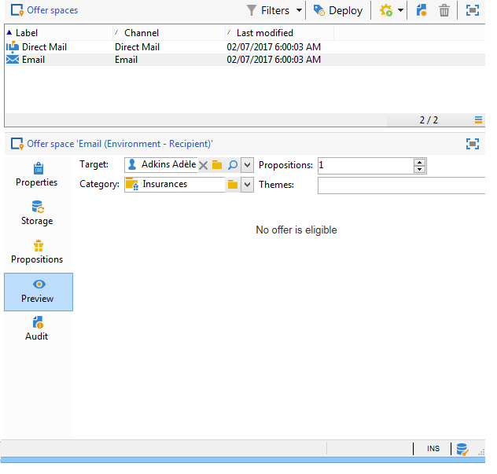

The preview can ignore contexts when they are restricted to a space. This is the case when the interaction schema has been extended to add fields referenced in a space using an inbound channel (for more on this, refer to [Extension example](../../interaction/using/extension-example.md)).
