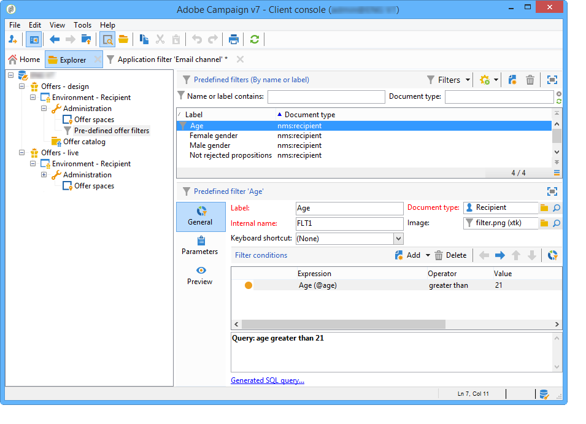
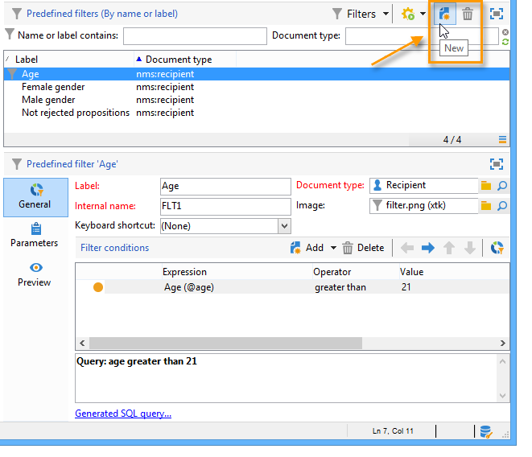
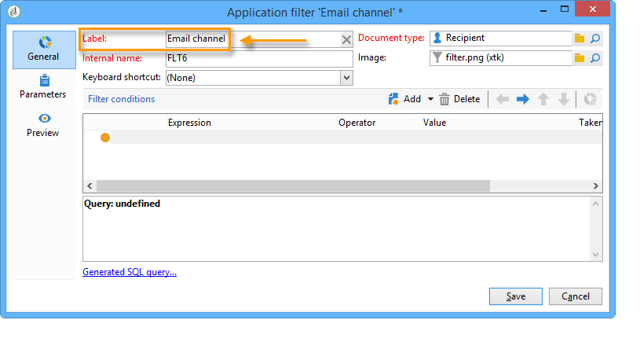
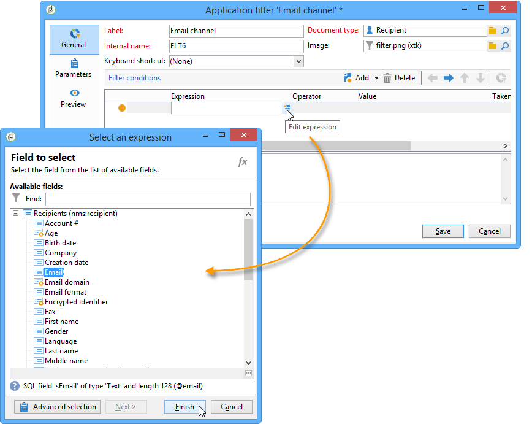
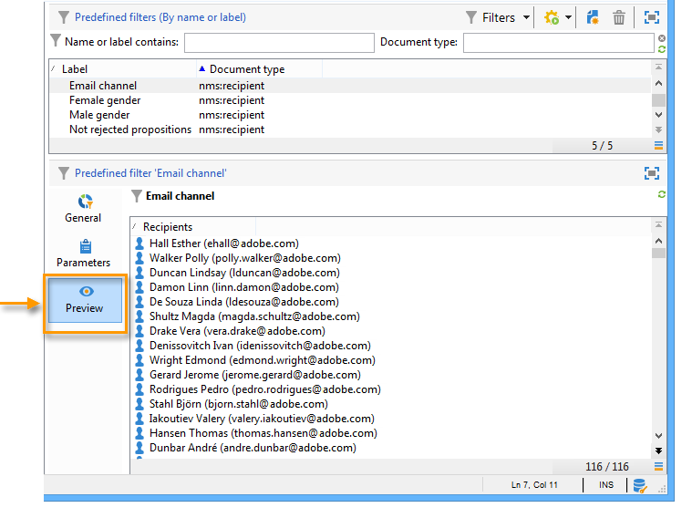

# Creating predefined filters{#creating-predefined-filters}

 Predefined filters let you create eligibility rules for the target population that can easily be re-used during offer creation. They are specific to each environment and take the offer parameters into account.

To create a filter, apply the following process:

1. Go to the **[!UICONTROL Administration]** folder and select **[!UICONTROL Pre-defined offer filters]**.

   

1. Click **[!UICONTROL New]**.

   

1. Change the label to be able to identify the filter later.

   

1. Select the field that the filtering condition will concern.

   

1. Select an operator and a value if necessary, then save the query.

   

1. Click **[!UICONTROL Preview]** to view the result of the filter.

   

**Related topic**

* [Save frequently used queries as editable predefined filters](https://helpx.adobe.com/campaign/kb/simplifying-campaign-management-acc.html#Savefrequentlyusedqueriesaseditablepredefinedfilters)
