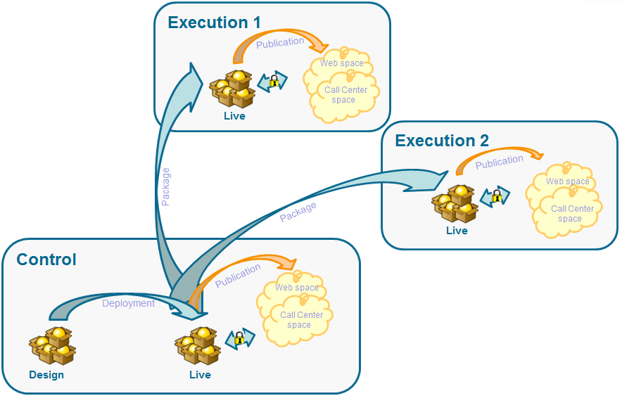
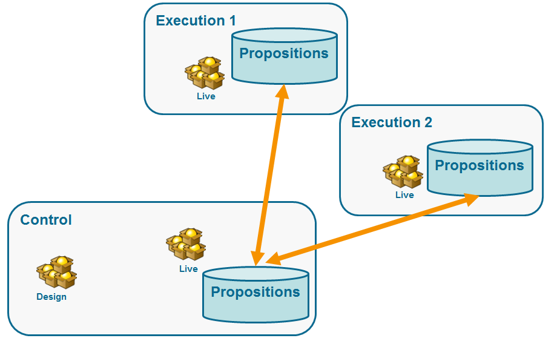
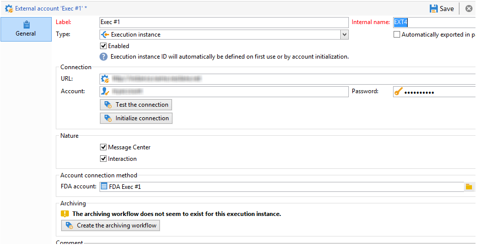
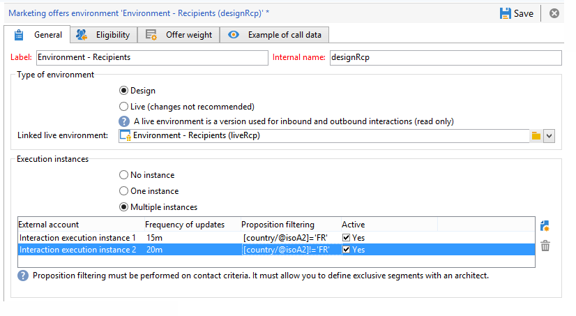
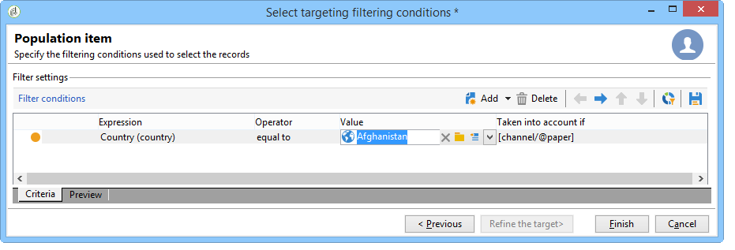

# Distributed architectures{#distributed-architectures}

## Principle {#principle}

To be able to support scalability and provide 24/7 service on the inbound channel, you can use Interaction with a distributed architecture. This type of architecture is already used with Message Center and is made up of several instances:

* one or several control instances dedicated to the outbound channel and containing the marketing and environment design base
* one or several execution instances dedicated to inbound channel



>[!NOTE]
>
>Control instances are dedicated to the inbound channel and contain the online version of the catalog. Every execution instance is independent and dedicated to one contact segment (for example, one execution instance per country). Offer engine call-ups must be directly performed on the execution (one specific URL per execution instance). As synchronization between instances is not automatic, interactions from the same contact must be sent through the same instance.

## Proposition synchronization {#proposition-synchronization}

Offer synchronization is carried out via packages. On execution instances, all catalog objects are prefixed by the external account name. This means several control instances (development and production instances for example) can be supported on one same execution instance.

>[!IMPORTANT]
>
>We recommend you use short and explicit internal names.

Offers are automatically deployed then published on execution and control instances.

Offers deleted in the design environment are disabled on all online instances. Obsolete propositions and offers are automatically deleted on all instances after the purge period (specified in each instance's deployment assistant) and sliding period (specified in the incoming propositions' typology rules).



A workflow is created for each environment and external account for proposition synchronization. Synchronization frequency can be adjusted for each environment and external account.

## Limitations {#limitations}

* If you use the fall back function from an anonymous environment to an identified environment, these two environments must be on the same execution instance. 
* The synchronization between several execution instances is not performed in real time. Interactions of the same contact must be sent to the same instance. The control instance must be dedicated to the outbound channel (no real time).
* The marketing database is not automatically synchronized. The marketing data used in the weights and eligibility rules must be duplicated on execution instances. This process does not come as standard, you must develop it during the integration period. 
* Proposition synchronization is carried out exclusively by FDA connection.
* If you use Interaction and Message Center on the same instance, synchronization will occur via FDA protocol in both cases.

## Packages configuration {#packages-configuration}

Any schema extensions directly linked to **Interaction** (offers, propositions, recipients, etc.) must be deployed on the execution instances.

The Interaction package must be installed on all instances (control and execution). Two additional packages are available: one package to be installed on the control instances, and another to be installed on each execution instance.

>[!NOTE]
>
>When installing the package, the **long** type fields of the **nms:proposition** table such as the proposition ID, become **int64** type fields. This type of data is detailed in the [this section](../../configuration/using/schema-structure.md#mapping-the-types-of-adobe-campaign-dbms-data).

The data retention duration must be configured on each instance (via the **[!UICONTROL Data purge]** window in the deployment wizard). On execution instances, this period must correspond to the historical depth necessary for typology rules (sliding period) and eligibility rules to be calculated.

On the control instances:

1. Create an external account by execution instance:

   

    * Complete the label and add a short and explicit internal name.
    * Select the **[!UICONTROL Execution instance]**.
    * Check the **[!UICONTROL Enabled]** option.
    * Complete the connection parameters for the execution instance.
    * Every execution instance must be linked to an ID. This ID is assigned when you click on the **[!UICONTROL Initialize connection]** button.
    * Check the type of application used: **[!UICONTROL Message Center]**, **[!UICONTROL Interaction]**, or both.
    * Enter the FDA account used. An operator must be created on the execution instances and must have the following read and write rights on the database of the instance in question:

      ```    
      grant SELECT ON nmspropositionrcp, nmsoffer, nmsofferspace, xtkoption, xtkfolder TO user;
      grant DELETE, INSERT, UPDATE ON nmspropositionrcp TO user;
      ```

   >[!NOTE]
   >
   >The IP address of the control instance must be authorized on the execution instances.

1. Configure the environment:

   

    * Add the list of execution instances.
    * For each one, specify the synchronization period and filter criteria (for example, by country).

      >[!NOTE]
      >
      >If you encounter an error, you can consult the synchronization workflows and offer notifications. These can be found in the technical workflows of the application.

If, for optimization reasons, only part of the marketing database is duplicated on the execution instances, you can specify a restricted schema linked to the environment to allow the users to only use data that is available on the execution instances. You can create an offer using data that is not available on execution instances. To do this, you must deactivate the rule on the other channels by limiting this rule on the outbound channel (**[!UICONTROL Taken into account if]** field).



## Maintenance options {#maintenance-options}

Here is a list of maintenance options available on the control instance:

>[!IMPORTANT]
>
>These options must only be used for specific maintenance cases.

* **`NmsInteraction_LastOfferEnvSynch_<offerEnvId>_<executionInstanceId>`**: last date that an environment was synced on a given instance.
* **`NmsInteraction_LastPropositionSynch_<propositionSchema>_<executionInstanceIdSource>_<executionInstanceIdTarget>`**: last date that propositions from a given schema were synced from one instance to another.
* **`NmsInteraction_MapWorkflowId`**: an option containing the list of all synchronization workflows generated.

The following option is available on execution instances:

**NmsExecutionInstanceId**: option containing the instance ID.

## Packages installation {#packages-installation}

If your instance did not previously have the Interaction package, no migration is necessary. By default, the proposition table will be in 64 bits after the packages have been installed.

>[!IMPORTANT]
>
>Depending on the volume of existing propositions in your instance, this operation may take a while.

* If your instance has little or no propositions, no manual modification of the proposition table is necessary. The modification will be done when packages are installed.
* If your instance has a lot of propositions, it is better to change the structure of the propositions table before installing the control packages and running them. We recommend running the queries during a low-activity period.

>[!NOTE]
>
>If you have carried out specific configurations in the proposition table, adapt the queries accordingly.

### PostgreSQL {#postgresql}

There are two methods. The first (using a work table) is slightly faster.

**Work table**

```
CREATE TABLE NmsPropositionRcp_tmp AS SELECT * FROM nmspropositionrcp WHERE 0=1;
ALTER TABLE nmspropositionrcp_tmp
  ALTER COLUMN ipropositionid TYPE bigint,
  ALTER COLUMN iinteractionid TYPE bigint;
INSERT INTO nmspropositionrcp_tmp SELECT * FROM nmspropositionrcp;
DROP TABLE nmspropositionrcp;
CREATE INDEX proposition_id ON NmsPropositionRcp (ipropositionid);
CREATE INDEX nmspropositionrcp_deliveryid ON NmsPropositionRcp (ideliveryid);
CREATE INDEX nmspropositionrcp_lastmodified ON NmsPropositionRcp (tslastmodified);
CREATE INDEX nmspropositionrcp_offerid ON NmsPropositionRcp (iofferid);
CREATE INDEX nmspropositionrcp_offerspaceid ON NmsPropositionRcp (iofferspaceid);
CREATE INDEX nmspropositionrcp_recipientidid ON NmsPropositionRcp (irecipientid);
ALTER TABLE nmspropositionrcp_tmp RENAME TO nmspropositionrcp;
```

**Alter Table**

```
ALTER TABLE nmspropositionrcp
  ALTER COLUMN ipropositionid TYPE bigint,
  ALTER COLUMN iinteractionid TYPE bigint;
```

### Oracle {#oracle}

Editing the size of a **Number** type does not lead to values or the index being re-written. It is therefore immediate.

The query to be executed is as follows:

```
ALTER TABLE nmspropositionrcp MODIFY (
ipropositionid NUMBER(19, 0),
iinteractionid NUMBER(19, 0)
);
```

### MSSQL {#mssql}

The queries to be executed are as follows:

```
SELECT * INTO NmsPropositionRcp_tmp FROM NmsPropositionRcp WHERE 1 = 0;
GO
ALTER TABLE NmsPropositionRcp_tmp ALTER COLUMN ipropositionid BIGINT;
GO
ALTER TABLE NmsPropositionRcp_tmp ALTER COLUMN iinteractionid BIGINT;
GO
INSERT INTO NmsPropositionRcp_tmp SELECT * FROM NmsPropositionRcp;
GO
DROP TABLE NmsPropositionRcp;
GO
sp_rename 'NmsPropositionRcp_tmp', NmsPropositionRcp
GO
ALTER TABLE NmsPropositionRcp ADD DEFAULT ((0)) FOR dWeight
GO
ALTER TABLE NmsPropositionRcp ADD DEFAULT ((0)) FOR iDeliveryId
GO
ALTER TABLE NmsPropositionRcp ADD DEFAULT ((0)) FOR iEngineType
GO
ALTER TABLE NmsPropositionRcp ADD DEFAULT ((0)) FOR iInteractionId
GO
ALTER TABLE NmsPropositionRcp ADD DEFAULT ((0)) FOR iOfferId
GO
ALTER TABLE NmsPropositionRcp ADD DEFAULT ((0)) FOR iOfferSpaceId
GO
ALTER TABLE NmsPropositionRcp ADD DEFAULT ((0)) FOR iPropositionId
GO
ALTER TABLE NmsPropositionRcp ADD DEFAULT ((0)) FOR iRank
GO
ALTER TABLE NmsPropositionRcp ADD DEFAULT ((0)) FOR iRecipientId
GO
ALTER TABLE NmsPropositionRcp ADD DEFAULT ((0)) FOR iStatus
GO
CREATE NONCLUSTERED INDEX NmsPropositionRcp_deliveryId ON NmsPropositionRcp (iDeliveryId)
GO
CREATE NONCLUSTERED INDEX NmsPropositionRcp_eventDate ON NmsPropositionRcp (tsEvent)
GO
CREATE UNIQUE NONCLUSTERED INDEX NmsPropositionRcp_id ON NmsPropositionRcp (iPropositionId)
GO
CREATE NONCLUSTERED INDEX NmsPropositionRcp_lastModified ON NmsPropositionRcp (tsLastModified)
GO
CREATE NONCLUSTERED INDEX NmsPropositionRcp_offerId ON NmsPropositionRcp (iOfferId)
GO
CREATE NONCLUSTERED INDEX NmsPropositionRcp_offerSpaceI ON NmsPropositionRcp (iOfferSpaceId)
GO
CREATE NONCLUSTERED INDEX NmsPropositionRcp_recipientId ON NmsPropositionRcp (iRecipientId)
GO
```
