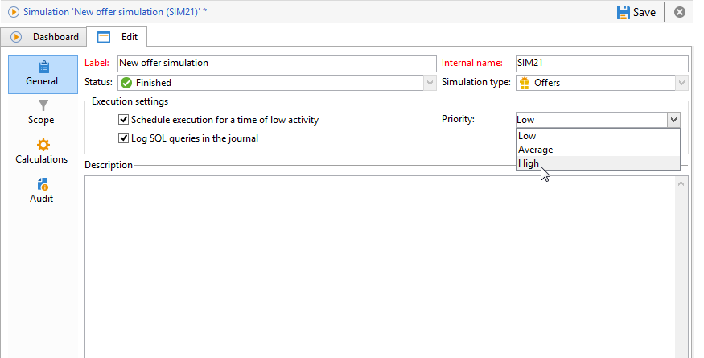

# Execution settings{#execution-settings}

When creating a simulation, you can specify execution settings if necessary. These settings let you execute the simulation during a time of low activity depending on its priority, or record SQL queries in the log. This stage is optional.

These settings can be changed later in the **[!UICONTROL General]** tab of the simulation window.

* **[!UICONTROL Schedule execution for a time of low activity]** : lets you schedule the simulation based on the chosen priority (Low, Average or High) in order to optimize Adobe Campaign performances.
* **[!UICONTROL Priority]** : this is the level applied to the simulation to schedule it. When the **[!UICONTROL Schedule execution for a time of low activity]** option is checked, the campaign processing workflow selects a time of low activity to start the campaign.
* **[!UICONTROL Log SQL queries in the journal]** : this functionality is for expert users only. It lets you add a tab to the log displaying SQL queries to detect possible malfunctions if the simulation finishes with errors.

