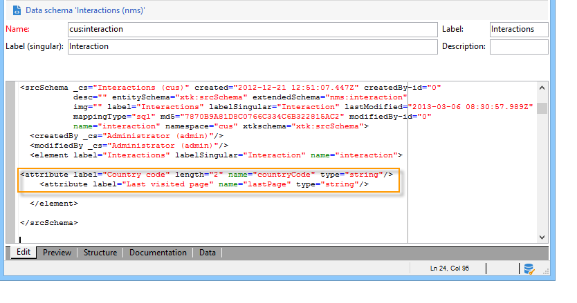
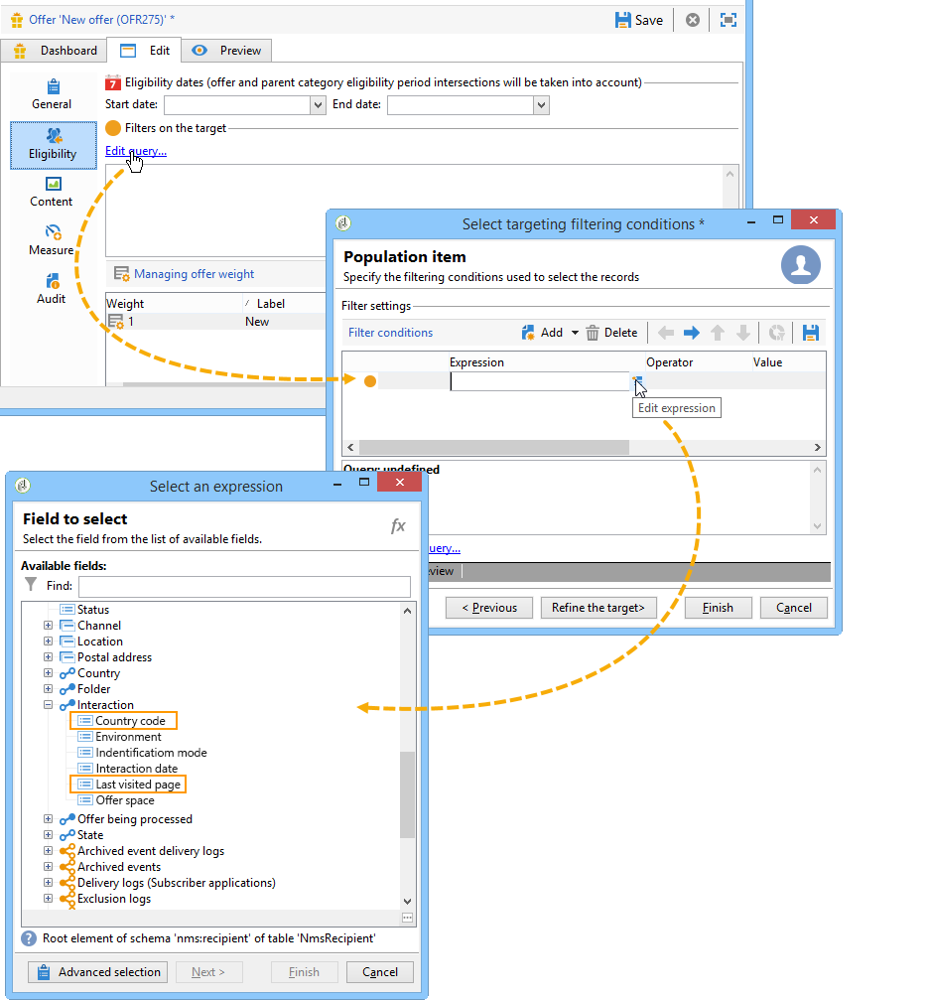

# Extension example{#extension-example}

In the case of an inbound contact (call center or web site), the most relevant offers are suggested to a given contact using a set of eligibility rules. To enrich the eligibility criteria of your offers, extend the **nms:interaction** schema.

* To add a new interaction context, extend the **nms:interaction** schema and create as many **attribute** elements as necessary in the schema.

  In the following example, the criteria added are the country code and the last visited page.

  

* You can then use the attributes previously created when defining the eligibility criteria definition.

  In the following example, we can create eligibility criteria to display an offer based on the user's country or on the last web page they viewed.

  

* When configuring SOAP calls, insert the **context** XML element to reference context information added in the interaction schema. For further information, refer to [Integration via SOAP (server side)](../../interaction/using/integration-via-soap--server-side-.md).
