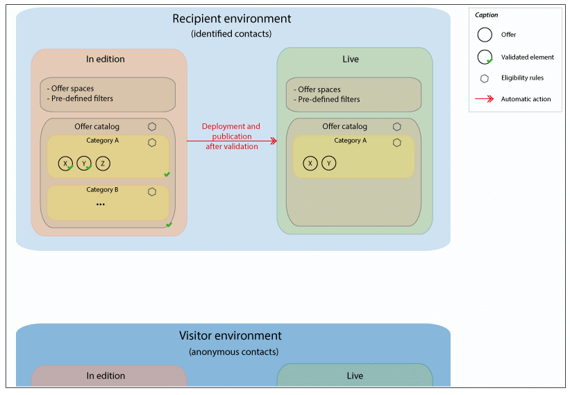
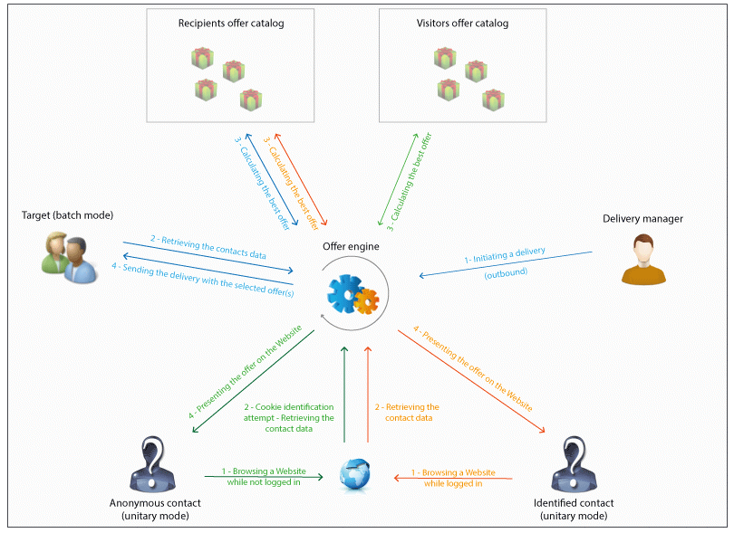

# Fundamental principles{#fundamental-principles}

## Deploying environments {#deploying-environments}

There are two environments for each targeting dimension used when managing offers:

* A design environment in which the offer manager takes care of creating and categorizing offers, editing them, and starting the approval process so that they can be used. The rules for each category, the offer spaces on which offers can be presented, and the predefined filters used to define an offer's eligibility are also defined in this environment.

  Categories can also be published manually in the online environment.

  The process for approving offers is detailed in the [Approving and activating an offer](../../interaction/using/approving-and-activating-an-offer.md) section.

* A live environment in which approved offers from the design environment, as well as the various offer spaces, filters, categories and rules configured in the design environment can all be found. During a call to the offer engine, the engine will always use offers from the live environment.

An offer is only deployed on the offer spaces selected during the approval process. Therefore, an offer can be live but unusable on an offer space that is also live.

## Interaction types and contact methods {#interaction-types-and-contact-methods}

There are two possible types of interactions: inbound interactions (initiated by a contact) and outbound interactions (initiated by the offer maker).

These two types of interactions can be carried out either in unitary mode (offer is calculated for a single contact), or in batch mode (offer is calculated for a set of contacts). Generally, inbound interactions are carried out in unitary mode and outbound interactions are carried out in batch mode. Nevertheless, there may be certain exceptions, for transactional messages for example, whereby the outbound interaction is carried out in unitary mode (refer to [this section](../../message-center/using/about-transactional-messaging.md)).

As soon as an offer can or must be presented (according to the configurations carried out), the offer engine plays the intermediary role: it automatically calculates the best possible offer for a contact among those available by combining data received about the contact and the different rules that can be applied as specified in the application.

