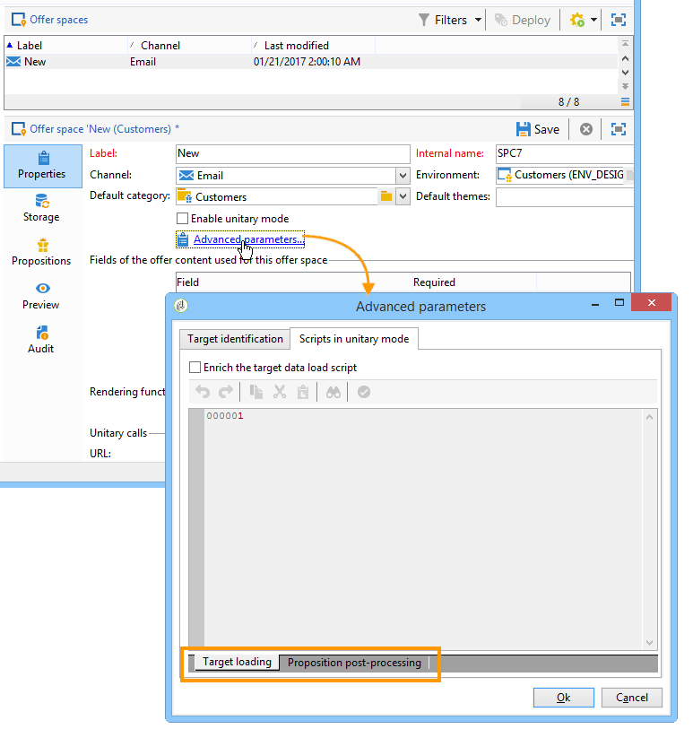
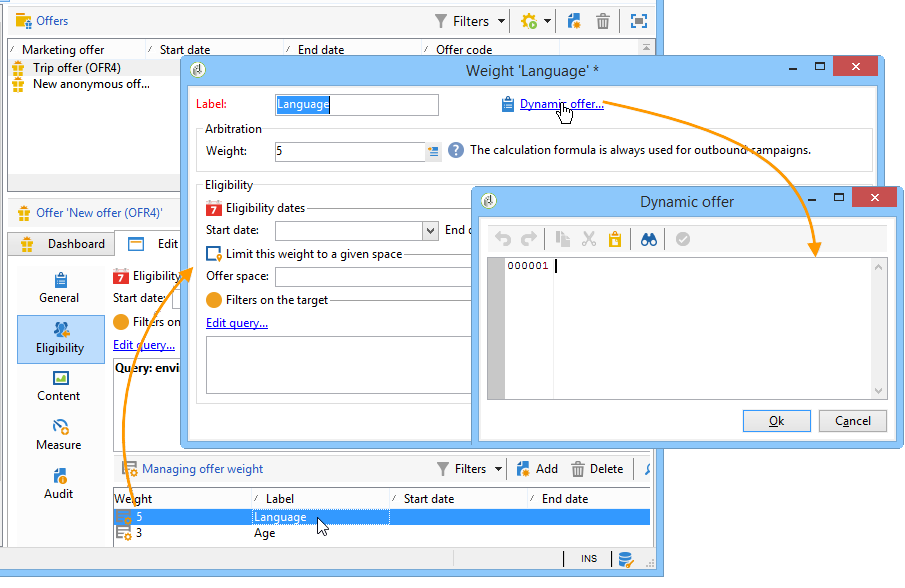
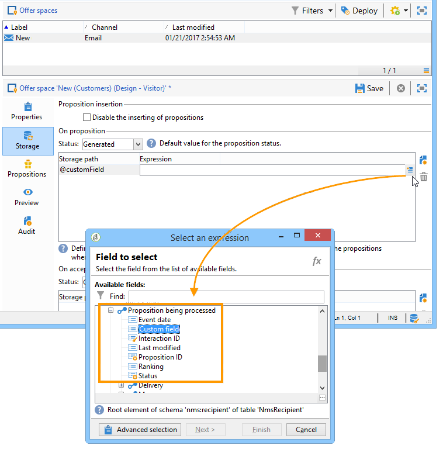

# Hooks{#hooks}

Hooks in Interaction let you modify the **standard engine behavior**.

The **[!UICONTROL Target loading]** and **[!UICONTROL Proposition post-processing]** hooks are configured, in Adobe Campaign, in the offer space:



The **[!UICONTROL Dynamic offer]** hook is configured with the offer weight in Adobe Campaign:



## Target loading {#target-loading}

This hook lets you enrich the profile of the contact (that was loaded by the out-of-the-box query) with additional data from an external system.

Data collected must be inserted into the call data node (Interaction node). The integrator must have extended the call data schema beforehand to define the structure of the collected data. The user can access this data in the same way as for standard call data (at an eligibility rules and personalization level).

**Input parameters:**

* xmlInteraction (xml type): Interaction node
* aTargetId (table type): target identifier
* sUuid230 (string type): value of the uuid230 permanent cookie
* sNlid (string type): value of the nlid session cookie

**Return parameters:**

* enriched Interaction node (first parameter of this hook)

>[!NOTE]
>
>The **xmlInteraction** parameter contains both the call data and the profile of the contact that was loaded by the out-of-the-box query.

**Example:**

```
// Call an external system to get additional data for the target
  var additionalData  = getUrl("https://EXTERNAL_SYSTEM?target=" + encodeURIComponent(aTargetId.join("|")));
  // Enrich the context with this data
  interaction.@additionalData = additionalData;
```

## Proposition post-processing {#proposition-post-processing-}

This hook lets you check the consistency and compatibility of eligible propositions in a given interaction. It also lets you define a new scoring or probability calculation functionality.

Example of using consistency rules:

* Limiting the number of propositions in the same call, linked to the same product, or the same category.
* Only presenting offers related to a product in the same interaction.

The post-processing is executed after the typology rules application and the eligible proposition sorting, and before the prioritization step.

**Input parameters:**

* aProposition: table of eligible propositions. Here is an example of the structure of an element in this table

  ```
  { offer_id:1234,
    weight:2}
  ```

* dicOffer (xml type): dictionary of all the attributes of eligible offers (offer code, category id, category full name, start date, end date, label, internal name, offer id, additional offer fields). For example

  ```
  { "1242": <offer category-id="61242" categoryFullName="/FULL/PATH/TO/CATEGORY/" code="CODE" endDate="" id="62473" label="LABEL" name="OFR38_OE4" product-id="43" startDate=""/>,
    "1243": ...}
  ```

* xmlTarget (xml type): profile data node
* xmlInteraction (xml type): call data node
* iPropNumber (integer type): number of expected offers

**Return parameters:**

* list of modified propositions (first parameter of the hook)
* modified Interaction node

**Example:**

```
var aReturnedProps = [];

if( aProposition.length > 0 )
{
  var iReturnedProps = 0;
  for( var iPropIdx = 0; iPropIdx < aProposition.length && iReturnedProps < iPropNumber; iPropIdx ++ )
  {
    // Check a consistency rule for instance
    if( true )
    {
      aReturnedProps.push(aProposition[iPropIdx]);
      iReturnedProps++;
    }
  }
}

return aReturnedProps;
```

## Dynamic offer {#dynamic-offer}

This hook allows you to make a call to an external engine to select a list of products linked to an offer. It is configured in the offer after eligibility rules, and before the typology rules application.

Beforehand, the integrator should extend the propositions **PropositionRcp** schema with the additional info on the product. To specify where this data will be stored, a **[!UICONTROL Proposition being processed]** link is available in the **[!UICONTROL Storage]** tab of the space 



**Input parameters:**

* xmlOffer (xml type): offer (offer code, category id, category full name, start date, end date, label, internal name, offer id, additional offer fields)
* dWeight: context weight (double type)
* xmlTarget (xml type): profile data node
* xmlInteraction (xml type): call data node

**Return parameters:**

A table of propositions to generate is returned. Each element of this table is composed of the following information:

* offer identifier
* additional product data (product code, for example)
* weight

>[!NOTE]
>
>The system checks that the offer id is the same for both the input and return parameters.

**Example:**

```
var product = getUrl("https://EXTERNAL_SYSTEM?offerCode=" + encodeURIComponent(xmlOffer.@code));
if( product )
  return [{offer_id: parseInt(String(xmlOffer.@id)), weight: dWeight, productId: product}];
```
