# Integrating an offer via a workflow{#integrating-an-offer-via-a-workflow}

Outside of the delivery activity itself, several workflow activities allow you to define the way offers are presented:

* Delivery outline
* Enrichment
* Offer engine
* Offers by cell

## Delivery outline {#delivery-outline}

The delivery outline activity, available in the campaign workflows, lets you present offers that are referenced in a delivery outline from the current campaign in progress.

1. In a workflow, add a delivery outline activity before adding a delivery activity.
1. In the delivery outline activity, specify the outline you would like to use.

   For more information on specifying delivery outlines, refer to the [Campaign - MRM](../../campaign/using/marketing-campaign-deliveries.md#associating-and-structuring-resources-linked-via-a-delivery-outline) guide.

1. Complete the available fields according to your delivery.
1. There are two possible cases:

    * If you would like to call the offer engine, check the **[!UICONTROL Restrict the number of propositions selected]** box. Specify the offer space and the number of propositions that will be presented in the delivery.

      The offer weights and eligibility rules will be taken into account by the offer engine.
    
    * If you do not check the box, all the offers in the delivery outline will be presented without making a call to the offer engine.

   >[!NOTE]
   >
   >The preview takes into account the number of offers specified in the delivery. When executing a workflow, it is the number specified in the delivery outline that is taken into account.

   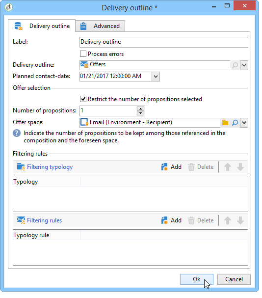

## Enrichment {#enrichment}

The enrichment activity lets you add offers or links to offers for delivery recipients.

>[!NOTE]
>
>For more information on the enrichment activity, refer to the dedicated documentation in the [Workflows guide](../../workflow/using/enrichment.md).

For example, you can enrich the data for a recipient query before a delivery.

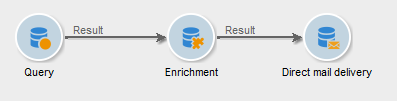

There are two methods for specifying offer propositions.

* Specifying an offer or an offer engine call.
* Referencing a link to an offer.

### Specifying an offer or a call to the offer engine {#specifying-an-offer-or-a-call-to-the-offer-engine}

After configuring your query (refer to the [Workflows guide](../../workflow/using/query.md)):

1. Add and open an enrichment activity.
1. In the **[!UICONTROL Enrichment]** tab, select **[!UICONTROL Add data]**.
1. Select **[!UICONTROL An offer proposition]** in the types of data to add.

   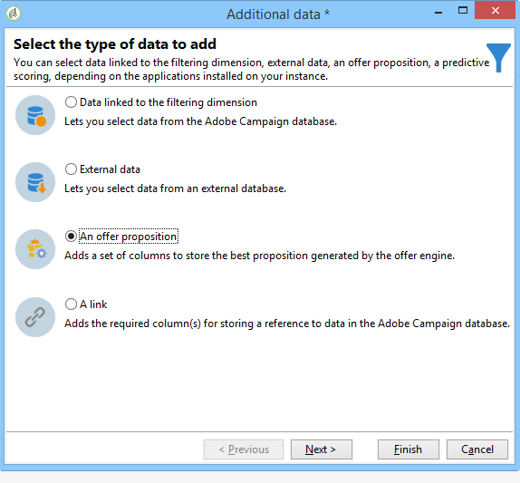

1. Specify an identifier as well as a label for the proposition that will be added.
1. Specify the offer selection. There are two possible options for this:

    * **[!UICONTROL Search for the best offer in a category]** : check this option and specify the offer engine call parameters (offer space, category or theme(s), contact date, number of offers to keep). The engine will automatically calculate the offer(s) to add according to these parameters. We recommend completing either the **[!UICONTROL Category]** or the **[!UICONTROL Theme]** field, rather than both at the same time.
    
      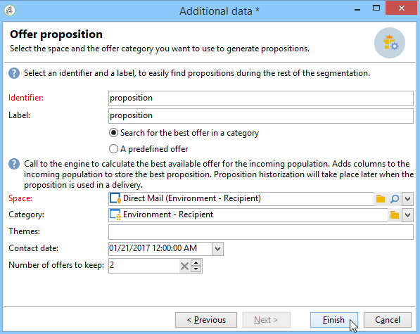

    * **[!UICONTROL A predefined offer]** : check this option and specify an offer space, a specific offer, and a contact date to directly configure the offer that you would like to add, without calling the offer engine.
    
      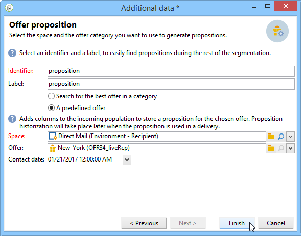

1. Then configure a delivery activity that corresponds to your chosen channel. For more on this, refer to the [Inserting an offer proposition into a delivery](../../interaction/using/integrating-an-offer-via-the-wizard.md#inserting-an-offer-proposition-into-a-delivery) section.

   >[!NOTE]
   >
   >The number of propositions available for the preview depends on the configuration carried out in the enrichment activity rather than any possible configuration carried out directly in the delivery.

### Referencing a link to an offer {#referencing-a-link-to-an-offer}

You can also reference a link to an offer in an enrichment activity.

To do this, use the following process:

1. Select **[!UICONTROL Add data]** in the activity's **[!UICONTROL Enrichment]** tab.
1. In the window where you choose the type of data to add, select **[!UICONTROL A link]**.
1. Select the type of link you want to establish as well as its target. In this case, the target is the offer schema.

   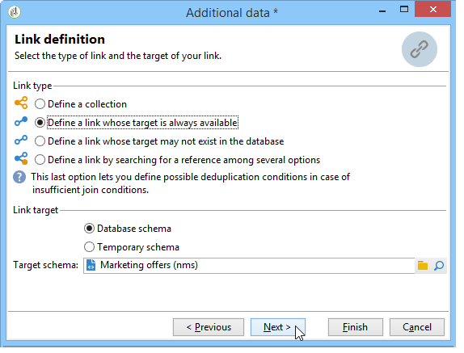

1. Specify the join between the inbound table data in the enrichment activity (here the recipient table) and the offer table. For example, you can link an offer code to a recipient.

   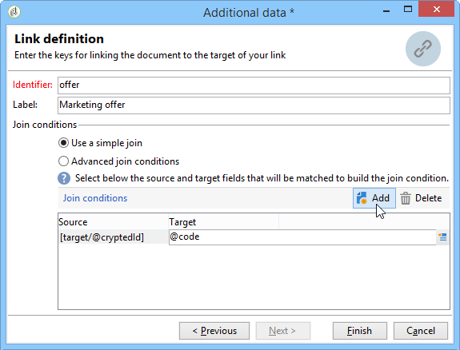

1. Then configure a delivery activity that corresponds to your chosen channel. For more on this, refer to the [Inserting an offer proposition into a delivery](../../interaction/using/integrating-an-offer-via-the-wizard.md#inserting-an-offer-proposition-into-a-delivery) section.

   >[!NOTE]
   >
   >The number of propositions available for the preview depends on the configuration carried out in the delivery.

### Storing offer rankings and weights {#storing-offer-rankings-and-weights}

By default, when an **enrichment** activity is used to deliver offers, their rankings and their weights are not stored in the proposition table.

>[!NOTE]
>
>Remember: The **[!UICONTROL Offer engine]** activity does store this information by default.

However, you can store this information as follows:

1. Create a call to the offer engine in an enrichment activity placed after a query and before a delivery activity. Refer to the [Specifying an offer or a call to the offer engine](../../interaction/using/integrating-an-offer-via-a-workflow.md#specifying-an-offer-or-a-call-to-the-offer-engine) section.
1. In the activity's main window, select **[!UICONTROL Edit additional data...]**.

   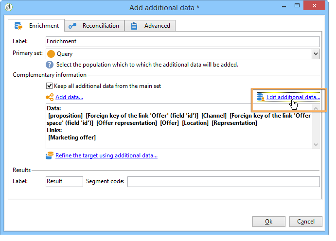

1. Add the **[!UICONTROL @rank]** columns for the ranking and **[!UICONTROL @weight]** for the offer weight.

   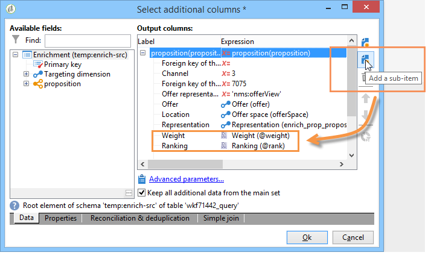

1. Confirm your addition and save your workflow.

The delivery automatically stores the ranking and weight of offers. This information is visible in the delivery's **[!UICONTROL Offers]** tab.

## Offer engine {#offer-engine}

The **[!UICONTROL Offer engine]** activity also lets you specify a call to the offer engine prior to the delivery.

This activity works on the same principle as the enrichment activity with an engine call, by enriching the inbound population data with an offer calculated by the engine, before a delivery.

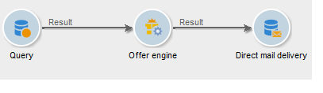

After configuring your query (refer to the [Workflows guide](../../workflow/using/query.md)):

1. Add and open an **[!UICONTROL Offer engine]** activity.
1. Complete the various available fields to specify the call to offer engine parameters (offer space, category or theme(s), contact date, number of offers to keep). The engine will automatically calculate the offer(s) to add according to these parameters.

   >[!NOTE]
   >
   >Warning: if you use this activity, only the offer propositions used in the delivery will be stored.

   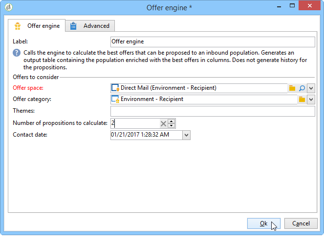

1. Then configure a delivery activity that corresponds to your chosen channel. For more on this, refer to the [Inserting an offer proposition into a delivery](../../interaction/using/integrating-an-offer-via-the-wizard.md#inserting-an-offer-proposition-into-a-delivery) section.

## Offers by cell {#offers-by-cell}

The **[!UICONTROL Offers by cell]** activity lets you distribute the inbound population (from a query for example) into several segments and to specify an offer to present for each of these segments.

To do this, use the following process:

1. Add the **[!UICONTROL Offers by cell]** activity once you have specified the target population, then open it.
1. In the **[!UICONTROL General]** tab, select the offer space on which you want to present the offers.
1. In the **[!UICONTROL Cells]** tab, specify the different sub-sets using the **[!UICONTROL Add]** button:

    * Specify the subset population using the available filtering and limiting rules.
    * Then select the offer that you want to present to the sub-set. The available offers are those that are eligible on the offer environment that was selected at the previous step.
    
      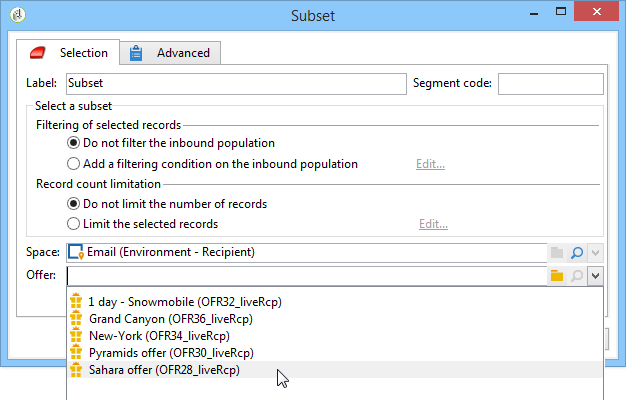

1. Then configure a delivery activity that corresponds to your chosen channel. For more on this, refer to the [Inserting an offer proposition into a delivery](../../interaction/using/integrating-an-offer-via-the-wizard.md#inserting-an-offer-proposition-into-a-delivery) section.
