# Integrating an offer via the wizard{#integrating-an-offer-via-the-wizard}

When creating a delivery, there are two possible methods for integrating offers:

* Calling the offer engine in the body of a delivery.
* Referencing offers via a campaign's delivery outlines. This method is generally used for paper campaigns.

## Delivering with a call to the offer engine {#delivering-with-a-call-to-the-offer-engine}

To present an offer during a marketing campaign, simply create a classic delivery action based on the chosen channel. The offer engine is called up when the delivery content is defined, by clicking the **[!UICONTROL Offers]** icon available in the toolbar.

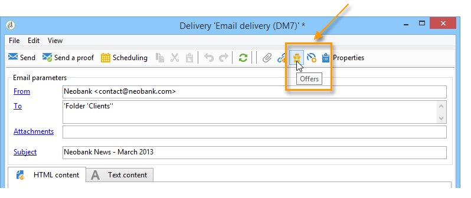

Learn more about direct mail deliveries [in this section](../../delivery/using/about-direct-mail-channel.md). Learn more about marketing campaigns [in this section](../../campaign/using/setting-up-marketing-campaigns.md).

### Main steps for inserting an offer into a delivery {#main-steps-for-inserting-an-offer-into-a-delivery}

To insert offer propositions into a delivery, apply the following steps:

1. In the delivery window, click the Offers icon. 

   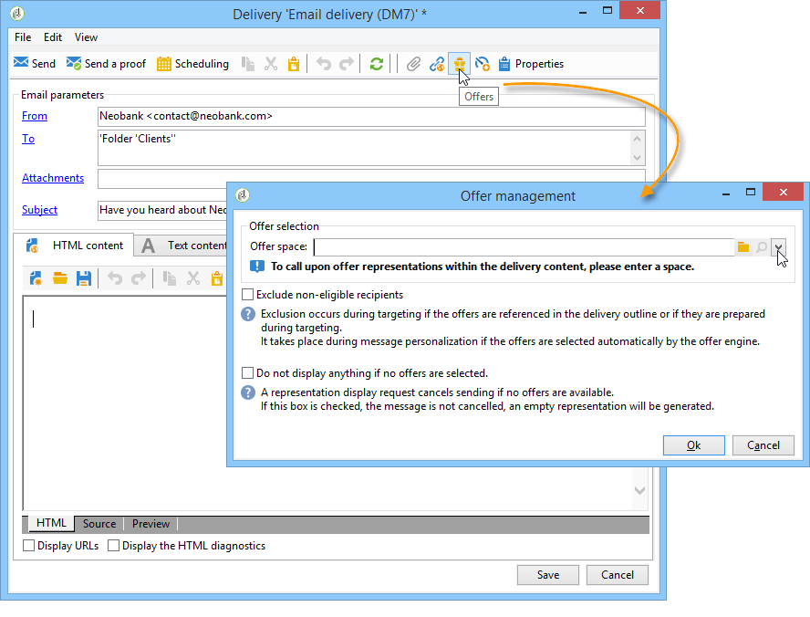

1. Select the space that matches your offer environment.

   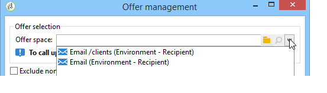

1. To refine the engine's choice of offers, select either the category from which the offer(s) to be presented is a part of, or one/several themes. We recommend only using one of these fields at a time to avoid overloading the restrictions.

   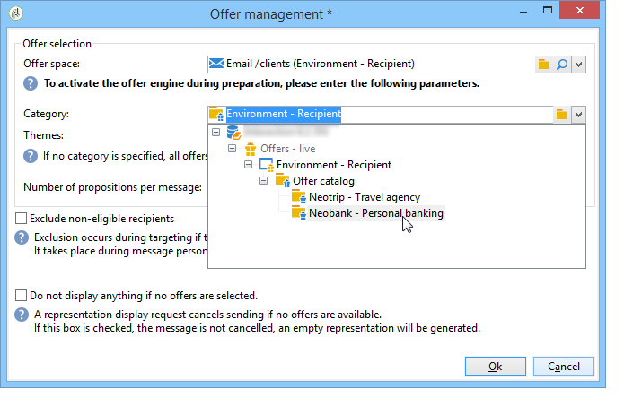

   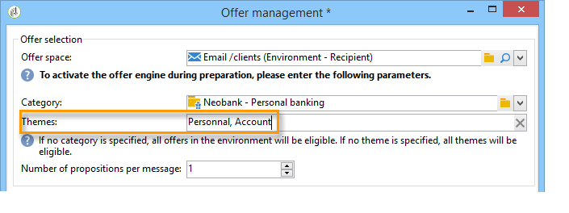

1. Specify the number of offers you want to insert into the delivery body.

   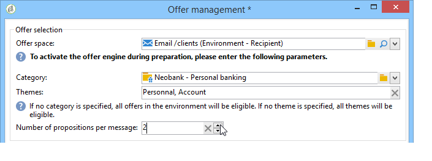

1. Select the **[!UICONTROL Exclude non-eligible recipients]** option if necessary. For more on this, refer to [Parameters for calling offer engine](#parameters-for-calling-offer-engine).

   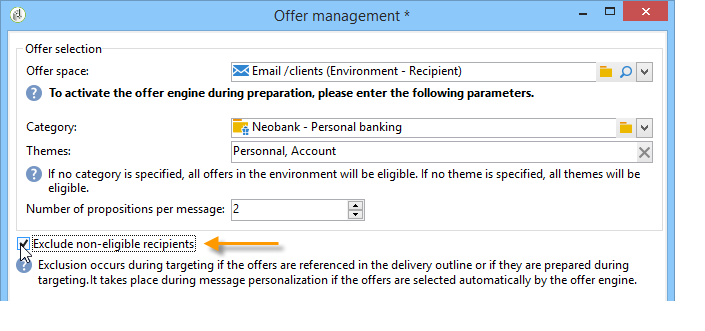

1. If necessary, select the **[!UICONTROL Do not display anything if no offers are selected]** option. For more on this, refer to [Parameters for calling offer engine](#parameters-for-calling-offer-engine).

   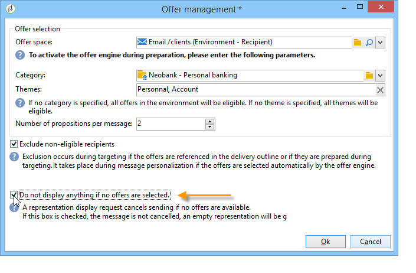

1. Insert the property(ies) into the delivery content using the merge fields. The number of propositions available depends on the way the engine call is configured and their order depends on the priority of offers.

   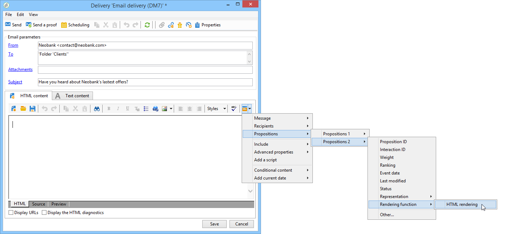

1. Finalize the content and send your delivery as usual.

   

### Parameters for calling offer engine {#parameters-for-calling-offer-engine}

* **[!UICONTROL Space]** : space of the offer environment which must be selected to activate the offer engine.
* **[!UICONTROL Category]** : specific folder in which offers are sorted. If no category is specified, all the offers contained in the environment will be taken into account by the offer engine, unless a theme is selected. 
* **[!UICONTROL Themes]** : key words defined upstream in the categories. These act as a filter and let you refine the number of offers to be presented by selecting them in a set of categories. 
* **[!UICONTROL Number of propositions]** : number of offers returned by the engine that can be inserted into the delivery body. If they are not inserted into the message, the offers will still be generated, but not presented.
* **[!UICONTROL Exclude non-eligible recipients]** : This option lets you activate or deactivate the exclusion of recipients for whom there are not enough eligible offers. The number of eligible propositions may be lower than the requested number of propositions. If this box is checked, recipients who don't have enough propositions will be excluded from the delivery. If you don't select this option, these recipients will not be excluded but they won't have the requested number of propositions.
* **[!UICONTROL Do not display anything if no offer is selected]** : this option lets you choose how the message will be processed in case one of the propositions does not exist. When this box is checked, the representation of the missing proposition is not displayed and no content will appear in the message for this proposition. If the box isn't checked, the message itself is cancelled during sending and recipients will no longer receive any messages.

### Inserting an offer proposition into a delivery {#inserting-an-offer-proposition-into-a-delivery}

The representation of offers to be presented is inserted into the body of the delivery via the merge fields. The number of propositions is defined in the parameters of the offer engine call.

The delivery can be personalized using the offer's fields or, in the case of an email, the rendering functions.

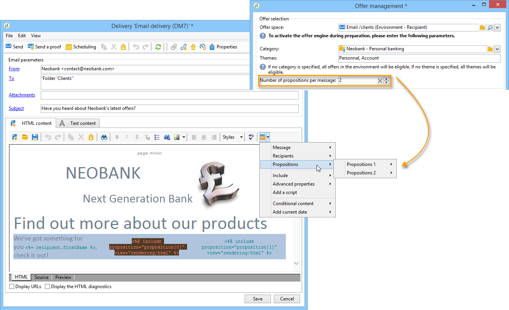

## Delivering with delivery outlines {#delivering-with-delivery-outlines}

You can also present offers in a delivery using delivery outlines.

For more information on delivery outlines, refer to the [Campaign - MRM](../../campaign/using/marketing-campaign-deliveries.md#associating-and-structuring-resources-linked-via-a-delivery-outline) guide.

1. Create a new campaign or access an existing campaign.
1. Access the delivery outlines via the campaign's **[!UICONTROL Edit]** > **[!UICONTROL Documents]** tab.
1. Add an outline then insert as many offers as you like into it by right-clicking on the outline and selecting **[!UICONTROL New]** > **[!UICONTROL Offer]**, then save the campaign.

   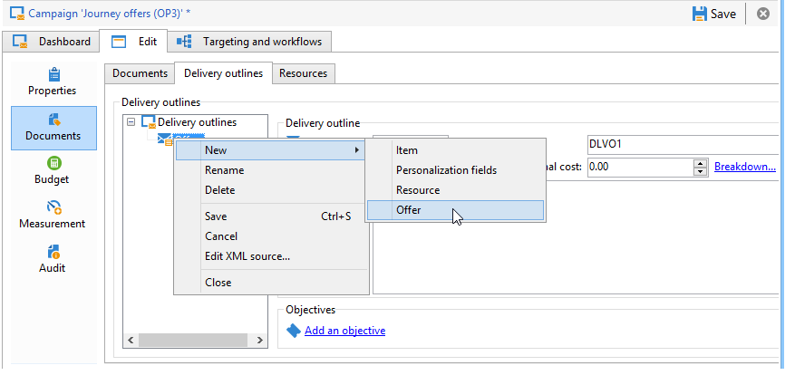

1. Create a delivery whose delivery outlines you have access to (for example, a direct mail delivery).
1. When editing the delivery, click **[!UICONTROL Select a delivery outline]**.

   >[!NOTE]
   >
   >Depending on the type of delivery, this option can be found in the **[!UICONTROL Properties]** > **[!UICONTROL Advanced]** menu (for email deliveries for example).

   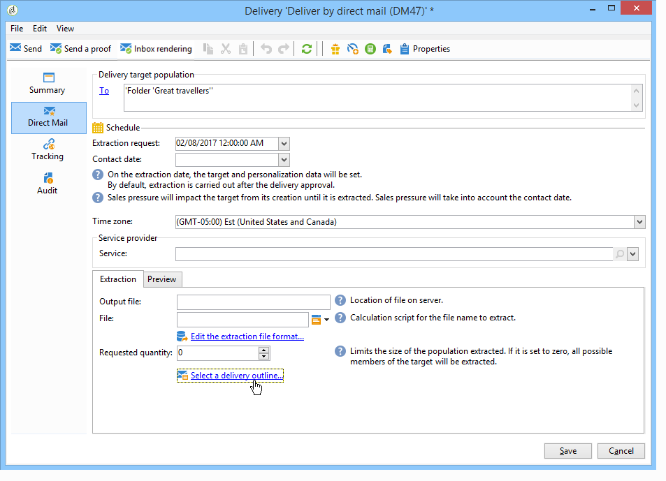

1. Using the **[!UICONTROL Offers]** button, you can then configure the offer space as well as the number of offers to present in the delivery.

   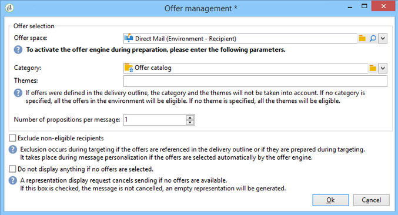

1. Add the propositions into the delivery body using the personalization fields (for more on this, refer to the [Inserting an offer proposition into a delivery](#inserting-an-offer-proposition-into-a-delivery) section), or in the case of a direct mail delivery, by editing the extraction file format.

   Propositions will be selected from the offers referenced in the delivery outline.

   >[!NOTE]
   >
   >Information regarding the offer rankings and weights is only saved in the proposition table if the offers are generated directly in the delivery.
