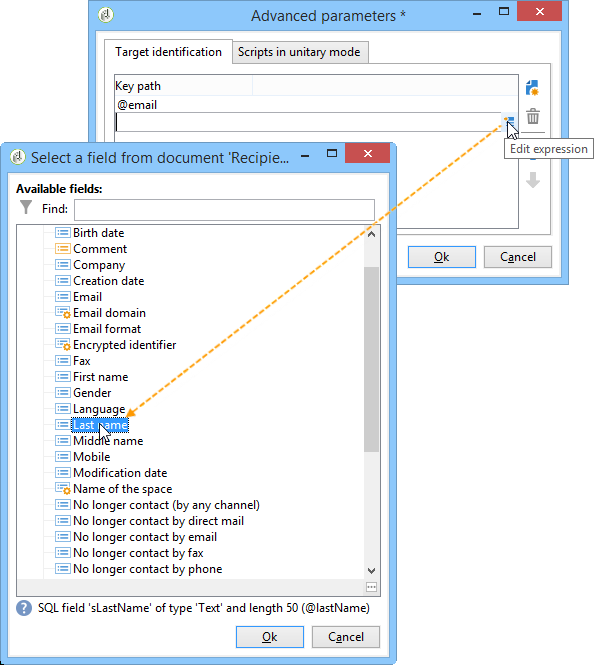
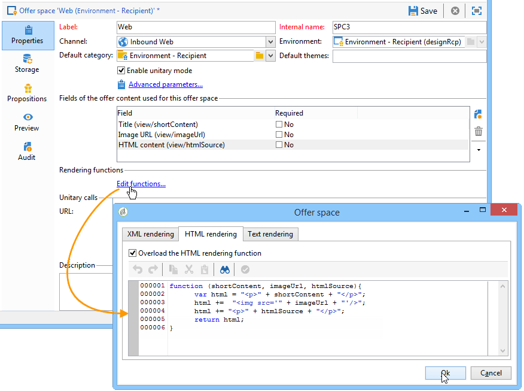
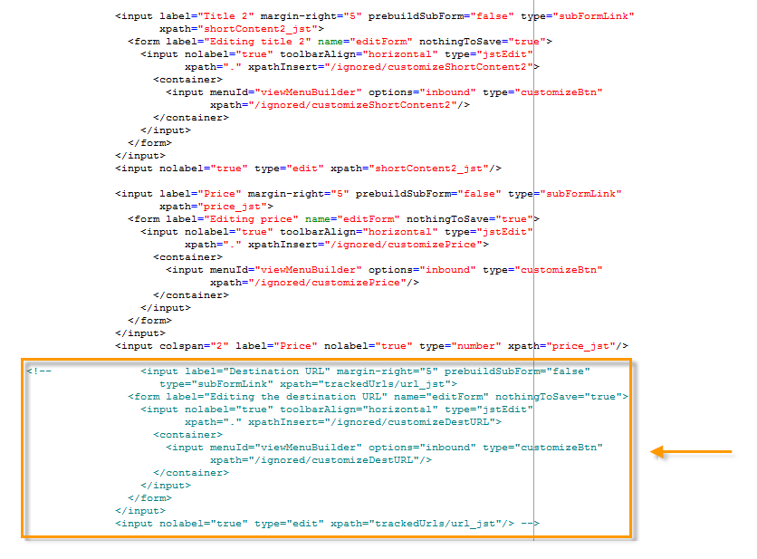
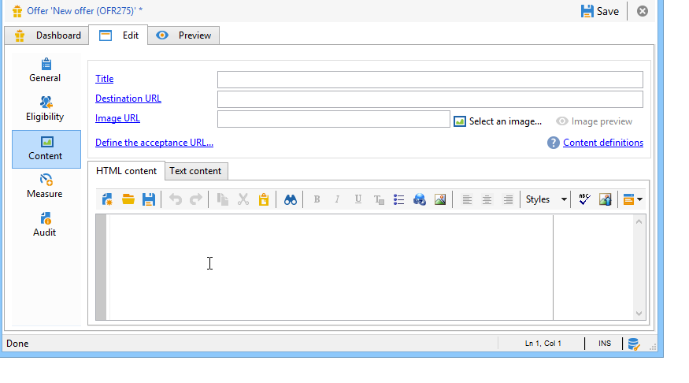
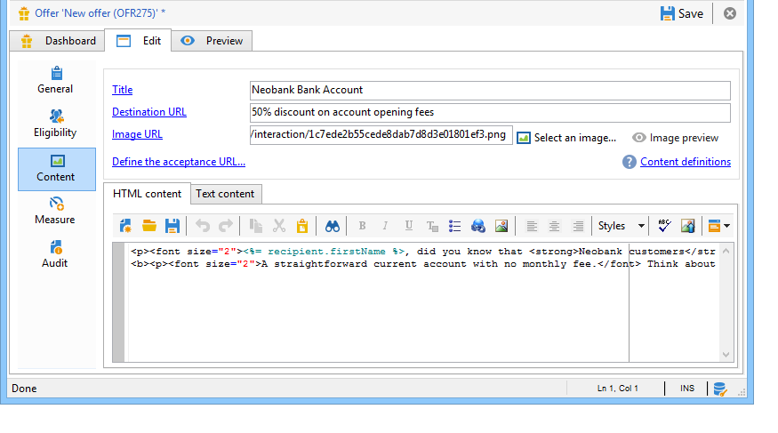

# Integration via JavaScript (client side){#integration-via-javascript-client-side}

To call the Interaction engine in a web page, insert a call to a JavaScript code directly into the page. This call returns the offer content in a targeted 

element.

Adobe recommends using the JavaScript integration method.

The script calling URL looks like this:

```
<script id="interactionProposalScript" src="https://<SERVER_URL>/nl/interactionProposal.js?env=" type="text/javascript"></script>
```

The "**env**" parameter receives the internal name of the live environment dedicated to anonymous interactions.

To present an offer, we need to create an environment and an offer space in Adobe Campaign, then configure the HTML page.

The following use cases detail the possible options for integrating offers via JavaScript.

## HTML mode {#html-mode}

### Presenting an anonymous offer {#presenting-an-anonymous-offer}

1. **Preparing the interaction engine**

   Open the Adobe Campaign interface and prepare an anonymous environment.

   Create an offer space linked to the anonymous environment.

   Create an offer and its representation linked to the offer space.

1. **Content of the HTML page**

   The HTML page must include a 

   element with an @id attribute with the value of the internal name of the created offer space ("i_internal name space"). The offer will be inserted into this 
   element by Interaction.

   In our example, the @id attribute receives the "i_SPC12" value, where "SPC12" is the internal name of the previously created offer space:

   ```
   <div id="i_SPC12"></div>
   ```

   In our example, the URL for calling the script is as follows ("OE3" is the internal name of the live environment):

   ```
   <script id="interactionProposalScript" src="https://instance.adobe.org:8080/nl/interactionProposal.js?env=OE3" type="text/javascript"></script>
   ```

   >[!IMPORTANT]
   >
   >The `<script>` tag must not be self-closing.

   This static call will automatically generate a dynamic call containing all the parameters needed by the Interaction engine.

   This behavior lets you use several offer spaces on the same page, to be managed by a single call to the engine.

1. **Results in the HTML page**

   The content of the offer representation is returned to the HTML page by the Interaction engine:

   ```
   <div id="banner_header">
     <div id="i_SPC12">
       <table>
         <tbody>
           <tr>
             <td><h3>Fly to Japan!</h3></td>
           </tr>
           <tr>
             <td></td>
             <td>
               <p>Discover Japan for 2 weeks at an unbelievable price!!</p>
               <p><b>2345 Dollars - All inclusive</b></p>
             </td>
           </tr>
         </tbody>
       </table>
     </div>
     <script src="https://instance.adobe.org:8080/nl/interactionProposal.js?env=OE3" id="interactionProposalScript" type="text/javascript"></script>
   </div>
   ```

### Presenting an identified offer {#presenting-an-identified-offer}

To present an offer to an identified contact, the process is similar as the one detailed here: [Presenting an anonymous offer](#presenting-an-anonymous-offer). In the content of the web page, you need to add the following script that will identify the contact during the call to the engine:

```
<script type="text/javascript">
  interactionTarget = <contact_identifier>;
</script>
```

1. Go to the offer space that will be called up by the web page, click **[!UICONTROL Advanced parameters]** and add one or more identification keys.

   

   In this example, the identification key is composite since it is based both on the email and the recipient name.

1. During the web page display, the script evaluation lets you pass the recipient ID on to the offer engine. If the ID is composite, the keys are displayed in the same sequence as used in the advanced settings and are separated by a |.

   In the following example, the contact has logged on to the website and was recognized during the call to the Interaction engine thanks to their email and name.

   ```
   <script type="text/javascript">
     interactionTarget = myEmail|myName;
   </script>
   ```

### Using an HTML rendering function {#using-an-html-rendering-function}

To generate the HTML offer representation automatically, you can use a rendering function.

1. Go to the offer space and click the **[!UICONTROL Edit functions]** link.
1. Select **[!UICONTROL Overload the HTML rendering function]**.
1. Go to the **[!UICONTROL HTML rendering]** tab and insert the variables that match the fields defined for the offer content in the offer space.

   

   In this example, the offer is displayed in the form of a banner in a web page and is made up of a clickable image and a title that match the fields defined in the offer content.

## XML mode {#xml-mode}

### Presenting an offer {#presenting-an-offer}

Interaction lets you return an XML node to the HTML page which calls up the offer engine. This XML node can be processed by functions to be developed on the customer side.

The call to the Interaction engine looks like this:

```
<script type="text/javascript" id="interactionProposalScript" src="https://<SERVER_URL>/nl/interactionProposal.js?env=&cb="></script>
```

The "**env**" parameter receives the internal name of the live environment.

The "**cb**" parameter receives the name of the function which will read the XML node returned by the engine containing the (callback) proposition(s). This parameter is optional.

The "**t**" parameter receives the value of the target, only for an identified interaction. This parameter can also be passed with the **interactionTarget** variable. This parameter is optional.

The "**c**" parameter receives the list of internal names of the categories. This parameter is optional.

The "**th**" parameter receives the list of themes. This parameter is optional.

The "**gctx**" parameter receives the call data global (context) to the entire page. This parameter is optional.

The returned XML node looks like this:

```
<propositions>
 <proposition id="" offer-id="" weight="" rank="" space="" div=""> //proposition identifiers
   ...XML content defined in Adobe Campaign...
 </proposition>
 ...
</propositions>
```

The following use case details the configurations to carry out in Adobe Campaign to enable XML mode then show the result of the call to the engine in the HTML page.

1. **Creating an environment and an offer space**

   For more on creating an environment, refer to [Live/Design environments](../../interaction/using/live-design-environments.md).

   For more on creating an offer space, refer to [Creating offer spaces](../../interaction/using/creating-offer-spaces.md). 

1. **Extending the offer schema to add new fields**

   This schema will define the following fields: Title number 2 and price.

   The name of the schema in the example is **cus:offer**

   ```
   <srcSchema _cs="Marketing offers (cus)" created="2013-01-18 17:14:20.762Z" createdBy-id="0"
              desc="" entitySchema="xtk:srcSchema" extendedSchema="nms:offer" img="nms:offer.png"
              label="Marketing offers" labelSingular="Marketing offers" lastModified="2013-01-18 15:20:18.373Z"
              mappingType="sql" md5="F14A7AA009AE1FCE31B0611E72866AC3" modifiedBy-id="0"
              name="offer" namespace="cus" xtkschema="xtk:srcSchema">
     <createdBy _cs="Administrator (admin)"/>
     <modifiedBy _cs="Administrator (admin)"/>
     <element img="nms:offer.png" label="Marketing offers" labelSingular="Marketing offer"
              name="offer">
       <element label="Content" name="view">
         <element label="Price" name="price" type="long" xml="true"/>
         <element label="Title 2" name="title2" type="string" xml="true"/>
   
         <element advanced="true" desc="Price calculation script." label="Script price"
                  name="price_jst" type="CDATA" xml="true"/>
         <element advanced="true" desc="Title calculation script." label="Script title"
                  name="title2_jst" type="CDATA" xml="true"/>
       </element>
     </element>
   </srcSchema>
   ```

   >[!IMPORTANT]
   >
   >Each element needs to be defined twice. CDATA ("_jst") type elements can contain personalization fields.
   >
   >Don't forget to update the database structure. For more on this, refer to [this section](../../configuration/using/updating-the-database-structure.md).

   >[!NOTE]
   >
   >You can extend the offer schema to add new fields both in batch and unitary mode, and in any format (text, HTML, and XML).

1. **Extending the offer formula to edit new fields and modify an existing field**

   Edit the **Offer (nsm)** input form.

   In the "Views" section, insert the two new fields with the following content:

   ```
   <input label="Title 2" margin-right="5" prebuildSubForm="false" type="subFormLink"
                        xpath="title2_jst">
                   <form label="Edit title 2" name="editForm" nothingToSave="true">
                     <input nolabel="true" toolbarAlign="horizontal" type="jstEdit"
                            xpath="." xpathInsert="/ignored/customizeTitle2">
                       <container>
                         <input menuId="viewMenuBuilder" options="inbound" type="customizeBtn"
                                xpath="/ignored/customizeTitle2"/>
                       </container>
                     </input>
                   </form>
                 </input>
                 <input nolabel="true" type="edit" xpath="title2_jst"/>
   
                 <input label="Price" margin-right="5" prebuildSubForm="false" type="subFormLink"
                        xpath="price_jst">
                   <form label="Edit price" name="editForm" nothingToSave="true">
                     <input nolabel="true" toolbarAlign="horizontal" type="jstEdit"
                            xpath="." xpathInsert="/ignored/customizePrice">
                       <container>
                         <input menuId="viewMenuBuilder" options="inbound" type="customizeBtn"
                                xpath="/ignored/customizePrice"/>
                       </container>
                     </input>
                   </form>
                 </input>
                 <input colspan="2" label="Prix" nolabel="true" type="number" xpath="price_jst"/>
   ```

   Comment out the destination URL field:

   

   >[!IMPORTANT]
   >
   >The fields of the ( `<input>`) form must point to the CDATA type elements defined in the created schema.

   The rendering in the offer representations form looks like this:

   

   The **[!UICONTROL Title 2]** and **[!UICONTROL Price]** fields have been added and the **[!UICONTROL Destination URL]** field is no longer displayed.

1. **Creating an offer**

   For more on creating offers, refer to [Creating an offer](../../interaction/using/creating-an-offer.md).

   In the following use case, the offer is entered as follows:

   

1. Approve an offer or have it approved by somebody else, then activate it on the offer space created at the last step so that it is made available in the linked live environment.
1. **Engine calls and result on the HTML page**

   The call to the interaction engine in the HTML page looks like this:

   ```
   <script id="interactionProposalScript" src="https://<SERVER_URL>/nl/interactionProposal.js?env=OE7&cb=alert" type="text/javascript">
   ```

   The value of the "**env**" parameter is the internal name of the live environment.

   The value of the "**cb**" parameter is the name of the function which needs to interpret the XML node returned by the engine. In our example, the called up function opens a modal window (alert() function).

   The XML node returned by the Interaction engine looks like this:

   ```
   <propositions>
    <proposition id="a28002" offer-id="10322005" weight="1" rank="1" space="SPC14" div="i_SPC14">
     <xmlOfferView>
      <title>Travel to Russia</title>
      <price>3456</price>
      <description>Discover this vacation package!INCLUDES 10 nights. FEATURES buffet breakfast daily. BONUS 5th night free.</description>
      <image>
       <path>https://myinstance.com/res/Track/ae1d2113ed732d58a3beb441084e5960.jpg</path>
       <alt>Travel to Russia</alt>
      </image>
     </xmlOfferView>
    </proposition>
   </propositions>
   ```

### Using a rendering function {#using-a-rendering-function-}

It's possible to use an XML rendering function to create an offer presentation. This function will modify the XML node that is returned to the HTML page during the call to the engine.

1. Go to the offer space and click the **[!UICONTROL Edit functions]** link.
1. Select **[!UICONTROL Overload the XML rendering function]**. 
1. Go to the **[!UICONTROL XML rendering]** tab and insert the desired function.

   The function can look like this:

   ```
   function (proposition) {
     delete proposition.@id;
     proposition.@newAttribute = "newValue";
   } 
   ```


