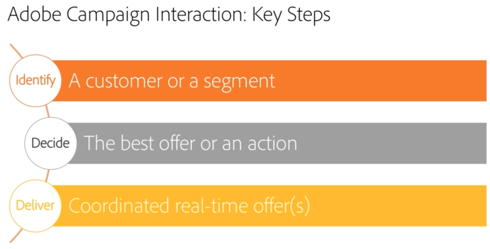

# Interaction and offer management{#interaction-and-offer-management}

Interaction lets you respond in real time during an interaction with a given contact (a customer or target) by making them a single or several adapted offers. For example, these can be simple communication messages, special offers on one or several products or a service.

Offers are sent to contacts via an inbound (website or call center) or outbound (email delivery, direct mail or SMS within a marketing campaign) contact.

You can create an offer catalog that will interface with inbound and outbound channels to select the best offer to send to a contact in a given context. Offer relevance for a recipient is defined based on eligibility rules. The selection of an offer from a set of relevant offers is determined using priority rules. Offer presentation rules take into account the contact's exchange history and help avoid having them receive the same offer several times.

Interaction lets you create and manage a catalog of offers, and configure the eligibility rules and application themes linked to them. Depending on the channel chosen, offer content can be personalized thanks to various rendering functions. Finally, you can use the simulation module to calculate the impact of an offer presentation.

 To familiarize yourself with the interaction feature and terminologies used in Campaign Interaction, watch [this video](https://helpx.adobe.com/campaign/classic/how-to/acs-overview.html?playlist=/ccx/v1/collection/product/campaign/classic/segment/digital-marketers/explevel/intermediate/applaunch/get-started/collection.ccx.js&ref=helpx.adobe.com).

## Related topics

| Useful pages | Additional resources |
|---|---|
| [Interaction implementation steps](../../interaction/using/implementation-steps.md) | [Testing offer distribution](../../interaction/using/about-offers-simulation.md) |
| [Live/Design environments](../../interaction/using/live-design-environments.md) | [Adding an offer in an email](../../interaction/using/integrating-an-offer-via-the-wizard.md) |
| [Creating offer spaces](../../interaction/using/creating-offer-spaces.md) |  [Use case: add an offer in a website](../../interaction/using/offers-on-an-inbound-channel.md)  |
