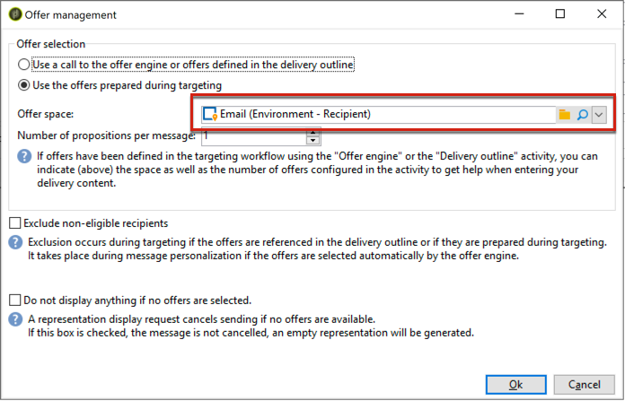
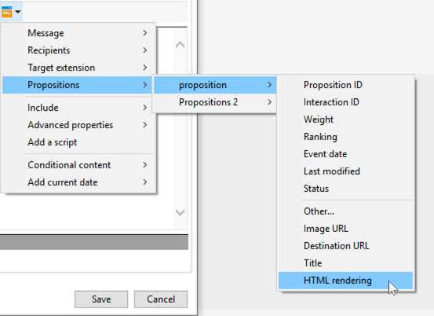
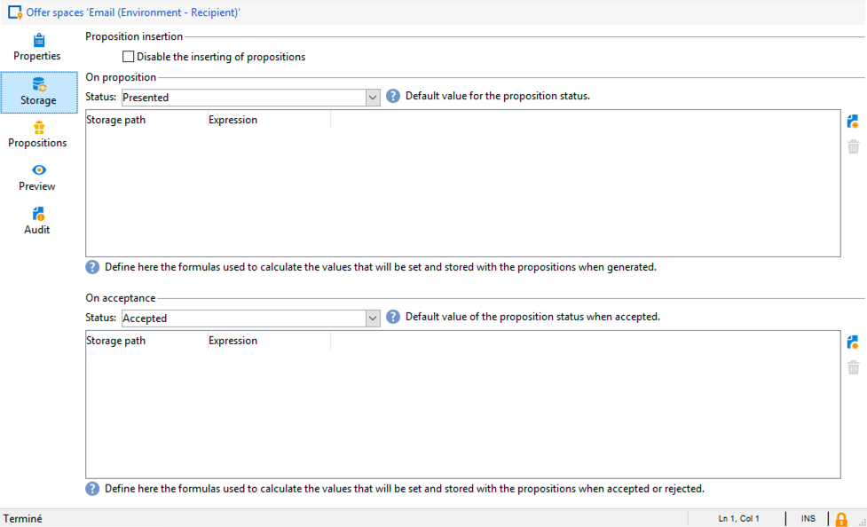
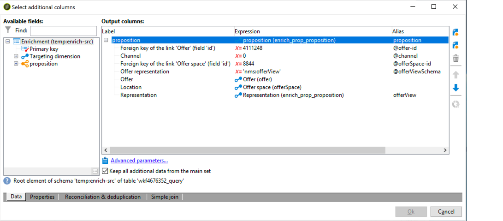
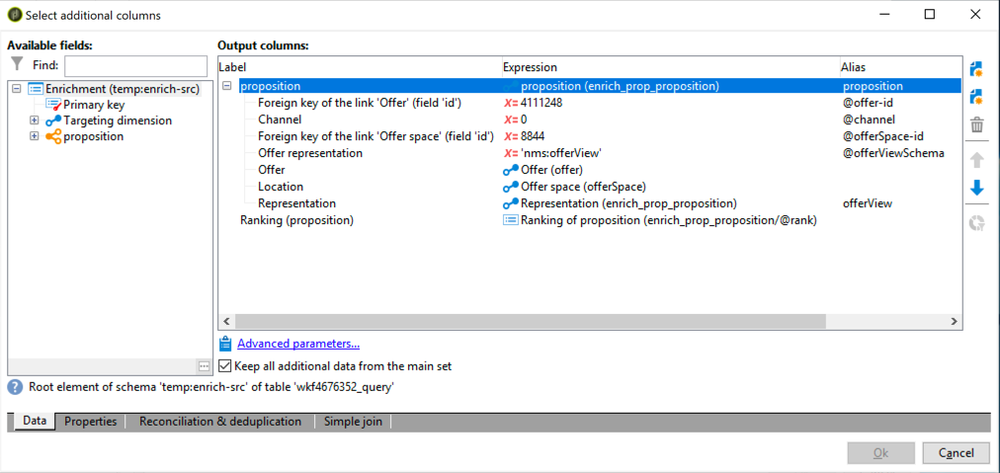
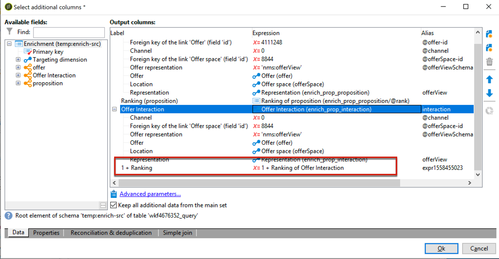

# Interaction best practices{#interaction-best-practices}

## General recommendations {#general-recommendations}

This section presents the best practice approach to manage the Interaction module in Adobe Campaign Classic, including eligibility rules, pre-defined filters, workflow activities and database options.

Interaction in Adobe Campaign requires careful management to operate efficiently. You must find a balance between the number of contacts and the number of offer categories and offers. If those factors are not dealt carefully, your Adobe Campaign instance may encounter issues.

### Implementation {#implementation}

Below are listed important elements that should be kept in mind when implementing and configuring interactions.

* For batch engine (typically used in outbound communications like email), throughput is the main concern, as multiple contacts can be handled at the same time. The typical bottleneck is database performance.
* The main constraint for unitary engine (typically used in inbound communications like a banner on a web site) is latency, as someone is expecting an answer. The typical bottleneck is CPU performance.
* The offer catalog design has a huge impact on Adobe Campaign Classic performance.
* When there are many offers, split them into several offer catalogs.

### Eligibility rules {#eligibility-rules}

Below are listed some best practices regarding eligibility rules.

* Simplify the rules. Rules complexity impacts performance as it extends the look-up. A complex rule is any rule that has more than five conditions.
* To increase performance, rules can be broken out in distinct predefined filters that are shared across multiple offers.
* Put the most restrictive offer category rules at the highest possible position in the tree. Doing this, they will filter out the most contacts first, reducing the target number and preventing them from being processed by further rules.
* Put the most expensive rules in terms of time or processing at the bottom of the tree. Doing this, these rules will only be run on the remaining target audience.
* Start at a specific category to avoid scanning the whole tree.
* To save processing time, precompute aggregates instead of building complex rules with joins. To do this, try to store customer data in a reference table that can be looked up within eligibility rules.
* Use a minimum number of weights to limit the number of queries.
* It is recommended having a limited number of offers per offer space. This ensures faster retrieval of offers in any given space.
* Use indexes, especially on frequently used look-up columns.

### Proposition table {#proposition-table}

Below are listed a few best practices regarding the proposition table.

* Use a minimum number of rules to make the processing as fast as possible.
* Limit the number of records in the proposition table: only keep the records that are needed to track its status update and what is needed by the rules, then archive them into another system.
* Perform intensive database maintenance on the proposition table, such as rebuild indexes or recreate table.
* Limit the number of propositions asked per target. Do not set more than what you are actually going to use.
* Avoid joins as much as possible in the rule criteria.

## Tips and tricks on managing offers {#tips-managing-offers}

This section contains more detailed advice on managing offers and using the Interaction module in Adobe Campaign Classic.

### Using multiple offer spaces in an email delivery {#multiple-offer-spaces}

When including offers in deliveries, the offers are generally selected upstream in the Campaign workflow via an Enrichment activity (or another similar activity).

When selecting offers in an Enrichment activity, you can choose which offer space to use. However, regardless of the selected offer space, the delivery customization menu depends on the offer space set up in the delivery.

In the example below, the offer space selected in the delivery is **[!UICONTROL Email (Environment - Recipient)]**:



If the offer space you select in the delivery does not have an HTML rendering function set up, you will not see it in the delivery menu and it will not be available for selection. Again, this is independent of the offer space selected in the Enrichment activity.

In the example below, the HTML rendering function is available in the drop-down list because the offer space selected in the delivery has a rendering function:



This function inserts code such as: `<%@ include proposition="targetData.proposition" view="rendering/html" %>`.

When you select the proposition, the value of the **[!UICONTROL view]** attribute is as follows:
* "rendering/html": html rendering. It uses the HTML rendering function.
* "offer/view/html": html content. It does not use the HTML rendering function. It only includes the HTML field.

When you include multiple offer spaces in a single email delivery and if some of them have rendering functions and some do not have it, you must remember which offers use which offer spaces, and which offer spaces have rendering functions.

Consequently, to avoid any issue, it is recommended that all offer spaces have an HTML rendering function defined, even if your offer space only requires HTML content.

### Setting the rank in the proposition log table {#rank-proposition-log-table}

Offer spaces have the ability to store data in the proposition table when propositions are generated or accepted:



However, this only applies to inbound interactions.

It is also possible to store additional data in the proposition table when using outbound interactions, and also when using outbound offers without the Interaction module.

Any field from the workflow temp table whose name matches a field name in the proposition table is copied into the same field in the proposition table.

For example, when selecting an offer manually (without Interaction) in an Enrichment, the standard fields are defined as follows:



Additional fields can be added, such as a @rank field:



Because there is a field in the proposition table named @rank, the value in the workflow temp table will be copied.

For more on storing additional fields in the proposition table, see [Integrating an offer via a workflow](../../interaction/using/integrating-an-offer-via-a-workflow.md#storing-offer-rankings-and-weights).

For outbound offers with Interaction, this is useful when several offers are selected and you want to record in which order they will be displayed in an email.

You can also store additional metadata directly in the proposition table, such as the current spend level, to keep historical records about the spend at the time offers were generated.

When using outbound Interaction, the @rank field can be added, as in the example above, but its value is automatically set based on the order returned by Interaction. For example, if you are using Interaction to select three offers, the @rank field will have values 1, 2, and 3 returned.

When using Interaction and manually selecting offers, the user can combine both approaches. For example, the user may manually set the @rank field to be 1 for the manually selected offer, and use an expression such as "1 + @rank" for the offers returned by Interaction. Assuming Interaction selects three offers, the offers returned by both approaches will be ranked 1-4:



### Extending the nms:offer schema {#extending-nms-offer-schema}

When extending the nms:offer schema, make sure you follow the out-of-the-box structure already set-up:
* Define any new field for content storage under `<element name="view">`.
* Each new field needs to be defined twice. Once as a regular XML field, and once as a CDATA XML field with "_jst" appended to the name. For example:

    ```
    <element label="Price" name="price" type="long" xml="true"/>
    <element advanced="true" label="Script price" name="price_jst" type="CDATA" xml="true"/>
    ```

* Any fields that contain URLs to be tracked must be placed under `<element name="trackedUrls">` which is found under `<element name="view" >`.
