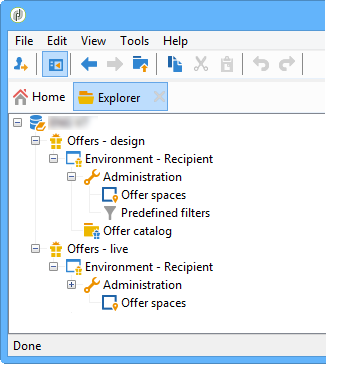
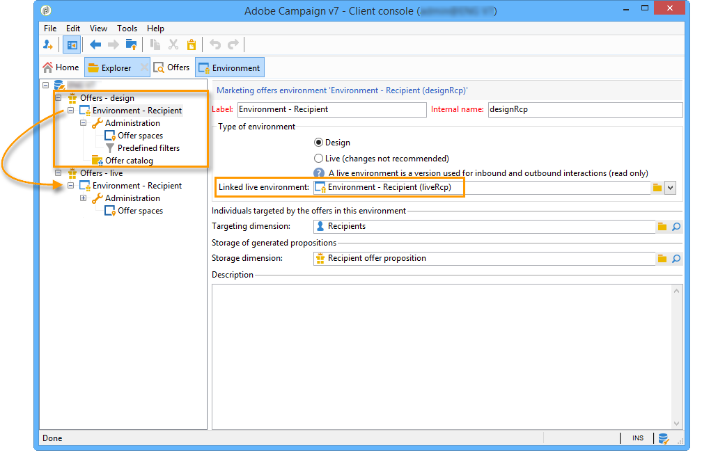
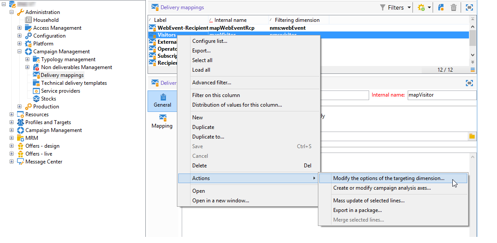
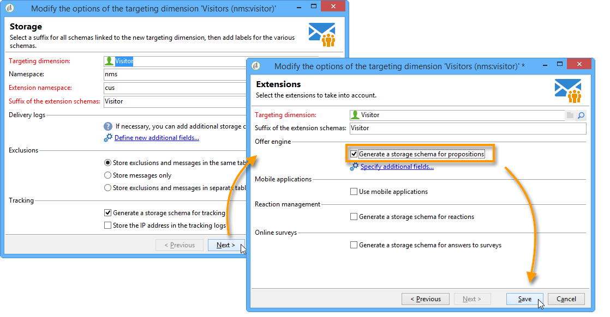

# Live/Design environments{#live-design-environments}

## Operating principle {#operating-principle}

Interaction operates with two types of offer environments:

* **Design** offer environments that include offers that are being edited and can be altered. These offers haven't been through the approval cycle and aren't delivered to contacts.
* **Live** offer environments that include approved offers as they are presented to contacts. The offers in this environment are read-only.

Each **Design** environment is linked to a **Live** environment. When an offer is complete, its content and eligibility rules are subjected to an approval cycle. Once this cycle is complete, the concerned offer is automatically deployed to the **Live** environment. From this moment on, it will be available for delivery.

By default, Interaction comes with a **Design** environment and a **Live** environment linked to it. Both environments are pre-configured to target the out-of-the-box recipient table.

>[!NOTE]
>
>To target another table (visitor table for anonymous offers or a specific recipient table), you need to use the target mapping wizard to create the environments. For more on this, refer to [Creating an offer environment](../../interaction/using/live-design-environments.md#creating-an-offer-environment).

Offer managers and the delivery managers have access to different views of the environment. Delivery managers can only view the **Live** offer environment and use offers to deliver them. Offer managers can view and alter the **Design** environment and view the **Live** environment. For more on this, refer to [Operator profiles](../../interaction/using/operator-profiles.md).

## Creating an offer environment {#creating-an-offer-environment}

By default, Interaction comes with a pre-configured environment to target the recipient table (identified offers). If you wish to target another table (visitor table for anonymous offers or a specific recipient table), you need to apply the following configurations:

1. Place your cursor on the **Administration** > **Campaign management** > **Delivery mappings** node. Right-click the delivery mapping you want to use (**Visitors** if you want to use anonymous offers) and select **Actions** > **Modify the options of the targeting dimension**.

   

1. Click **Next** to proceed to the next screen in the wizard, check the **Generate a storage schema for propositions** box and click **Save**.

   

   >[!NOTE]
   >
   >If the box is already checked, uncheck it then recheck it.

1. Adobe Campaign creates two environments (**Design** and **Live**) with targeting information from the previously enabled target mapping. The environment is preconfigured with the targeting information.

   If you have activated **Visitor** mapping, the **Environment dedicated to incoming anonymous interactions** box is automatically checked in the environment's **General** tab.

   This option lets you activate anonymous interaction specific functions, particularly when configuring environment offer spaces. You can also configure options that allow you to switch from an "identified" environment to an "anonymous" environment.

   For example, you can link a recipient environment offer space (identified contact) with an offer space that matches a visitor environment (unidentified contact). In this way, different offers will be made available to the contact depending on whether s/he is identified or not. For more on this, refer to [Creating offer spaces](../../interaction/using/creating-offer-spaces.md).

   

>[!NOTE]
>
>For more information on anonymous interactions on an inbound channel, refer to [Anonymous interactions](../../interaction/using/anonymous-interactions.md).

