# Managing offer presentation{#managing-offer-presentation}

## Presentation rules overview {#presentation-rules-overview}

Interaction lets you control the flow of offer propositions using presentation rules. These rules, which are specific to Interaction, are typology rules. They let you exclude offers based on the history of propositions already made to a recipient. They are referenced in the environment

## Creating and referencing an offer presentation rule {#creating-and-referencing-an-offer-presentation-rule}

1. Go to the **[!UICONTROL Administration]** > **[!UICONTROL Campaign management]** > **[!UICONTROL Typology management]** > **[!UICONTROL Typology rules]** node. 
1. Create a typology rule and choose the **[!UICONTROL Offer presentation]** type.

   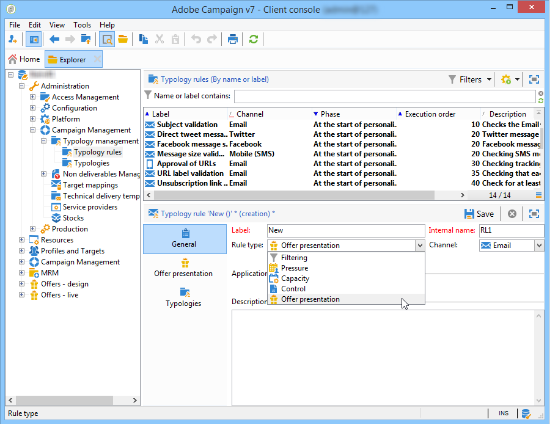

1. Specify the channel to which the rule should apply.

   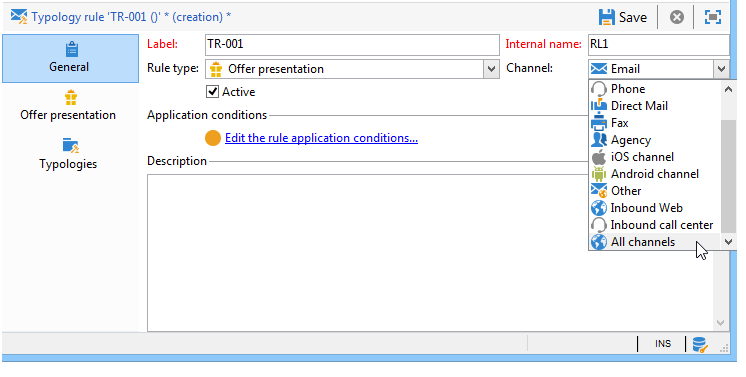

1. Configure the rule's application criteria. For more on this, refer to [Presentation rule settings](#presentation-rule-settings).
1. Go to the **[!UICONTROL Administration]** > **[!UICONTROL Campaign execution]** > **[!UICONTROL Typology management]** > **[!UICONTROL Typologies]** node and create a typology that will group all **[!UICONTROL Offer presentation]** type rules.

   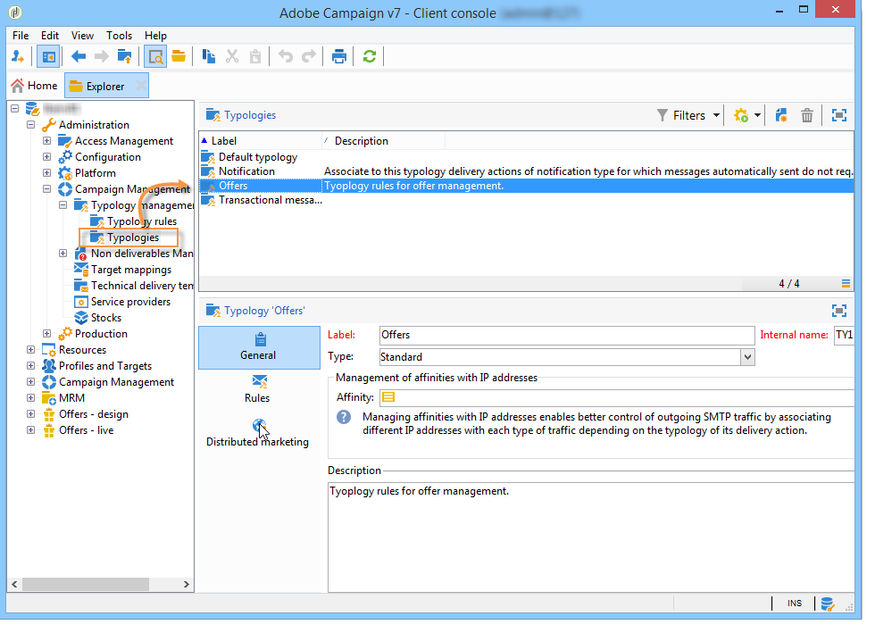

1. Once the typology has been created, place your cursor on the typology rules and group them in the typology you have just created.

   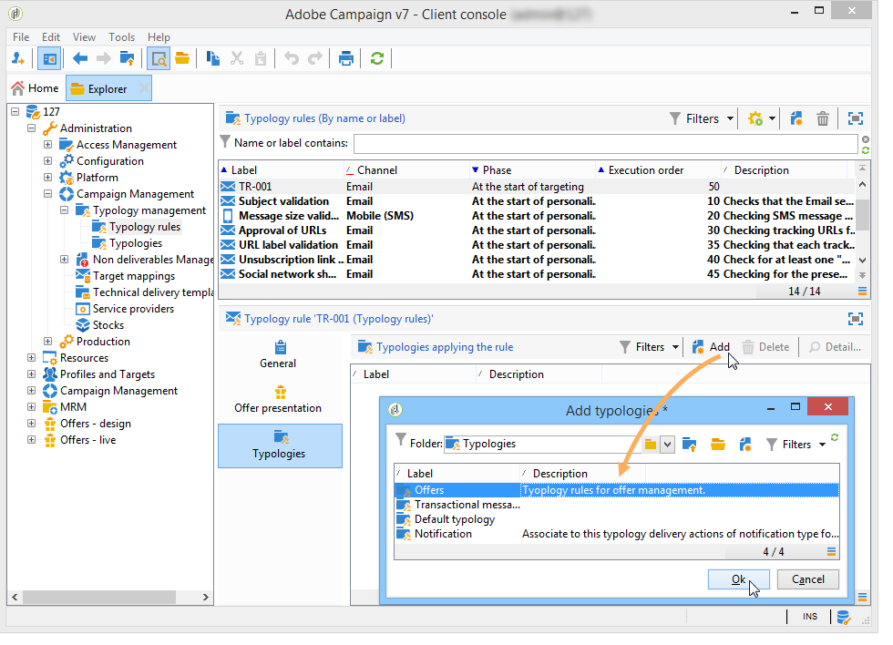

1. In your offer environment, reference the typology using the drop-down list.

   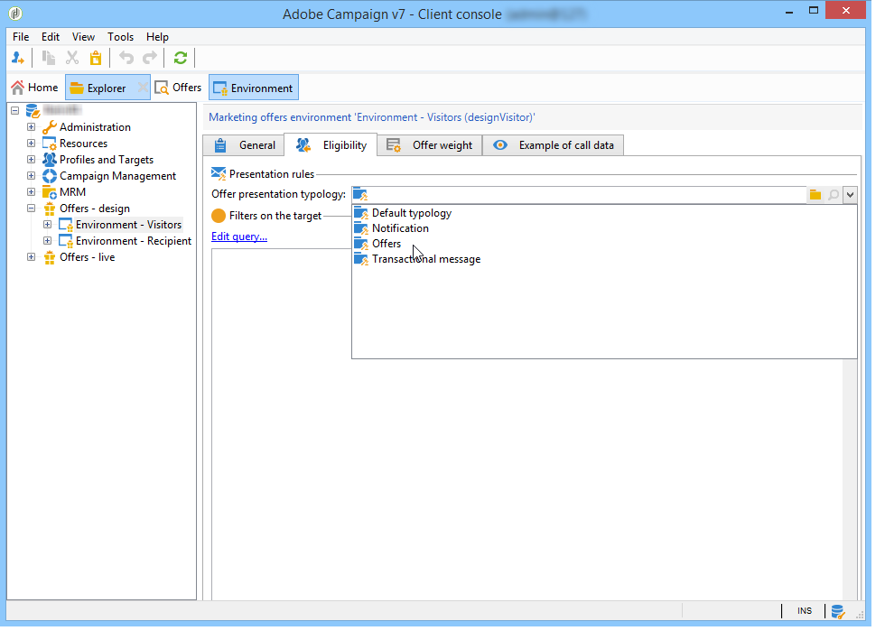

## Presentation rule settings {#presentation-rule-settings}

### Application criteria {#application-criteria-}

The application criteria available in the **[!UICONTROL General]** tab lets you specify the offers which the presentation rule will apply to. To do this, you need to create a query and choose the concerned offers, as described below.

1. In your typology rule, click the **[!UICONTROL Edit the rule application conditions...]** link to create your query.

   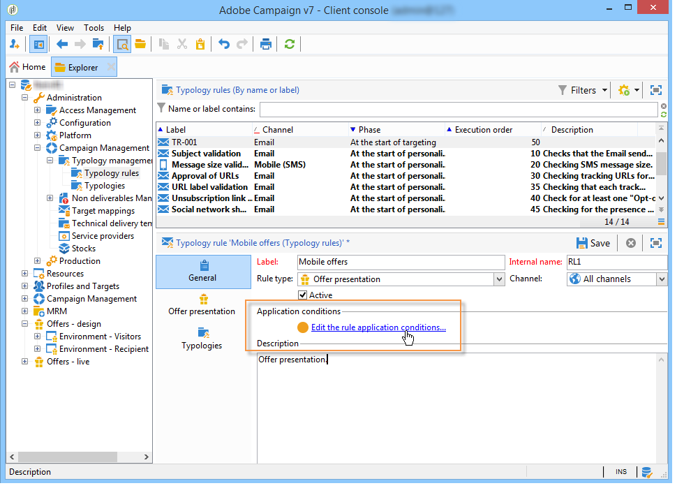

1. In the query window, you can apply a filter on the offers to which you wish to apply a typology rule.

   For example, you can select an offer category.

   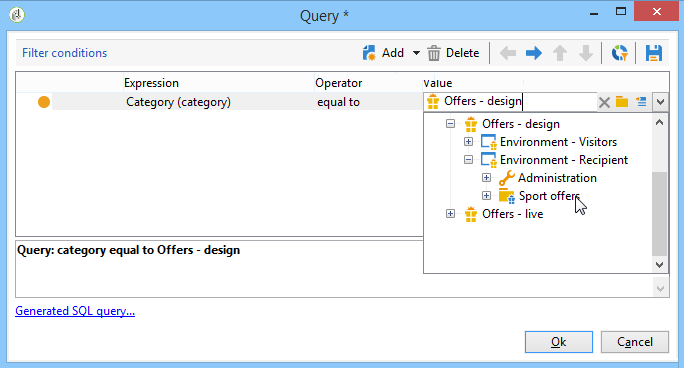

### Offer dimensions {#offer-dimensions}

In the **[!UICONTROL Offer presentation]** tab, you must specify the same dimensions for the presentation rule as those configured in the environment.

The **[!UICONTROL Targeting dimension]** coincides with the table of recipients (by default: nms:recipients) who will receive the offer propositions. The **[!UICONTROL Storage dimension]** coincides with the table which contains the proposition history linked to the targeting dimension (by default:nms:propositionRcp).

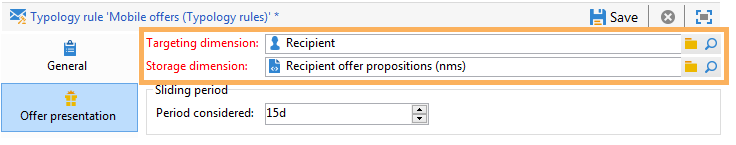

>[!NOTE]
>
>You can also use non-standard tables. If you want to use a specific targeting dimension, you will need to create tables as well as a dedicated environment using the target mapping. For more on this, refer to [Creating an offer environment](../../interaction/using/live-design-environments.md#creating-an-offer-environment).

### Period {#period}

This is a sliding period which starts on the offer presentation date. It sets a time-limit for the validity of offer propositions. The rule does not apply to offer propositions made beyond this period.

The period starts **n** days before the proposition date and ends **n** days afterwards, where **n** corresponds to the number entered in the **[!UICONTROL Period considered]** field:

* For inbound spaces, the proposition date is the offer presentation date. 
* For outbound spaces, the proposition date is the delivery contact date (for example the delivery date entered in a targeting workflow).

Use the arrows to change the number of days or directly enter a period ("2d 6h", for instance).

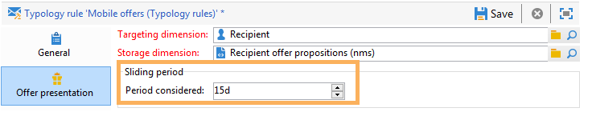

### Number of propositions {#number-of-propositions}

It is possible to set the highest number of propositions that can be made before the concerned offer(s) is/are excluded.

Use the arrows to change the number of offer propositions.

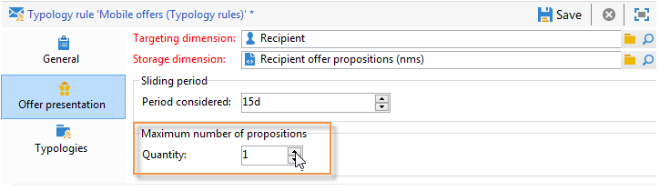

## Defining propositions and recipients {#defining-propositions-and-recipients}

The **[!UICONTROL Propositions to count]** section lets you specify both the recipients and the propositions which will lead to the exclusion of the offers defined in the **[!UICONTROL General]** tab if they appear a certain number of times in the propositions history.

### Filtering propositions {#filtering-propositions}

You can select filtering criteria to exclude propositions based on the channel, the offers concerned or the status of previously assigned propositions. 

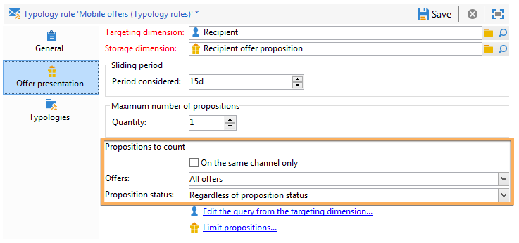

These criteria represent the most frequent applications of presentation rules. To use other criteria, you can create a query using the **[!UICONTROL Limit propositions...]** link. For more on this, refer to the [Creating a query on propositions](#creating-a-query-on-propositions) section.

* **Filter on the channel**

  **[!UICONTROL On the same channel only]** : lets you exclude offer propositions on the channel specified in the **[!UICONTROL General]** tab.

  For instance, the channel specified for the rule in the **[!UICONTROL General]** tab is email. If the offers that the rule applies to were so far only offered on the web channel, the Interaction engine can present the offers in an email delivery. However, once the offers have been presented by email, the interaction engine will choose a different channel to present the offers.

  >[!NOTE]
  >
  >We are talking about the channel and not the space. If the rule must exclude an offer on the web channel, the offer destined to be presented on a website in two spaces (in a banner and in the body of the page, for instance), will not be displayed on the site if it has already been presented before.
  >
  >For a workflow involving offer presentation, the rules are only correctly taken into account if they are configured on **[!UICONTROL All channels]**.

* **Filter on the offer**

  This filter lets you restrict the offer propositions to be counted to specific sets of offers.

  **[!UICONTROL All offers]** : default value. No filter is applied to the offers.

  **[!UICONTROL Offer being presented]** : the offer specified in the **[!UICONTROL General]** tab is excluded if it has already been presented.

  **[!UICONTROL Offers from the same category]** : an offer is excluded if an offer from the same category has already been presented.

  **[!UICONTROL The offers which the rule applies to]** : when several offers are defined in the **[!UICONTROL General]** tab, each offer proposition from this set of offers is taken into account and ends in the exclusion of all offers if the proposition threshold is reached.

  For instance, offers 2, 3 and 5 are defined in the **[!UICONTROL General]** tab. The maximum number of propositions is set to 2. If offers 2 and 5 are each presented once, the number of propositions counted will be 2. As a result, offer 3 will never be presented.

* **Filter on the proposition status**

  This filter lets you choose the most frequent statuses for offer propositions to be taken into account in the proposition history.

  **[!UICONTROL Regardless of the proposition status]** : default value. No filter is applied to the proposition status.

  **[!UICONTROL Accepted or rejected propositions]** : lets you exclude previously presented offers which have been accepted or rejected.

  **[!UICONTROL Accepted propositions]** : lets you exclude previously presented offers which have been accepted.

  **[!UICONTROL Rejected propositions]** : lets you exclude previously presented offers which have been rejected.

### Defining recipients {#defining-recipients}

To specify the recipients, click the **[!UICONTROL Edit the query from the targeting dimension...]** link and select the recipients concerned by the rule.

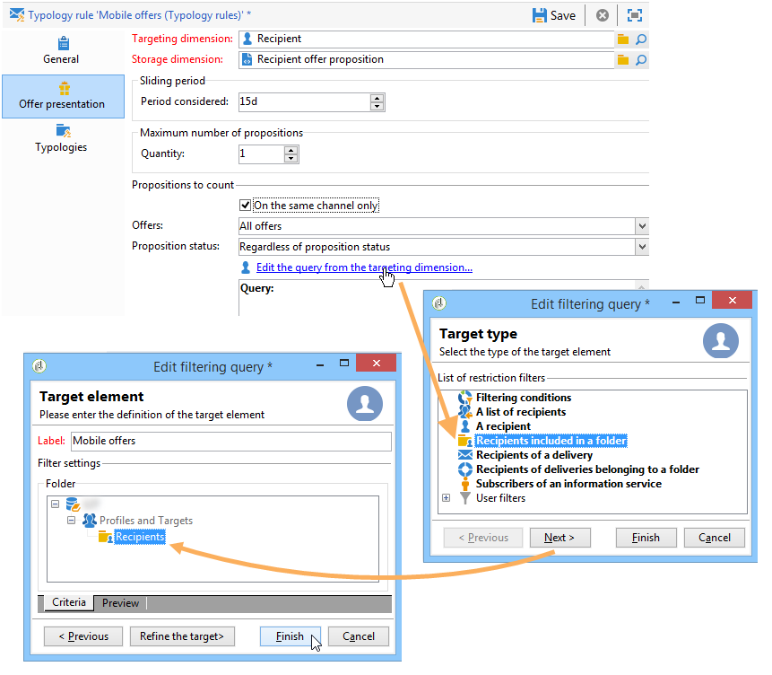

### Creating a query on propositions {#creating-a-query-on-propositions}

To specify the propositions to be counted via a query, click the **[!UICONTROL Limit propositions...]** link and specify the criteria to be taken into account.

In the following example, the propositions to be counted after two presentations are the ones in the **Special offers** category, for the **Call center** space, with a weight below **20**.

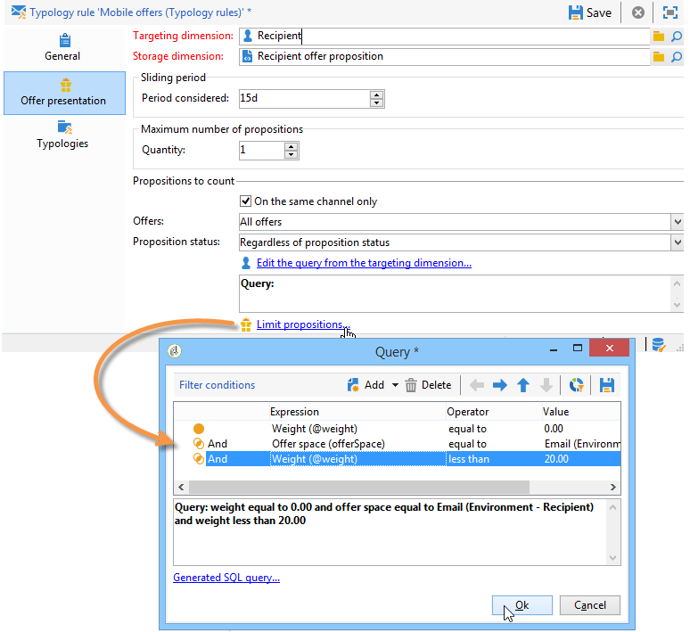
