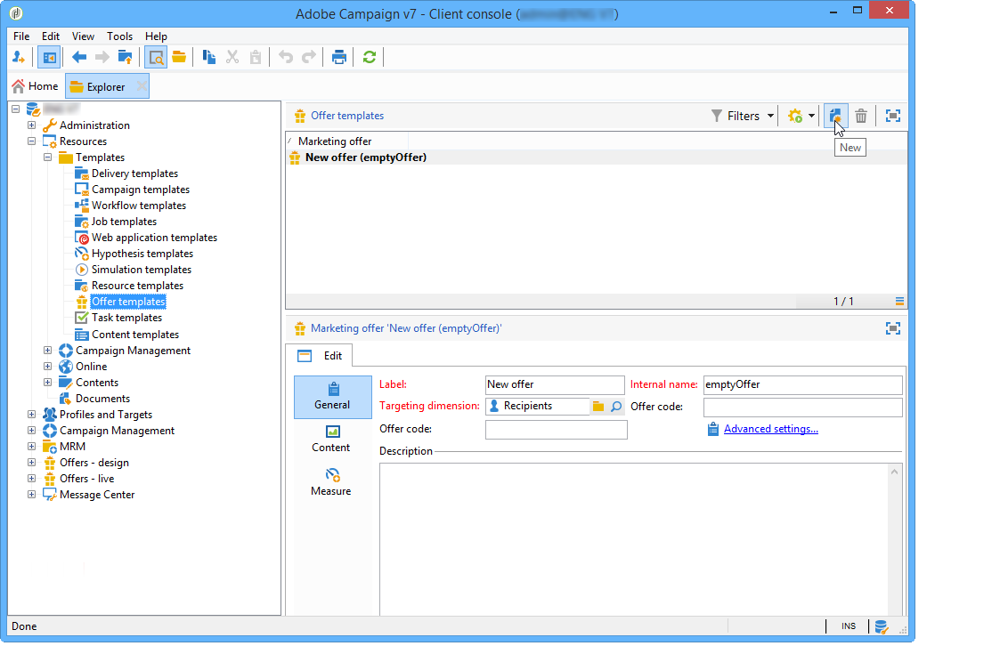
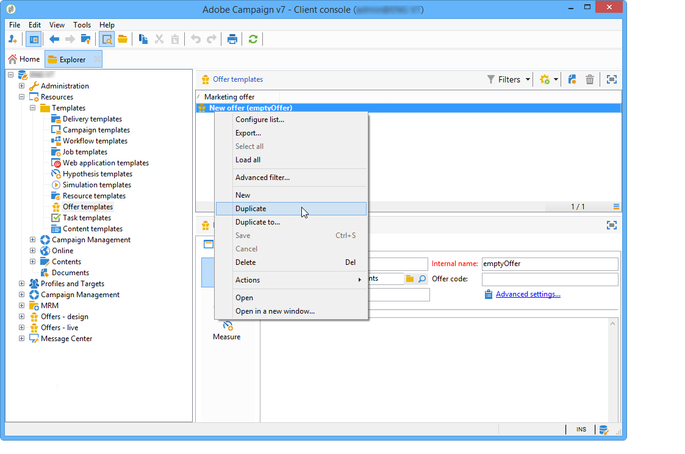
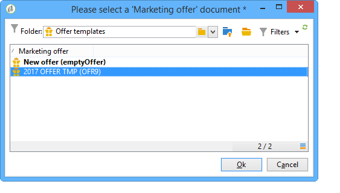

# Managing offer templates{#managing-offer-templates}

Offer templates are delivered out-of-box in Adobe Campaign. You may use them after creating your offers, duplicating them or adapting their configuration to your needs. You can also create your own templates. Template offers are stored in the folder **Resources** > **Templates** > **Offer templates**.

## Creating an offer template {#creating-an-offer-template}

To create a template offer, follow these steps:

1. Go to **Resources** > **Templates** > **Offer templates**.
1. Click the **New** icon.

   

1. Configure your template by applying the same process as for a normal offer, then save it by clicking **Save**.

## Duplicate an existing template {#duplicate-an-existing-template}

To duplicate an offer template (out-of-the-box or not), take the following steps:

1. Go to **Resources > Templates > Offer templates**.
1. Using the mouse, right click on the template that you wish to duplicate and select **Duplicate** from the drop-down menu.

   

1. If necessary, configure the settings you wish to see appear in the template, then save the template by clicking **Save**.

This template will now be offered when creating an offer.

