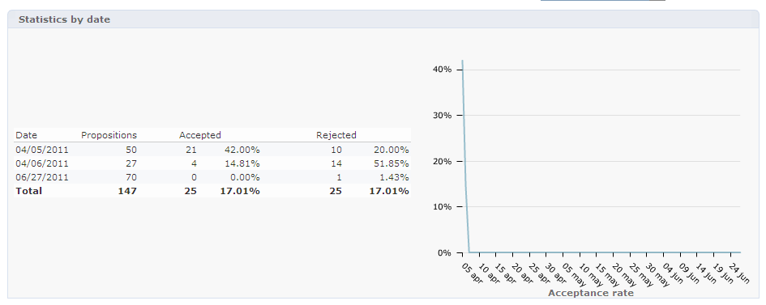
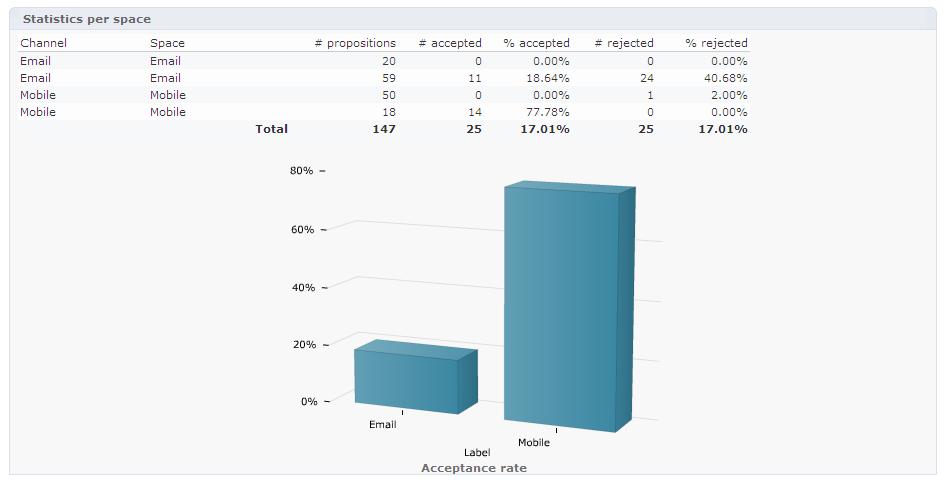
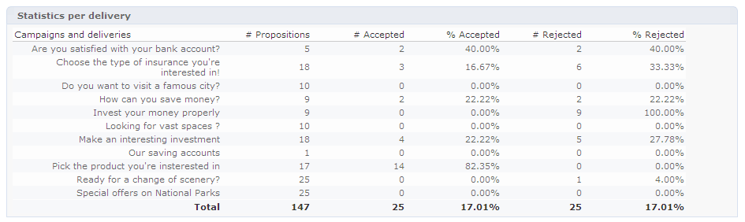
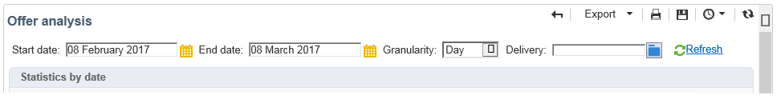

# Offer analysis report{#offer-analysis-report}

The **[!UICONTROL Offer analysis]** report provides you with an overview of the number of accepted or rejected propositions.

>[!NOTE]
>
>This functionality is only visible online and only to the delivery manager.

Statistics are sorted based on three criteria:

* By date:

  

* By space:

  

* By deliveries:

  

Data can be filtered based on the various criteria available in the upper section of the report. Once you have selected the desired criteria, click the **[!UICONTROL Refresh]** link to apply them to the report. 

