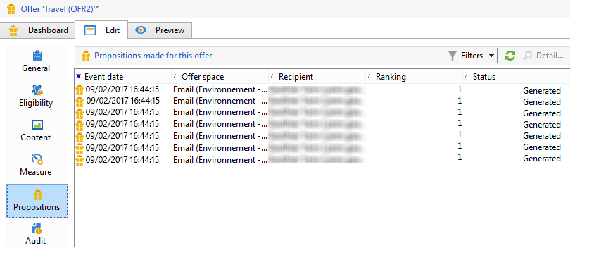
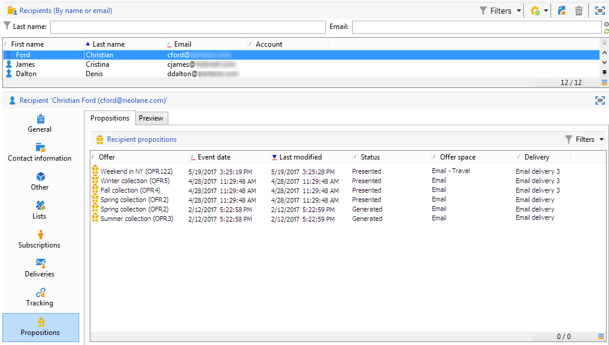
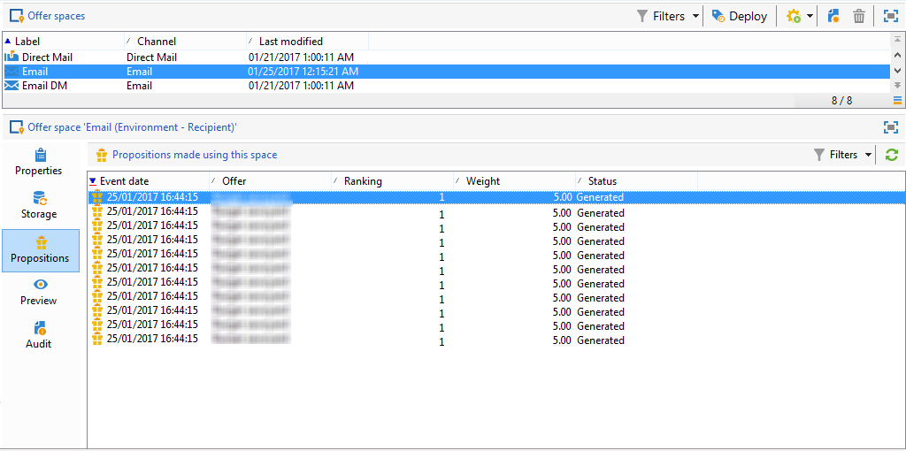

# Offer proposition history{#offer-proposition-history}

Once your offer propositions have been made, you can view the presentation history.

>[!NOTE]
>
>This functionality is only visible online and only to the delivery manager.

* At the offer level, in the **Edit** tab, click **Propositions**.

  

* From a recipient's profile, click the **Propositions** tab.

  

* At the offer space level, click the **Propositions** tab.

  

