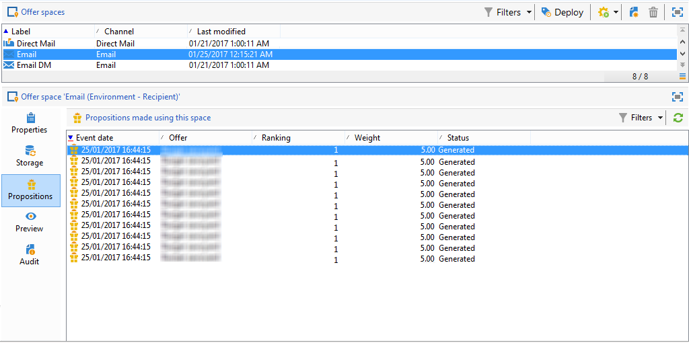

# Offer proposition history{#offer-proposition-history}

Once your offer propositions have been made, you can view the presentation history.

>[!NOTE]
>
>This functionality is only visible online and only to the delivery manager.

* At the offer level, in the **[!UICONTROL Edit]** tab, click **[!UICONTROL Propositions]**.

  

* From a recipient's profile, click the **[!UICONTROL Propositions]** tab.

  

* At the offer space level, click the **[!UICONTROL Propositions]** tab.

  
