# Offers on an inbound channel{#offers-on-an-inbound-channel}


## Presenting an offer to an anonymous visitor {#presenting-an-offer-to-an-anonymous-visitor}

The Neobank site wants to display an offer on their website aimed at unidentified visitors who browse the page.

To set up this interaction, we're going to:

1. [Create an anonymous environment](#creating-an-anonymous-environment)
1. [Create anonymous offer spaces](#creating-anonymous-offer-spaces)
1. [Create an offer category and a theme](#creating-an-offer-category-and-a-theme)
1. [Create anonymous offers.](#creating-anonymous-offers)
1. [Configure the web offer spaces on the website](#configure-the-web-offer-space-on-the-website)

### Creating an anonymous environment {#creating-an-anonymous-environment}

Follow the procedure detailed in [Creating an offer environment](../../interaction/using/live-design-environments.md#creating-an-offer-environment) to create your anonymous environment based on the **Visitors**' dimensions.

You will get a tree structure containing your new environment:

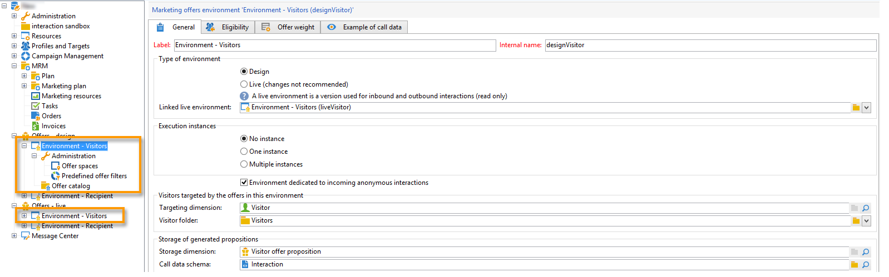

### Creating anonymous offer spaces {#creating-anonymous-offer-spaces}

1. In your anonymous environment (**Visitors**) go to the **[!UICONTROL Administration]** > **[!UICONTROL Spaces]** node.
1. Click **[!UICONTROL New]** to create call channels.

   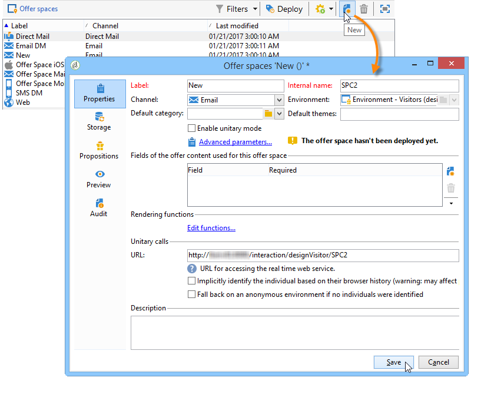

   >[!NOTE]
   >
   >The space is automatically linked to the anonymous environment.

1. Change the label and select the **[!UICONTROL Inbound Web]** channel. You also have to check the **[!UICONTROL Enable unitary mode]** box.

   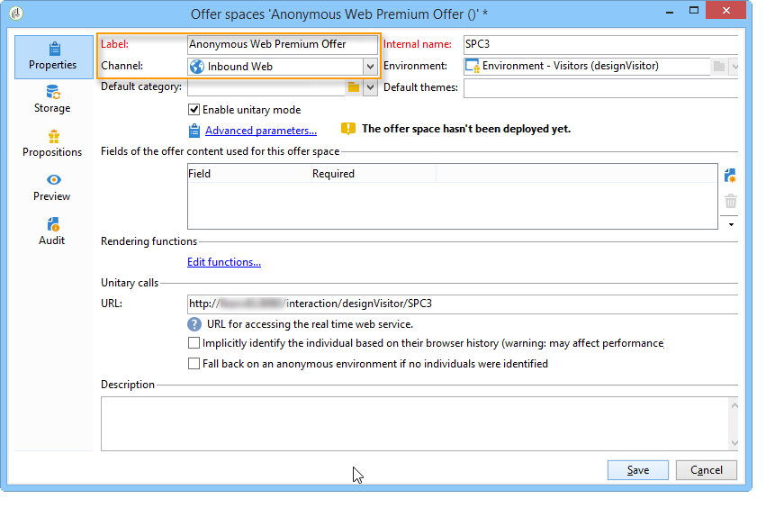

1. Select the offer content fields used for the space and specify them as required by checking the relevant box.

   In this way, any offers missing one of the following elements will not be eligible for this space:

    * Title
    * HTML content
    * Image URL
    * Destination URL

   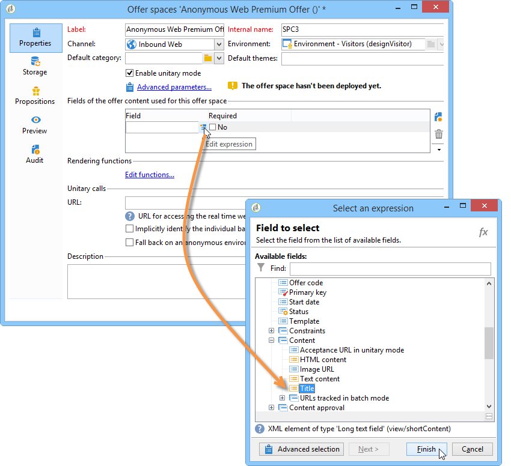

1. Edit the HTML rendering function, for example as follows:

   ``` 
   function (imageUrl, targetUrl, shortContent, htmlSource){
         var html = "<p><b>" + shortContent + "</b></p>";
         html += "<p>" + htmlSource + "</p>";
         html += "<a _urlType='11' href='" + targetUrl + "'></a>";
         return html;
       }   
   ```

   >[!IMPORTANT]
   >
   >The rendering function must name the fields used for the space in the order in which they were previously selected so that the offers display correctly.

   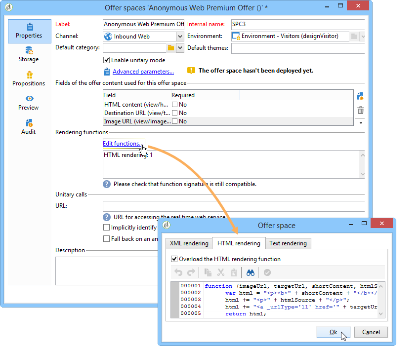

1. Save the offer space.

### Creating an offer category and a theme {#creating-an-offer-category-and-a-theme}

1. Go to the **[!UICONTROL Offer catalog]** node within the environment you have just created.
1. Right-click the **[!UICONTROL Offer catalog]** node and select **[!UICONTROL Create a new 'Offer category' folder]**.

   Name the new category, **Financial products** for example.

1. Go to the category's **[!UICONTROL Eligibility]** tab and enter **financing** as a theme, then save changes.

   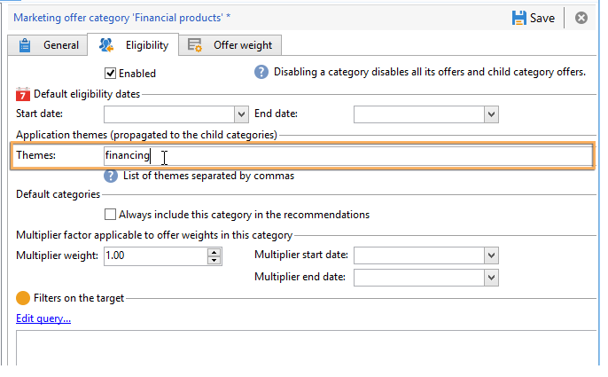

### Creating anonymous offers {#creating-anonymous-offers}

1. Go to the category you've just created.
1. Click **[!UICONTROL New]**.

   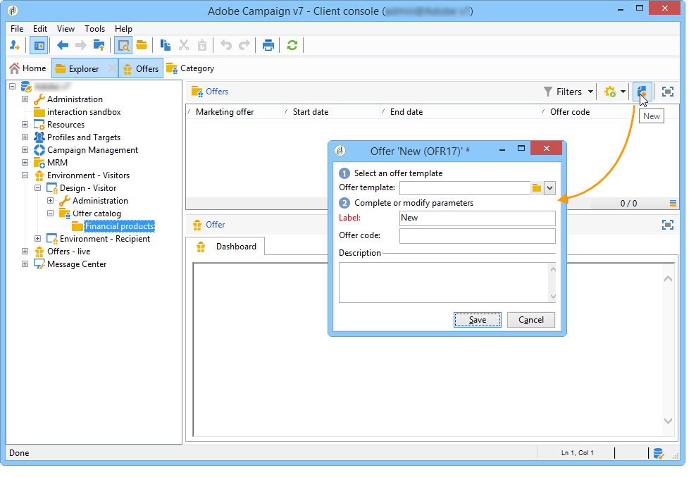

1. Select the out-of-the-box anonymous offer template or a previously created template.

   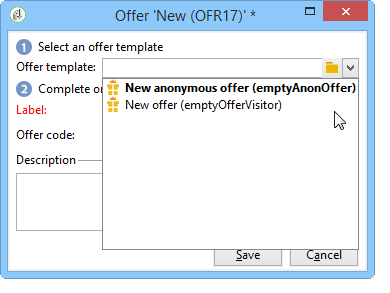

1. Change the label and save your offer.

   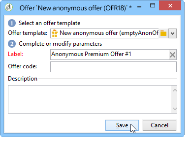

1. Go to the **[!UICONTROL Eligibility]** tab and specify the weight of the offers according to its application contexts.

   In this example, the offer is configured to be displayed on the home page of the site as a priority until the end of the year.

   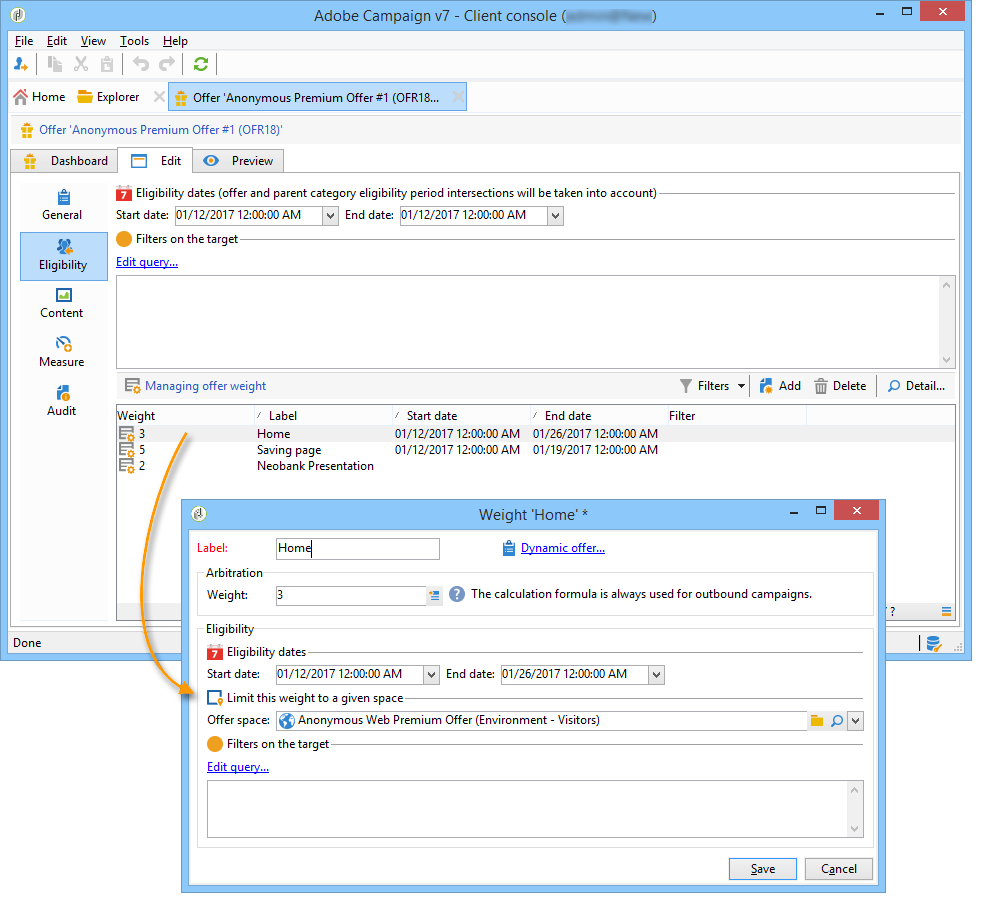

1. Go to the **[!UICONTROL Content]** tab and define the content of the offer.

   >[!NOTE]
   >
   >You can select **[!UICONTROL Content definitions]** to display the list of elements required for the web space.

   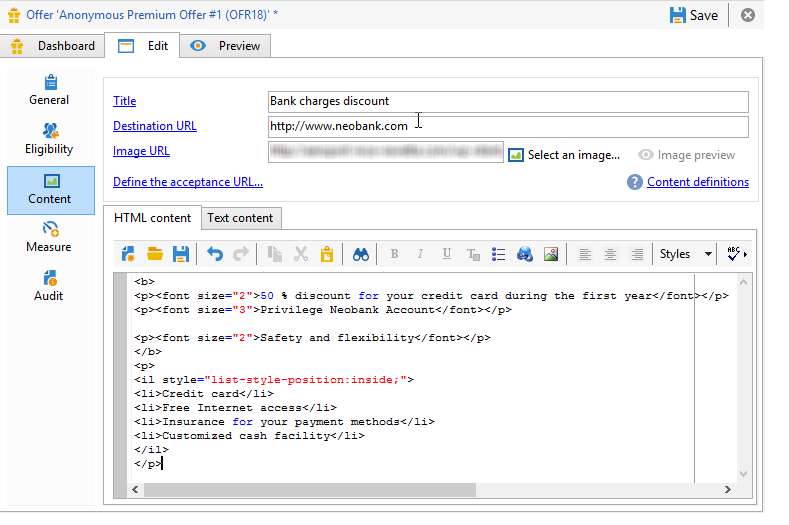

1. Create a second offer.

   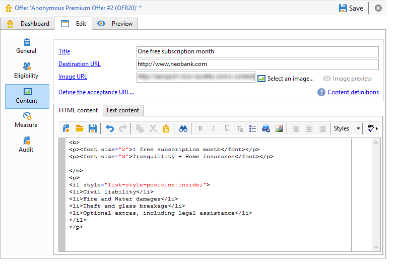

1. Go to the **[!UICONTROL Eligibility]** tab and apply the same weight as for the first offer.
1. Run the approval cycle for each offer in order to make them, as well as their approved offer spaces, available in the online environment.

### Configure the web offer space on the website {#configure-the-web-offer-space-on-the-website}

To make the offers you have just configured visible on the website, insert a JavaScript code into the HTML page of your site to call up the Interaction engine (for more on this, refer to [About inbound channels](../../interaction/using/about-inbound-channels.md)).

1. Go to the HTML page and insert an @id attribute with a value matching the internal name of the anonymous offer space created previously (refer to [Creating anonymous offer spaces](#creating-anonymous-offer-spaces)), preceded by **i_**.

   

1. Insert the call URL.

   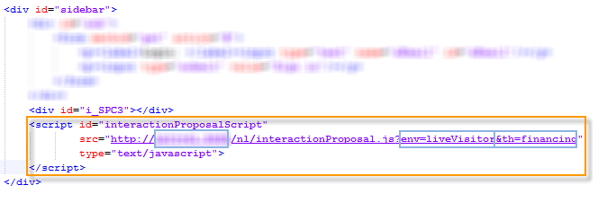

   The blue URL boxes above correspond to the instance name, the internal name of the environment (refer to [Creating an anonymous environment](#creating-an-anonymous-environment)) and the theme linked to the category ([Creating an offer category and a theme](#creating-an-offer-category-and-a-theme)). The latter is optional.

When a visitor accesses the website's home page, the offers with the **financing** theme are displayed as configured on the HTML page. 

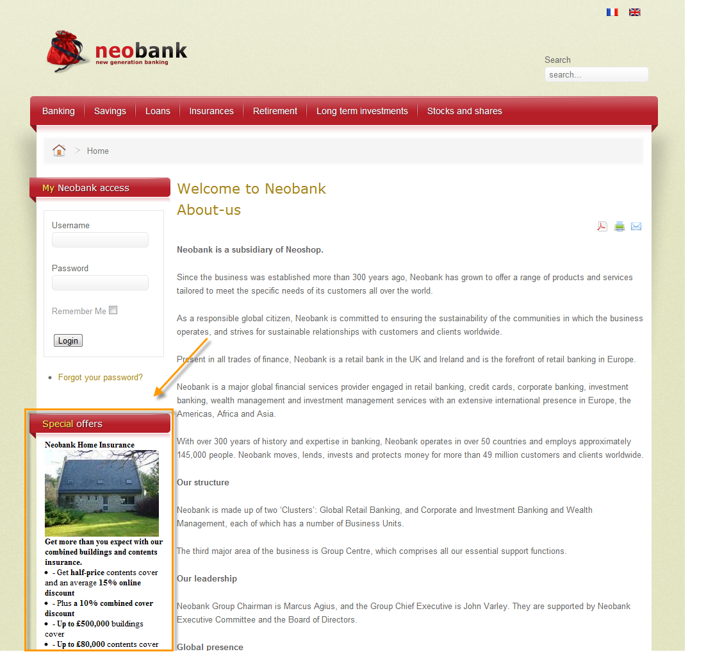

A user who visits the page several times will see either one or the other offers in the category since they have both been assigned the same weight.

## Switching to an anonymous environment in case of unidentified contacts {#switching-to-an-anonymous-environment-in-case-of-unidentified-contacts}

The Neobank company would like to create marketing offers for two different targets. It wants to display generic offers for its anonymous website browsers. If one of these users turns out to be a customer with identifiers provided by Neobank, the company would like them to receive personalized offers as soon as they log on.

This case study is based on the following scenario:

1. A visitor browses the Neobank website without logging on.

   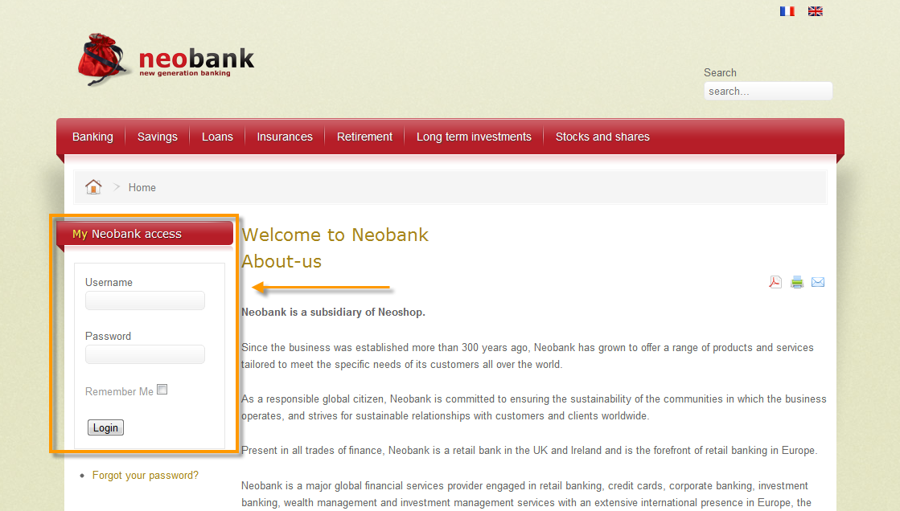

   Three anonymous offers are displayed on the page: two **Best Offer** offers for Neobank products and one offer from a Neobank partner.

   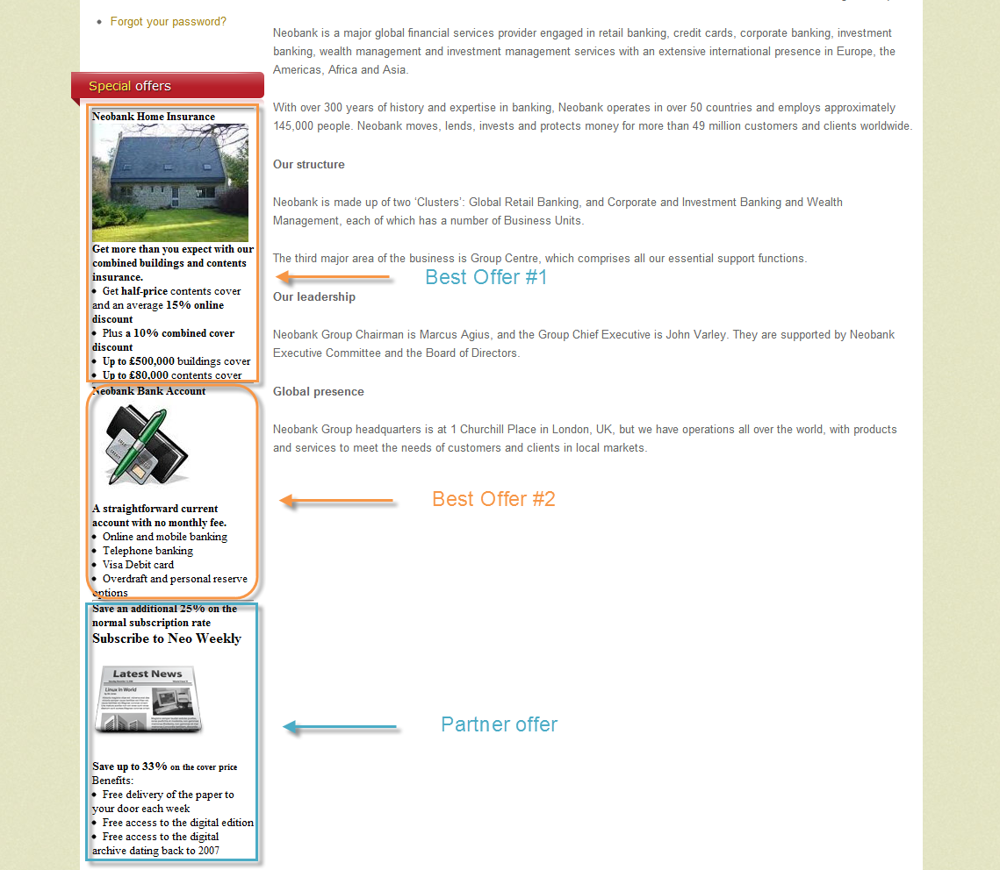

1. The user, a Neobank customer, logs on with his credentials.

   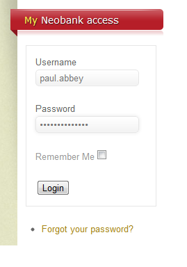

   Three personalized offers are displayed.

   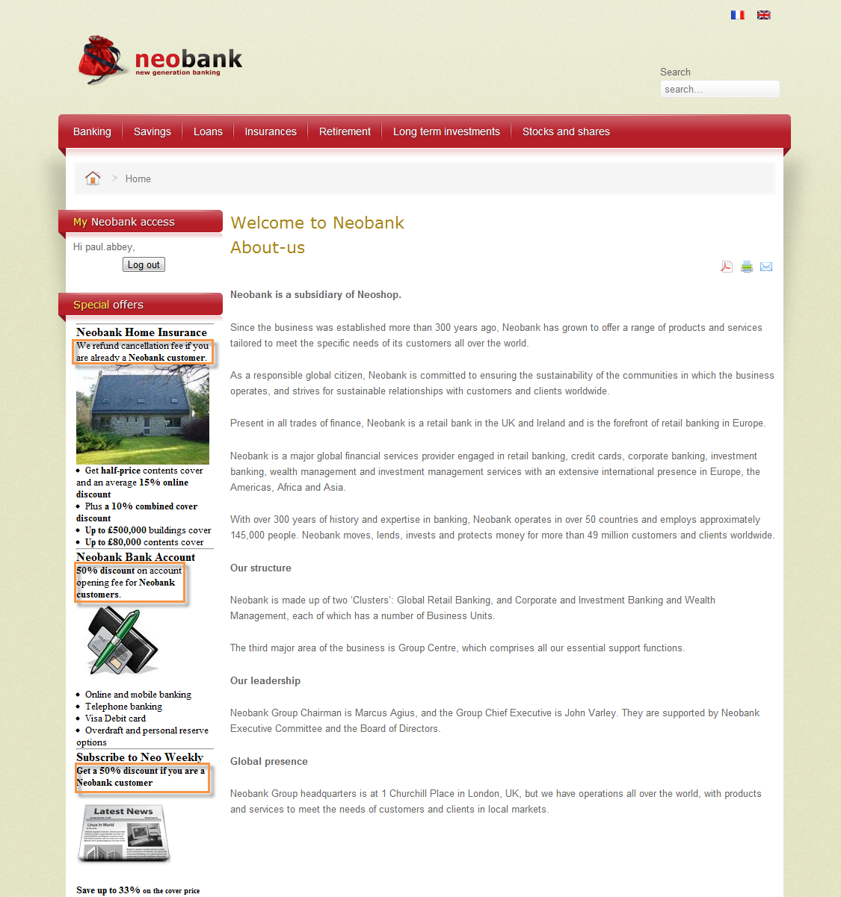

To implement this case study, you need to have two offer environments: one for anonymous interactions and one with offers configured especially for identified contacts. The identified offer environment will be configured to switch to the anonymous offer environment automatically if the contact isn't logged on and therefore isn't identified.

Apply the following steps:

* Create a catalog of offers specific to anonymous inbound interactions using the following steps:

    1. [Creating an environment for anonymous contacts](#creating-an-environment-for-anonymous-contacts)
    1. [Configuring offer spaces for the anonymous environment](#configuring-offer-spaces-for-the-anonymous-environment)
    1. [Creating offer categories in an anonymous environment](#creating-offer-categories-in-an-anonymous-environment)
    1. [Creating offers for anonymous visitors](#creating-offers-for-anonymous-visitors)

* Create a catalog of offers specific to identified inbound interactions using the following steps:

    1. [Configure the offer spaces in the identified environment](#configure-the-offer-spaces-in-the-identified-environment)
    1. [Creating offer categories in an identified environment](#creating-offer-categories-in-an-identified-environment)
    1. [Creating personalized offers](#creating-personalized-offers)

* Configure the call to the offer engine:

    1. [Configuring offer spaces on the web page](#configuring-offer-spaces-on-the-web-page)
    1. [Specifying the advanced settings of the identified offer spaces](#specifying-the-advanced-settings-of-the-identified-offer-spaces)

### Creating an environment for anonymous contacts {#creating-an-environment-for-anonymous-contacts}

1. Create an offer environment for anonymous inbound interactions via the delivery mapping wizard (**Visitor** mapping). For more on this, refer to [Creating an offer environment](../../interaction/using/live-design-environments.md#creating-an-offer-environment).

   

### Configuring offer spaces for the anonymous environment {#configuring-offer-spaces-for-the-anonymous-environment}

The offers which must be presented on the web site belong to two different categories: **Best Offer** and **Partner**. In this example, we are going to create a specific offer space for each category.

To create the offer space to match the **Best Offer** category, apply the following process:

1. In the Adobe Campaign tree, go to the anonymous environment you have just created and add an offer space.

   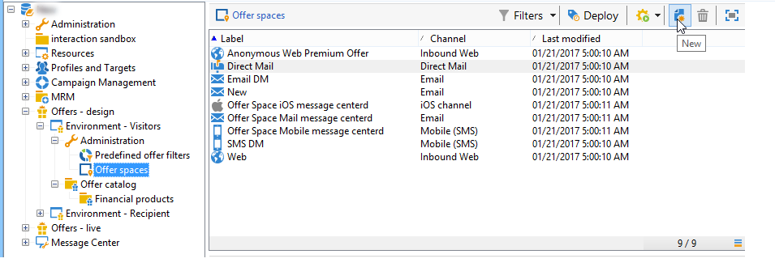

1. Create a new **[!UICONTROL Inbound web]** type space.

   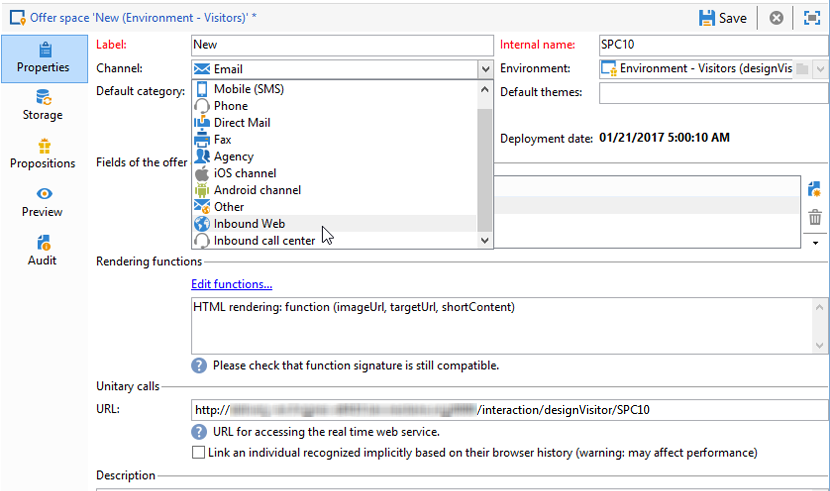

1. Enter a label for it: **Web Best Anonymous Offer** for instance.
1. Add the offer content fields used for this offer space and configure the rendering functions.

   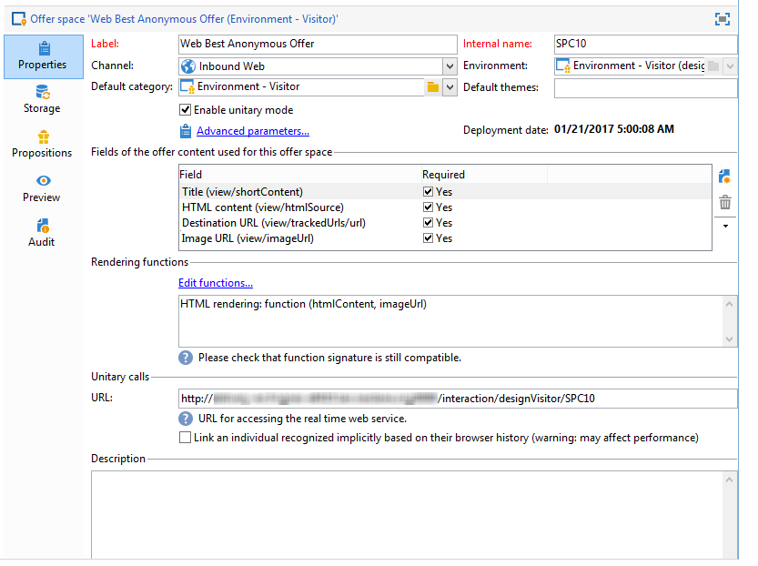

   >[!IMPORTANT]
   >
   >The rendering function must name the fields used for the space in the order in which they were previously selected so that the offers display correctly.

1. Use the same process to create an inbound web channel offer space to match the **Partner** category.

   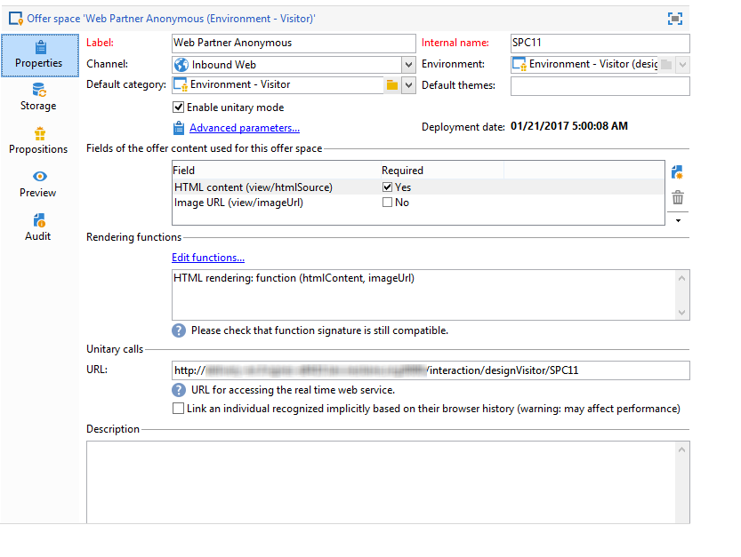

### Creating offer categories in an anonymous environment {#creating-offer-categories-in-an-anonymous-environment}

Start by creating two offer categories: the **Best Offer** category and the **Partner** category. Each category will contain two offers for anonymous contacts.

1. Go to the **[!UICONTROL Offer catalog]** in the anonymous environment that you have just created.
1. Add an **[!UICONTROL Offer category]** folder with **Best Offer** as a label.

   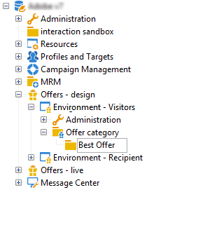

1. Create a second category with **Partner** as a label.

   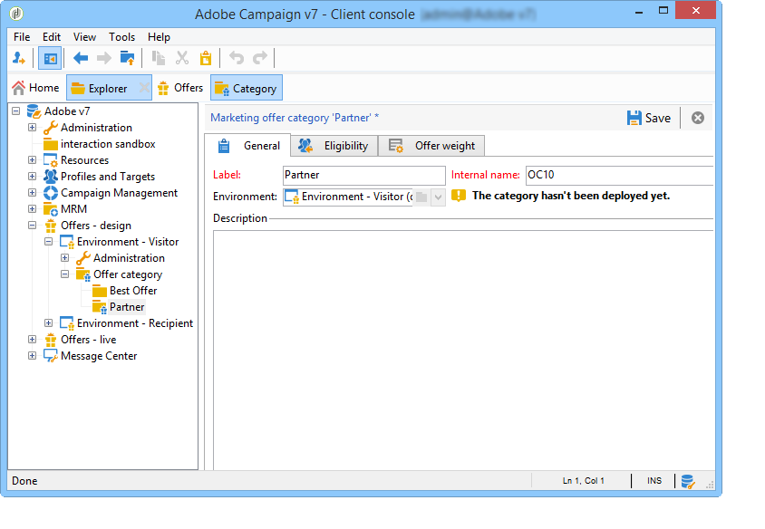

### Creating offers for anonymous visitors {#creating-offers-for-anonymous-visitors}

We are now going to create two offers in each of the categories created above.

1. Go to the **Best Offer** category and create an anonymous offer.

   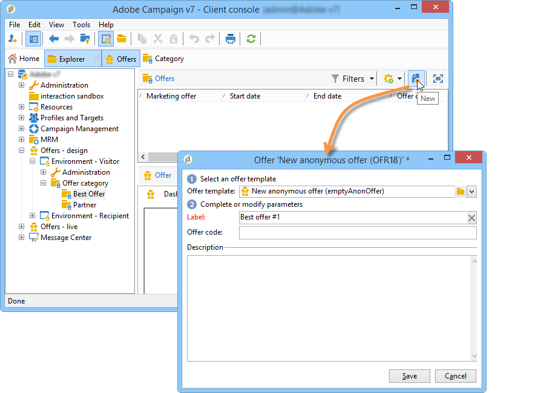

1. Go to the **[!UICONTROL Eligibility]** tab and specify the weight of the offers according to its application contexts.

   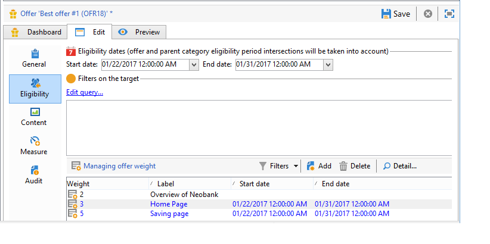

1. Go to the **[!UICONTROL Content]** tab and define the content of the offer. 

   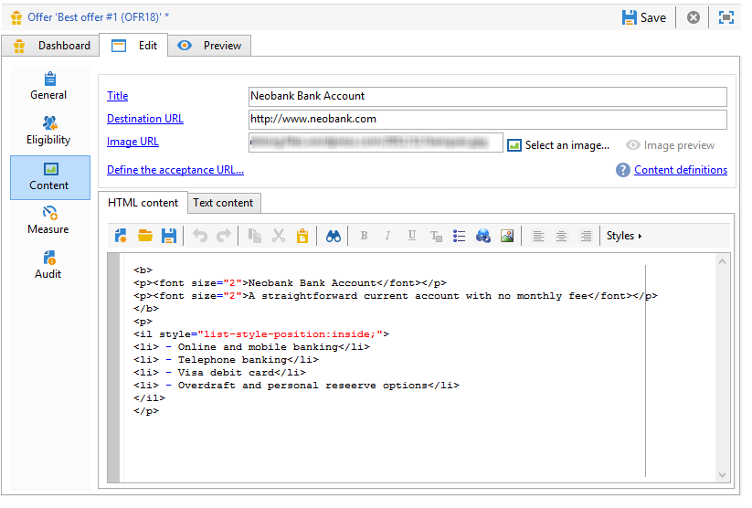

1. Create a second offer in the **Best Offer** category.

   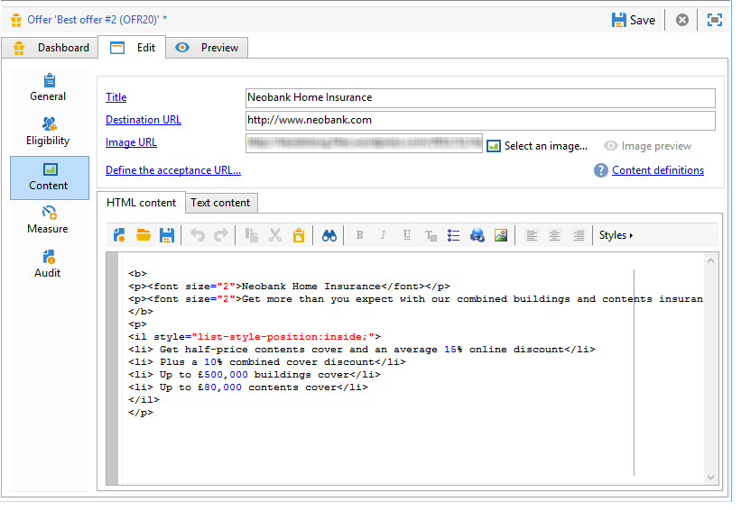

1. Go to the **Partner** category and create an anonymous offer.
1. Go to the **[!UICONTROL Content]** tab and define the content of the offer. 

   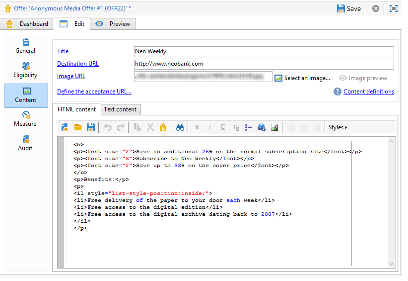

1. Go to the **[!UICONTROL Eligibility]** tab and specify the weight of the offers according to its application contexts.

   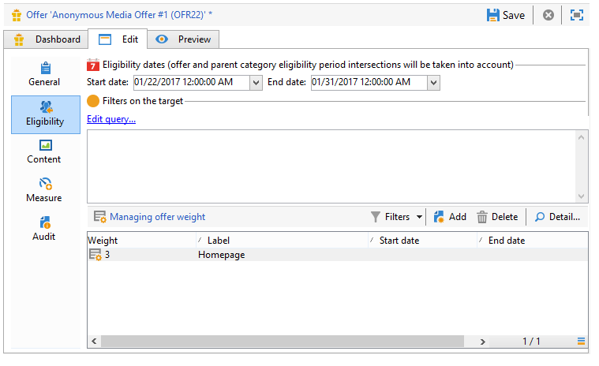

1. Create a second offer for the **Partner** category.

   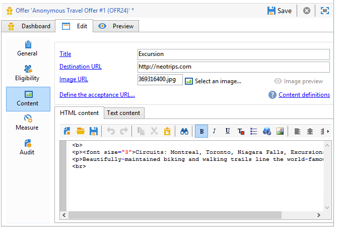

1. Go to the **[!UICONTROL Eligibility]** tab and apply the same weight that you applied to the first offer in this category so that the offers are displayed successively on the website.

   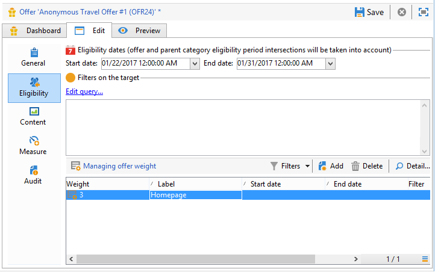

1. Run the approval cycle for each offer to begin making them go live. When approving content, activate the **Partner** or **Best Offer** offer space, according to the offer.

### Configure the offer spaces in the identified environment {#configure-the-offer-spaces-in-the-identified-environment}

The offers which you are going to present on the website are taken from two different categories: **Best Offer** and **Partner**. In this example, we want to create a specific space for each category.

To create the two offer spaces, apply the same procedure as for anonymous offer spaces. Refer to [Configuring offer spaces for the anonymous environment](#configuring-offer-spaces-for-the-anonymous-environment).

1. In the Adobe Campaign tree, go to the environment you have just created and add **Best Offer** and **Partner** offer spaces.
1. Apply the process detailed in [Configuring offer spaces for the anonymous environment](#configuring-offer-spaces-for-the-anonymous-environment).

   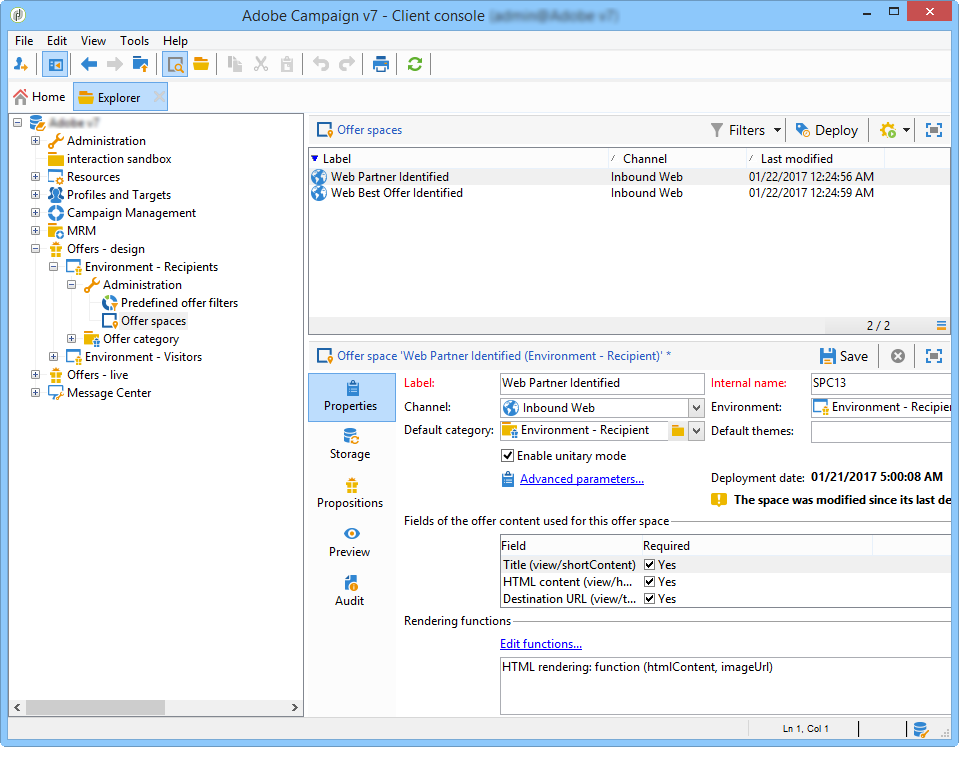

1. Select the **[!UICONTROL Fall back on an anonymous environment if no individuals were identified]** option.

   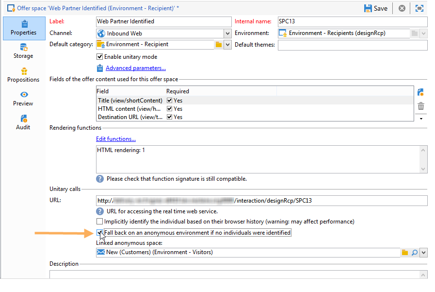

1. Using the drop-down list, select the anonymous web offer space created previously (refer to [Configuring offer spaces for the anonymous environment](#configuring-offer-spaces-for-the-anonymous-environment)).

   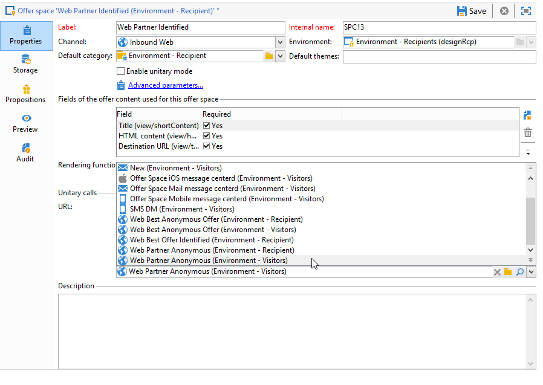

### Specifying the advanced settings of the identified offer spaces {#specifying-the-advanced-settings-of-the-identified-offer-spaces}

In this example, contact identification takes place thanks to the email address in the Adobe Campaign database. To add the recipient email to the space, apply the following process:

1. In the identified environment, go to the offer space folder.
1. Select the **Best Offer** offer space and click **[!UICONTROL Advanced parameters]**.

   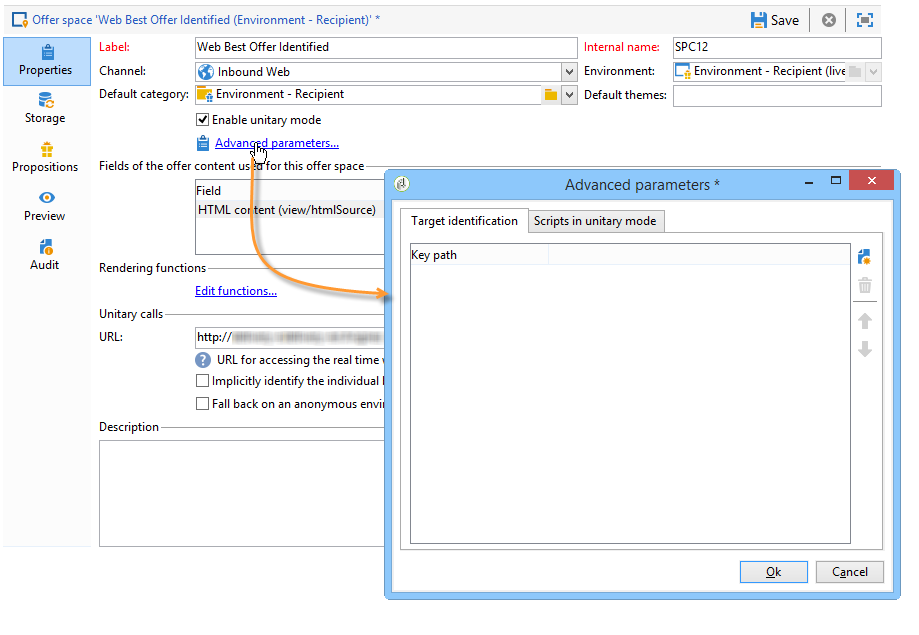

1. In the **[!UICONTROL Target identification]** tab, click **[!UICONTROL Add]**.

   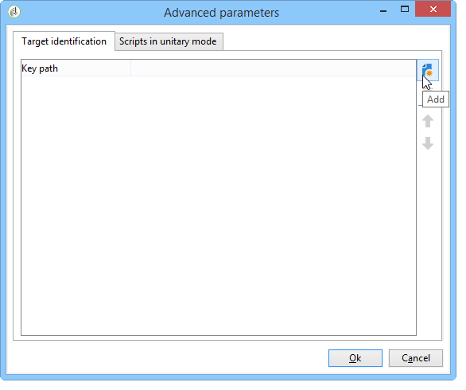

1. Click **[!UICONTROL Edit expression]**, go to the recipients table and select the **[!UICONTROL Email]** field.

   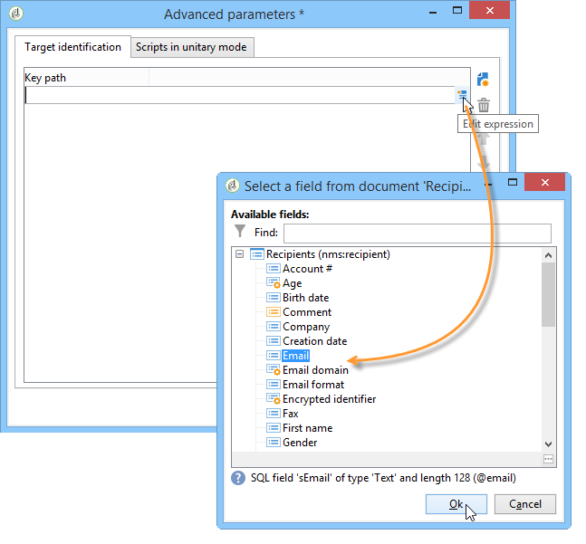

1. Click **[!UICONTROL OK]** to close the **[!UICONTROL Advanced parameters]** window and finish configuring the **Best Offer** offer space.
1. Apply the same process for the **Partner** offer space.

   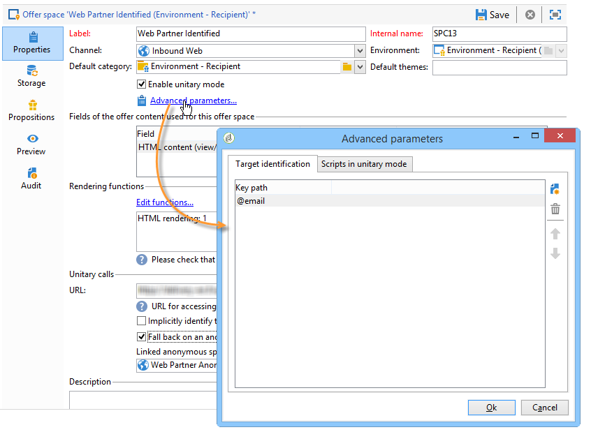

### Creating offer categories in an identified environment {#creating-offer-categories-in-an-identified-environment}

We are going to create two separate categories: the **Best Offer** category and the **Partner** category, each with two personalized offers.

1. Go to the **[!UICONTROL Offer catalogs]** node in the identified environment.
1. As in the anonymous environment, add two **[!UICONTROL Offer category]** folders with **Best Offer** and **Partner** as a labels.

   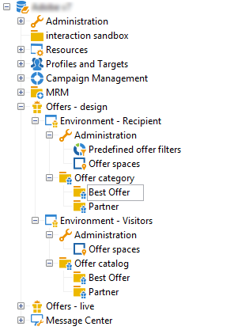

### Creating personalized offers {#creating-personalized-offers}

We want to create two personalized offers for each category, i.e. four offers.

1. Go to the **Best Offer** category and create a first personalized offer.

   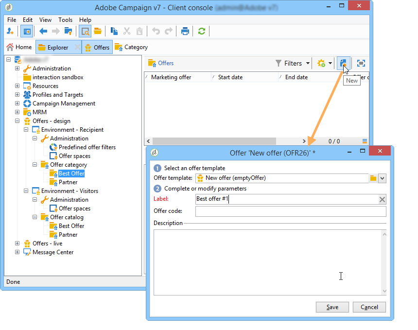

1. Go to the **[!UICONTROL Eligibility]** tab and specify the weight of the offers according to its application contexts.

   

1. Go to the **[!UICONTROL Content]** tab and define the content of the offer. 

   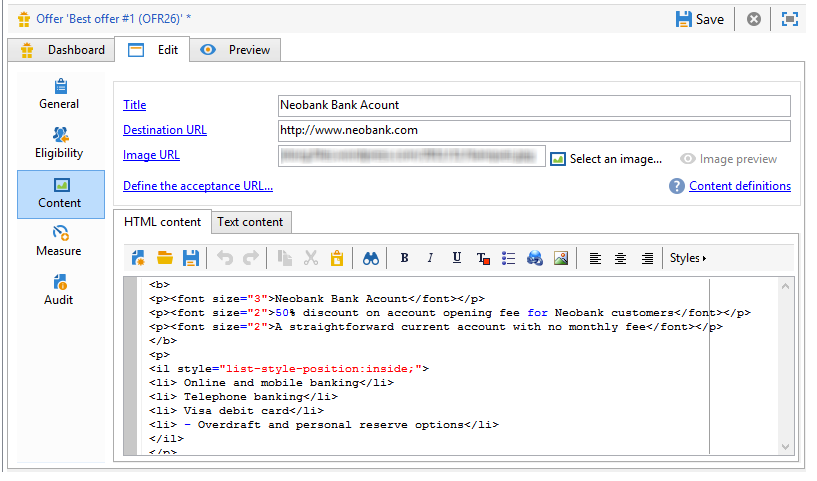

1. Create a second offer in the **Best Offer** category.

   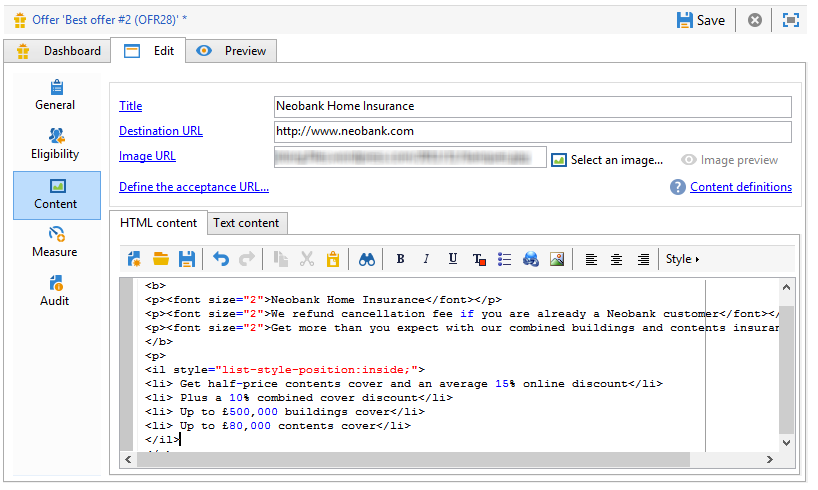

1. Go to the **Partner** category and create a personalized offer.

   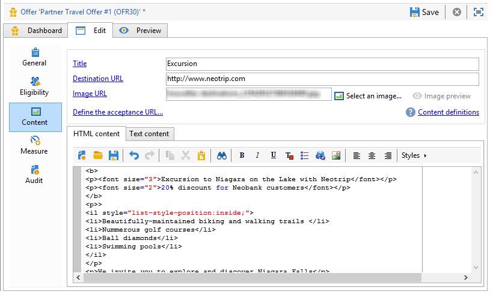

1. Go to the **[!UICONTROL Eligibility]** tab and specify the weight of the offers according to its application contexts.

   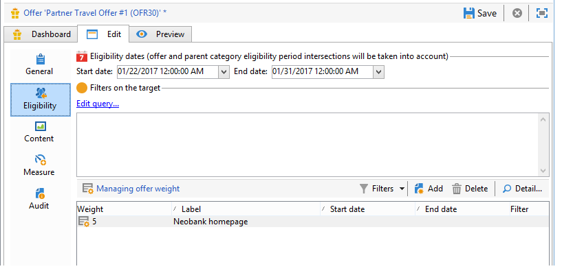

1. Create a second offer for the **Partner** category.

   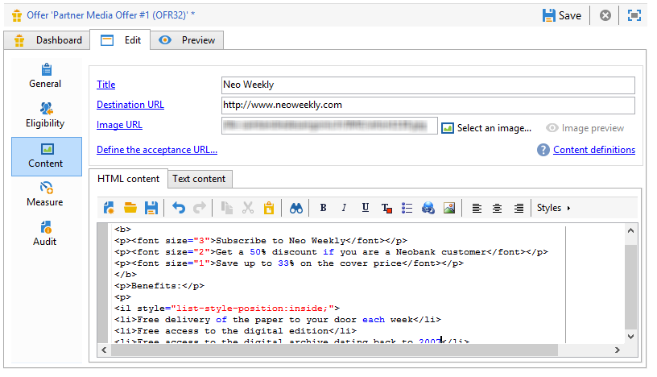

1. Go to the **[!UICONTROL Eligibility]** tab and apply the same weight that you applied to the first offer in this category so that the offers are displayed successively on the website.
1. Run the approval cycle for each offer to begin updating them. During content approval, activate the **Partner** or **Best Offer** offer spaces.

### Configuring offer spaces on the web page {#configuring-offer-spaces-on-the-web-page}

The website of the Neobank company has three spaces for offers: two for bank related offers from the **Best Offer** category, and one for offers from the **Partner** category.

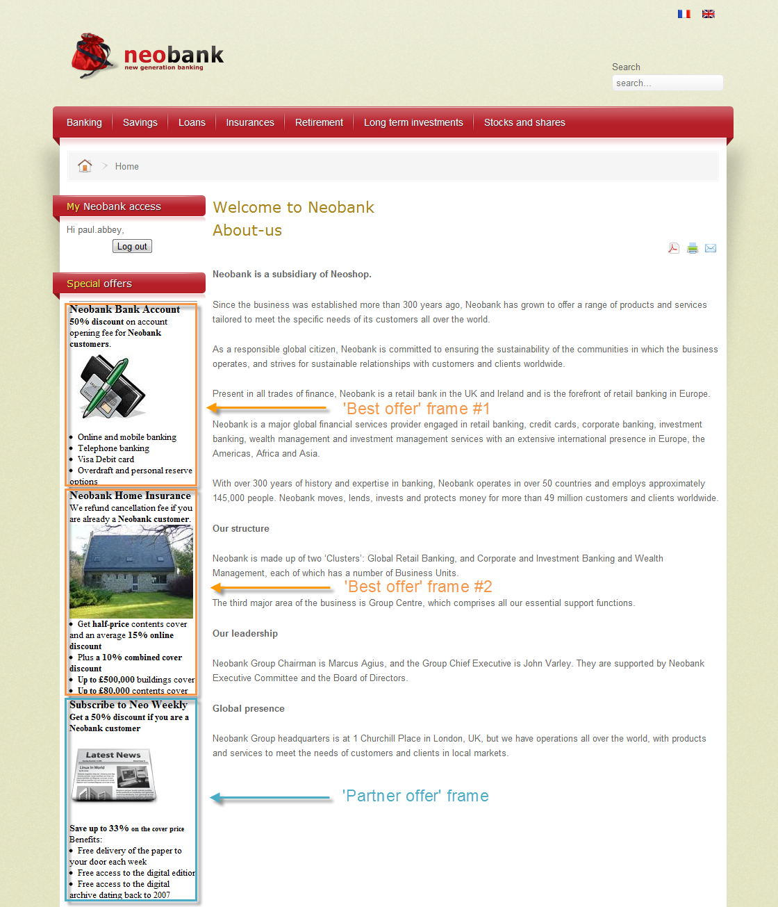

To configure these offer spaces on the HTML page of the website, apply the following process:

1. In the content of the HTML page, insert three 

   elements with an @id attribute whose value will enable us to call up the offers in the various offer spaces of the website.

   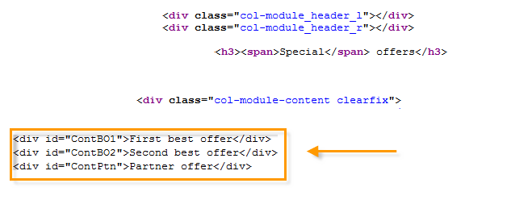

1. Then insert the script for defining attribute values. 

   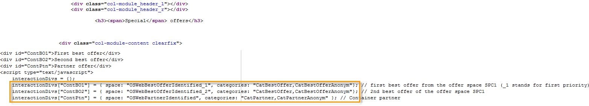

   In this example, **ContBO1** and **ContBO2** receive the value **OsWebBestOfferIdentified**, i.e. the internal name of the **Best Offer** offer space created previously in the identified environment. The **CatBestOffer** and **CatBestOfferAnonym** values match the internal name of the **Best Offer** categories for anonymous and identified environments. 

   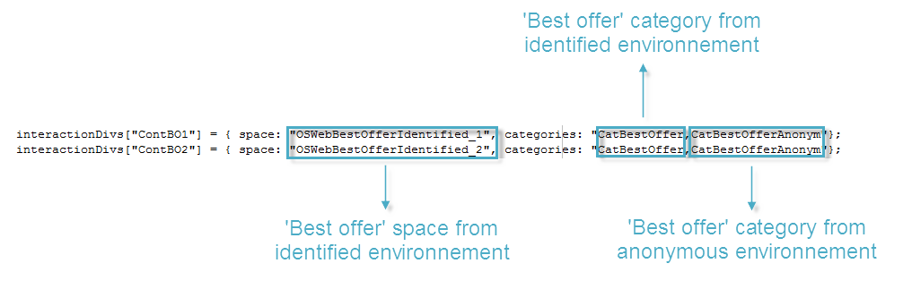

   Likewise, **ContPtn** receives the **OSWebPartnerIdentified** value, which matches the internal name of the **Partner** offer space created in the identified environment. **CatPartner** and **CatPartnerAnonym** match the internal name of the **Partner** categories for anonymous and identified environments. 

   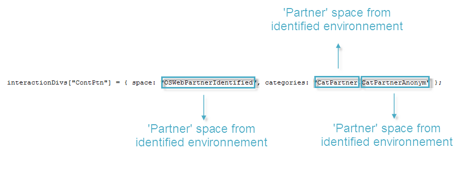

1. Assign the information that will let you identify the person who logs on to the Neobank site to the **interactionTarget** variable.

   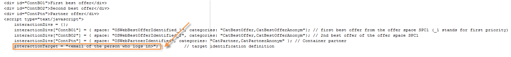

   The person's identification can be based on a browser cookie, a reading parameter in the URL, email, or identifier of the person. If a field of the recipient table other than the primary key is used, it needs to be defined in the advanced parameters of the space (refer to [Specifying the advanced settings of the identified offer spaces](#specifying-the-advanced-settings-of-the-identified-offer-spaces)).

1. Insert the call URL.

   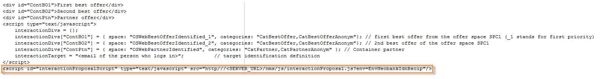

   The URL contains **EnvNeobankRecip**, the internal name of the identified environment.

When you open the web page; the script lets you call up the Interaction engine to display the content of offers in the relevant spaces of the web page. In a single call to the Adobe Campaign server, the engine determines the environment, the offer space and the categories to be selected.

In this example, the engine recognizes the identified environment (**EnvNeobankIdnRecip**). It identifies the offer space (**OSWebBestOfferIdentified**) and the **Best Offer** category (**CatBestOffer**) for the first and second offer spaces on the web page, as well as the (**OSWebPartnerIdentified**) offer space and the **Partner** category (**CatPartner**) for the third offer space on the site.

If the engine can't identify the recipient, it switches to the anonymous offer spaces referenced in the identified offer spaces and towards the anonymous categories (**CatPartner** and **CatPartnerAnonym**) as specified in the script.
