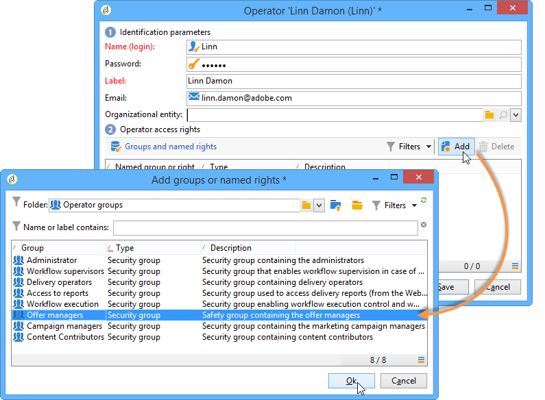
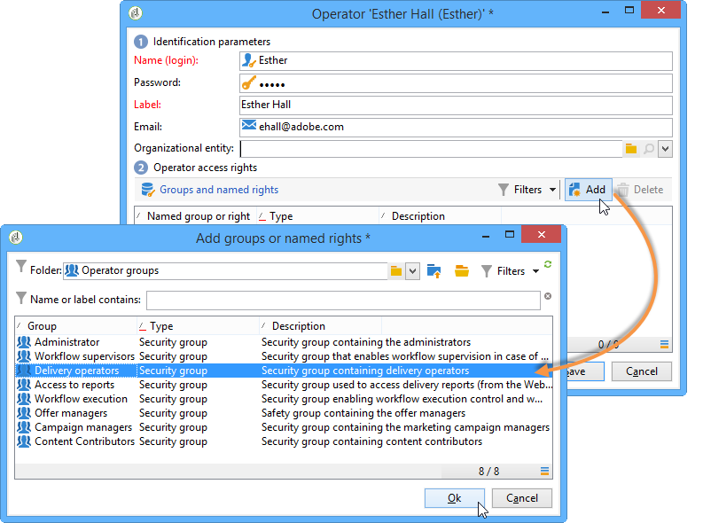

# Operator profiles{#operator-profiles}

There are two types of operators who use Interaction: offer managers and delivery managers. They each have specific rights that only give them access to some parts of the tree and the platform.

* **[!UICONTROL Offer manager]** : creates and maintains offers. Note that if offers are used in the workflow, the operator will need to be in the **[!UICONTROL Administrator]** or **[!UICONTROL Offer managers]** operator group to execute the workflow.
* **[!UICONTROL Delivery manager]** : approves and uses offers

The steps for creating operators specific to Interaction are identical to those used to create all other operators on the platform. For more on this, refer to [this section](../../platform/using/access-management.md). The rights are configured during operator creation.

## Offer manager {#offer-manager}

1. Create a new operator.
1. Go to the **[!UICONTROL Groups and named rights]** window, click **[!UICONTROL Add]** and select the **[!UICONTROL Offer manager]** group.

   

The rights assigned to the offer manager enable them to carry out the following tasks:

* Modify **[!UICONTROL Design]** environments.
* View **[!UICONTROL Live]** environments.
* Configure administration functions (predefined spaces and filters).
* Create and alter categories.
* Create offers.
* Configure offer eligibility.
* Approve offers.

  >[!NOTE]
  >
  >The offer manager can only approve an offer in two certain cases. The first being if nobody in particular was specified as the reviewer, and the second being if the operator in charge of creating templates (with the right to assign reviewers) specified him/her as the reviewer in the offer template on which the offer was based.

## Delivery manager {#delivery-manager}

1. Create a new operator.
1. Go to the **[!UICONTROL Groups and named rights]** window, click **[!UICONTROL Add]** and select the **[!UICONTROL Delivery manager]** group.

   

The rights assigned to the delivery manager are/enable them to carry out the following tasks:

* Display **[!UICONTROL Live]** environments.
* Display and modify offer categories.
* Approve offers if s/he is specified as one of its reviewers.

  >[!NOTE]
  >
  >The delivery manager can only approve an offer if he has been defined as a reviewer during the offer configuration.

## Recap of rights according to operator {#recap-of-rights-according-to-operator}

<table> 
 <tbody> 
  <tr> 
   <td> </td> 
   <td> <strong>Offer manager (editing)</strong>  </td> 
   <td> <strong>Offer manager (live)</strong>  </td> 
  </tr> 
  <tr> 
   <td> <strong>Tree structure level</strong>  </td> 
   <td> </td> 
   <td> </td> 
  </tr> 
  <tr> 
   <td> Offers being edited / Live offers  </td> 
   <td> Read / Write  </td> 
   <td> Read  </td> 
  </tr> 
  <tr> 
   <td> Recipient - Environment  </td> 
   <td> Read / Write  </td> 
   <td> Read  </td> 
  </tr> 
  <tr> 
   <td> Administration  </td> 
   <td> Read / Write  </td> 
   <td> Read  </td> 
  </tr> 
  <tr> 
   <td> Spaces  </td> 
   <td> Read / Write  </td> 
   <td> Read  </td> 
  </tr> 
  <tr> 
   <td> Predefined offer filters  </td> 
   <td> Read / Write  </td> 
   <td> Read  </td> 
  </tr> 
  <tr> 
   <td> Typology  </td> 
   <td> Read / Write  </td> 
   <td> Read  </td> 
  </tr> 
  <tr> 
   <td> Typology rules  </td> 
   <td> Read / Write  </td> 
   <td> Read  </td> 
  </tr> 
  <tr> 
   <td> Offer catalog  </td> 
   <td> Read / Write  </td> 
   <td> Read  </td> 
  </tr> 
  <tr> 
   <td> Offer category  </td> 
   <td> Read / Write  </td> 
   <td> Read  </td> 
  </tr> 
 </tbody> 
</table>

<table> 
 <tbody> 
  <tr> 
   <td> </td> 
   <td> <strong>Delivery manager (editing)</strong>  </td> 
   <td> <strong>Delivery manager (live)</strong>  </td> 
  </tr> 
  <tr> 
   <td> <strong>Tree structure level</strong>  </td> 
   <td> </td> 
   <td> </td> 
  </tr> 
  <tr> 
   <td> Offers being edited / Live offers  </td> 
   <td> </td> 
   <td> Read  </td> 
  </tr> 
  <tr> 
   <td> Recipient - Environment  </td> 
   <td> </td> 
   <td> Read  </td> 
  </tr> 
  <tr> 
   <td> Administration  </td> 
   <td> </td> 
   <td> </td> 
  </tr> 
  <tr> 
   <td> Spaces  </td> 
   <td> </td> 
   <td> </td> 
  </tr> 
  <tr> 
   <td> Predefined offer filters  </td> 
   <td> Read  </td> 
   <td> Read  </td> 
  </tr> 
  <tr> 
   <td> Typology  </td> 
   <td> Read  </td> 
   <td> Read  </td> 
  </tr> 
  <tr> 
   <td> Typology rules  </td> 
   <td> </td> 
   <td> Read  </td> 
  </tr> 
  <tr> 
   <td> Offer catalog  </td> 
   <td> Read  </td> 
   <td> Read  </td> 
  </tr> 
  <tr> 
   <td> Offer category  </td> 
   <td> </td> 
   <td> Read  </td> 
  </tr> 
 </tbody> 
</table>
