# Presentation rules{#presentation-rules}

## Creating a presentation rule {#creating-a-presentation-rule}

In our database, there are several travel offers for Europe, Africa, the United States and Canada. We want to send offers for a trip to Canada, but if the recipient refuses this type of offer, we don't want to send it to them again

We are going to configure our rule so that the trip to Canada is only offered once per recipient and not offered again if rejected.

1. In the Adobe Campaign tree, go to the **[!UICONTROL Administration]** > **[!UICONTROL Campaign management]** > **[!UICONTROL Typology management]** > **[!UICONTROL Typology rules]** node.
1. Create a new **[!UICONTROL Offer presentation]** type rule.

   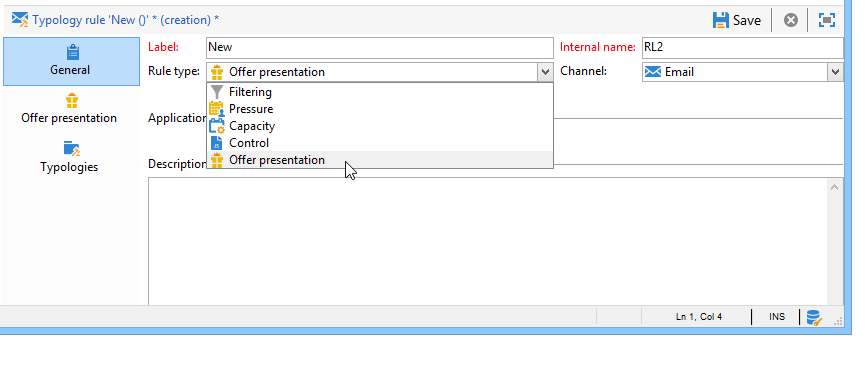

1. Change its label and its description if necessary.

   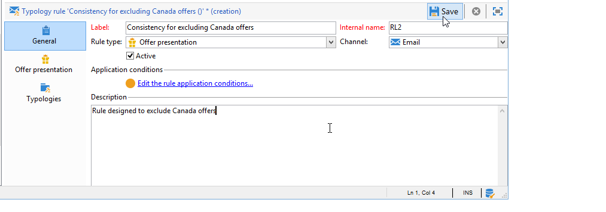

1. Choose the **[!UICONTROL All channels]** option to extend the rule to all channels. 

   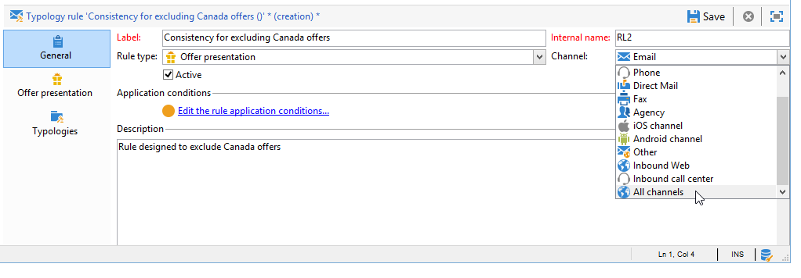

1. Click the **[!UICONTROL Edit expression]** link and choose the **[!UICONTROL Category]** node as an expression.

   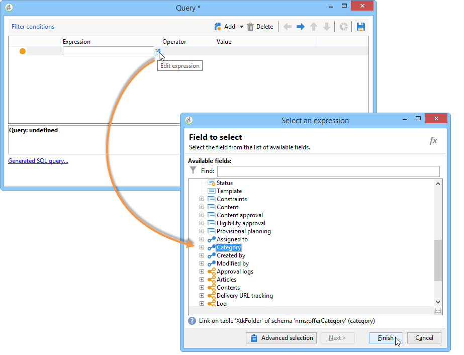

1. Choose the category that matches your travel offer for Canada and click **[!UICONTROL OK]** to close the query window.

   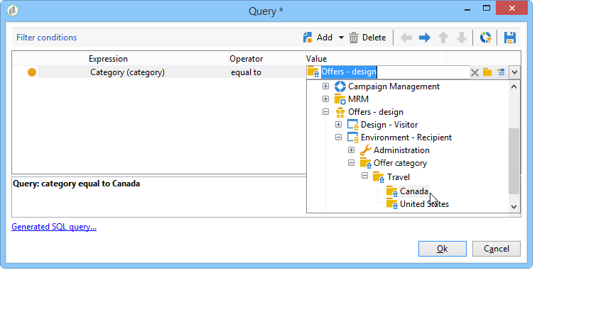

1. In the **[!UICONTROL Offer presentation]** tab, choose the same dimensions as those configured in the environment. 

   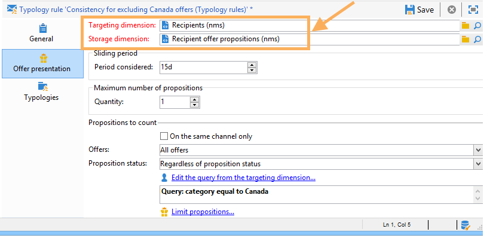

1. Specify the period during which the rule will apply.

   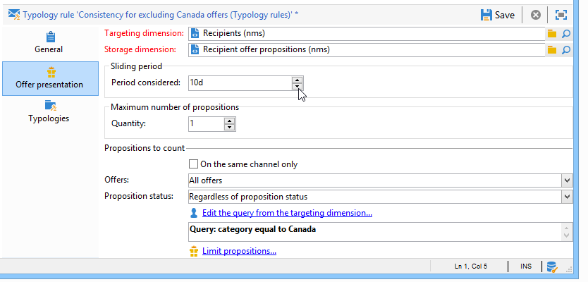

1. Limit the proposition to one so that recipients that have already rejected a trip to Canada will not receive another similar offer. 

   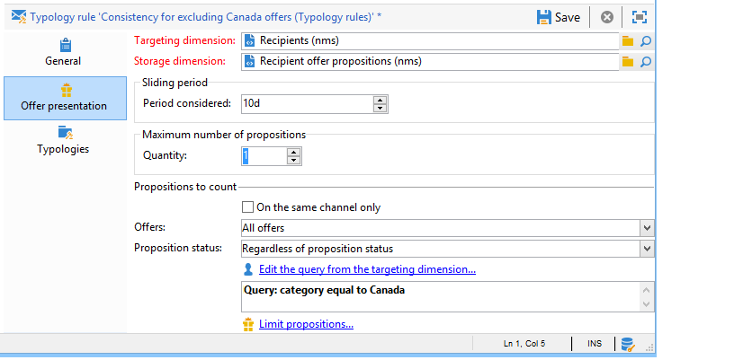

1. Select the **[!UICONTROL Offers for the same category]** filter to exclude all offers from the **Canada** category.

   

1. Select the **[!UICONTROL Rejected propositions]** filter to take into account only propositions rejected by the recipient. 

   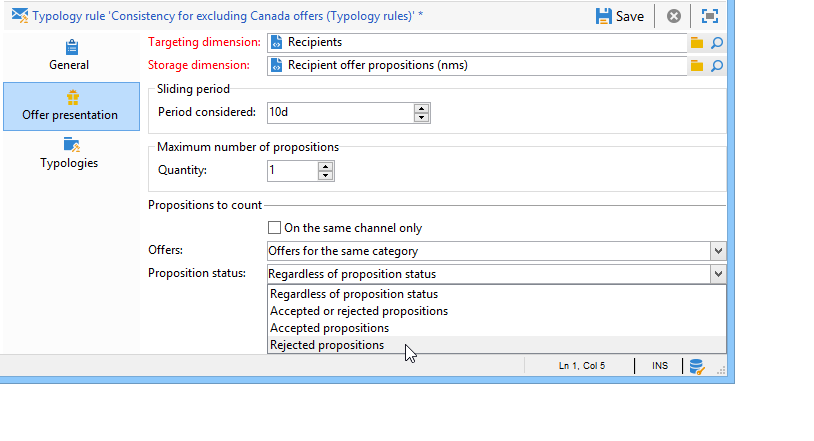

1. Choose the recipients for which this rule will apply.

   In our example, we will choose the **Frequent travelers** recipients.

   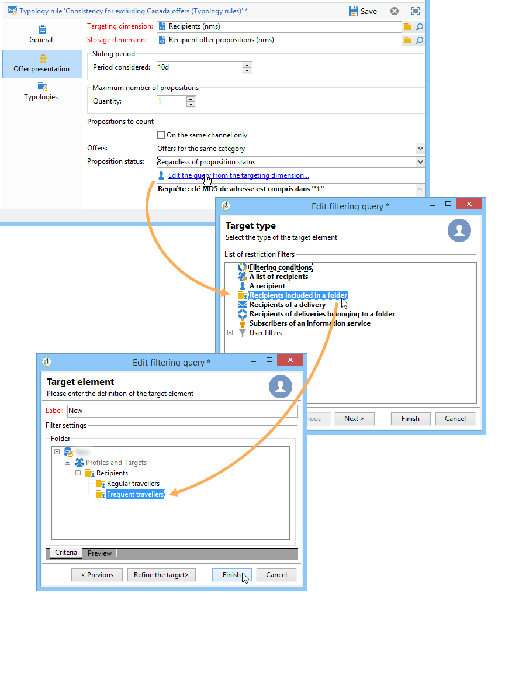

1. Reference the rule in an offer typology.

   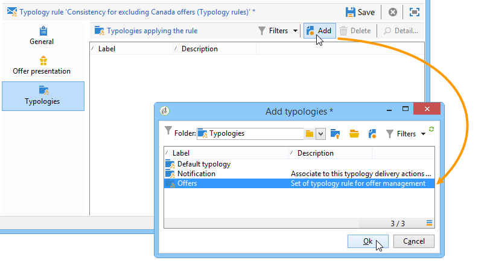

1. Go to the offer environment, (**Environment - Recipient** in this case) and reference the new typology just created using the drop-down list in the **[!UICONTROL Eligibility]** tab.

   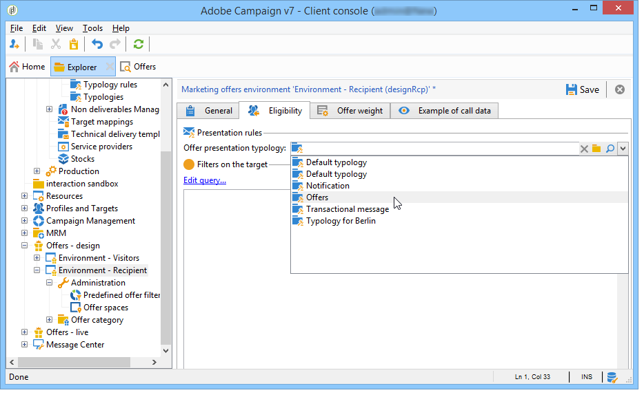

## Applying the presentation rule {#applying-the-presentation-rule}

Here is an application example of the previously created typology rule.

We want to send a first offer proposition belonging to the Canada category. If the offer is rejected once by any of the recipients, it will not be offered to them again.

1. In the **Frequent travelers** recipient folder, choose one of the profiles to check the offers for which they are eligible: click the **[!UICONTROL Propositions]** tab, then the **[!UICONTROL Preview]** tab.

   In our example, **Tim Ramsey** is eligible for an offer which is part of the **Americas** category.

   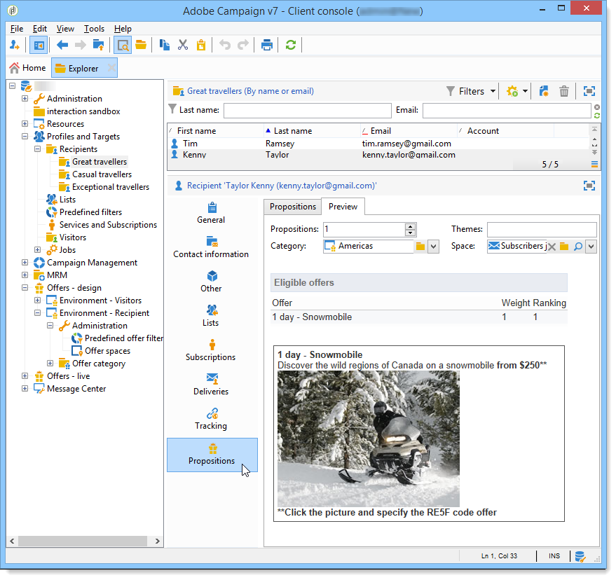

1. Start by creating an email delivery which will target your **Frequent travelers** recipients with offers.
1. Select the offer engine call-up parameters.

   In our example, the **Travel in America** category is chosen, which contains the **Canada** and **United States** sub-categories.

   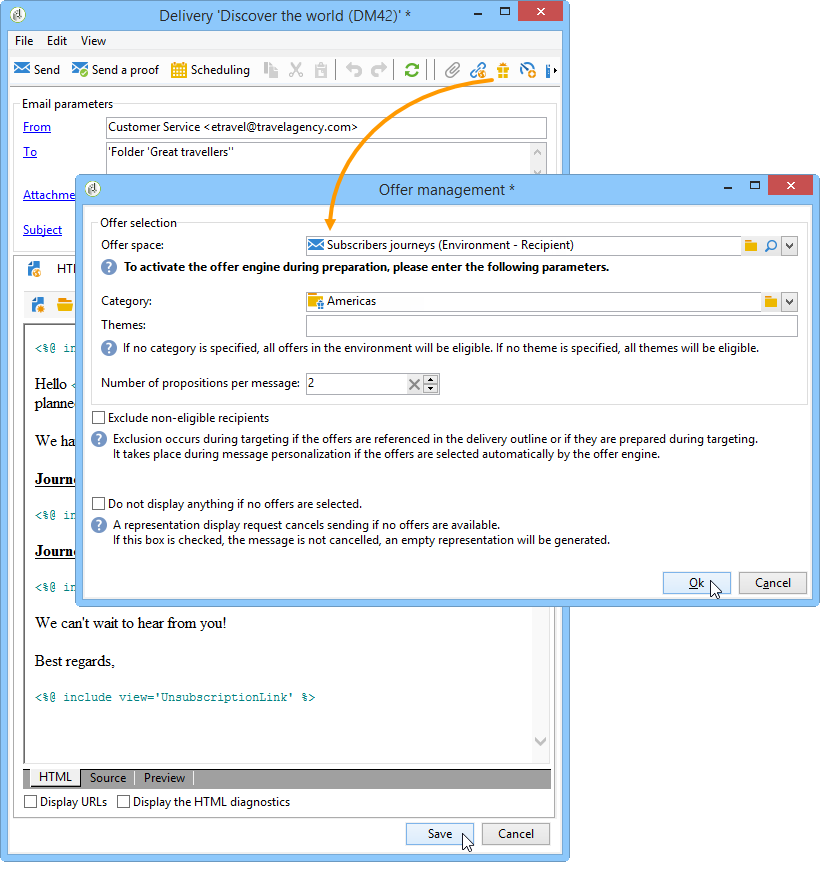

1. Insert your offers in the body of the message and send the delivery. For more on this, refer to [About outbound channels](../../interaction/using/about-outbound-channels.md).

   The recipient received the offer for which they are eligible.

1. The recipient rejected the Canada offer, as shown in the proposition history.

   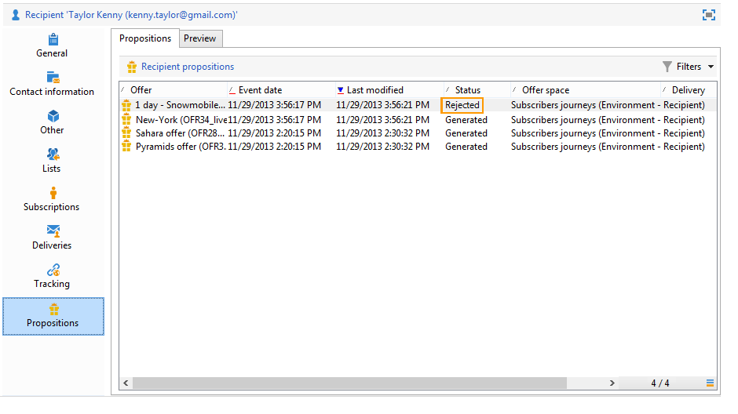

1. Check the offers for which they are now eligible.

   We can see that no offers for Canada are chosen.

   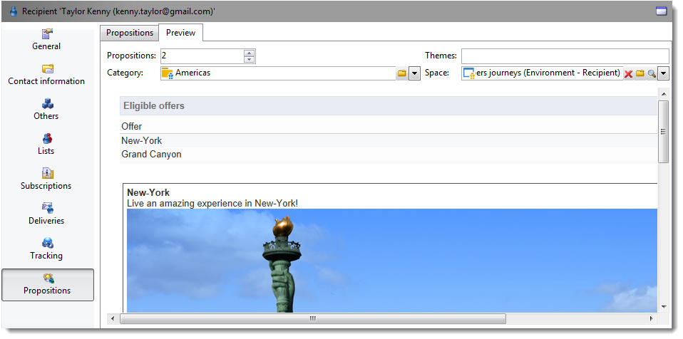

**Related topic**

* [Manage offers and control redundancy across channels](https://helpx.adobe.com/campaign/kb/simplifying-campaign-management-acc.html#Manageoffersandcontrolredundancyacrosschannels)
