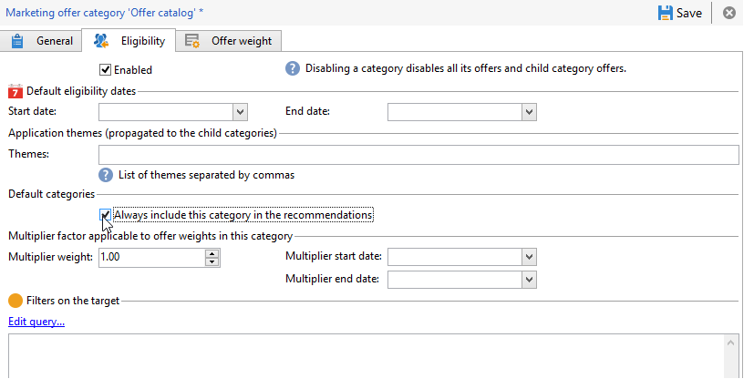

# Recommending a category{#recommending-a-category}

It may be the case that a recipient is not considered eligible for all offers. In order to ensure that all recipients receive an offer proposition, it is possible to systematically add one or various offer categories in the recommendations. Unlike the main offers, these "backup" offers must have a low weight (but not zero), so that they are only taken into account if no high weight offers are eligible. In addition, there must be no presentation rule applied to these offers to ensure that they are always included in the recommendations. This means that, during a proposition, if no high weight offer is available, the recipient will receive at least one offer from this category.

To always include a category in the recommendations, apply the following steps:

1. Open the explorer and click an offer catalog from your tree structure.
1. Click the **Eligibility** tab and tick the **Always include this category in the recommendations** box.
1. Finish and approve by clicking **Save**.

   

