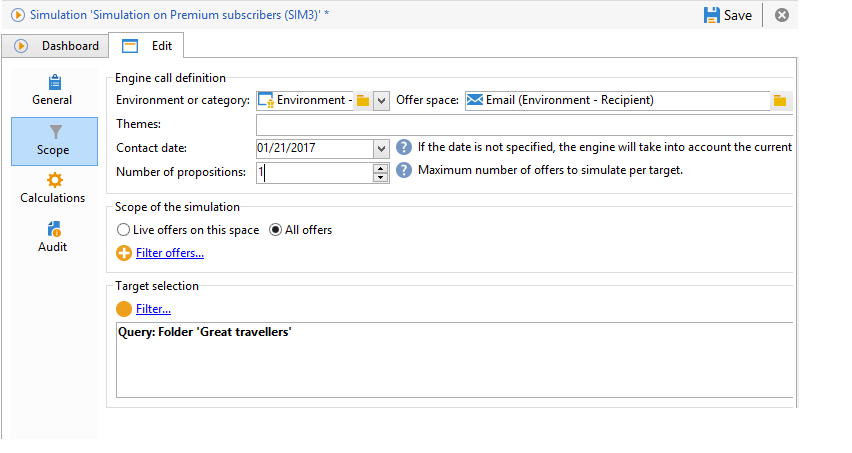
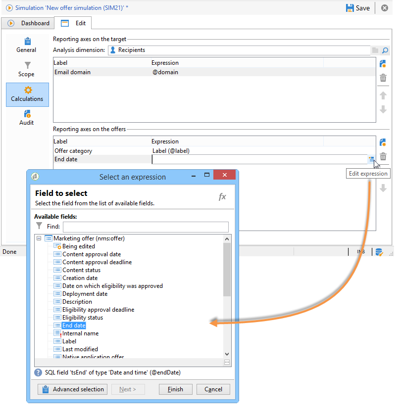

# Simulation scope{#simulation-scope}

## Definition of the scope {#definition-of-the-scope}

Open the **[!UICONTROL Scope]** tab to choose your settings.

The following items are mandatory:

* Environment or offer category.
* Offer space.
* Contact date. Offers that are not eligible on the contact date are not taken into account.
* Target population.

  If you don't configure a filter on your target, the entire recipient table will be taken into account.

* Number of propositions to be simulated per target.

  The recipient will receive this many propositions. For example, if you enter 5, each recipient will receive a maximum of 5 offer propositions. 

  

To refine the offers to be taken into account for the simulation, you can add one or several themes (specified beforehand in the categories).

You can also choose to carry out the simulation on all the offers or only those that are online. Some filters allow you to alter your selection if you want to.

>[!NOTE]
>
>You must specify a contact date. This lets the interaction engine sort the offers in the selected environment or category. If no date is configured, the simulation will raise an error.

## Adding reporting axes {#adding-reporting-axes}

You can enhance the simulation analysis by adding reporting axes on the target or the offers themselves via the **[!UICONTROL Calculations]** tab.

To do this, click the **[!UICONTROL Add]** button and choose the appropriate fields. Axes will be used for calculating the simulation and are displayed in the analysis report. For more on this, refer to [Simulation tracking](../../interaction/using/simulation-tracking.md).

