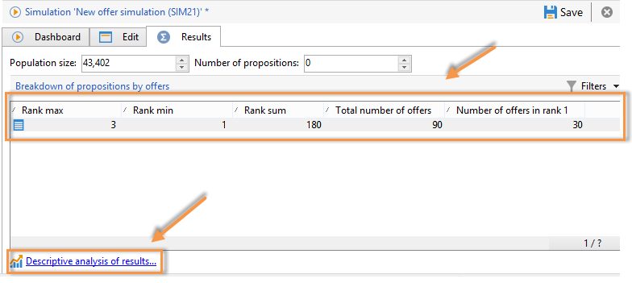
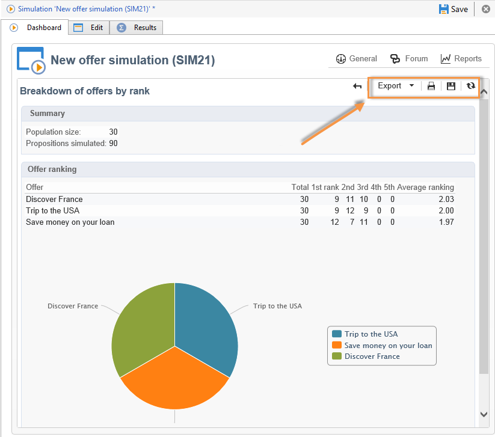

# Simulation tracking{#simulation-tracking}

Once the simulation is finished, you can analyze its result via the **[!UICONTROL Results]** tab which is added to the simulation window and the **[!UICONTROL Breakdown of offers by rank]** report, available via in the simulation dashboard.

The simulation results contain a breakdown of propositions per rank and per recipient. Reporting axes are also taken into account and shown in this tab.

You can save these results and export them if necessary by creating a descriptive analysis of results. To do this, click the appropriate link in the result window.

Refer to [this section](../../reporting/using/about-descriptive-analysis.md) for more information on the descriptive analysis wizard. 

A pivot table provides a quick view of offer breakdowns per ranking. Like all reports in Adobe Campaign, you can export, print, archive or display it in a web browser.

For more on this, refer to [this section](../../reporting/using/actions-on-reports.md).

