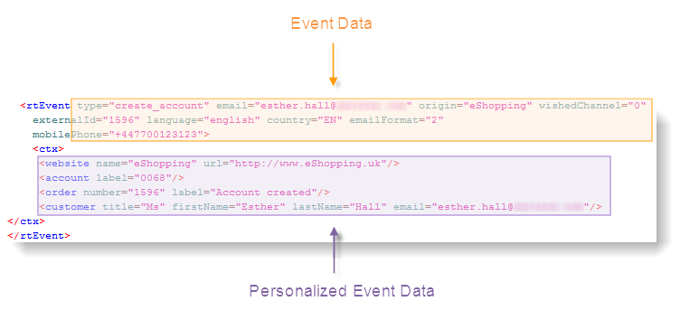

# About event processing{#about-event-processing}

 In the context of transactional messaging, an event is generated by an external information system and is sent to Adobe Campaign via the **[!UICONTROL PushEvent]** and **[!UICONTROL PushEvents]** methods (refer to [Event description](../../message-center/using/event-description.md)). It contains data linked to the event, such as its type (order confirmation or account creation on a website for instance), email address or mobile number, as well as other information that lets you enrich and personalize the transactional message before delivery. This can be customer contact information, the language of the message or the email format.

Example of event data:

To process transactional messaging events, the following steps must be applied:

1. Event collection,
1. Event transfer to a message template,
1. Event enrichment with personalization data,
1. Delivery execution,
1. Recycling of events whose linked delivery failed (this step can be carried out via an Adobe Campaign workflow).

## Event statuses {#event-statuses}

The **Event history**, under **[!UICONTROL Message Center]** > **[!UICONTROL Event history]** , groups all the processed events into one single view. They can be categorized by event type or by **status**. These statuses are:

* **Pending**: which means the event may be:

    * an event which has just been collected and which has not yet been processed. The **[!UICONTROL Number of errors]** column shows the value 0. The email template has not yet been linked.
    * an event processed but whose confirmation is erroneous. The **[!UICONTROL Number of errors]** column shows a value that is not 0. To know when this event will be processed again, consult the **[!UICONTROL Process requested on]** column.

* **Pending delivery**: the event was processed and the delivery template is linked. The email is pending delivery and the classic delivery process is applied. For more information, you can open the delivery. Refer to [Delivery](../../delivery/using/about-message-tracking.md).
* **Sent**, **Ignored** and **Delivery error**: these delivery statuses are recovered via the **updateEventsStatus** workflow. For more information, you can open the relevant delivery.
* **Event not covered**: the Message Center routing phase failed. For example, Adobe Campaign did not find the email which acts as a template for the event.
* **Event expired**: the maximum number of send tries was reached. The event is considered null.
