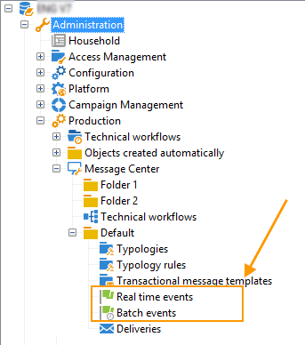

# Event processing {#about-event-processing}

In the context of transactional messaging, an event is generated by an external information system and is sent to Adobe Campaign via the **[!UICONTROL PushEvent]** and **[!UICONTROL PushEvents]** methods (see [Event description](../../message-center/using/event-description.md)).
 
This event contains data linked to the event, such as its [type](../../message-center/using/creating-event-types.md) (order confirmation, account creation on a website, etc.), email address or mobile number, as well as other information that lets you enrich and personalize the transactional message before delivery (customer contact information, language of the message, email format, etc.).

Example of event data:

## Event processing steps {#event-processing}

To process transactional messaging events, the following steps are applied on the execution instance(s):

1. [Event collection](#event-collection)
1. [Event transfer to a message template](#routing-towards-a-template)
1. Event enrichment with personalization data
1. [Delivery execution](../../message-center/using/delivery-execution.md)
1. [Recycling of events](#event-recycling) whose linked delivery failed (via an Adobe Campaign workflow)

Once all the steps above are carried out through the execution instance, each targeted recipient receives a personalized message.

>[!NOTE]
>
>For more on the transactional messaging instances, see [Transactional messaging architecture](../../message-center/using/transactional-messaging-architecture.md).

## Event collection {#event-collection}

Events generated by the information system can be collected using two modes:

* Calls to SOAP methods let you push events in Adobe Campaign: the PushEvent method lets you send one event at a time, the PushEvents method lets you send several events at once. For more on this, see [Event description](../../message-center/using/event-description.md).

* Creating a workflow lets you recover events by importing files or via an SQL gateway (with the [Federated Data Access](../../installation/using/about-fda.md) option).

Once they are collected, events are broken down by technical workflows between real time and batch queues of the execution instance(s), while waiting to be linked to a message template.

>[!NOTE]
>
>On the execution instances, the **[!UICONTROL Real time events]** or **[!UICONTROL Batch events]** folders must not be set as views, as this could lead to access right issues. For more on setting a folder as a view, refer to [this section](../../platform/using/access-management-folders.md).

## Routing towards a template {#routing-towards-a-template}

Once the message template is published on the execution instance(s), two templates are automatically generated: one to be linked to a real time event, and one to be linked to a batch event.

The routing step consists in linking an event to the appropriate message template, based on:

* The event type specified in the properties of the event itself:

    

* The event type specified in the message template properties:

    

By default, routing relies on the following information:

* The event type
* The channel to be used (by default: email)
* The most recent delivery template, based on the publication date

## Event statuses {#event-statuses}

The **Event history**, under **[!UICONTROL Message Center]** > **[!UICONTROL Event history]** , groups all the processed events into one single view. They can be categorized by event type or by **status**. These statuses are:

* **Pending**: The event can be:

    * An event which has just been collected and which has not yet been processed. The **[!UICONTROL Number of errors]** column shows the value 0. The email template has not yet been linked.
    * An event processed but whose confirmation is erroneous. The **[!UICONTROL Number of errors]** column shows a value that is not 0. To know when this event will be processed again, consult the **[!UICONTROL Process requested on]** column.

* **Pending delivery**: The event was processed and the delivery template is linked. The email is pending delivery and the classic delivery process is applied. For more information, you can open the delivery.
* **Sent**, **Ignored** and **Delivery error**: These delivery statuses are recovered via the **updateEventsStatus** workflow. For more information, you can open the relevant delivery.
* **Event not covered**: The transactional messaging routing phase failed. For example, Adobe Campaign did not find the email which acts as a template for the event.
* **Event expired**: The maximum number of send tries was reached. The event is considered null.

## Event recycling {#event-recycling}

If the delivery of a message on a specific channel fails, Adobe Campaign can resend the message using a different channel. For instance, if a delivery on the SMS channel fails, the message is resent using the email channel.

To do this, you need to configure a workflow which recreates all events with the **Delivery error** status, and assigns a different channel to them.

>[!CAUTION]
>
>This step can only be carried out using a workflow and is therefore reserved for expert users. For more information, please contact your Adobe account executive.