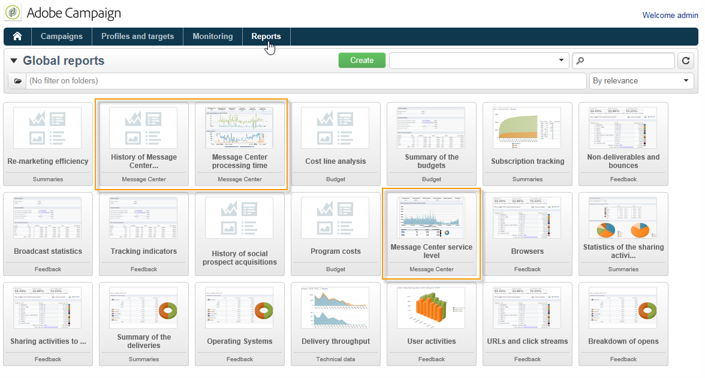

# Access transactional messaging reports {#about-transactional-messaging-reports}

Adobe Campaign offers several reports that allow you to control the activity and smooth running of the execution instances.

These Message Center reports can be accessed from the **[!UICONTROL Reports]** tab of the **control instance**. 

