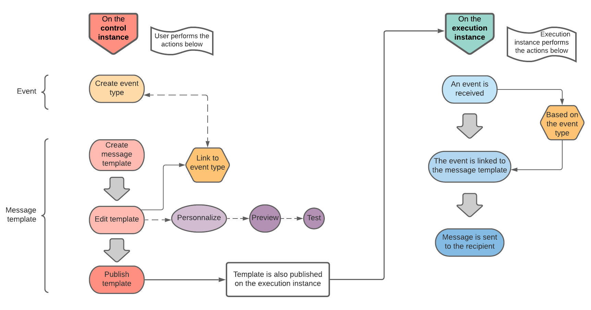

# Get started with transactional messaging {#about-transactional-messaging}

## Overview {#overview}

**Transactional messaging** (Message Center) is a Campaign module designed for managing custom trigger notifications generated from events sent by an external information system.

A transactional message is an individual and unique communication, sent in real-time by a provider such as a website. It is particularly expected, because it contains important information that the recipient wants to check or confirm.

Transactional messaging capabilities are designed to support scalability and provide a 24/7 service.

* **When is it due?** Because this message contains important information, the user expects it to be sent in real time. Consequently, the delay between the event being triggered and the message arriving has to be very short.

* **Why is it important?** Generally, a transactional message has high open rates. It should therefore be carefully designed, because it can have a strong impact on the customers' behavior as it defines the client relation.

* **For example?** It could be a welcome message after creating an account, a confirmation that an order has shipped, an invoice, a message confirming a password change, a notification after a customer browsed your website, a product unavailability communication, an account statement, etc.

>[!IMPORTANT]
>
>Transactional messaging requires a specific licence. Please check your licence agreement.

<!--Before starting with transactional messaging, make sure you read the corresponding [best practices and limitations]().-->

## Transactional messaging operating principle {#transactional-messaging-operating-principle}

The Adobe Campaign Transactional messaging module integrates into an information system which returns events to be changed into personalized transactional messages. These messages can be sent individually or in batches via email, SMS or push notifications.

This feature relies on a specific architecture, where the **execution instance** is separated from the **control instance**. This distribution ensures higher availability and better load management. For more on this, see [Transactional messaging architecture](../../message-center/using/transactional-messaging-architecture.md).

>[!NOTE]
>
>To create new users for Message Center execution instances hosted on Adobe Cloud, you need to contact [Adobe Customer Care](https://helpx.adobe.com/enterprise/admin-guide.html/enterprise/using/support-for-experience-cloud.ug.html). Message Center users are specific operators that require dedicated permissions to access **[!UICONTROL Real time events (nmsRtEvent)]** folders.

The transactional messaging overall process can be described as follows:

For example, imagine you are a company with a website where your customers can buy products.

Adobe Campaign allows you to send a notification email to customers who have added products to their cart. When one of them leaves your website without going through with their purchases (external event which triggers a Campaign event), a cart abandonment email is automatically sent to them (transactional message delivery).

The main steps for putting this into place are detailed below in [this section](#key-steps).

>[!NOTE]
>
>Adobe Campaign prioritizes processing transactional messages over any other delivery.

## Key steps {#key-steps}

The main steps when creating and managing personalized transactional messages in Adobe Campaign are summarized below.

### Steps to perform on the control instance

On the **control instance**, you must peform the following actions:

1. [Create an event type](../../message-center/using/creating-event-types.md).
1. [Create and design the message template](../../message-center/using/creating-the-message-template.md). You must link an event to your message during this step.
1. [Test the message](../../message-center/using/testing-message-templates.md).
1. [Publish the message template](../../message-center/using/publishing-message-templates.md).

>[!NOTE]
>
>All the steps above are performed on the **control instance**. Publishing the template on the control instance will also publish it on all **execution instances**. For more on the transactional messaging instances, see [Transactional messaging architecture](../../message-center/using/transactional-messaging-architecture.md).

### Event processing on the execution instance

Once you designed and published the transactional message template, if a corresponding event is triggered, the main steps below are performed on the **execution instance**:

1. When the event is generated by the external information system, the relevant data are sent to Campaign via the **PushEvent** and **PushEvents** methods. See [Event collection](../../message-center/using/about-event-processing.md#event-collection).
1. The event is linked to the appropriate message template. See [Routing towards a template](../../message-center/using/about-event-processing.md#routing-towards-a-template).
1. Once the enrichment stage is complete, the delivery is sent. See [Delivery execution](../../message-center/using/delivery-execution.md). Each targeted recipient receives a personalized message.

## Related topics {#related-topics}

* [Get started with communication channels](../../delivery/using/communication-channels.md)
* [Delivery creation key steps](../../delivery/using/steps-about-delivery-creation-steps.md)
* [Transactional messaging architecture](../../message-center/using/transactional-messaging-architecture.md)
* [Access transactional messaging reports](../../message-center/using/about-transactional-messaging-reports.md)
