# Configure instances {#creating-a-shared-connection}

To use the transactional messaging capabilities, you need to configure the control and execution instances. You can use either:
* [One control instance](#control-instance) associated with one or several execution instances
* [Several control instances](#using-several-control-instances) associated with several execution instances

>[!IMPORTANT]
>
>Schema extensions impacted the resources used by [Message Center technical workflows](../../message-center/using/additional-configurations.md#technical-workflows) on either control or execution instances need to be duplicated on the other instances used by the Transactional messaging module.

You also need to specify and connect the execution instance(s) to the control instance(s).

All the steps needed to configure and connect the control and execution instances are described in this section.

>[!IMPORTANT]
>
>The control instance and the execution instance(s) must be installed on different machines. They cannot share the same Campaign instance.

## Configure the control instance {#control-instance}

To connect the control instance and the execution instances, you first need to create and configure an **[!UICONTROL Execution instance]** type external account **on the control instance**. Therefore, once [published](../../message-center/using/publishing-message-templates.md#template-publication), transactional message templates can be deployed to the execution instances.

If you are using several execution instances, you must create as many external accounts as there are execution instances.

>[!NOTE]
>
>When execution instances are used by several control instances, data can be divided by folder and by operator. For more on this, see [Use several control instances](#using-several-control-instances).

### Create an external account

>[!NOTE]
>
>The steps below must be performed **on the control instance**.

To create an **[!UICONTROL Execution instance]** type external account, apply the following:

1. Go to the **[!UICONTROL Administration > Platform > External accounts]** folder.
1. Select one of the execution instance type external accounts provided out-of-the-box with Adobe Campaign, right-click and choose **[!UICONTROL Duplicate]** .

   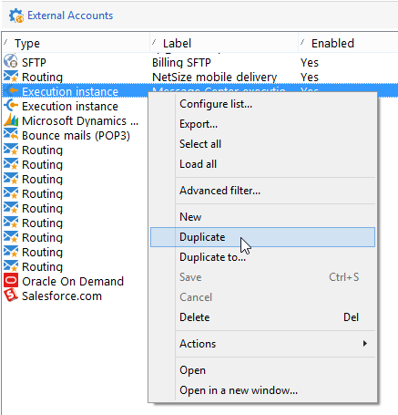

1. Change the label according to your needs. 

   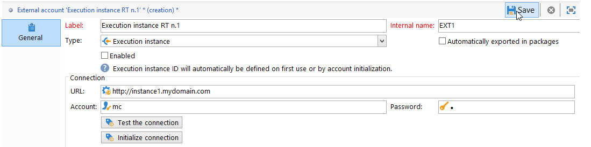

1. Select the **[!UICONTROL Enabled]** option to make the external account operational.

   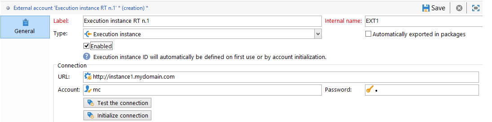

1. Specify the address of the server on which the execution instance is installed.

   

1. The account must match the Message Center Agent as defined in the operator folder. By default, the out-of-the-box account provided by Adobe Campaign is **[!UICONTROL mc]** .

   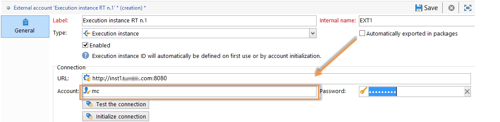

1. Enter the password of the account as defined in the operator folder.

   >[!NOTE]
   >
   >To avoid entering a password each time you log on to the instance, you can specify the IP address of the control instance in the execution instance. For more on this, see [Configure the execution instance(s)](#execution-instance).

1. Specify the recovery method to be used by the execution instance. The data to recover is forwarded to the control instance by the execution instance, to add to transactional message and event archives.

   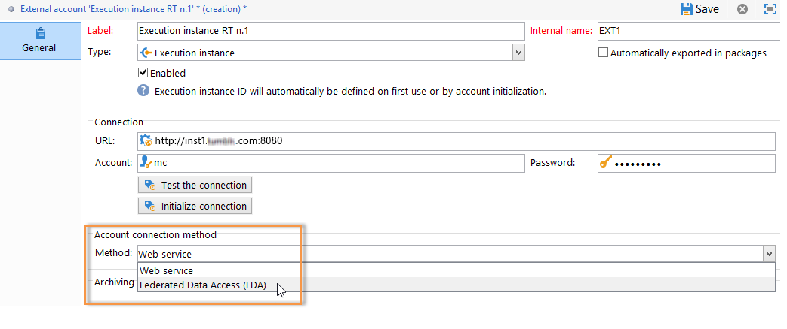

   Data collection occurs either via a Web service which uses HTTP/HTTPS access, or via the Federated Data Access (FDA) module.

   >[!NOTE]
   >
   >Please note that when using FDA over HTTP, only execution instances using a PostgreSQL database are supported. MSSQL or Oracle databases are not supported.

   The second method (FDA) is recommended if the control instance has direct access to the database of the execution instances. If not, choose the Web service access. The FDA account to specify coincides with the connection to the databases of the various execution instances created on the control instance.

   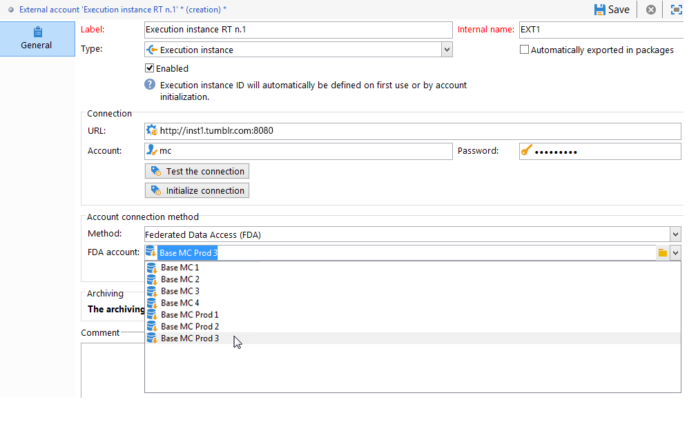

   For more information on Federated Data Access (FDA), refer to [this section](../../installation/using/about-fda.md).

1. Click **[!UICONTROL Test the connection]** to make sure the control instance and the execution instance are linked up.

   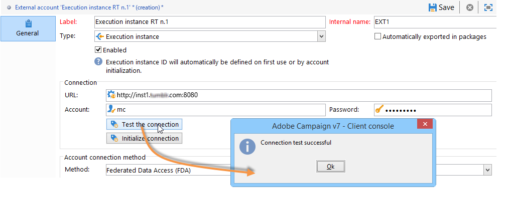

When using several execution instances, repeat these steps to create as many external accounts as there are execution instances.

### Identify execution instances {#identifying-execution-instances}

Each execution instance must be associated with a unique identifier to differentiate the history of each execution instance when viewing them on the control instance.

This identifier can be attributed on each execution instance **manually**. In this case, this step must be performed **on each execution instance**. To do this, use the deployment wizard as detailed below:

1. Open the deployment wizard on an execution instance.
1. Go to the **[!UICONTROL Message Center]** window.
1. Assign your chosen identifier to the instance.

   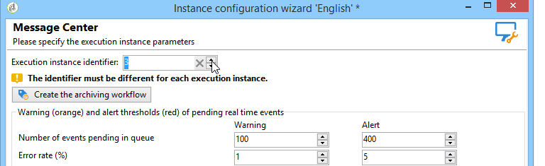

1. Repeat the steps above on each execution instance.

The identifier can also be **automatically** attributed. To do this, go to the **control instance**, and click the **[!UICONTROL Initialize connection]** button.

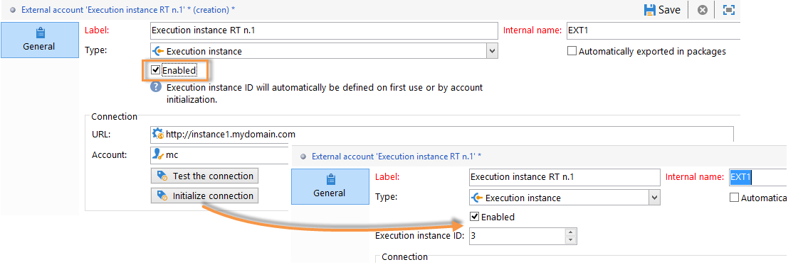

## Configure the execution instance(s) {#execution-instance}

>[!NOTE]
>
>The steps below must be performed **on the execution instance(s)**.

To connect the execution instance(s) to the control instance, follow the steps below.

In order for the control instance to be able to connect to the execution instance without having to give a password, simply enter the IP address of the control instance in the **Message Center** access rights section. However, empty passwords are forbidden by default.

To use an empty password, go to the execution instances and define a security zone limited to the IP address of the information system that delivers the events. This security zone must allow empty passwords and accept `<identifier> / <password>` type connections. For more on this, refer to [this section](../../installation/using/security-zones.md).

>[!NOTE]
>
>When execution instances are used by several control instances, data can be divided by folder and by operator. For more on this, see [Use several control instances](#using-several-control-instances).

1. On an execution instance, go to the operator folder ( **[!UICONTROL Administration > Access management > Operators]** ).
1. Select the **Message Center** agent.

   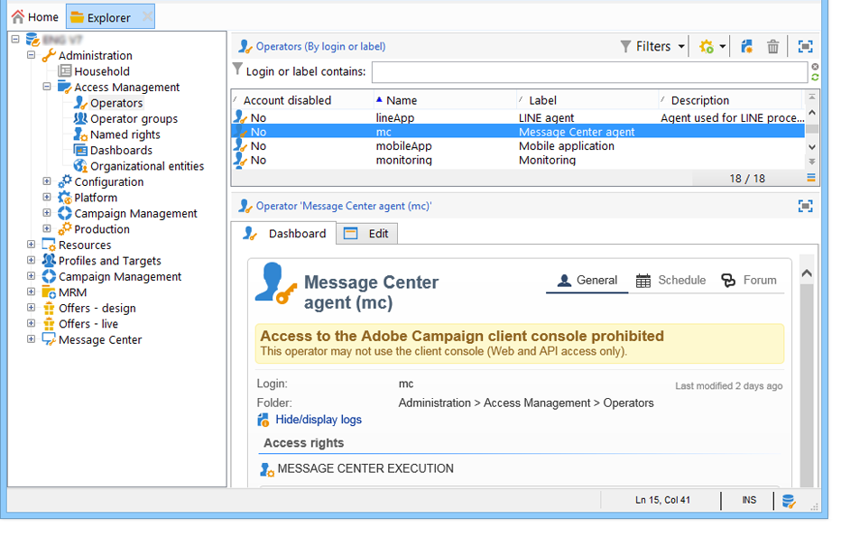

1. Select the **[!UICONTROL Edit]** tab, click **[!UICONTROL Access rights]** , and then click the **[!UICONTROL Edit the access parameters...]** link.

   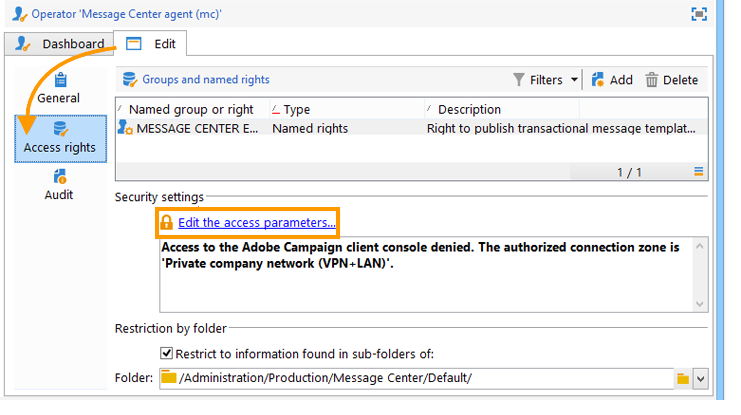

1. In the **[!UICONTROL Access settings]** window, click the **[!UICONTROL Add a trusted IP mask]** link and add the IP address of the control instance.

   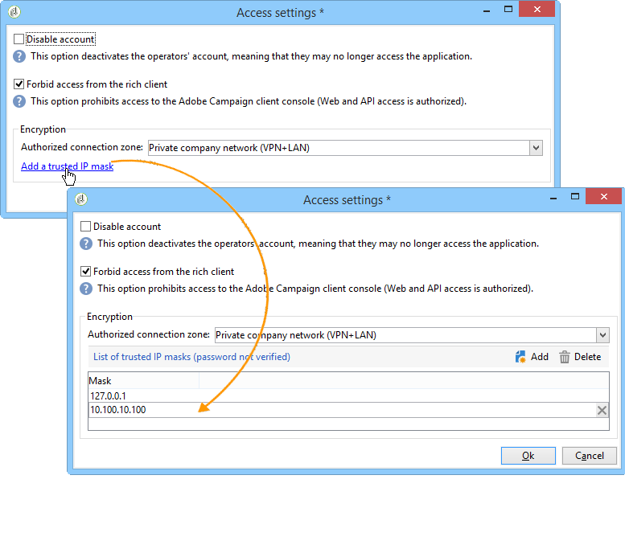

When using several execution instances, repeat these steps for each execution instance.

## Use several control instances {#using-several-control-instances}

You can share an execution cluster with various control instances. This type of architecture requires the following configuration.

For example, imagine your company manages two brands, each with its own control instance: **Control 1** and **Control 2**. Two execution instances are also used. You need to enter a different Message Center operator for each control instance: an **mc1** operator for the **Control 1** instance and an **mc2** operator for the **Control 2** instance.

In the tree of all the execution instances, create one folder per operator (**Folder 1** and **Folder 2**), and restrict each operator's data access to their folder.

### Configure control instances {#configuring-control-instances}

>[!NOTE]
>
>The steps below must be performed **on the control instances**.

1. On the **Control 1** control instance, create one external account per execution instance, and enter the **mc1** operator in each external account. The **mc1** operator will thereafter be created on all the execution instances (see [Configure execution instances](#configuring-execution-instances)).

   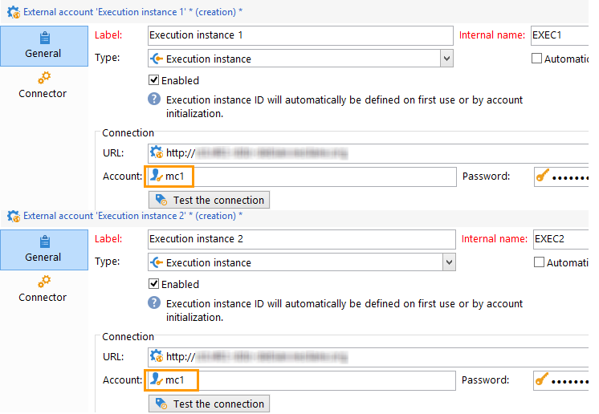

1. On the **Control 2** control instance, create one external account per execution instance, and enter the **mc2** operator in each external account. The **mc2** operator will thereafter be created on all the execution instances (see [Configure execution instances](#configuring-execution-instances)).

   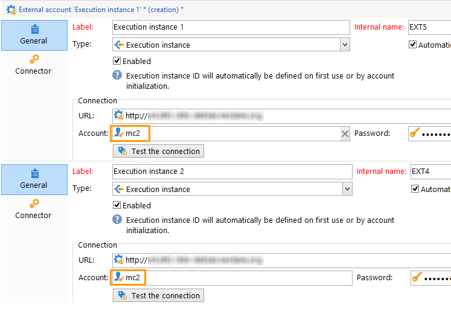

   >[!NOTE]
   >
   >For more on configuring a control instance, rsee [this section](#control-instance).

### Configure execution instances {#configuring-execution-instances}

>[!NOTE]
>
>The steps below must be performed **on the execution instances**.

In order to use several control instances, this configuration has to be performed on ALL execution instances.

1. Create one folder per operator in the **[!UICONTROL Administration > Production > Message Center]** node: **Folder 1** and **Folder 2**. For more on creating folders and views, refer to [this page](../../platform/using/access-management-folders.md).

   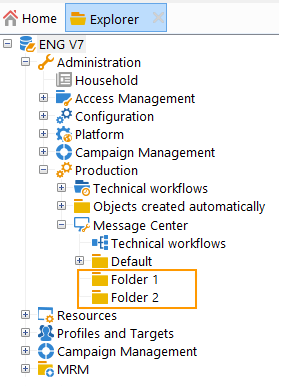

1. Create the **mc1** and **mc2** operators by duplicating the Message Center operator provided by default (**mc**). For more on creating operators, refer to [this section](../../platform/using/access-management-operators.md).

   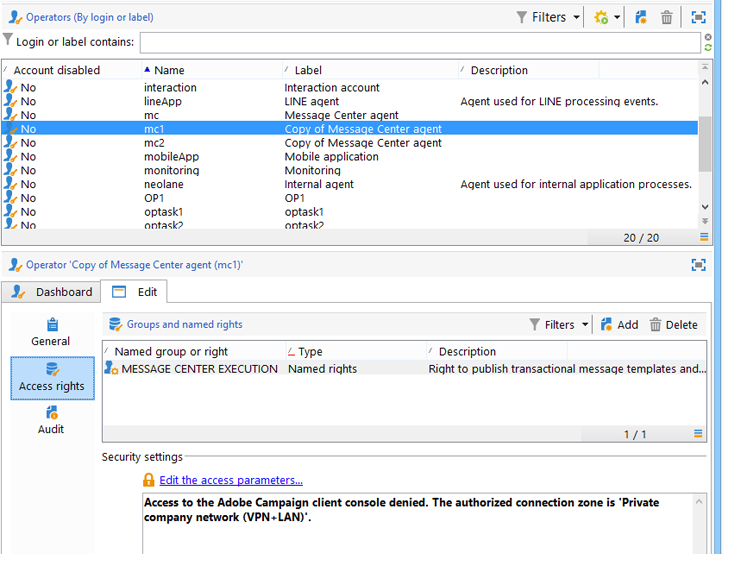

   >[!NOTE]
   >
   >**mc1** and **mc2** operators must have **[!UICONTROL Message Center execution]** rights and they cannot have access to the Adobe Campaign client console. An operator must always be linked with a security zone. For more on this, refer to [this section](../../installation/using/security-zones.md).

1. For each operator, check the **[!UICONTROL Restrict to information found in sub-folders of]** box, and select the relevant folder (**Folder 1** for the **mc1** operator and **Folder 2** for the **mc2** operator).

   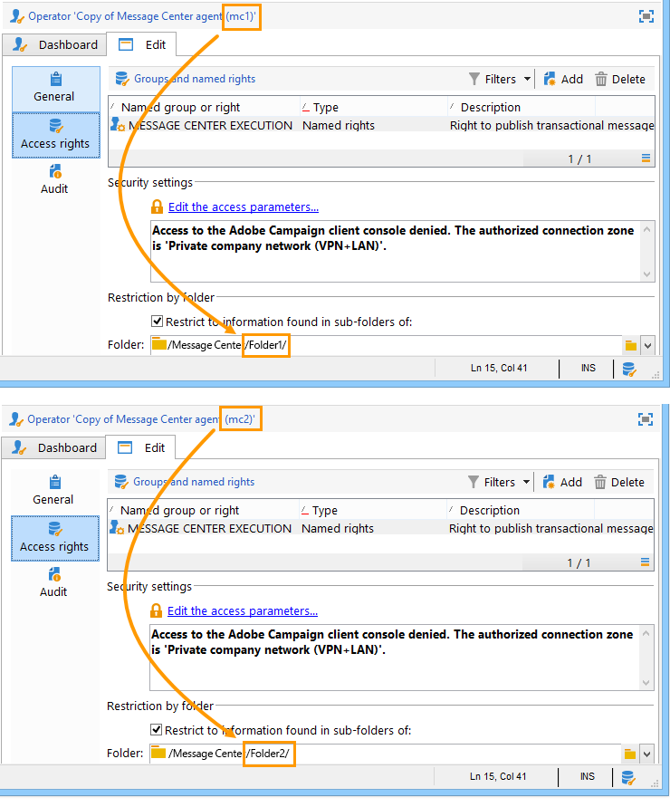

1. Give each operator read and write permissions for their folder. To do this, right-click the folder and select **[!UICONTROL Properties]** . Then select the **[!UICONTROL Security]** tab and add the relevant operator (**mc1** for **Folder 1** and **mc2** for **Folder 2**). Make sure that the **[!UICONTROL Read/Write data]** boxes are checked.

   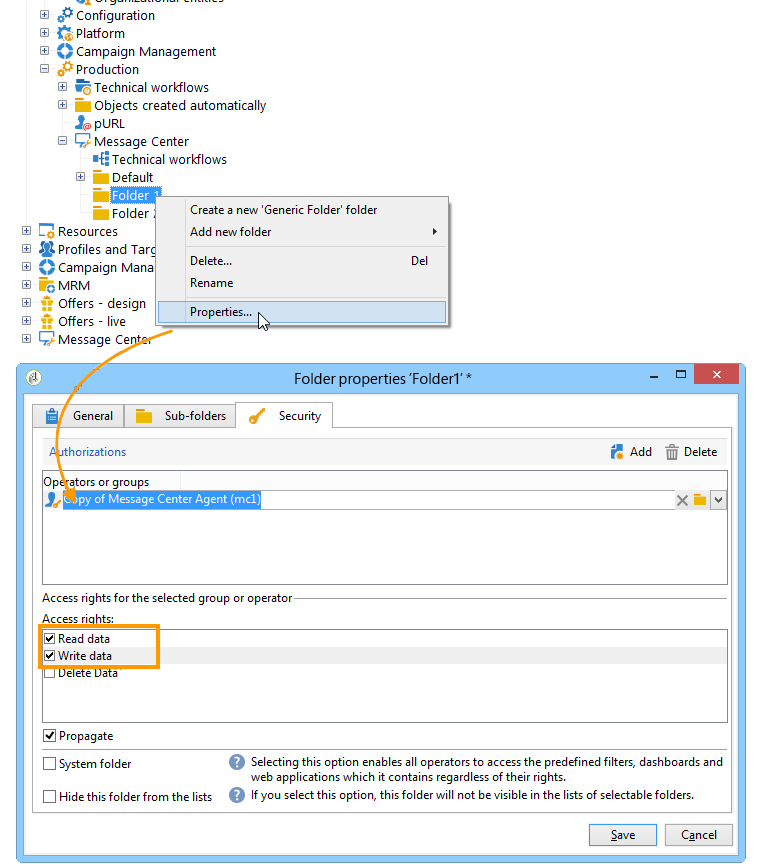
